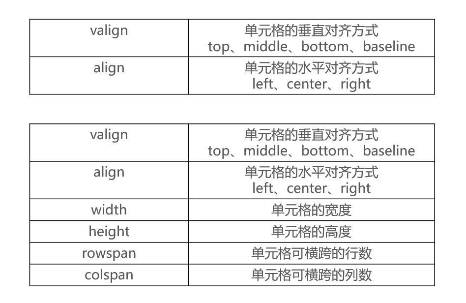

# 表格标签

其实在过去表格标签用的非常非常的多, 绝大多数的网站都是使用表格标签来制作的, 也就是说表格标签是一个时代的代表

表格标签作用: 用来给一堆数据添加表格语义

其实表格是一种数据的展现形式, 当数据量非常大的时候, 表格这种展现形式被认为是最为清晰的一种展现形式

```html
<table>
  <tr>
    <td>需要显示的内容</td>
  </tr>
</table>
```

- 表格标签中的 table 代表整个表格, 也就是一堆 table 标签就是一个表格
- 表格标签中的 tr 标签代表整个表格中的一行数据, 也就是说一对 tr 标签就是表格中的一行
- 表格标签中的 td 标签代表表格中一行中的一个单元格, 也就是说一对 td 标签就是一行中的一个单元格

注意:

1. 表格标签有一个边框属性, 这个属性决定了边框的宽度. 默认情况下这个属性的值是 0, 所以看不到边框
2. 表格标签和列表标签一样, 它是一个组合标签, 所以 table/tr/td 要么一起出现, 要么一起不出现, 不会单个出现

# 表格标签的属性

`<table>`的属性：

- `border`：边框。像素为单位。
- `style="border-collapse:collapse;"`：单元格的线和表格的边框线合并（表格的两边框合并为一条）
- `width`：宽度。像素为单位。
- `height`：高度。像素为单位。
- `bordercolor`：表格的边框颜色。
- `align`：**表格**的水平对齐方式。属性值可以填：left right center。 注意：这里不是设置表格里内容的对齐方式，如果想设置内容的对齐方式，要对单元格标签`<td>`进行设置）
- `cellpadding`：单元格内容到边的距离，像素为单位。默认情况下，文字是紧挨着左边那条线的，即默认情况下的值为 0。 注意不是单元格内容到四条边的距离哈，而是到一条边的距离，默认是与左边那条线的距离。如果设置属性`dir="rtl"`，那就指的是内容到右边那条线的距离。
- `cellspacing`：单元格和单元格之间的距离（外边距），像素为单位。默认情况下的值为 0
- `bgcolor="#99cc66"`：表格的背景颜色。
- `background="路径src/..."`：背景图片。 背景图片的优先级大于背景颜色。
- `bordercolorlight`：表格的上、左边框，以及单元格的右、下边框的颜色
- `bordercolordark`：表格的右、下边框，以及单元格的上、左的边框的颜色 这两个属性的目的是为了设置 3D 的效果。
- `dir`：公有属性，单元格内容的排列方式(direction)。 可以 取值：`ltr`：从左到右（left to right，默认），`rtl`：从右到左（right to left） 既然说`dir`是共有属性，如果把这个属性放在任意标签中，那表明这个标签的位置可能会从右开始排列。

## 宽度和高度

可以给 table 标签和 td 标签使用

表格的宽度和高度默认是按照内容的尺寸来调整的, 也可以通过给 table 标签设置 width/height 属性的方式来手动指定表格的宽度和高度

如果给 td 标签设置 widht/height 属性, 会修改当前单元格的宽度和高度, 不会影响整个表格的宽度和高度

## 水平对齐和垂直对齐

- 水平对齐:给 table 标签和 tr 标签和 td 标签使用

  - 给 table 标签设置 align 属性, 可以控制表格在水平方向的对齐方式
  - 给 tr 标签设置 align 属性, 可以控制当前行中所有单元格内容的水平方向的对齐方式
  - 给 td 标签设置 align 属性, 可以控制当前单元格中内容在说方向的对齐方式
  - 如果 td 中设置了 align 属性, tr 中也设置了 align 属性, 那么单元格中的内容会按照 td 中设置的来对齐

- 垂直对齐:只能给 tr 标签和 td 标签使用 - 给 tr 标签设置 valign 属性, 可以控制当前行中所有单元格中的内容, 在垂直方向的对齐方式 - 给 td 标签设置 valign 属性, 可以控制当前单元格中的内容在垂直方向的对齐方式 - 如果 td 中设置了 valign 属性, tr 中也设置了 valign 属性, 那么单元格中的内容会按照 td 中设置的来对齐

tr、th、td 的常用属性：



## 外边距和内边距

只能给 table 标签使用

1. 外边距(cellspacing)就是单元格和单元格之间的距离, 我们称之为外边距。默认情况下单元格和单元格之间的外边距的距离是 2px
2. 内边距(cellpadding)就是单元格的边框和文字之间的间隙, 我们称之为内边距。默认情况下内边距是 1

## border

边框的宽度

# 细线表格

在表格标签中想通过指定外边距为 0 来实现细线表格是不靠谱的, 其实它是将 2 条线合并为了一条线, 所以看上去很不舒服

细线表格的制作方式:

1. 给 table 标签设置 bgcolor
2. 给 tr 标签设置 bgcolor
3. 给 table 标签设置 cellspacing = "1px"

注意:

- table 标签和 tr 标签以及 td 标签都支持 bgcolor 属性
- 但是以上内容仅仅作为了解, 因为样式以后都是通过 css 来控制

# 表格标签的其它标签

## 表格标题

在表格标签中提供了一个标签专门用来设置表格的标题, 这个标签叫做 caption. 只要将标题写在 caption 标签中, 那么标题就会自动相对于表格的宽度居中

caption 标签的注意:

1. caption 一定要写在 table 标签中, 否则无效
2. caption 一定要紧跟在 table 标签后面

## 标题单元格标签

1. 在表格标签中提供了一个标签专门用来存储每一列的标题, 这个标签叫做 th 标签, 只要将当前列的标题存储在这个标签中就会自动居中+加粗文字
2. 到此为止我们就发现, 其实表格中有两种单元格, 一种是 td, 一种是 th。td 是专门用来存储数据的, th 是专门用来存储当前列的标题的

# 表格的结构

由于表格中存储的数据比较复杂, 为了方便管理和阅读以及提升语义, 我们可以对表格中存储的数据进行分类
表格中存储的数据可以分为 4 类

1. 表格的标题
2. 表格的表头信息
3. 表格的主体信息
4. 表格的页尾信息

表格的完整结构

```html
<table>
  <caption>
    表格的标题
  </caption>
  <thead>
    <tr>
      <th>每一列的标题</th>
    </tr>
  </thead>
  <tbody>
    <tr>
      <td>数据</td>
    </tr>
  </tbody>
  <tfoot>
    <tr>
      <td>数据</td>
    </tr>
  </tfoot>
</table>
```

- caption 作用：指定表格的标题
- thead 作用：表格的表头，指定表格的表头信息
- tbody 作用：指定表格的主体信息
- tfoot 作用：表格的页脚，指定表格的附加信息
- th：表格的表头单元格

注意:

1. 如果我们没有编写 tbody, 系统会给我们添加 tbody
2. 如果指定了 thead 和 tfoot, 那么在修改整个表格的高度时, thead 和 tfoot 有自己默认的高度, 不会随着表格的高度变化而变化

# 单元格合并

## 水平方向上的单元格合并

可以给 td 标签添加一个 colspan 属性, 来指定把某一个单元格当做多个单元格来看待(水平方向)

```html
<td colspan="2"></td>
```

含义: 把当前单元格当做两个单元格来看待

注意:

1. 由于把某一个单元格当做了多个单元格来看到, 所以就会多出一些单元格, 所以需要删掉一些单元格才能正常显示
2. 一定要记住单元格合并永远都是向后或者向下合并, 而不能向前或者向上合并

## 垂直方向上的单元格合并

可以给 td 标签设置一个 rowspan 属性, 来指定把某一个单元格当做多个单元格来看待(垂直方向)

```html
<td rowspan="2"></td>
```

含义: 把当前单元格当做两个单元格来看待

# CSS 属性- border-spacing

border-spacing 用于设置单元格之间的水平、垂直间距，比如

```css
table {
  border-spacing: 10px 20px;
}
```

- 2 个值分别是 cell 之间的水平、垂直间距

- 如果只设置 1 个值，同时代表水平、垂直间距

# 内嵌框架

内嵌框架用`<iframe>`表示。`<iframe>`是`<body>`的子标记。

内嵌框架 inner frame：嵌入在一个页面上的框架(仅仅 IE、新版 google 浏览器支持，可能有其他浏览器也支持，暂时我不清楚)。

**属性：**

- `src="subframe/the_second.html"`：内嵌的那个页面
- `width=800`：宽度
- `height=“150`：高度
- `scrolling="no"`：是否需要滚动条。默认值是 true。
- `name="mainFrame"`：窗口名称。公有属性。
