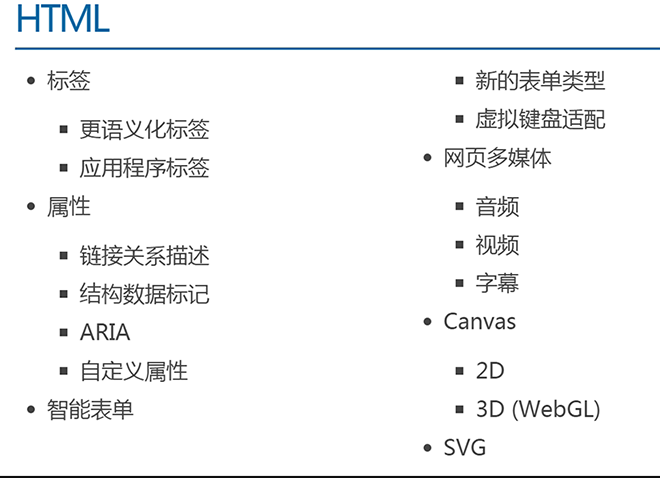

# HTML5 介绍

Web 技术发展时间线

- 1991 HTML
- 1994 HTML2
- 1996 CSS1 + JavaScript
- 1997 HTML4
- 1998 CSS2
- 2000 XHTML1（严格的 html）
- 2002 Tableless Web Design（表格布局）
- 2005 AJAX
- 2009 HTML5
- 2014 HTML5 Finalized

2002 年的表格布局逐渐被淘汰，是因为：表格是用来承载数据的，并不是用来划分网页结构的。

2009 年就已经推出了 HTML5 的草案，但直到 2014 年才有定稿，是因为有移动端的推动。

H5 草案的前身是叫：Web Application，最早是由 WHATWG 这个组织在 2004 年提出的。2007 年被 W3C 组织接纳，并在 2008-01-22 发布 HTML5 的第一个草案。

HTML5 并不仅仅只是做为 HTML 标记语言的一个最新版本，更重要的是它制定了 Web 应用开发的一系列标准，成为第一个将 Web 做为应用开发平台的 HTML 语言。

HTML5 定义了一系列新元素，如新语义标签、智能表单、多媒体标签等，可以帮助开发者创建富互联网应用，还提供了一些 Javascript API，如地理定位、重力感应、硬件访问等，可以在浏览器内实现类原生应用。我们甚至可以结合 Canvas 开发网页版游戏。

**HTML5 的广义概念**：HTML5 代表浏览器端技术的一个发展阶段。在这个阶段，浏览器的呈现技术得到了飞跃发展和广泛支持，它包括：HTML5、CSS3、Javascript API 在内的一套技术组合。

HTML5 不等于 HTML next version。HTML5 包含： HTML 的升级版、CSS 的升级版、JavaScript API 的升级版。

HTML5 是新一代开发 Web 富客户端应用程序整体解决方案。包括：HTML5，CSS3，Javascript API 在内的一套技术组合。

富客户端：具有很强的交互性和体验的客户端程序。比如说，浏览博客，是比较简单的客户端；一个在线听歌的网站、即时聊天网站就是富客户端。

HTML5 的应用场景：

1. 极具表现力的网页：内容简约而不简单。
2. 网页应用程序：
   - 代替 PC 端的软件：iCloud、百度脑图、Office 365 等。
   - APP 端的网页：淘宝、京东、美团等。
   - 微信端：公众号、小程序等。
3. 混合式本地应用。
4. 简单的游戏。

# HTML5 新增的内容




语义化的标签，语义标签对于我们并不陌生，如<p>表示一个段落、<ul>表示一个无序列表。

标签语义化的作用：

- 能够便于开发者阅读和写出更优雅的代码。
- 同时让浏览器或是网络爬虫可以很好地解析，从而更好分析其中的内容。
- 更好地搜索引擎优化。

HTML 的职责是描述一块内容是什么（或其意义），而不是它长什么样子；它的外观应该由 CSS 来决定。

在此基础上，HTML5 增加了大量有意义的语义标签，更有利于搜索引擎或辅助设备理解 HTML 页面内容。HTML5 会让 HTML 代码的内容更结构化、标签更语义化。

我们常见的 css+div 布局是：


在 html5 中，我们可以这样写：


# H5 中新增的语义标签

- <section> 表示区块
- <article> 表示文章。如文章、评论、帖子、博客
- <header> 表示页眉
- <footer> 表示页脚
- <nav> 表示导航
- <aside> 表示侧边栏。如文章的侧栏
- <figure> 表示媒介内容分组。
- <mark> 表示标记 (用得少)
- <progress> 表示进度 (用得少)
- <time> 表示日期

本质上新语义标签与<div>、<span>没有区别，只是其具有表意性，使用时除了在 HTML 结构上需要注意外，其它和普通标签的使用无任何差别，可以理解成<div class="nav"> 相当于<nav>。

## 新语义标签的兼容性处理

IE8 及以下版本的浏览器不支持 H5 和 CSS3。解决办法：引入 html5shiv.js 文件。引入时，需要做 if 判断

```html
<!--  条件注释 只有ie能够识别-->

<!--[if lte ie 8]>
  <script src="html5shiv.min.js"></script>
<![endif]-->
```

上方代码是条件注释：虽然是注释，但是 IE 浏览器可以识别出来。

- l：less 更小
- t：than 比
- e：equal 等于
- g：great 更大

我们在测试 IE 浏览器的兼容的时候，可以使用软件 ietest，模拟 IE6-IE11。

在不支持 HTML5 新标签的浏览器，会将这些新的标签解析成行内元素(inline)对待，所以我们只需要将其转换成块元素(block)即可使用。

但是在 IE9 版本以下，并不能正常解析这些新标签，但是可以识别通过 document.createElement('tagName')创建的自定义标签。于是我们的解决方案就是：将 HTML5 的新标签全部通过 document.createElement('tagName')来创建一遍，这样 IE 低版本也能正常解析 HTML5 新标签了。

# H5 中的表单

传统的 Web 表单已经越来越不能满足开发的需求，HTML5 在 Web 表单方向做了很大的改进，如拾色器、日期/时间组件等，使表单处理更加高效。

H5 中新增的表单类型：

- email 只能输入 email 格式。自动带有验证功能。
- tel 手机号码。
- url 只能输入 url 格式。
- number 只能输入数字。
- search 搜索框
- range 滑动条
- color 拾色器
- time 时间
- date 日期
- datetime 时间日期
- month 月份
- week 星期

上面的部分类型是针对移动设备生效的，且具有一定的兼容性，在实际应用当中可选择性的使用。

# 表单元素（标签）

datalist 数据列表

```html
<input type="text" list="myData" />
<datalist id="myData">
  <option>本科</option>
  <option>研究生</option>
  <option>不明</option>
</datalist>
```


表单属性：

- placeholder 占位符（提示文字）
- autofocus 自动获取焦点
- multiple 文件上传多选或多个邮箱地址
- autocomplete 自动完成（填充的）。on 开启（默认），off 取消。用于表单元素，也可用于表单自身(on/off)
- form 指定表单项属于哪个 form，处理复杂表单时会需要
- novalidate 关闭默认的验证功能（只能加给 form）
- required 表示必填项
- pattern 自定义正则，验证表单。

表单事件：

- oninput()：用户输入内容时触发，可用于输入字数统计。
- oninvalid()：验证不通过时触发。比如，如果验证不通过时，想弹出一段提示文字，就可以用到它。

# 多媒体

在 HTML5 之前，在网页上播放音频/视频的通用方法是利用 Flash 来播放。但是大多情况下，并非所有用户的浏览器都安装了 Flash 插件，由此使得音频、视频播放的处理变得非常复杂；并且移动设备的浏览器并不支持 Flash 插件。

H5 里面提供了视频和音频的标签。

## 音频

HTML5 通过<audio>标签来解决音频播放的问题。

```html
<audio src="music/yinyue.mp3" autoplay controls></audio>
```

我们可以通过附加属性，来更友好地控制音频的播放，如：

- src: 用于告诉 video 标签需要播放的视频地址
- autoplay 自动播放。写成 autoplay 或者 autoplay = ""，都可以。
- controls 控制条。（建议把这个选项写上，不然都看不到控件在哪里）
- loop 一般用于做广告视频, 用于告诉 video 标签视频播放完毕之后是否需要循环播放
- preload 预加载视频, 但是需要注意 preload 和 autoplay 相冲, 如果设置了 autoplay 属性, 那么 preload 属性就会失效

处理兼容性问题：由于版权等原因，不同的浏览器可支持播放的格式是不一样的


为了做到多浏览器支持，可以采取以下兼容性写法

```html
<audio controls loop>
  <source src="music/yinyue.mp3" />
  <source src="music/yinyue.ogg" />
  <source src="music/yinyue.wav" />
  抱歉，你的浏览器暂不支持此音频格式
</audio>
```

## 视频

HTML5 通过<video>标签来解决视频播放的问题。

```html
<video src="video/movie.mp4" controls autoplay></video>
```

我们可以通过附加属性，来更友好地控制视频的播放，如：

- autoplay 自动播放。写成 autoplay 或者 autoplay = ""，都可以。
- controls 控制条。（建议把这个选项写上，不然都看不到控件在哪里）
- loop 循环播放。
- preload 预加载视频, 但是需要注意 preload 和 autoplay 相冲, 如果设置了 autoplay 属性, 那么 preload 属性就会失效
- width：设置播放窗口宽度。
- height：设置播放窗口的高度。
- muted:静音
- poster: 用于告诉 video 标签视频没有播放之前显示的占位图片


# DOM 操作

## 获取元素

- document.querySelector("selector") 通过 CSS 选择器获取符合条件的第一个元素。
- document.querySelectorAll("selector") 通过 CSS 选择器获取符合条件的所有元素，以类数组形式存在。

## 类名操作

- Node.classList.add("class") 添加 class
- Node.classList.remove("class") 移除 class
- Node.classList.toggle("class") 切换 class，有则移除，无则添加
- Node.classList.contains("class") 检测是否存在 class

## 自定义属性

js 里可以通过 box1.index=100; box1.title 来自定义属性和获取属性。

H5 可以直接在标签里添加自定义属性，但必须以 data- 开头。

```html
<!DOCTYPE html>
<html>
  <head lang="en">
    <meta charset="UTF-8" />
    <title></title>
  </head>
  <body>
    <!-- 给标签添加自定义属性 必须以data-开头 -->
    <div
      class="box"
      title="盒子"
      data-my-name="smyhvae"
      data-content="我是一个div"
    >
      div
    </div>
    <script>
      var box = document.querySelector(".box");

      //自定义的属性 需要通过 dateset[]方式来获取
      console.log(box.dataset["content"]); //打印结果：我是一个div
      console.log(box.dataset["myName"]); //打印结果：smyhvae

      //设置自定义属性的值
      var num = 100;
      num.index = 10;
      box.index = 100;
      box.dataset["content"] = "aaaa";
    </script>
  </body>
</html>
```

# H5 新的 API

离线、音视频、图形、实时通信、本地存储、设备能力等。

## 拖拽

在 HTML5 的规范中，我们可以通过为元素增加 draggable="true" 来设置此元素是否可以进行拖拽操作，其中图片、链接默认是开启拖拽的。

### 拖拽元素。

页面中设置了 draggable="true" 属性的元素。`<div class="box1" draggable="true"></div>`

拖拽元素的事件监听：（应用于拖拽元素）

- ondragstart 当拖拽开始时调用
- ondragleave 当鼠标离开拖拽元素时调用
- ondragend 当拖拽结束时调用
- ondrag 整个拖拽过程都会调用

### 目标元素

比如说，你想把元素 A 拖拽到元素 B 里，那么元素 B 就是目标元素。

页面中任何一个元素都可以成为目标元素。

目标元素的事件监听：（应用于目标元素）

- ondragenter 当拖拽元素进入时调用
- ondragover 当拖拽元素停留在目标元素上时，就会连续一直触发（不管拖拽元素此时是移动还是不动的状态）
- ondrop 当在目标元素上松开鼠标时调用
- ondragleave 当鼠标离开目标元素时调用

如果想让拖拽元素在目标元素里做点事情，就必须要在 ondragover() 里加 event.preventDefault()这一行代码。

## 历史

界面上的所有 JS 操作不会被浏览器记住，就无法回到之前的状态。

在 HTML5 中可以通过 window.history 操作访问历史状态，让一个页面可以有多个历史状态

window.history 对象可以让我们管理历史记录，可用于单页面应用，Single Page Application，可以无刷新改变网页内容。

- window.history.forward(); // 前进
- window.history.back(); // 后退
- window.history.go(); // 刷新
- window.history.go(n); //n=1 表示前进；n=-1 后退；n=0s 刷新。如果移动的位置超出了访问历史的边界，会静默失败，但不会报错。
- 通过 JS 可以加入一个访问状态
- history.pushState; //放入历史中的状态数据, 设置 title(现在浏览器不支持改变历史状态)

## 地理定位

在 HTML 规范中，增加了获取用户地理信息的 API，这样使得我们可以基于用户位置开发互联网应用，即基于位置服务 LBS (Location Base Service)。

### 获取地理信息的方式

1. IP 地址
2. 三维坐标
   - GPS（Global Positioning System，全球定位系统）
   - Wi-Fi 定位：仅限于室内。
   - 手机信号定位：通过运营商的信号塔定位。
3. 用户自定义数据：对不同获取方式的优缺点进行了比较，浏览器会自动以最优方式去获取用户地理信息

### 隐私

HTML5 Geolocation(地理位置定位) 规范提供了一套保护用户隐私的机制。必须先得到用户明确许可，才能获取用户的位置信息。

API 详解

- navigator.getCurrentPosition(successCallback, errorCallback, options) 获取当前地理信息
- navigator.watchPosition(successCallback, errorCallback, options) 重复获取当前地理信息

1. 当成功获取地理信息后，会调用 succssCallback，并返回一个包含位置信息的对象 position：（Coords 即坐标）
   - position.coords.latitude 纬度
   - position.coords.longitude 经度
2. 当获取地理信息失败后，会调用 errorCallback，并返回错误信息 error。
3. 可选参数 options 对象可以调整位置信息数据收集方式

## 全屏

HTML5 规范允许用户自定义网页上任一元素全屏显示。

开启/关闭全屏显示(注意 screen 是小写)

- `requestFullscreen()`让元素开启全屏显示
- `cancleFullscreen()`让元素关闭全屏显示

为考虑兼容性问题，不同的浏览器需要在此基础之上，添加私有前缀，比如：（注意 screen 是大写）

- webkitRequestFullScreen
- webkitCancleFullScreen
- mozRequestFullScreen
- mozCancleFullScreen

检测当前是否处于全屏状态`document.fullScreen`

不同浏览器需要加私有前缀，比如：

- document.webkitIsFullScreen
- document.mozFullScreen

## Web 存储

随着互联网的快速发展，基于网页的应用越来越普遍，同时也变的越来越复杂，为了满足各种各样的需求，会经常性在本地存储大量的数据，传统方式我们以 document.cookie 来进行存储的，但是由于其存储大小只有 4k 左右，并且解析也相当的复杂，给开发带来诸多不便，HTML5 规范则提出解决方案。

H5 中有两种存储的方式

1. window.sessionStorage 会话存储：
   - 保存在内存中。
   - 生命周期为关闭浏览器窗口。也就是说，当窗口关闭时数据销毁。
   - 在同一个窗口下数据可以共享。
2. window.localStorage 本地存储：
   - 有可能保存在浏览器内存里，有可能在硬盘里。
   - 永久生效，除非手动删除（比如清理垃圾的时候）。
   - 可以多窗口共享。

Web 存储的特性：

1. 设置、读取方便。
2. 容量较大，sessionStorage 约 5M、localStorage 约 20M。
3. 只能存储字符串，可以将对象 JSON.stringify() 编码后存储。
