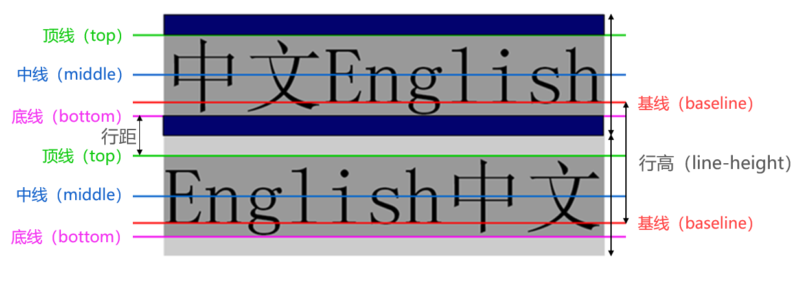

# 文本属性

## text-decoration

text-decoration 用于设置文字的装饰线

－ none：无任何装饰线。可以去除 a 元素默认的下划线
－ underline：下划线
－ overline：上划线
－ line-through：中划线（删除线）

u、ins 元素默认就是设置了 text-decoration 为 underline

## text-indent

text-indent 用于设置第一行内容的缩进

`text-indent: 2em;`刚好是缩进 2 个文字

## text-align

text-align 可用于设置元素内容在元素中的水平对齐方式

常用的值：

- left：左对齐
- right：右对齐
- center：正中间显示
- justify：两端对齐

# 字体属性

## font-size

font-size 决定文字的大小

常用的设置：具体数值+单位，比如 100px。也可以使用 em 单位：1em 代表 100%，2em 代表 200%，0.5em 代表 50%

百分比：基于父元素的 font-size 计算，比如 50%表示等于父元素 font-size 的一半

## font-family

font-family 用于设置文字的字体名称

可以设置 1 个或者多个字体名称（从左到右按顺序选择字体，直到找到可用的字体为止）

一般情况下，英文字体只适用于英文，中文字体同时适用于英文和中文，所以，如果希望中英文分别使用不同的字体，应该先将英文字体写在前面，中文字体写在后面

```css
div {
  font-family: "Courier New", "华文彩云";
}
```

## font-weight

font-weight 用于设置文字的粗细（重量）

100 | 200 | 300 | 400 | 500 | 600 | 700 | 800 | 900：每一个数字表示一个重量

normal：等于 400

bold：等于 700

strong、b、h1~h6 等标签的 font-weight 默认就是 bold

## font-style

font-style 用于设置文字的常规、斜体显示

- normal：常规显示
- italic：用字体的斜体显示
- oblique：文本倾斜显示

em、i、cite、address、var、dfn 等元素的 font-style 默认就是 italic

设置 font-style 为 italic 的 span 元素，使用效果等价于 em 元素

## font-variant

font-variant 可以影响小写字母的显示形式

可以设置的值如下

- normal：常规显示
- small-caps：将小写字母替换为缩小过的大写字母

```html
<head>
  <meta charset="UTF-8" />
  <meta name="viewport" content="width=device-width, initial-scale=1.0" />
  <title>Document</title>
  <style>
    div {
      font-size: 30px;
      font-variant: small-caps;
    }
  </style>
</head>

<body>
  <div>Hello World！</div>
</body>
```


## line-height

line-height 用于设置文本的最小行高

行高可以先简单理解为一行文字所占据的高度

行高的严格定义是：两行文字基线（baseline）之间的间距

基线（baseline）：与小写字母 x 最底部对齐的线



注意区分 height 和 line-height 的区别

- height：元素的整体高度
- line-height：元素中每一行文字所占据的高度

假设 div 中只有一行文字，如何让这行文字在 div 内部垂直居中。让 line-height 等同于 height

## font

font 是一个缩写属性

> font-style font-variant font-weight font-size/line-height font-family

```css
div {
  font: italic small-caps 700 50px/25px "微软雅黑";
}
```

font-style、font-variant、font-weight 可以随意调换顺序，也可以省略

line-height 可以省略，如果不省略，必须跟在 font-size 后面

font-size、font-family 不可以调换顺序，不可以省略

# text-overflow

white-space 用于设置空白处理和换行规则

- normal：合并所有连续的空白，允许单词超屏时自动换行
- nowrap：合并所有连续的空白，不允许单词超屏时自动换行

- text-overflow 通常用来设置文字溢出时的行为(处理那部分不可见的内容)
  - clip：溢出的内容直接裁剪掉（字符可能会显示不完整）
  - ellipsis：溢出那行的结尾处用省略号表示

text-overflow 生效的前提是 overflow 的属性不为 visible
