# 属性选择器

## [att]

拥有 title 属性的元素

```html
<head>
  <meta charset="UTF-8" />
  <meta name="viewport" content="width=device-width, initial-scale=1.0" />
  <title>Document</title>
  <style>
    [title] {
      color: red;
    }
  </style>
</head>

<body>
  <div title="one">Hello World1</div>
  <div>Hello World2</div>
  <div>
    <p title="two">Hello World3</p>
  </div>
  <div title="">Hello World4</div>
</body>
```

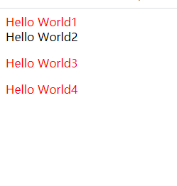

## [att=val]

```html
<head>
  <meta charset="UTF-8" />
  <meta name="viewport" content="width=device-width, initial-scale=1.0" />
  <title>Document</title>
  <style>
    [title="one"] {
      color: red;
    }
  </style>
</head>

<body></body>
```

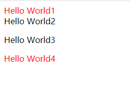

## [attr^=val]

title 属性值以单词 one 开头的元素

```html
<head>
  <meta charset="UTF-8" />
  <meta name="viewport" content="width=device-width, initial-scale=1.0" />
  <title>Document</title>
  <style>
    [title^="one"] {
      color: red;
    }
  </style>
</head>

<body>
  <div title="one">文本内容1</div>
  <p title="twoone">文本内容2</p>
  <span title="two one">文本内容3</span>
  <div title="two-one">文本内容4</div>
  <p title="two">文本内容5</p>
  <p title="one_two">文本内容6</p>
</body>
```

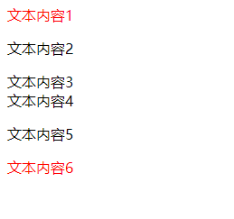

## [attr|=val]

title 属性值恰好等于 one 或者 以单词 one 开头且后面紧跟着连字符-的元素

一般是用在 lang 属性上面

```html
<head>
  <meta charset="UTF-8" />
  <meta name="viewport" content="width=device-width, initial-scale=1.0" />
  <title>Document</title>
  <style>
    [title|="one"] {
      color: red;
    }
  </style>
</head>

<body>
  <div title="test on two">文本内容1</div>
  <p title="test-one">文本内容2</p>
  <span title="one two">文本内容3</span>
  <div title="one-two">文本内容4</div>
  <p title="one">文本内容5</p>
  <p title="one_two">文本内容6</p>
</body>
```

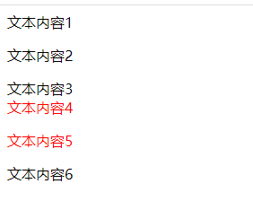

[attribute|=value] CSS2

[attribute^=value] CSS3

两者之间的区别:

- CSS2 中的只能找到 value 开头,并且 value 是被-和其它内容隔开的
- CSS3 中的只要是以 value 开头的都可以找到, 无论有没有被-隔开

##　[attr*=val]

title 属性值包含单词 one 的元素

```html
<head>
  <meta charset="UTF-8" />
  <meta name="viewport" content="width=device-width, initial-scale=1.0" />
  <title>Document</title>
  <style>
    [title*="one"] {
      color: red;
    }
  </style>
</head>

<body>
  <div title="one">文本内容1</div>
  <p title="twoone">文本内容2</p>
  <span title="two one">文本内容3</span>
  <div title="two-one">文本内容4</div>
  <p title="two">文本内容5</p>
  <p title="two_one">文本内容6</p>
</body>
```

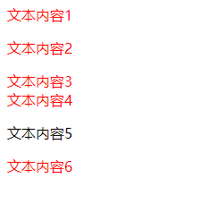

## [attr~=val]

title 属性值包含单词 one 的元素（单词 one 与其他单词之间必须用空格隔开）

```html
<head>
  <meta charset="UTF-8" />
  <meta name="viewport" content="width=device-width, initial-scale=1.0" />
  <title>Document</title>
  <style>
    [title~="one"] {
      color: red;
    }
  </style>
</head>

<body>
  <div title="testonetwo">文本内容1</div>
  <div title="testone two">文本内容2</div>
  <div title="test one two">文本内容3</div>
  <div title="testone">文本内容4</div>
  <div title="one two">文本内容5</div>
  <div title="one-two">文本内容6</div>
  <div title="one_two">文本内容7</div>
  <div title="one">文本内容8</div>
  <div title="two">文本内容9</div>
</body>
```

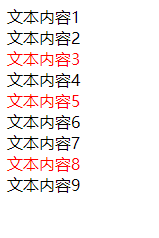

[attribute~=value] CSS2

[attribute*=value] CSS3

两者之间的区别:

- CSS2 中的只能找到独立的单词, 也就是包含 value,并且 value 是被空格隔开的
- CSS3 中的只要包含 value 就可以找到

## [attr$=val]

[attribute$=value] CSS3

title 属性值以单词 one 结尾的元素

```html
<head>
  <meta charset="UTF-8" />
  <meta name="viewport" content="width=device-width, initial-scale=1.0" />
  <title>Document</title>
  <style>
    [title$="one"] {
      color: red;
    }
  </style>
</head>

<body>
  <div title="one">文本内容1</div>
  <div title="twoone">文本内容2</div>
  <div title="two one">文本内容3</div>
  <div title="two-one">文本内容4</div>
  <div title="two_one">文本内容5</div>
</body>
```

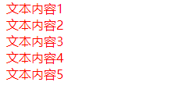

# 后代选择器

div 元素里面的 span 元素（包括直接、间接子元素）

```html
<head>
  <meta charset="UTF-8" />
  <meta name="viewport" content="width=device-width, initial-scale=1.0" />
  <title>Document</title>
  <style>
    div span {
      color: red;
    }
  </style>
</head>

<body>
  <span>文本内容1</span>
  <div>
    <span>文本内容2</span>
    <p>
      <span>文本内容3</span>
    </p>
  </div>
  <div>
    <span>文本内容4</span>
  </div>
  <span>文本内容5</span>
</body>
```

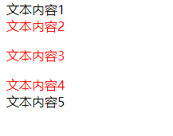

1. 后代选择器必须用空格隔开
2. 后代不仅仅是儿子, 也包括孙子/重孙子, 只要最终是放到指定标签中的都是后代
3. 后代选择器不仅仅可以使用标签名称, 还可以使用其它选择器
4. 后代选择器可以通过空格一直延续下去

# 子选择器

div 元素里面的直接 span 子元素（不包括间接子元素）

```html
<head>
  <meta charset="UTF-8" />
  <meta name="viewport" content="width=device-width, initial-scale=1.0" />
  <title>Document</title>
  <style>
    div > span {
      color: red;
    }
  </style>
</head>

<body>
  <span>文本内容1</span>
  <div>
    <span>文本内容2</span>
    <p>
      <span>文本内容3</span>
    </p>
  </div>
  <div>
    <span>文本内容4</span>
  </div>
  <span>文本内容5</span>
</body>
```

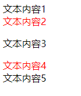

1. 子元素选择器只会查找儿子, 不会查找其他被嵌套的标签
2. 子元素选择器之间需要用>符号连接, 并且不能有空格
3. 子元素选择器不仅仅可以使用标签名称, 还可以使用其它选择器
4. 子元素选择器可以通过>符号一直延续下去

后代选择器和子元素选择器之间的区别:

- 后代选择器使用空格作为连接符号,子元素选择器使用>作为连接符号
- 后代选择器会选中指定标签中, 所有的特定后代标签, 也就是会选中儿子/孙子..., 只要是被放到指定标签中的特定标签都会被选中。子元素选择器只会选中指定标签中, 所有的特定的直接标签, 也就是只会选中特定的儿子标签

后代选择器和子元素选择器之间的共同点:

- 后代选择器和子元素选择器都可以使用标签名称/id 名称/class 名称来作为选择器
- 后代选择器和子元素选择器都可以通过各自的连接符号一直延续下去

如果想选中指定标签中的所有特定的标签, 那么就使用后代选择器

如果只想选中指定标签中的所有特定儿子标签, 那么就使用子元素选择器

# 兄弟选择器

## 相邻兄弟选择器

div 元素后面紧挨着的 p 元素（且 div、p 元素必须是兄弟关系）

```html
<head>
  <meta charset="UTF-8" />
  <meta name="viewport" content="width=device-width, initial-scale=1.0" />
  <title>Document</title>
  <style>
    div + p {
      color: red;
    }
  </style>
</head>

<body>
  <p>文本内容1</p>
  <div>
    <p>文本内容2</p>
  </div>
  <p>文本内容3</p>
  <p>文本内容4</p>
</body>
```

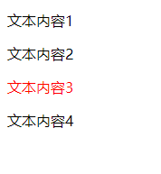

相邻兄弟选择器 CSS2 推出的

给指定选择器后面紧跟的那个选择器选中的标签设置属性

1. 相邻兄弟选择器必须通过+连接
2. 相邻兄弟选择器只能选中紧跟其后的那个标签, 不能选中被隔开的标签

## 通用兄弟选择器

div 元素后面的 p 元素（且 div、p 元素必须是兄弟关系）

```html
<head>
  <meta charset="UTF-8" />
  <meta name="viewport" content="width=device-width, initial-scale=1.0" />
  <title>Document</title>
  <style>
    div ~ p {
      color: red;
    }
  </style>
</head>

<body>
  <span>文本内容1</span>
  <p>文本内容2</p>
  <div>文本内容3</div>
  <div>
    <p>文本内容4</p>
  </div>
  <p>文本内容5</p>
  <p>文本内容6</p>
</body>
```

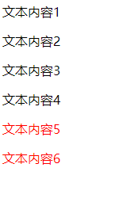

通用兄弟选择器 CSS3 推出的

给指定选择器后面的所有选择器选中的所有标签设置属性

1. 通用兄弟选择器必须用~连接
2. 通用兄弟选择器选中的是指定选择器后面某个选择器选中的所有标签, 无论有没有被隔开都可以选中

# 选择器组

## 交集选择器

给所有选择器选中的标签中, 相交的那部分标签设置属性

同时符合 2 个条件的元素：div 元素、class 值有 one

```html
<head>
  <meta charset="UTF-8" />
  <meta name="viewport" content="width=device-width, initial-scale=1.0" />
  <title>Document</title>
  <style>
    div.one {
      color: red;
    }
  </style>
</head>

<body>
  <div class="one">文本内容1</div>
  <div class="one">文本内容2</div>
  <div class="two">文本内容3</div>
</body>
```

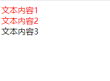

所有同时符合 3 个条件的元素：div 元素、class 值有 one、title 属性值等于 test

```html
<head>
  <meta charset="UTF-8" />
  <meta name="viewport" content="width=device-width, initial-scale=1.0" />
  <title>Document</title>
  <style>
    div.one[title="test"] {
      color: red;
    }
  </style>
</head>

<body>
  <div class="one">文本内容1</div>
  <div class="one" title="test">文本内容2</div>
  <div class="two" title="other">文本内容3</div>
</body>
```

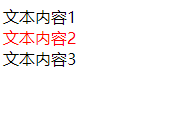

1. 选择器和选择器之间没有任何的连接符号
2. 选择器可以使用标签名称/id 名称/class 名称
3. 交集选择器仅仅作为了解, 企业开发中用的并不多

## 并集选择器

给所有选择器选中的标签设置属性

所有的 div 元素 + 所有 class 值有 one 的元素 + 所有 title 属性值等于 test 的元素

```html
<head>
  <meta charset="UTF-8" />
  <meta name="viewport" content="width=device-width, initial-scale=1.0" />
  <title>Document</title>
  <style>
    div,
    .one,
    [title="test"] {
      color: red;
    }
  </style>
</head>

<body>
  <div>文本内容1</div>
  <span title="test">文本内容2</span>
  <p class="one">文本内容3</p>
</body>
```

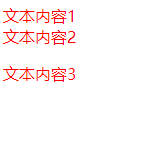

1. 并集选择器必须使用,来连接
2. 选择器可以使用标签名称/id 名称/class 名称

# 伪类

常见的伪类有：

- 动态伪类（dynamic pseudo-classes）:link、:visited、:hover、:active、:focus
- 结构伪类（structural pseudo-classes）`:nth-child()、:nth-last-child(）、:nth-of-type()、:nth-last-of-type()、:first-child、:last-child、:first-of-type、:last-of-type、:root、:only-child、:only-of-type、:empty`
- 否定伪类（negation pseudo-classes）：`:not()`

## 动态伪类

- a:link 未访问的链接
- a:visited 已访问的链接
- a:hover 鼠标挪动到链接上
- a:active 激活的链接（鼠标在链接上长按住未松开）

使用注意

- :hover 必须放在:link 和:visited 后面才能完全生效
- :active 必须放在:hover 后面才能完全生效
- 所以建议的编写顺序是 :link、:visited、:hover、:active
- 记忆：女朋友看到 LV 后，ha ha 大笑

除了 a 元素，:hover、:active 也能用在其他元素上

- :focus 指当前拥有输入焦点的元素（能接收键盘输入）
- 文本输入框一聚焦后，背景就会变红色

因为链接 a 元素可以被键盘的 Tab 键选中聚焦，所以:focus 也适用于 a 元素

动态伪类编写顺序建议为`:link、:visited、:focus、:hover、:active`
记忆：女朋友看到 LV 包包后，（Feng）疯一样地 ha ha 大笑

去除 a 元素默认的:focus 效果

```css
a:focus {
  outline: none;
}
```

或者将 tabindex 属性设置为-1

```html
<head>
  <meta charset="UTF-8" />
  <meta name="viewport" content="width=device-width, initial-scale=1.0" />
  <title>Document</title>
  <style>
    /* a {
      outline: none;
    } */
  </style>
</head>

<body>
  <a tabindex="-1" href="#">Google一下</a>
  <p>
    Lorem ipsum dolor sit amet consectetur adipisicing elit. Iusto eaque
    molestias repellat accusamus? Eligendi excepturi minus nulla quaerat soluta,
    consequuntur quas perspiciatis sed officiis doloremque, laborum cumque
    corporis consequatur quia.
  </p>
  <input type="text" />
</body>
```

直接给 a 元素设置样式，相当于给 a 元素的所有动态伪类都设置了

相当于 a:link、a:visited、a:hover、a:active、a:focus 的 color 都是 red

# 结构伪类

1. 同级别的第几个
   :first-child 选中同级别中的第一个标签
   :last-child 选中同级别中的最后一个标签
   :nth-child(n) 选中同级别中的第 n 个标签
   :nth-last-child(n) 选中同级别中的倒数第 n 个标签
   :only-child 选中父元素中唯一的标签
   注意点: 不区分类型
2. 同类型的第几个
   :first-of-type 选中同级别中同类型的第一个标签
   :last-of-type 选中同级别中同类型的最后一个标签
   :nth-of-type(n) 选中同级别中同类型的第 n 个标签
   :nth-last-of-type(n) 选中同级别中同类型的倒数第 n 个标签
   :only-of-type 选中父元素中唯一类型的某个标签

- :nth-child(odd) 选中同级别中的所有奇数
- :nth-child(even) 选中同级别中的所有偶数
- :nth-child(xn+y) x 和 y 是用户自定义的, 而 n 是一个计数器, 从 0 开始递增

# 伪元素

常用的伪元素有

- :first-line、::first-line
- :first-letter、::first-letter
- :before、::before
- :after、::after

::first-line 可以针对首行文本设置属性

```html
<head>
  <meta charset="UTF-8" />
  <meta name="viewport" content="width=device-width, initial-scale=1.0" />
  <title>Document</title>
  <style>
    div::first-line {
      color: blue;
      text-decoration: underline;
    }
  </style>
</head>

<body>
  <div>
    Lorem ipsum dolor sit amet consectetur adipisicing elit. Cumque aliquam,
    modi ab nesciunt distinctio rerum voluptatem in illum ad provident dolorem
    corrupti quae. Libero molestiae sed adipisci, corrupti ipsum nulla.
  </div>
</body>
```

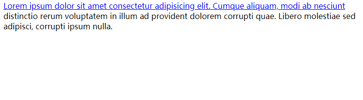

只有下列属性可以应用在::first-line 伪元素

- 字体属性、颜色属性、背景属性
- word-spacing、letter-spacing、text-decoration、text-transform、line-height

::first-letter 可以针对首字母设置属性

只有下列属性可以应用在::first-letter 伪元素

- 字体属性、margin 属性、padding 属性、border 属性、颜色属性、背景属性
- text-decoration、text-transform、letter-spacing、word-spacing（适当的时候）、line-height、float、vertical-align（只有当 float 是 none 时）

::before 和::after 用来在一个元素的内容之前或之后插入其他内容（可以是文字、图片）

```html
<head>
  <meta charset="UTF-8" />
  <meta name="viewport" content="width=device-width, initial-scale=1.0" />
  <title>Document</title>
  <style>
    div {
      color: blue;
    }

    div::before {
      color: hotpink;
      content: "我是在div前面加的内容";
      font-size: 40px;
    }

    div::after {
      color: red;
      content: "我是在div后面加的内容";
      font-size: 40px;
    }
  </style>
</head>

<body>
  <div>
    Lorem ipsum dolor sit amet consectetur adipisicing elit. Cumque aliquam,
    modi ab nesciunt distinctio rerum voluptatem in illum ad provident dolorem
    corrupti quae. Libero molestiae sed adipisci, corrupti ipsum nulla.
  </div>
</body>
```

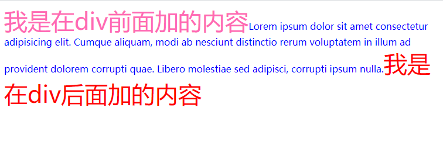
