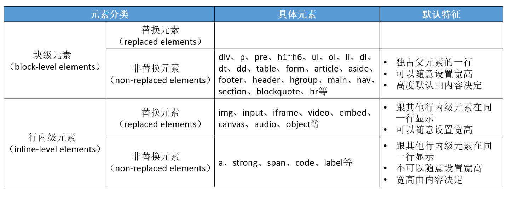

# CSS 属性-元素类型

## 块级、行内级元素

根据元素的显示（能不能在同一行显示）类型，HTML 元素可以主要分为 2 大类

- 块级元素（block-level elements）
  - 独占父元素一行。比如 div、p、pre、h1~h6、ul、ol、li、dl、dt、dd、table、form、article、aside、footer、header、hgroup、main、nav、section、blockquote、hr 等
- 行内级元素（inline-level elements）
  - 多个行内级元素可以在父元素的同一行中显示。比如 a、img、span、strong、code、iframe、label、input、button、canvas、embed、object、 video、audio 等

## 替换、非替换元素

根据元素的内容（是否浏览器会替换掉元素）类型，HTML 元素可以主要分为 2 大类

- 替换元素（replaced elements）
  - 元素本身没有实际内容，浏览器根据元素的类型和属性，来决定元素的具体显示内容。比如 img、input、iframe、video、embed、canvas、audio、object 等
- 非替换元素（non-replaced elements）
  - 和替换元素相反，元素本身是有实际内容的，浏览器会直接将其内容显示出来，而不需要根据元素类型和属性来判断到底显示什么内容。比如 div、p、pre、h1~h6、ul、ol、li、dl、dt、dd、table、form、article、aside、footer、header、hgroup、main、nav、section、blockquote、hr、a、strong、span、code、label 等

元素的分类总结：

# CSS 属性 - display

CSS 中有个 display 属性，能修改元素的显示类型，有 4 个常用值

- block：让元素显示为块级元素
- inline：让元素显示为行内级元素
- none：隐藏元素
- inline-block：让元素同时具备行内级、块级元素的特征

# inline-block

- 可以让元素同时具备块级、行内级元素的特征
- 跟其他行内级元素在同一行显示
- 可以随意设置宽高
- 宽高默认由内容决定

可以理解为

- 对外来说，它是一个行内级元素
- 对内来说，它是一个块级元素

常见用途

- 让行内级非替换元素（比如 a、span 等）能够随时设置宽高
- 让块级元素（比如 div、p 等）能够跟其他元素在同一行显示

# CSS 属性 - visibility

visibility，能控制元素的可见性，有 2 个常用值

- visible：显示元素
- hidden：隐藏元素

`visibility: hidden;`和`display: none;`的区别

- `visibility: hidden;`虽然元素看不见了，但元素的框依旧还留着，还会占着原来的位置
- `display: none;`不仅元素看不见了，而且元素的框也会被移除，不会占着任何位置

# CSS 属性 - overflow

overflow 用于控制内容溢出时的行为

- visible：溢出的内容照样可见
- hidden：溢出的内容直接裁剪
- scroll：溢出的内容被裁剪，但可以通过滚动机制查看
  - 会一直显示滚动条区域，滚动条区域占用的空间属于 width、height
- auto：自动根据内容是否溢出来决定是否提供滚动机制

还有 overflow-x、overflow-y 两个属性，可以分别设置水平垂直方向
（建议还是直接使用 overflow，因为目前 overflow-x、overflow-y 还没有成为标准，浏览器可能不支持）

# 元素之间的空格

行内级元素（包括 inline-block 元素）的代码之间如果有空格，会被解析显示为空格

目前建议的解决方法

1. 元素代码之间不要留空格
2. 注释掉空格
3. 设置父元素的 font-size 为 0，然后在元素中重新设置自己需要的 font-size。此方法在 Safari 不适用
4. 给元素加 float

注意点：

- 块级元素、inline-block 元素
  - 一般情况下，可以包含其他任何元素（比如块级元素、行内级元素、inline-block 元素）
  - 特殊情况，p 元素不能包含其他块级元素
- 行内级元素（比如 a、span、strong 等）
  - 一般情况下，只能包含行内级元素
