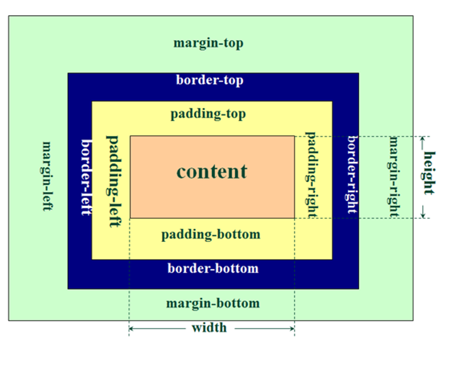
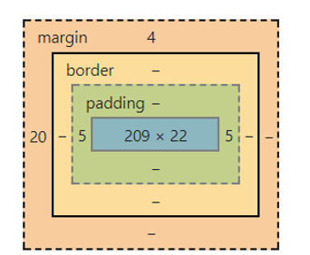
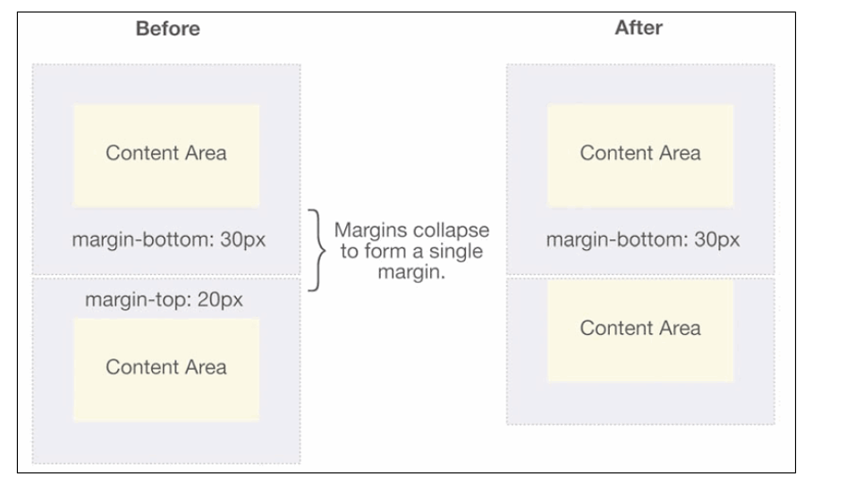
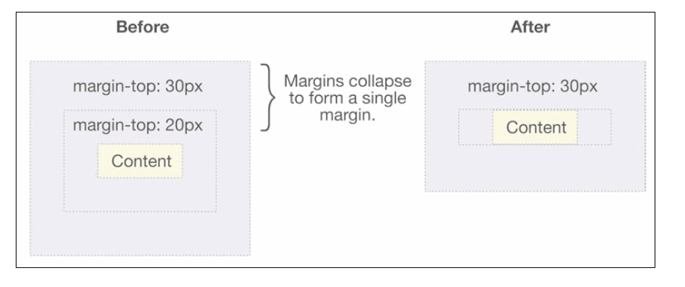
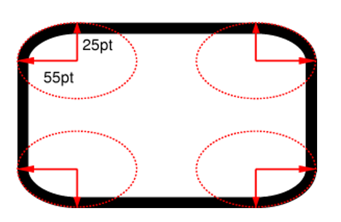
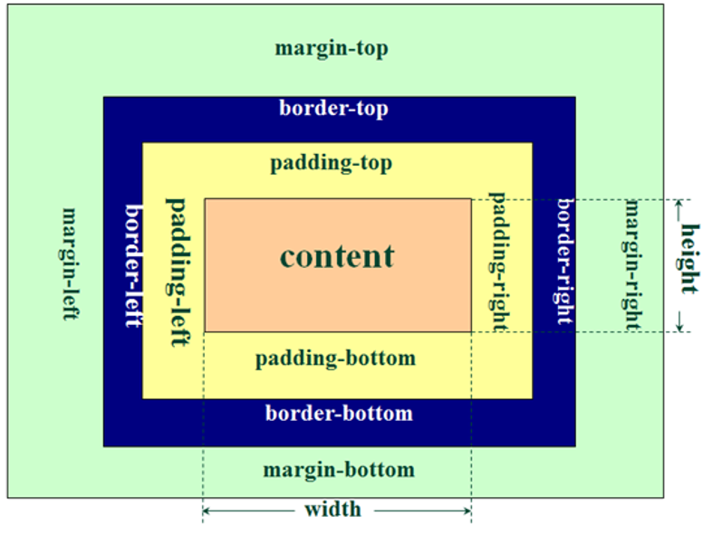
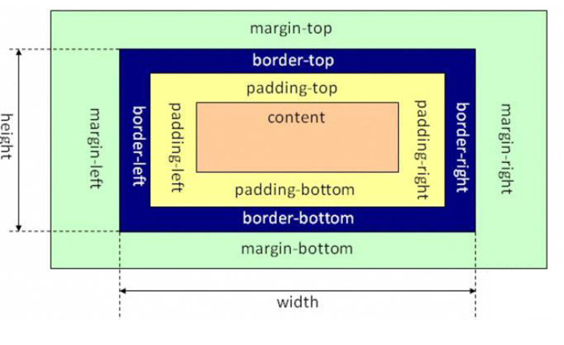

# 盒子模型

HTML 中的每一个元素都可以看做是一个盒子，可以具备这 4 个属性

- 内容（content）：盒子里面装的东西
- 内边距（padding）：盒子边缘和里面装的东西之间的间距
- 边框（border）：就是盒子的边框，边缘部分
- 外边距（margin）：盒子和其他盒子之间的间距

默认的盒子模型如下图所示



浏览器开发者工具中看到的盒子模型



# 内容相关属性

- width：宽度
  - min-width：最小宽度，无论内容多少，宽度都大于或等于 min-width
  - max-width：最大宽度，无论内容多少，宽度都小于或等于 max-width
- height：高度
  - min-height：最小高度，无论内容多少，高度都大于或等于 min-height
  - max-height：最大高度，无论内容多少，高度都小于或等于 max-height

# 内边距相关属性

- padding-left：左内边距
- padding-right：右内边距
- padding-top：上内边距
- padding-bottom：下内边距
- padding：是 padding-top、padding-right、padding-bottom、padding-left 的简写属性

这三个属性的取值省略时的规律:

- 上 右 下 左 > 上 右 下 > 左边的取值和右边的一样
- 上 右 下 左 > 上 右 > 左边的取值和右边的一样 下边的取值和上边一样
- 上 右 下 左 > 上 > 右下左边取值和上边一样

注意:

1. 给标签设置内边距之后, 标签占有的宽度和高度会发生变化
2. 给标签设置内边距之后, 内边距也会有背景颜色

# 外边距相关属性

- margin-left：左外边距
- margin-right：右外边距
- margin-top：上外边距
- margin-bottom：下外边距
- margin：是 margin-top、margin-right、margin-bottom、margin-left 的简写属性

## 上下 margin 传递

- margin-top 传递
  - 如果块级元素的顶部线和父元素的顶部线重叠，那么这个块级元素的 margin-top 值会传递给父元素
- margin-bottom 传递
  - 如果块级元素的底部线和父元素的底部线重写，并且父元素的高度是 auto，那么这个块级元素的 margin-bottom 值会传递给父元素

如何防止出现传递问题？

- 给父元素设置 padding-top/padding-bottom
- 给父元素设置 border
- 触发 BFC: 设置 overflow 为 auto

建议：

- margin 一般是用来设置兄弟元素之间的间距
- padding 一般是用来设置父子元素之间的间距

## 上下 margin 折叠

- 垂直方向上相邻的 2 个 margin（margin-top、margin-bottom）有可能会合并为 1 个 margin，这种现象叫做 collapse（折叠，倒塌）
- 水平方向上的 margin（margin-left、margin-right）永远不会 collapse

折叠后最终值的计算规则：两个值进行比较，取较大的值

如何防止 margin collapse？只设置其中一个元素的 margin

两个兄弟块级元素之间上下 margin 的折叠



父子块级元素之间 margin 的折叠



# 边框相关的属性

- 边框宽度
  - border-top-width、border-right-width、border-bottom-width、border-left-width
  - border-width 是上面 4 个属性的简写属性
- 边框颜色
  - border-top-color、border-right-color、border-bottom-color、border-left-color
  - border-color 是上面 4 个属性的简写属性
- 边框样式
  - border-top-style、border-right-style、border-bottom-style、border-left-style
  - border-style 是上面 4 个属性的简写属性

边框样式的取值：

- none：没有边框，边框颜色、边框宽度会被忽略
- dotted：边框是一系列的点
- dashed：边框是一条虚线
- solid：边框是一条实线
- double：边框有两条实线。两条线宽和其中的空白的宽度之和等于 border-width 的值
- groove：边框看上去好象是雕刻在画布之内
- ridge：和 grove 相反，边框看上去好象是从画布中凸出来
- inset：该边框使整个框看上去好象是嵌在画布中
- outset：和 inset 相反，该边框使整个框看上去好象是从画布中凸出来

行内级非替换元素的注意点：

- 以下属性对行内级非替换元素不起作用，width、height、margin-top、margin-bottom
- 以下属性对行内级非替换元素的效果比较特殊，padding-top、padding-bottom、上下方向的 border

# border-radius

border-radius 是一个缩写属性

```css
border-radius: 10px 20px 30px 40px/15px 25px 35px 45px;
```

斜线/前面是水平半径，后面是垂直半径

- 4 个值的顺序是 top-left、top-right、bottom-right、bottom-left（顺时针方向）
- 如果 bottom-left 没设置，就跟随 top-right
- 如果 bottom-right 没设置，就跟随 top-left
- 如果 top-right 没设置，就跟随 top-left

border-radius 大于或等于 50%时，就会变成一个圆

`border-*-*-radius`定义的是四分之一椭圆的半径

- 第 1 个值是水平半径
- 第 2 个值是垂直半径（如果不设置，就跟随水平半径的值）
- 还可以设置百分比。参考的是 border-box 的宽度

`border-top-left-radius: 55pt 25pt`



# outline

outline 表示元素的外轮廓。不占用空间，默认显示在 border 的外面

outline 相关属性有

- outline-width
- outline-style：取值跟 border 的样式一样，比如 solid、dotted 等
- outline-color
- outline：outline-width、outline-style、outline-color 的简写属性，跟 border 用法类似

应用实例：去除 a 元素、input 元素的 focus 轮廓效果

# box-shadow

box-shadow 属性可以设置一个或者多个阴影

每个阴影用<shadow>表示

多个阴影之间用逗号隔开，从前到后叠加

> <shadow> = inset? && <length>{2,4} && <color>?

`?`表示 0 个或 1 个

`<length>{2,4}`表示 2-4 个值

- 第 1 个<length>：水平方向的偏移，正数往右偏移
- 第 2 个<length>：垂直方向的偏移，正数往下偏移
- 第 3 个<length>：模糊半径（blur radius）
- 第 4 个<length>：延伸距离（四周）
- <color>：阴影的颜色，如果没有设置，就跟随 color 属性的颜色
- inset：外框阴影变成内框阴影

# text-shadow

text-shadow 用法类似于 box-shadow，用于给文字添加阴影效果。但是 text-shadow 没有 inset，length 为 2-3

text-shadow 同样适用于::first-line、::first-letter

# box-sizing

box-sizing 用来设置盒子模型中宽高的行为

- content-box：设置宽度和高度时只是指定内容的宽高
  - padding、border 都布置在 width、height 外边
- border-box：设置宽度和高度时是内容+内边距+边框的高度
  - padding、border 都布置在 width、height 里边

## 盒子模型宽度和高度

内容的宽度和高度

- 就是通过 width/height 属性设置的宽度和高度

元素的宽度和高度

- 宽度 = 左边框 + 左内边距 + width + 右内边距 + 右边框
- 高度 = 上边框 + 上内边距 + height + 下内边距 + 下边框

元素空间的宽度和高度

- 宽度 = 左外边距 + 左边框 + 左内边距 + width + 右内边距 + 右边框 + 右外边距
- 高度 = 上外边距 + 上边框 + 上内边距 + height + 下内边距 + 下边框 + 下外边距

`box-sizing: content-box;`



- 元素的实际占用宽度 = border + padding + width
- 元素的实际占用高度 = border + padding + height

`box-sizing: border-box;`



- 元素的实际占用宽度 = width
- 元素的实际占用高度 = height

# 元素的水平居中显示

在一些需求中，需要元素在父元素中水平居中显示（父元素一般都是块级元素、inline-block）

普遍文本、行内元素、图片（行内替换元素）、行内块级元素（inline-block）

- 水平居中：在父元素中设置 text-align: center

块级元素

- 水平居中：margin: 0 auto
