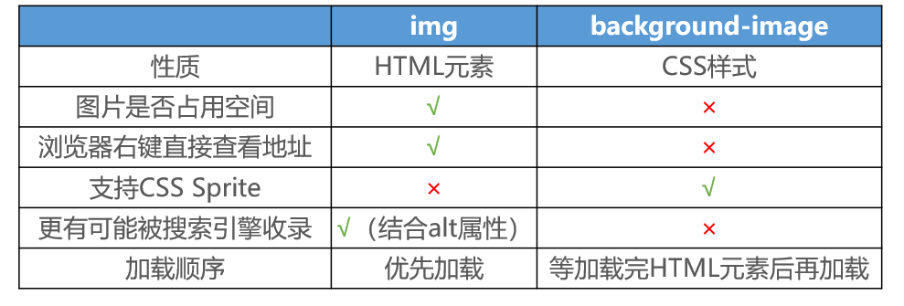

# background-image

background-image 用于设置元素的背景图片

会盖在(不是覆盖)background-color 的上面

如果设置了多张图片，设置的第一张图片将显示在最上面，其他图片按顺序层叠在下面

注意：如果设置了背景图片后，元素没有具体的宽高，背景图片是不会显示出来的

# background-repeat

background-repeat 用于设置背景图片是否要平铺

常见的设值有

- repeat：平铺
- no-repeat：不平铺
- repeat-x：只在水平方向平铺
- repeat-y：只在垂直平方向平铺

# background-size

background-size 用于设置背景图片的大小

- auto：以背景图本身大小显示
- cover：缩放背景图，以完全覆盖铺满元素
- contain：缩放背景图，宽度或者高度铺满元素，但是图片保持宽高比
- <percentage>：百分比，相对于背景区（background positioning area）
- length：具体的大小，比如 100px

# background-position

background-position 用于设置背景图片在水平、垂直方向上的具体位置

- 水平方向还可以设值：left、center、right
- 垂直方向还可以设值：top、center、bottom
- 如果只设置了 1 个方向，另一个方向默认是 center。比如`background-position: 80px;` 等价于 `background-position: 80px center;`

# CSS Sprite

CSS Sprite 是一种 CSS 图像合成技术，将各种小图片合并到一张图片上，然后利用 CSS 的背景定位来显示对应的图片部分

有人翻译为：CSS 雪碧、CSS 精灵

使用 CSS Sprite 的好处

- 减少网页的 http 请求数量，加快网页响应速度，减轻服务器压力
- 减小图片总大小
- 解决了图片命名的困扰，只需要针对一张集合的图片命名

Sprite 图片制作（雪碧图、精灵图）

- PhotoShop
- https://www.toptal.com/developers/css/sprite-generator

# background-attachment

background-attachment 可以设置以下 3 个值

- scroll：背景图片跟随元素一起滚动（默认值）
- local：背景图片跟随元素以及元素内容一起滚动
- fixed：背景图片相对于浏览器窗口固定

# background

background 是一系列背景相关属性的简写属性，常用格式是`image position/size repeat attachment color`

background-size 可以省略，如果不省略，background-size 必须紧跟在 background-position 的后面

其他属性也都可以省略，而且顺序任意

# background-image 和 img 的选择

利用 background-image 和 img 都能够实现显示图片的需求，在开发中该如何选择？



- img，作为网页内容的重要组成部分，比如广告图片、LOGO 图片、文章配图、产品图片
- background-image，可有可无。有，能让网页更加美观。无，也不影响用户获取完整的网页内容信息

# 线性渐变（Linear Gradients）

通过渐变可以设置一些复杂的背景颜色，可以实现从一个颜色向其他颜色过渡的效果

渐变是**图片**，需要通过 background-image 来设置

线性渐变，颜色沿着一条直线发生变化`background: linear-gradient(direction, color-stop1, color-stop2, ...);`

指定一个渐变的方向

- to left
- to right
- to bottom
- to top
- deg 表示度数
- turn 表示圈

渐变可以同时指定多个颜色，多个颜色默认情况下平均分布，也可以手动指定渐变的分布情况。`background-image: repeating-linear-gradient(to right ,red, yellow 50px);`

`repeating-linear-gradient()`可以平铺的线性渐变

注意点:

- 至少需要传递 2 个颜色, 至多没有上限
- 默认情况下自动回自动计算纯色和渐变色的范围, 但是我们也可以手动指定。手动指定的格式: 颜色 范围
- 只有第一个颜色后面的范围是指定纯色的范围, 后面的都是指定渐变的范围

# 径向渐变(Radial Gradients)

```css
background: radial-gradient(center, shape size, start-color, ..., last-color);
```

线性渐变: 默认从上至下。径向渐变: 默认从中心点向四周扩散

线性渐变: 可以通过 to 关键字的方式修改渐变的方向。径向渐变: 可以通过 at 关键字的方式修改开始渐变的位置

线性渐变: 可以通过 to deg 的方式修改渐变的方向。径向渐变: 可以通过 at 位置 位置的方式修改开始渐变的位置

线性渐变可以指定纯色和渐变的范围。径向渐变也可以指定扩散的范围

注意点:如果需要同时指定扩散的位置和扩散的范围, 那么范围必须写到 at 前面

```css
background: radial-gradient(100px at 200px 100px, red, green);
```

# cursor

cursor 可以设置鼠标指针（光标）在元素上面时的显示样式
cursor 常见的设值有

- auto：浏览器根据上下文决定指针的显示样式，比如根据文本和非文本切换指针样式
- default：由操作系统决定，一般就是一个小箭头
- pointer：一只小手，鼠标指针挪动到链接上面默认就是这个样式
- text：一条竖线，鼠标指针挪动到文本输入框上面默认就是这个样式
- none：没有任何指针显示在元素上面
