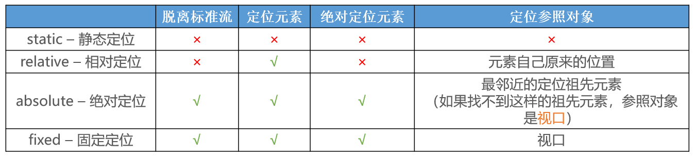

# 标准流（Normal Flow）

默认情况下，元素都是按照 normal flow（标准流、常规流、正常流、文档流【document flow】）进行排布

从左到右、从上到下按顺序摆放好

默认情况下，互相之间不存在层叠现象

在标准流中，可以使用 margin、padding 对元素进行定位，其中 margin 还可以设置负数

比较明显的缺点是

- 设置一个元素的 margin 或者 padding，通常会影响到标准流中其他元素的定位效果
- 不便于实现元素层叠的效果

# position

利用 position 可以对元素进行定位，常用取值有 4 个

- static：静态定位
- relative：相对定位
- absolute：绝对定位
- fixed：固定定位

## static - 静态定位

position 属性的默认值

元素按照 normal flow 布局

- left 、right、top、bottom 没有任何作用

## relative-相对定位

元素按照 normal flow 布局

- 可以通过 left、right、top、bottom 进行定位
- 定位参照对象是元素自己原来的位置

## fixed - 固定定位

元素脱离 normal flow（脱离标准流、脱标）

- 可以通过 left、right、top、bottom 进行定位
- 定位参照对象是视口（viewport，文档的可视区域）
- 当画布滚动时，固定不动

脱标元素的特点：

- 可以随意设置宽高
- 宽高默认由内容决定
- 不再受标准流的约束
- 不再给父元素汇报宽高数据

## absolute - 绝对定位

元素脱离 normal flow（脱离标准流、脱标）

- 可以通过 left、right、top、bottom 进行定位
- 定位参照对象是最邻近的定位祖先元素
- 如果找不到这样的祖先元素，参照对象是视口

定位元素（positioned element）

- position 值不为 static 的元素
- 也就是 position 值为 relative、absolute、fixed 的元素

## 子绝父相

在绝大数情况下，子元素的绝对定位都是相对于父元素进行定位

如果希望子元素相对于父元素进行定位，又不希望父元素脱标，常用解决方案是：

- 父元素设置 position: relative（让父元素成为定位元素，而且父元素不脱离标准流）
- 子元素设置 position: absolute

简称为**子绝父相**

## 绝对定位技巧

绝对定位元素（absolutely positioned element）：position 值为 absolute 或者 fixed 的元素

对于绝对定位元素来说：

- 定位参照对象的宽度 = left + right + margin-left + margin-right + 绝对定位元素的实际占用宽度
- 定位参照对象的高度 = top + bottom + margin-top + margin-bottom + 绝对定位元素的实际占用高度

如果希望绝对定位元素的宽高和定位参照对象一样，可以给绝对定位元素设置以下属性`left: 0、right: 0、top: 0、bottom: 0、margin:0`

如果希望绝对定位元素在定位参照对象中居中显示，可以给绝对定位元素设置以下属性`left: 0、right: 0、top: 0、bottom: 0、margin: auto`

另外，还得设置具体的宽高值（宽高小于定位参照对象的宽高）

# z-index

元素的层叠

父子关系：子元素会层叠在父元素上

非父子关系：

- 都是非定位元素：在标准流中一般不存在层叠现象
- 1 个是定位元素 1 个是非定位元素：定位元素会层叠在非定位元素上面
- 都是定位元素：使用 CSS 属性 z-index 来控制层叠顺序

z-index 属性用来设置定位元素的层叠顺序（仅对定位元素有效）

取值可以是正整数、负整数、0

比较原则

- 如果是兄弟关系
  - z-index 越大，层叠在越上面
  - z-index 相等，写在后面的那个元素层叠在上面
- 如果不是兄弟关系
  - 各自从元素自己以及祖先元素中，找出最邻近的 2 个定位元素进行比较
  - 而且这 2 个定位元素必须有设置 z-index 的具体数值
