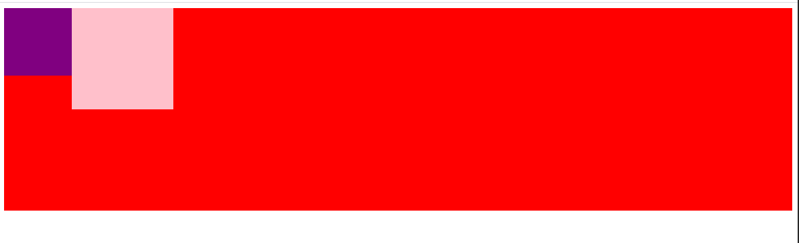
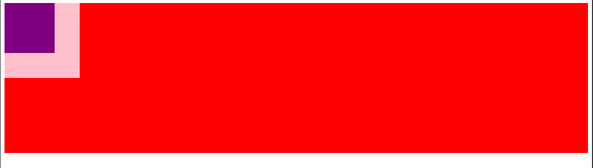
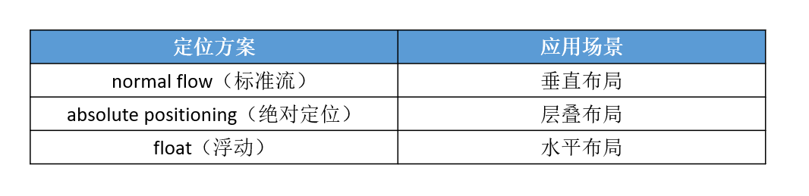

# 定位方案（Position Schemes）

在 CSS 中，有 3 种常用的方法对元素进行定位、布局

- normal flow：标准流、常规流、文档流
- absolute positioning：绝对定位
- float：浮动

绝对定位、浮动都会让元素脱离标准流，以达到灵活布局的效果

# float

可以通过 float 属性让元素产生浮动效果，float 的常用取值

- none：不浮动，默认值
- left：向左浮动
- right：向右浮动

**浮动的规则一：**

元素一旦浮动后，脱离标准流

朝着向左或向右方向移动，直到自己的边界紧贴着包含块（一般是父元素）或者其他浮动元素的边界为止

定位元素会层叠在浮动元素上面

**浮动的规则二：**

浮动元素不能与行内级内容层叠，行内级内容将会被浮动元素推出。比如行内级元素、inline-block 元素、块级元素的文字内容

```html
<head>
  <meta charset="UTF-8" />
  <meta name="viewport" content="width=device-width, initial-scale=1.0" />
  <title>Document</title>
  <style>
    .box {
      height: 300px;
      background-color: #f00;
    }

    .inner1 {
      float: left;
      width: 100px;
      height: 100px;
      background-color: purple;
    }

    .inner2 {
      display: inline-block;
      width: 150px;
      height: 150px;
      background-color: pink;
    }
  </style>
</head>

<body>
  <div class="box">
    <div class="inner1"></div>
    <div class="inner2"></div>
  </div>
</body>
```



当 inner2 盒子是块盒时如下：



**浮动的规则三：**

行内级元素、inline-block 元素浮动后，其顶部将与所在行的顶部对齐

**浮动的规则四：**

如果元素是向左（右）浮动，浮动元素的左（右）边界不能超出包含块的左（右）边界

**浮动的规则五：**

浮动元素之间不能层叠：

- 如果一个元素浮动，另一个浮动元素已经在那个位置了，后浮动的元素将紧贴着前一个浮动元素（左浮找左浮，右浮找右浮）
- 如果水平方向剩余的空间不够显示浮动元素，浮动元素将向下移动，直到有充足的空间为止

**浮动的规则六：**

浮动元素的顶端不能超过包含块的顶端，也不能超过之前所有浮动元素的顶端

浮动常用的场景：

- 解决行内级元素、inline-block 元素的水平间隙问题
- 布局

# 最后一个元素的 margin 处理

在进行布局时，同一千多个元素摆放后，设置 margin-left/right 让他们之间产生间距，那么最有一个元素设置的 margin-left/right 总是多余：

解决方法：

1. 每一行的最后一个元素，总是加一个 class，通过类选择器去除这个 margin-left/right
2. 通过伪类选择器，但是存在兼容性问题
3. 负 margin，公式：'margin-left' + 'border-left-width' + 'padding-left' + 'width' + 'padding-right' + 'border-right-width' + 'margin-right' = width of containing block
   - 参考：https://www.w3.org/TR/CSS21/visudet.html

# 浮动存在的问题

- 由于浮动元素脱离了标准流，变成了脱标元素，所以不再向父元素汇报高度
- 父元素计算总高度时，就不会计算浮动子元素的高度，导致了高度坍塌的问题

解决父元素高度坍塌问题的过程，一般叫做清浮动（清理浮动、清除浮动）

清浮动的目的是：让父元素计算总高度的时候，把浮动子元素的高度算进去

# BFC

BFC（Block Formatting Context）块级格式化环境，BFC 是一个 CSS 中的一个隐含的属性，可以为一个元素开启 BFC。开启 BFC 该元素会变成一个独立的布局区域

开启 BFC 后的特点：

1. 开启 BFC 后的元素不会被浮动元素所覆盖
2. 开启 BFC 后的元素子元素和父元素外边距不会重叠
3. 开启 BFC 后的元素可以包含浮动的子元素

可以通过一些特殊方式来开启元素的 BFC

1. 设置元素的浮动（不推荐）
2. 将元素设置为行内块元素（不推荐）
3. 将元素的 overflow 设置为一个非 visible 的值

# clear

clear 的常用取值：

- left：要求元素的顶部低于之前生成的所有左浮动元素的底部
- right：要求元素的顶部低于之前生成的所有右浮动元素的底部
- both：要求元素的顶部低于之前生成的所有浮动元素的底部
- none：默认值，无特殊要求

一般就只用在非浮动元素上，可以让非浮动元素与浮动元素不层叠

# 清浮动的常见方法

1. 给父元素设置固定高度。
   - 扩展性不好（不推荐）
2. 在父元素最后增加一个空的块级子元素，并且让它设置 clear: both
   - 会增加很多无意义的空标签，维护麻烦
   - 违反了结构与样式分离的原则（不推荐）
3. 在父元素最后增加一个 br 标签：<br clear="all">
   - 会增加很多无意义的空标签，维护麻烦
   - 违反了结构与样式分离的原则（不推荐）
4. 给父元素增加::after 伪元素
   - 纯 CSS 样式解决，结构与样式分离（推荐）

```css
.clear-fix:after {
  content: "";
  display: block;
  clear: both;
  height: 0; /* 兼容旧浏览器 */
  visibility: hidden; /* 兼容旧浏览器 */
}

.clear-fix {
  *zoom: 1; /* 兼容IE6~7 */
}
```

# 定位方案对比


