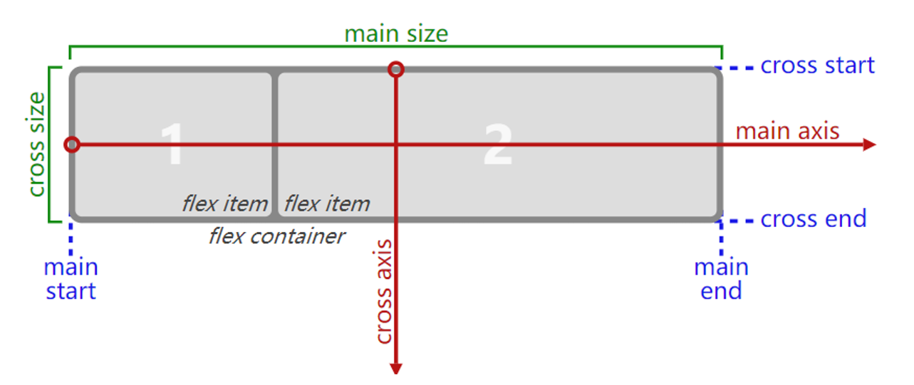
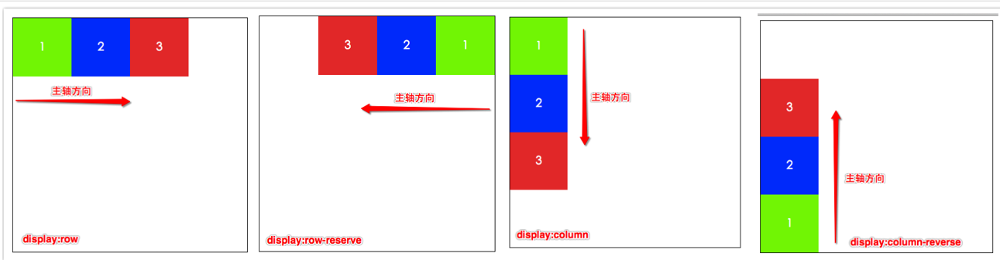

# 认识 flex 布局

flex 布局是目前 web 开发中使用最多的布局方案：

- flex 布局（Flexible 布局，弹性布局）
- 目前特别在移动端用的最多，目前 PC 端也使用越来越多了

两个重要的概念：

- 开启了 flex 布局的元素叫 flex container
- flex container 里面的直接子元素叫做 flex items

设置 display 属性为 flex 或者 inline-flex 可以成为 flex container

- flex： flex container 以 block-level 形式存在
- inline-flex： flex container 以 inline-level 形式存在

flex 布局模型

# flex 相关的属性

应用在 flex container 上的 CSS 属性：

- flex-flow
- flex-direction
- flex-wrap
- justify-content
- align-items
- align-content

应用在 flex items 上的 CSS 属性：

- flex
- flex-grow
- flex-basis
- flex-shrink
- order
- align-self

## flex-direction

flex items 默认都是沿着 main axis（主轴）从 main start 开始往 main end 方向排布

flex-direction 决定了 main axis 的方向，有 4 个取值：row（默认值）、row-reverse、column、column-reverse

## justify-content

justify-content 决定了 flex items 在 main axis 上的对齐方式

- flex-start（默认值）：与 main start 对齐
- flex-end：与 main end 对齐
- center：居中对齐
- space-between：
  - flex items 之间的距离相等
  - 与 main start、main end 两端对齐
- space-evenly：
  - flex items 之间的距离相等
  - flex items 与 main start、main end 之间的距离 等于 flex items 之间的距离
- space-around：
  - flex items 之间的距离相等
  - flex items 与 main start、main end 之间的距离是 flex items 之间距离的一半

## align-items

align-items 决定了 flex items 在 cross axis 上的对齐方式

- normal：在弹性布局中，效果和 stretch 一样
- stretch：当 flex items 在 cross axis 方向的 size 为 auto 时，会自动拉伸至填充 flex container
- flex-start：与 cross start 对齐
- flex-end：与 cross end 对齐
- center：居中对齐
- baseline：与基准线对齐(第一行文本基线对齐)

## flex-wrap

flex-wrap 决定了 flex container 是单行还是多行。默认情况下 flex-items 都会在同一行显示

- nowrap（默认）：单行
- wrap：多行
- wrap-reverse：多行（对比 wrap，cross start 与 cross end 相反）

flex-flow 是 flex-direction || flex-wrap 的简写。可以省略，顺序任意

## align-content

align-content 决定了多行 flex items 在 cross axis 上的对齐方式，用法与 justify-content 类似

- stretch（默认值）：与 align-items 的 stretch 类似
- flex-start：与 cross start 对齐
- flex-end：与 cross end 对齐
- center：居中对齐
- space-between：
  - flex items 之间的距离相等
  - 与 cross start、cross end 两端对齐
- space-around：
  - flex items 之间的距离相等
  - flex items 与 cross start、cross end 之间的距离是 flex items 之间距离的一半
- space-evenly：
  - flex items 之间的距离相等
  - flex items 与 cross start、cross end 之间的距离 等于 flex items 之间的距离

## order

order 决定了 flex items 的排布顺序

可以设置任意整数（正整数、负整数、0），值越小就越排在前面。默认值是 0

## align-self

flex items 可以通过 align-self 覆盖 flex container 设置的 align-items

- auto（默认值）：遵从 flex container 的 align-items 设置
- stretch、flex-start、flex-end、center、baseline，效果跟 align-items 一致

## flex-grow

flex-grow 决定了 flex items 如何扩展

- 可以设置任意非负数字（正小数、正整数、0），默认值是 0
- 当 flex container 在 main axis 方向上有剩余 size 时，flex-grow 属性才会有效

如果所有 flex items 的 flex-grow 总和 sum 超过 1，每个 flex item 扩展的 size 为

- flex container 的剩余 `size * flex-grow / sum`

如果所有 flex items 的 flex-grow 总和不超过 1，每个 flex item 扩展的 size 为

- `flex container 的剩余 size * flex-grow`

flex items 扩展后的最终 size 不能超过 max-width\max-height

## flex-shrink

flex-shrink 决定了 flex items 如何收缩

- 可以设置任意非负数字（正小数、正整数、0），默认值是 1
- 当 flex items 在 main axis 方向上超过了 flex container 的 size，flex-shrink 属性才会有效

如果所有 flex items 的 flex-shrink 总和超过 1，每个 flex item 收缩的 size 为

- `flex items 超出 flex container 的 size * 收缩比例 / 所有 flex items 的收缩比例之和`

如果所有 flex items 的 flex-shrink 总和 sum 不超过 1，每个 flex item 收缩的 size 为

- `flex items 超出 flex container 的 size * sum * 收缩比例 / 所有 flex items 的收缩比例之和`
- `收缩比例 = flex-shrink * flex item 的 base size`
- base size 就是 flex item 放入 flex container 之前的 size

flex items 收缩后的最终 size 不能小于 min-width\min-height

## flex-basis

flex-basis 用来设置 flex items 在 main axis 方向上的 base size

- auto（默认值）、具体的宽度数值（100px）

决定 flex items 最终 base size 的因素，从优先级高到低

- max-width\max-height\min-width\min-height
- flex-basis
- width\height
- 内容本身的 size

## flex

flex 是 flex-grow || flex-shrink || flex-basis 的简写,flex 属性可以指定 1 个，2 个或 3 个值。

单值语法: 值必须为以下其中之一:

- 一个无单位数(<number>): 它会被当作<flex-grow>的值。
- 一个有效的宽度(width)值: 它会被当作 <flex-basis>的值。
- 关键字 none，auto 或 initial.

双值语法: 第一个值必须为一个无单位数，并且它会被当作 <flex-grow> 的值。

第二个值必须为以下之一：

- 一个无单位数：它会被当作 <flex-shrink> 的值。
- 一个有效的宽度值: 它会被当作 <flex-basis> 的值。

三值语法:

- 第一个值必须为一个无单位数，并且它会被当作 <flex-grow> 的值。
- 第二个值必须为一个无单位数，并且它会被当作 <flex-shrink> 的值。
- 第三个值必须为一个有效的宽度值， 并且它会被当作 <flex-basis> 的值。
