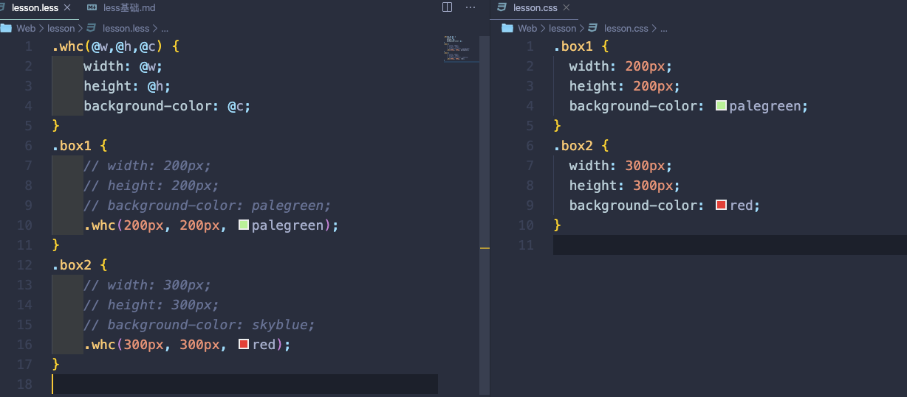

# CSS 预处理器

CSS 基本上是设计师的工具，不是程序员的工具。在程序员的眼里，CSS 是很头痛的事情，它并不像其它程序语言，比如说 PHP、Javascript 等等，有自己的变量、常量、条件语句以及一些编程语法，只是一行行单纯的属性描述，写起来相当的费事，而且代码难以组织和维护。

很自然的，有人就开始在想，能不能给 CSS 像其他程序语言一样，加入一些编程元素，让 CSS 能像其他程序语言一样可以做一些预定的处理。这样一来，就有了“CSS 预处器（CSS Preprocessor）”。

CSS 预处理器定义了一种新的语言，其基本思想是：用一种专门的编程语言，为 CSS 增加了一些编程的特性，将 CSS 作为目标生成文件，然后开发者就只要使用这种语言进行编码工作。

通俗的说，CSS 预处理器用一种专门的编程语言，进行 Web 页面样式设计，然后再编译成正常的 CSS 文件，以供项目使用。CSS 预处理器为 CSS 增加一些编程的特性，无需考虑浏览器的兼容性问题，例如你可以在 CSS 中使用变量、简单的逻辑程序、函数等等在编程语言中的一些基本特性，可以让你的 CSS 更加简洁、适应性更强、可读性更佳，更易于代码的维护等诸多好处。

CSS 预处理器技术已经非常成熟，而且也涌现出了很多种不同的 CSS 预处理器语言，比如说：Sass（SCSS）、LESS、Stylus...

# CSS 预处理器

CSS 预处理器就是用某一种语言用来为 CSS 增加一些动态语言的的特性(变量、函数、继承等)，CSS 预处理器可以让你的 CSS 更见简洁，适应性更强，代码更直观等诸多好处

简而言之: CSS 预处理器就是升级版 CSS

常见的 CSS 预处理器：Less、 Sass 、Stylus

CSS 的语法虽然简单, 但它同时也带来一些问题：CSS 需要书写大量看似没有逻辑的代码, 不方便维护及扩展, 也不利于复用。成这些原因的本质源于 CSS 是一门非程序式的语言, 没有变量/函数/作用域等概念

Less 是一门 CSS 预处理语言，为 CSS 赋予了动态语言的特征。

它扩展了 CSS 语言，增加了变量、Mixin(混合)、嵌套、函数和运算等特性，使 CSS 更易维护和扩展

一句话：用类似 JS 的语法去写 CSS

# less

## less 基本使用

**在浏览器中直接运行**

编写 less 文件-->引入 less 文件-->引入 less.js-->运行

注意:

- 一定要先引入 less.css 再引入 less.js
- 如果 less 代码是写到单独的文件中, 一定要在服务端环境运行才能生效

**提前预编译**

- 编写 less 文件-->利用工具转换为 css 文件-->引入 css 文件
- 考拉客户端: http://koala-app.com/index-zh.html
- 开源中国 : https://tool.oschina.net/less
- 构建工具配置 loader 自动编译:
- 也可以在编辑器中安装插件比如：easy-less

**less 注释**

less 中的注释和 JS 中的注释一样, 也有单行注释和多行注释

less 中单行注释和多行注释最大的区别在于: 是否会被编译

单行注释不会被编译(不会出现在编译后的文件中)

多行注释会被编译 (会出现在编译后的文件中)


## 变量

和 js 中的概念基本一样

- less 中定义变量的格式：`@变量名称: 值;`
- less 中使用变量的格式：`@变量名称;`
- 和 js 一样可以将一个变量赋值给另外一个变量：`@变量名称 : @变量名称;`
- 和 js 一样 less 中的变量也有全局变量和局部变量。
  - 定义在{}外面的就是全局的变量, 什么地方都可以使用。
  - 定义在{}里面的就是局部变量, 只能在{}中使用
  - less 中的变量是延迟加载的, 写到后面也能在前面使用
- 和 js 一样不同作用域的变量不会相互影响, 只有相同作用域的变量才会相互影响。和 js 一样在访问变量时会采用就近原则

**变量插值**

在 less 中属性的取值可以直接使用变量, 但是如果是属性名称或者选择器名称并不能直接使用变量

如果属性名称或者选择器名称想使用变量中保存的值, 那么必须使用变量插值的格式

变量插值的格式：`@{变量名称}`

```less
@size: 200px;
@w: width;
@d: div;
@{d} {
  @{w}: @size;
  height: @size;
  background-color: red;
  margin: 100px auto;
}
```


## less 中的运算

less 中的运算和 CSS3 中新增的 calc 函数一样, 都支持`+ - * /`运算，记得带上单位

```less
div {
  width: 200px;
  height: 200px;
  background: blue;
  position: absolute;
  left: 50%;
  margin-left: (-200px / 2);
}
```

## less 中的混合

将需要重复使用的代码封装到一个类中, 在需要使用的地方调用封装好的类即可

在预处理的时候 less 会自动将用到的封装好的类中的代码拷贝过来

注意:

- 如果混合名称的后面没有(), 那么在预处理的时候, 会保留混合的代码
- 如果混合名称的后面加上(), 那么在预处理的时候, 不会保留混合的代码


## 参数混合



## 混合中可变参数

less 中的`@arguments`和 js 中的`arguments`一样, 可以拿到传递进来的所有形参

less 中的`...`表示可以接收 0 个或多个参数。如果形参列表中使用了`...`, 那么`...`必须写在形参列表最后


## 匹配模式

混合的匹配模式：就是通过混合的第一个字符串形参,来确定具体要执行哪一个同名混合


`@_`表示通用的匹配模式。无论同名的哪一个混合被匹配了, 都会先执行通用匹配模式中的代码


## less 中导入其它 less 文件


## 内置函数

由于 less 的底层就是用 JavaScript 实现的, 所以 JavaScript 中常用的一些函数在 less 中都支持

## 层级结构

如果在某一个选择器的{}中直接写上了其它的选择器, 会自动转换成后代选择器。例如以下代码: `.father .son`

`&`的作用, 是告诉 less 在转换的时候不用用后代来转换, 直接拼接在当前选择器的后面即可


## less 中的继承

less 中的继承和 less 中混合的区别：

- 使用时的语法格式不同
- 转换之后的结果不同(混合是直接拷贝, 继承是并集选择器)

混合：

继承：

## 条件判断

less 中可以通过 when 给混合添加执行限定条件, 只有条件满足(为真)才会执行混合中的代码

when 表达式中可以使用比较运算符(> < >= <= =)、逻辑运算符、或检查函数来进行条件判断

```less
.size(@w, @h) when(@w =100px) {
  width: @w;
  height: @h;
}

div {
  .size(100px, 100px);
  background-color: red;
}
```

`(),()`相当于 JS 中的`||`

`()and()`相当于 JS 中的`&&`

```js
.size(@w, @h) when(ispixel(@w)) {
    width: @w;
    height: @h;
}

div {
    .size(100px, 100px);
    background-color: red;
}
```

# SASS

SASS 是一套利用 Ruby 实现的, 最早最成熟的 CSS 预处理器, 诞生于 2007 年。

它扩展了 CSS 语言，增加了变量、Mixin(混合)、嵌套、函数和运算等特性，使 CSS 更易维护和扩展

LESS 是一套利用 JavaScript 实现的 CSS 预处理器, 诞生于 2009 年。

由于 LESS 的诞生比 SASS 要晚, 并且 LESS 受到了 Sass 的影响, 所以在 LESS 中能看到大量 SASS 中的特性。所以只要学会了 LESS 就等同于学会了大部分的 SASS

LESS 和 SASS 文件后缀名区别

- LESS 以.less 结尾
- SASS 以.sass 或者.scss 结尾
  - .sass 结尾以缩进替代{}表示层级结构, 语句后面不用编写分号
  - .scss 以{}表示层级结构, 语句后面需要写分号

## SASS 中的注释

SASS 中的注释和 LESS 一样, 单行注释不会被编译(不会出现在编译后的文件中), 多行注释会被编译(会出现在编译后的文件中)

## SASS 中的变量

SASS 中的变量和 LESS 中一样, 只是定义格式不同

LESS 中定义变量`@变量名称: 值;`

SASS 中定义变量`$变量名称: 值;`

SASS 中变量特点和 LESS 中几乎一样

1. 后定义覆盖先定义
2. 可以把变量赋值给其它变量
3. 区分全局变量和局部变量(访问采用就近原则)

注意点:

- LESS 中变量是延迟加载, 可以先使用后定义
- SASS 中变量不是延迟加载, 不可以先使用后定义

## SASS 变量插值

变量插值: 如果是属性的取值可以直接使用变量,但是如果是属性名称或者选择器名称并不能直接使用变量, 必须使用变量插值的格式

SASS 中的变量插值和 LESS 中也一样, 只不过格式不一样

- LESS 变量插值格式: @{变量名称}
- SASS 变量插值格式: #{\$变量名称}

## SASS 中运算

SASS 中的运算和 LESS 也一样, 都支持`+ - \* /`运算

注意点: 无论是 LESS 中的运算还是 SASS 中的运算都需要加上()

## SASS 中的混合

SASS 中的混合和 LESS 中也一样, 只是定义格式和调用的格式不同

- LESS 中混合定义: `.混合名称{}` 或者`.混合名称(){}`
- LESS 中混合调用: `.混合名称;` 或者 `.混合名称();`
- SASS 中混合定义: `@mixin 混合名称{};` 或者 `@mixin 混合名称(){};`
- SASS 中混合调用: `@include 混合名称;` 或者 `@include 混合名称();`

## SASS 中带参数混合

SASS 中带参数的混合和 LESS 中也一样

1. 不带默认值形参
2. 带默认值形参
3. 给指定参数赋值


## SASS 中的可变参数

SASS 中的可变参数和 LESS 中也一样, 只不过由于 SASS 不是使用 JS 实现的, 所以不能直接在混合中使用 arguments

必须通过 `$args...`的格式来定义可变参数, 然后通过`$args`来使用

注意点: 和 LESS 一样可变参数必须写在形参列表的最后


## SASS 导入其它 sass 文件

和 LESS 一样 SASS 文件中也支持导入其它 SASS 文件。其实原生的 CSS 也支持通过@import 导入其它的 CSS 文件, 只不过不常用

不常用的原因在于原生的@import 导入其它的 CSS 文件,只有执行到@import 时浏觅器才会去下载对应 css 文件，这导致请求次数变多,页面加载起来特别慢

而 LESS 和 SASS 中的`@import` 是直接将导入的文件拷贝到当前文件中生成一份 CSS, 所以只会请求一次, 速度更快

## SASS 中的内置函数

https://sass-lang.com/documentation/modules

## SASS 中的层级结构

和 LESS 一样支持嵌套, 默认情况下嵌套的结构会转换成后代选择器

和 LESS 一样也支持通过`&`符号不转换成后代选择器

## SASS 中的继承

SASS 中的继承和 LESS 中的继承一样, 都是通过并集选择器来实现的, 只不过格式不一样而已

混合和继承区别

- 混合是直接拷贝, 有多少个地方用到就会拷贝多少份
- 继承是通过并集选择器, 不会拷贝只会保留一份

## SASS 中的条件判断

和 LESS 一样 SASS 中也支持条件判断, 只不过 SASS 中的条件判断支持得更为彻底

SASS 中支持

```sass
@if(条件语句){}
    @else if(条件语句){}
    ... ...
    @else(条件语句){}
```

SASS 中当条件不为 false 或者 null 时就会执行{}中的代码

和 LESS 一样 SASS 中的条件语句支持通过`> >= < <= ==`进行判断


## SASS 中的循环

SASS 比 LESS 牛逼的地方就在于 SASS 中直接支持循环语句, 而 LESS 中需要通过混合+条件判断自己实现

SASS 中支持两种循环, 分别是 for 循环和 while 循环

### for 循环

- `@for $i from 起始整数 through 结束整数{}`
- `@for $i from 起始整数 to 结束整数{}`

两者的区别 through 包头包尾, to 包头不包尾


### while 循环

`@while(条件语句){}`


