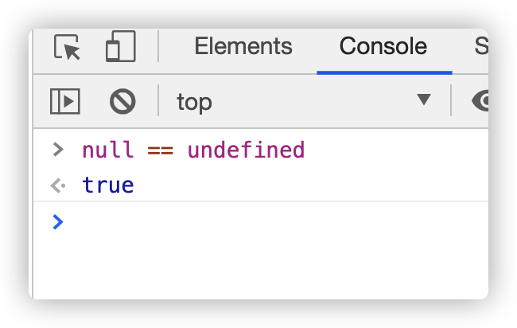
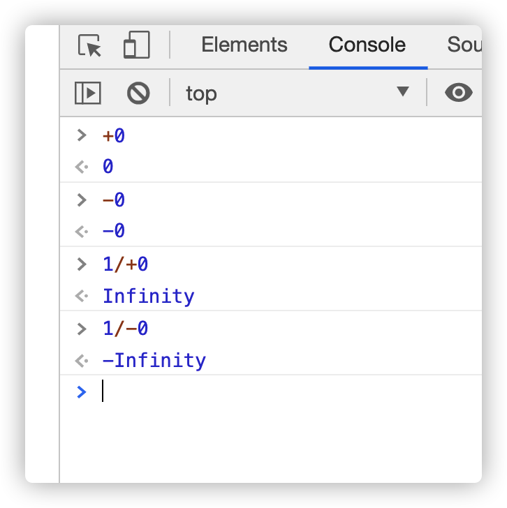

# js 脚本的书写格式

JavaScript 有三种书写格式，分别是行内式、内嵌式、外链式

行内式：

```html
<div onclick="alert(1)">1111</div>
```

内嵌式：

```html
<div>222222</div>
<script>
  var div = document.getElementsByTagName('div')[0];
  div.onclick = function () {
    alert(222);
  };
</script>
```

外链式：

```html
<script src="./index.js"></script>
```

通常将 js 代码放在 body 的最后, 因为 HTML 是从上至下加载, 而 js 代码通常是给标签添加交互(操作元素), 所以需要先加载 HTML, 否则如果执行 js 代码时 HTML 还未被加载, 那么 js 代码将无法添加交互(操作元素);

HTML 页面中出现<script>标签后，就会让页面暂停等待脚本的解析和执行。无论当前脚本是内嵌式还是外链式，页面的下载和渲染都必须停下来等待脚本的执行完成才能继续, 所以如果把 js 代码写在 head 中, 那么 js 代码没有执行完毕之前后续网页无法查看

# 语句

JavaScript 程序的执行单位为行（line），也就是一行一行地执行。一般情况下，每一行就是一个语句。

语句（statement）是为了完成某种任务而进行的操作。

```js
var res = 1 + 2;
```

这条语句先用 var 命令，声明了变量 a，然后将 1 + 3 的运算结果赋值给变量 a。

`1 + 3`叫做表达式（expression），指一个为了得到返回值的计算式。

语句和表达式的区别：

- 语句主要为了进行某种操作，一般情况下不需要返回值
- 表达式为了得到返回值，一定会返回一个值。

凡是 JavaScript 语言中预期为值的地方，都可以使用表达式。比如，赋值语句的等号右边，预期是一个值，因此可以放置各种表达式。

语句以分号结尾，一个分号就表示一个语句结束。多个语句可以写在一行内。

分号前面可以没有任何内容，JavaScript 引擎将其视为空语句。

表达式不需要分号结尾。一旦在表达式后面添加分号，则 JavaScript 引擎就将表达式视为语句，这样会产生一些没有任何意义的语句。

# 变量

变量是对**值**的具名引用。变量就是为**值**起名，然后引用这个名字，就等同于引用这个值。变量的名字就是变量名。

JavaScript 的变量名区分大小写，A 和 a 是两个不同的变量。

变量的声明和赋值，是分开的两个步骤

```js
var a = 1;
// 实际步骤如下：
var a;
a = 1;
```

如果只是声明变量而没有赋值，则该变量的值是 undefined。

undefined 是一个特殊的值，表示**无定义**。

# 标识符

标识符（identifier）指的是用来识别各种值的合法名称。最常见的标识符就是变量名，以及后面要提到的函数名。JavaScript 语言的标识符对大小写敏感，所以 a 和 A 是两个不同的标识符。

标识符有一套命名规则，不符合规则的就是非法标识符。JavaScript 引擎遇到非法标识符，就会报错。

标识符命名规则:

- 第一个字符，可以是任意 Unicode 字母（包括英文字母和其他语言的字母），以及美元符号（`$`）和下划线（`_`）。
- 第二个字符及后面的字符，除了 Unicode 字母、美元符号和下划线，还可以用数字 0-9。

JavaScript 有一些保留字，不能用作标识符：`arguments、break、case、catch、class、const、continue、debugger、default、delete、do、else、enum、eval、export、extends、false、finally、for、function、if、implements、import、in、instanceof、interface、let、new、null、package、private、protected、public、return、static、super、switch、this、throw、true、try、typeof、var、void、while、with、yield`。

# 注释

JavaScript 提供两种注释的写法：一种是单行注释，用`//`起头；另一种是多行注释，放在`/**/`之间。

```js
// 这是单行注释

/*
 这是
 多行
 注释
*/
```

# js 的原始值与引用值

原始值也叫基本类型：Number、String、Boolean、null、undefined

这些类型在内存中分别占有固定大小的空间，他们的值保存在栈空间，我们通过按值来访问的。

原始值是我把一个值放到另一个值里面，改了第一个值，第二个值不变


引用值：Object、Function、Array、date、RegExp...

引用类型，值大小不固定，栈内存中存放地址指向堆内存中的对象。是按引用访问的。

引用值是把第一个值放到第二个值里面，改第一个值，第二个值也改变


存放在堆内存中的对象，变量实际保存的是一个指针，这个指针指向另一个位置。每个空间大小不一样，要根据情况开进行特定的分配。

当我们需要访问引用类型（如**对象，数组，函数**等）的值时，首先从栈中获得该对象的地址指针，然后再从堆内存中取得所需的数据。

js 由值决定类型。原始值和引用值唯一的不同是赋值形式不同

## 字符串

字符串就是零个或多个排在一起的字符，放在单引号或双引号之中。

连接运算符（+）可以连接多个单行字符串，将长字符串拆成多行书写，输出的时候也是单行。
反斜杠（`\`）在字符串内有特殊含义，用来表示一些特殊字符，所以又称为转义符。

## null 与 undefined

null 与 undefined 都可以表示**没有**，含义非常相似。将一个变量赋值为 undefined 或 null，老实说，语法效果几乎没区别。

在 if 语句中，它们都会被自动转为 false，相等运算符（==）甚至直接报告两者相等。



区别是这样的：

- null 是一个表示**空**的对象，转为数值时为 0；
- undefined 是一个表示**此处无定义**的原始值，转为数值时为 NaN。

## 布尔值

布尔值代表**真**和**假**两个状态。**真**用关键字 true 表示，**假**用关键字 false 表示。布尔值只有这两个值。

下列运算符会返回布尔值：

- 前置逻辑运算符： ! (Not)
- 相等运算符：===，!==，==，!=
- 比较运算符：>，>=，<，<=

如果 JavaScript 预期某个位置应该是布尔值，会将该位置上现有的值自动转为布尔值。转换规则是除了下面六个值被转为 false，其他值都视为 true。

- `undefined`
- `null`
- `false`
- `0`
- `NaN`
- `""`或`''`（空字符串）

## 数值

JavaScript 内部，所有数字都是以 64 位浮点数形式储存，即使整数也是如此。所以，1 与 1.0 是相同的，是同一个数。


根据标准，64 位浮点数的指数部分的长度是 11 个二进制位，意味着指数部分的最大值是 2047（2 的 11 次方减 1）。也就是说，64 位浮点数的指数部分的值最大为 2047，分出一半表示负数，则 JavaScript 能够表示的数值范围为 21024 到 2-1023（开区间），超出这个范围的数无法表示。

如果一个数大于等于 2 的 1024 次方，那么就会发生**正向溢出**，即 JavaScript 无法表示这么大的数，这时就会返回 Infinity。

如果一个数小于等于 2 的-1075 次方（指数部分最小值-1023，再加上小数部分的 52 位），那么就会发生为“负向溢出”，即 JavaScript 无法表示这么小的数，这时会直接返回 0。


JavaScript 提供了几个特殊的数值

1. 正零和负零：JavaScript 内部实际上存在 2 个 0。一个是`+0`，一个是`-0`，区别就是 64 位浮点数表示法的符号位不同。它们是等价的。唯一有区别的场合是，`+0`或`-0`当作分母，返回的值是不相等的。

   

2. NaN：NaN 是 JavaScript 的特殊值，表示“非数字”（Not a Number），主要出现在将字符串解析成数字出错的场合。

   

   - NaN 不等于任何值，包括它本身。
   - NaN 在布尔运算时被当作 false。
   - NaN 与任何数（包括它自己）的运算，得到的都是 NaN。

   

3. Infinity：表示**无穷**，用来表示两种场景。一种是一个正的数值太大，或一个负的数值太小，无法表示；另一种是非 0 数值除以 0，得到 Infinity。Infinity 与 NaN 比较，总是返回 false。

   

   

   - Infinity 与 null 计算时，null 会转成 0，等同于与 0 的计算。

     

   - Infinity 与 undefined 计算，返回的都是 NaN。

     

isNaN 方法可以用来判断一个值是否为 NaN。

但是，isNaN 只对数值有效，如果传入其他值，会被先转成数值。比如，传入字符串的时候，字符串会被先转成 NaN，所以最后返回 true，这一点要特别引起注意。也就是说，isNaN 为 true 的值，有可能不是 NaN，而是一个字符串。

出于同样的原因，对于对象和数组，isNaN 也返回 true。

但是，对于空数组和只有一个数值成员的数组，isNaN 返回 false。


# 内存之栈内存与堆内存

栈(stack)会自动分配内存空间，会自动释放。堆(heap)动态分配的内存，大小不定也不会自动释放。

堆：队列优先,先进先出；由操作系统自动分配释放 ，存放函数的参数值，局部变量的值等。

栈：先进后出；动态分配的空间 一般由程序员分配释放， 若程序员不释放，程序结束时可能由 OS 回收，分配方式倒是类似于链表。

# 引用值中的数组与对象初识

数组就是专门用于存储一组数据的

创建数组：`var 变量名称 = new Array(size);`

往数组中存储数据：`变量名称[索引号] = 需要存储的数据;`

从数组中获取存储的数据：`变量名称[索引号];`

如果数组对应的索引中没有存储数据, 默认存储的就是 undefined

JavaScript 中访问了数组中不存在的索引不会报错, 会返回 undefined


通过字面量创建数组：`var arr = [1, 'a', true];`

JavaScript 中提供了一个默认的类 Object, 我们可以通过这个类来创建对象

由于我们是使用系统默认的类创建的对象, 所以系统不知道我们想要什么属性和行为, 所以我们必须手动的添加我们想要的属性和行为

通过`对象名称.属性名称 = 值;`给一个对象添加属性

通过`对象名称.行为名称 = 函数;`给一个对象添加行为

属性名称和取值之间用冒号隔开, 属性和属性之间用逗号隔开


