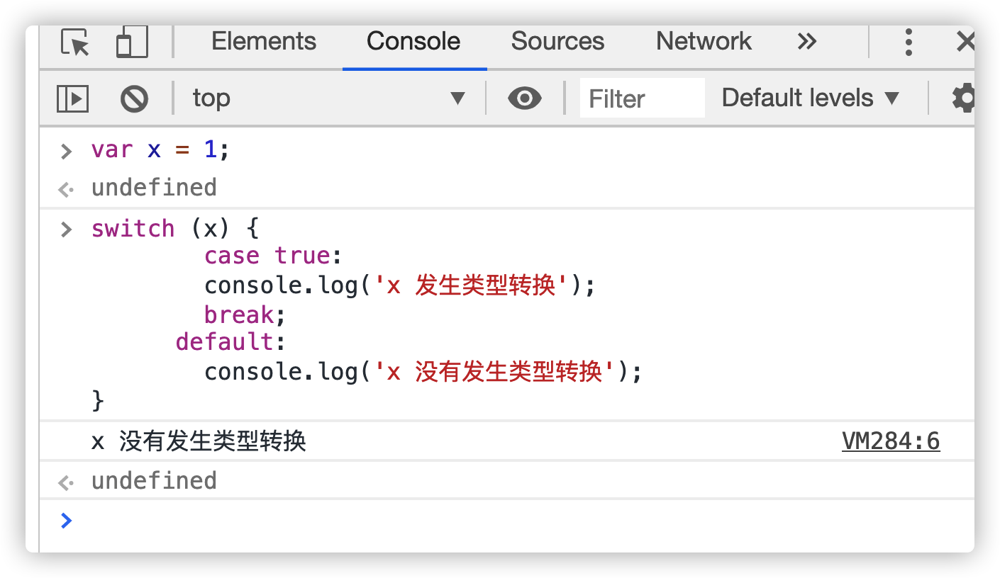
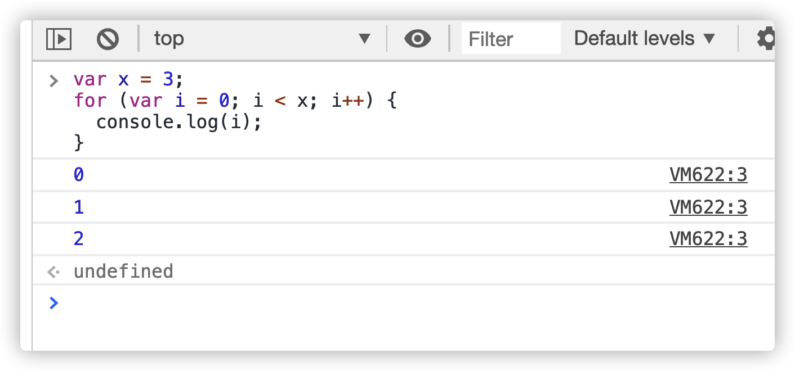
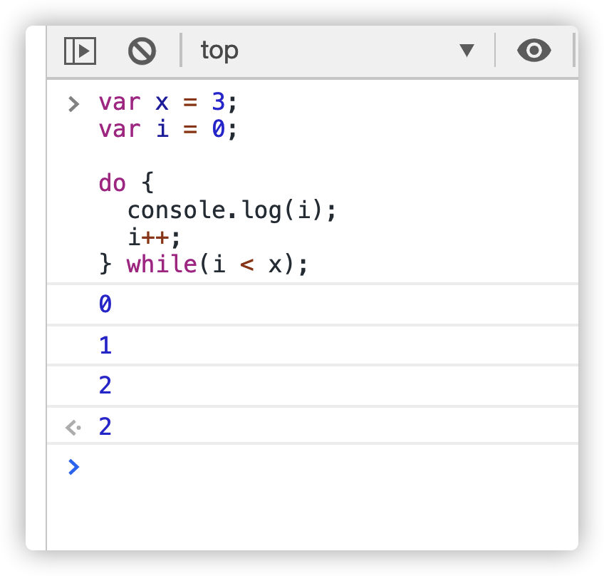
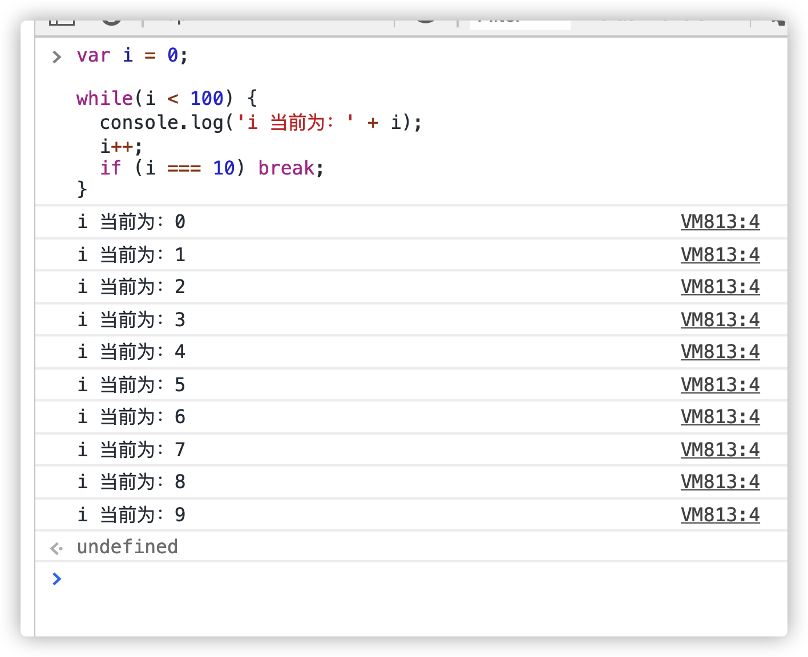
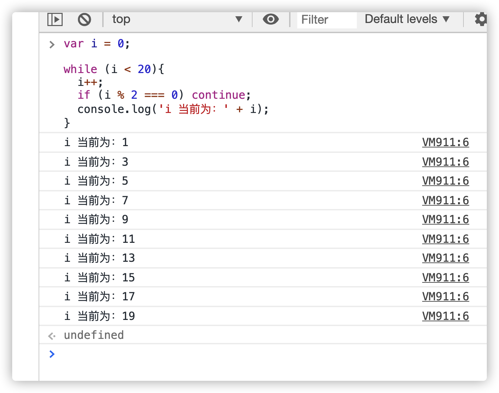

# 条件语句

JavaScript 提供 if 结构和 switch 结构，完成条件判断，即只有满足预设的条件，才会执行相应的语句。

## if 结构

if 结构先判断一个表达式的布尔值，然后根据布尔值的真伪，执行不同的语句。所谓布尔值，指的是 JavaScript 的两个特殊值，true 表示真，false 表示伪。

```js
if (布尔值) {
  语句;
}

// 或者

if (布尔值) 语句;
```

需要注意的是，**布尔值**往往由一个条件表达式产生的，必须放在圆括号中，表示对表达式求值。如果表达式的求值结果为 true，就执行紧跟在后面的语句；如果结果为 false，则跳过紧跟在后面的语句。

## if...else 结构

if 代码块后面，还可以跟一个 else 代码块，表示不满足条件时，所要执行的代码。

```js
if (a === 1) {
  // 满足条件时，执行的语句
} else {
  // 不满足条件时，执行的语句
}
```

对同一个变量进行多次判断时，多个 if...else 语句可以连写在一起。

else 代码块总是与离自己最近的那个 if 语句配对。

## switch 结构

多个 `if...else` 连在一起使用的时候，可以转为使用更方便的 switch 结构。

```js
var x = 1;
switch (x) {
  case 1:
    console.log('x 等于1');
    break;
  case 2:
    console.log('x 等于2');
    break;
  default:
    console.log('x 等于其他值');
}
```

switch 语句部分和 case 语句部分，都可以使用表达式。

需要注意的是，switch 语句后面的表达式，与 case 语句后面的表示式比较运行结果时，采用的是严格相等运算符（===），而不是相等运算符（==），这意味着比较时不会发生类型转换。



## 三元运算符

JavaScript 还有一个三元运算符（即该运算符需要三个运算子）`?:`，也可以用于逻辑判断。

```js
条件 ? 表达式1 : 表达式2;
```

如果**条件**为 true，则返回**表达式 1**的值，否则返回**表达式 2**的值。

这个三元运算符可以被视为 `if...else...`的简写形式，因此可以用于多种场合。

# 循环语句

循环语句用于重复执行某个操作，它有多种形式。

## while 循环

While 语句包括一个循环条件和一段代码块，只要条件为真，就不断循环执行代码块。

```js
while (条件) 语句;

// 或者

while (条件) 语句;
```

while 语句的循环条件是一个表达式，必须放在圆括号中。代码块部分，如果只有一条语句，可以省略大括号，否则就必须加上大括号。

## for 循环

for 语句是循环命令的另一种形式，可以指定循环的起点、终点和终止条件。它的格式如下。

```js
for (初始化表达式; 条件; 递增表达式) 语句;

// 或者

for (初始化表达式; 条件; 递增表达式) {
  语句;
}
```

for 语句后面的括号里面，有三个表达式。

- 初始化表达式（initialize）：确定循环变量的初始值，只在循环开始时执行一次。
- 条件表达式（test）：每轮循环开始时，都要执行这个条件表达式，只有值为真，才继续进行循环。
- 递增表达式（increment）：每轮循环的最后一个操作，通常用来递增循环变量。



## do...while 循环

do...while 循环与 while 循环类似，唯一的区别就是先运行一次循环体，然后判断循环条件。

```js
do 语句;
while (条件);

// 或者
do {
  语句;
} while (条件);
```

不管条件是否为真，do...while 循环至少运行一次，这是这种结构最大的特点。另外，while 语句后面的分号注意不要省略。



# break 语句和 continue 语句

break 语句和 continue 语句都具有跳转作用，可以让代码不按既有的顺序执行。

break 语句用于跳出代码块或循环。



for 循环也可以使用 break 语句跳出循环。

continue 语句用于立即终止本轮循环，返回循环结构的头部，开始下一轮循环。


