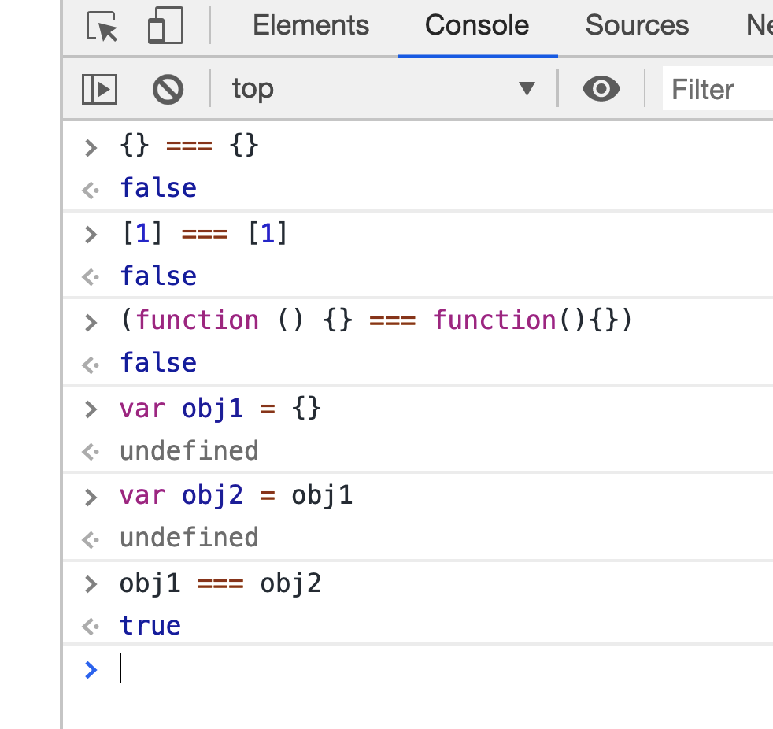

# 算术运算符

JavaScript 共提供 10 个算术运算符，用来完成基本的算术运算。

- 加法运算符：`x + y`
- 减法运算符： `x - y`
- 乘法运算符： `x * y`
- 除法运算符：`x / y`
- 指数运算符：`x ** y`
- 余数运算符：`x % y`
- 自增运算符：`++x` 或者 `x++`
- 自减运算符：`--x` 或者 `x--`
- 数值运算符： `+x`
- 负数值运算符：`-x`

## 加法运算符

加法运算符（+）是最常见的运算符，用来求两个数值的和。

JavaScript 允许非数值的相加。

两个布尔值相加，数值与布尔值相加，布尔值都会自动转成数值，然后再相加。


如果是两个字符串相加，这时加法运算符会变成连接运算符，返回一个新的字符串，将两个原字符串连接在一起。


加法运算符是在运行时决定，到底是执行相加，还是执行连接。也就是说，运算子的不同，导致了不同的语法行为，这种现象称为**重载**（overload）。

### 对象的相加

如果运算子是对象，必须先转成原始类型的值，然后再相加。


对象 obj 转成原始类型的值是`[object Object]`，再加 1 就得到了上面的结果。

对象转成原始类型的值，规则如下：

首先，自动调用对象的 valueOf 方法。一般来说，对象的 valueOf 方法总是返回对象自身，这时再自动调用对象的 toString 方法，将其转为字符串。对象的 toString 方法默认返回`[object Object]`


这里有一个特例，如果运算子是一个 Date 对象的实例，那么会优先执行 toString 方法。


## 余数运算符

余数运算符（%）返回前一个运算子被后一个运算子除，所得的余数。

运算结果的正负号由第一个运算子的正负号决定。

注意：`m % n`如果 m > n 的, 那么就正常取余。如果 m < n 的, 那么结果就是 m。如果 n 是 0, 那么结果就是 NaN


## 自增和自减运算符

自增和自减运算符，是一元运算符，只需要一个运算子。它们的作用是将运算子首先转为数值，然后加上 1 或者减去 1。它们会修改原始变量。

自增和自减运算符有一个需要注意的地方，就是放在变量之后，会先返回变量操作前的值，再进行自增/自减操作；放在变量之前，会先进行自增/自减操作，再返回变量操作后的值。


## 数值运算符，负数值运算符

数值运算符（+）同样使用加号，但它是一元运算符（只需要一个操作数），而加法运算符是二元运算符（需要两个操作数）。

数值运算符的作用在于可以将任何值转为数值（与 Number 函数的作用相同）。


负数值运算符（-），也同样具有将一个值转为数值的功能，只不过得到的值正负相反。连用两个负数值运算符，等同于数值运算符。


数值运算符号和负数值运算符，都会返回一个新的值，而不会改变原始变量的值。

## 指数运算符

指数运算符（`**`）完成指数运算，前一个运算子是底数，后一个运算子是指数。

指数运算符是右结合，而不是左结合。即多个指数运算符连用时，先进行最右边的计算。


## 赋值运算符

赋值运算符（Assignment Operators）用于给变量赋值。


# 比较运算符

比较运算符用于比较两个值的大小，然后返回一个布尔值，表示是否满足指定的条件。

JavaScript 一共提供了 8 个比较运算符。

- `>` 大于运算符
- `<` 小于运算符
- `<=` 小于或等于运算符
- `>=` 大于或等于运算符
- `==` 相等运算符
- `===` 严格相等运算符
- `!=` 不相等运算符
- `!==` 严格不相等运算符

这八个比较运算符分成两类：相等比较和非相等比较。两者的规则是不一样的，对于非相等的比较，算法是先看两个运算子是否都是字符串，如果是的，就按照字典顺序比较（实际上是比较 Unicode 码点）；否则，将两个运算子都转成数值，再比较数值的大小。

## 非相等运算符：非字符串的比较

如果两个运算子都是原始类型的值，则是先转成数值再比较。

如果运算子是对象，会转为原始类型的值，再进行比较。

## 严格相等运算符

JavaScript 提供两种相等运算符：`==`和`===`。

它们的区别是相等运算符（==）比较两个值是否相等，严格相等运算符（===）比较它们是否为**同一个值**。如果两个值不是同一类型，严格相等运算符（===）直接返回 false，而相等运算符（==）会将它们转换成同一个类型，再用严格相等运算符进行比较。

如果两个值的类型不同，直接返回 false。

同一类型的原始类型的值（数值、字符串、布尔值）比较时，值相同就返回 true，值不同就返回 false。


两个复合类型（对象、数组、函数）的数据比较时，不是比较它们的值是否相等，而是比较它们是否指向同一个地址。

如果两个变量引用同一个对象，则它们相等。



undefined 和 null 与自身严格相等。


## 严格不相等运算符

严格相等运算符有一个对应的“严格不相等运算符”（!==），它的算法就是先求严格相等运算符的结果，然后返回相反值。

```js
1 !== '1'; // true
// 等同于
!(1 === '1');
```

## 相等运算符

相等运算符用来比较相同类型的数据时，与严格相等运算符完全一样。

比较不同类型的数据时，相等运算符会先将数据进行类型转换，然后再用严格相等运算符比较。

原始类型的值会转换成数值再进行比较。

```js
1 == true; // true
// 等同于 1 === Number(true)

0 == false; // true
// 等同于 0 === Number(false)

2 == true; // false
// 等同于 2 === Number(true)

2 == false; // false
// 等同于 2 === Number(false)

'true' == true; // false
// 等同于 Number('true') === Number(true)
// 等同于 NaN === 1

'' == 0; // true
// 等同于 Number('') === 0
// 等同于 0 === 0

'' == false; // true
// 等同于 Number('') === Number(false)
// 等同于 0 === 0

'1' == true; // true
// 等同于 Number('1') === Number(true)
// 等同于 1 === 1

'\n  123  \t' == 123; // true
// 因为字符串转为数字时，省略前置和后置的空格
```

对象（这里指广义的对象，包括数组和函数）与原始类型的值比较时，对象转换成原始类型的值，再进行比较。

```js
// 对象与数值比较时，对象转为数值
(((([1] == (1)[1]) == // 对象与字符串比较时，对象转为字符串 // 等同于 Number([1]) == 1 // true
  '1'[ // true
    // 等同于 String([1]) == '1'
    (1, 2)
  ]) ==
  '1,2'[1]) == // 对象与布尔值比较时，两边都转为数值 // 等同于 String([1, 2]) == '1,2' // true
  true[2]) == // 等同于 Number([1]) == Number(true) // true
  true; // false
// 等同于 Number([2]) == Number(true)
```

undefined 和 null 与其他类型的值比较时，结果都为 false，它们互相比较时结果为 true。


## 不相等运算符

相等运算符有一个对应的**不相等运算符**（!=），它的算法就是先求相等运算符的结果，然后返回相反值。

# 布尔运算符

布尔运算符用于将表达式转为布尔值，一共包含四个运算符。

- 取反运算符：!
- 且运算符：&&
- 或运算符：||
- 三元运算符：?:

## 取反运算符

取反运算符是一个感叹号，用于将布尔值变为相反值，即 true 变成 false，false 变成 true。

对于非布尔值，取反运算符会将其转为布尔值。可以这样记忆，以下六个值取反后为 true，其他值都为 false。

- undefined
- null
- false
- 0
- NaN
- 空字符串（`''`）

如果对一个值连续做两次取反运算，等于将其转为对应的布尔值，与 Boolean 函数的作用相同。


## 且运算符

运算规则是：如果第一个运算子的布尔值为 true，则返回第二个运算子的值（注意是值，不是布尔值）；如果第一个运算子的布尔值为 false，则直接返回第一个运算子的值，且不再对第二个运算子求值。

## 或运算符（||）

运算规则是：如果第一个运算子的布尔值为 true，则返回第一个运算子的值，且不再对第二个运算子求值；如果第一个运算子的布尔值为 false，则返回第二个运算子的值。

## 三元条件运算符

三元条件运算符由问号（?）和冒号（:）组成，分隔三个表达式。它是 JavaScript 语言唯一一个需要三个运算子的运算符。如果第一个表达式的布尔值为 true，则返回第二个表达式的值，否则返回第三个表达式的值。

# typeof 操作符

typeof 能返回的六种数据类型(区分数字类型)： number、string、boolean、undefined、object、function


# 类型转换

## 强制转换

强制转换主要指使用 Number()、String()和 Boolean()三个函数，手动将各种类型的值，分别转换成数字、字符串或者布尔值。

使用 Number 函数，可以将任意类型的值转化成数值。

原始类型值的转换规则如下。


Number 函数将字符串转为数值，要比 parseInt 函数严格很多。基本上，只要有一个字符无法转成数值，整个字符串就会被转为 NaN。


Number 方法的参数是对象时，将返回 NaN，除非是包含单个数值的数组。


之所以会这样，是因为 Number 背后的转换规则比较复杂。

第一步，调用对象自身的 valueOf 方法。如果返回原始类型的值，则直接对该值使用 Number 函数，不再进行后续步骤。

第二步，如果 valueOf 方法返回的还是对象，则改为调用对象自身的 toString 方法。如果 toString 方法返回原始类型的值，则对该值使用 Number 函数，不再进行后续步骤。

第三步，如果 toString 方法返回的是对象，就报错。

String 函数可以将任意类型的值转化成字符串

String 方法的参数如果是对象，返回一个类型字符串；如果是数组，返回该数组的字符串形式。


String 方法背后的转换规则，与 Number 方法基本相同，只是互换了 valueOf 方法和 toString 方法的执行顺序。

1. 先调用对象自身的 toString 方法。如果返回原始类型的值，则对该值使用 String 函数，不再进行以下步骤。
2. 如果 toString 方法返回的是对象，再调用原对象的 valueOf 方法。如果 valueOf 方法返回原始类型的值，则对该值使用 String 函数，不再进行以下步骤。
3. 如果 valueOf 方法返回的是对象，就报错。

Boolean()函数可以将任意类型的值转为布尔值。

它的转换规则相对简单：除了以下五个值的转换结果为 false，其他的值全部为 true。

- undefined
- null
- 0（包含-0 和+0）
- NaN
- `''`（空字符串）

## 自动转换

遇到以下三种情况时，JavaScript 会自动转换数据类型，即转换是自动完成的，用户不可见。


