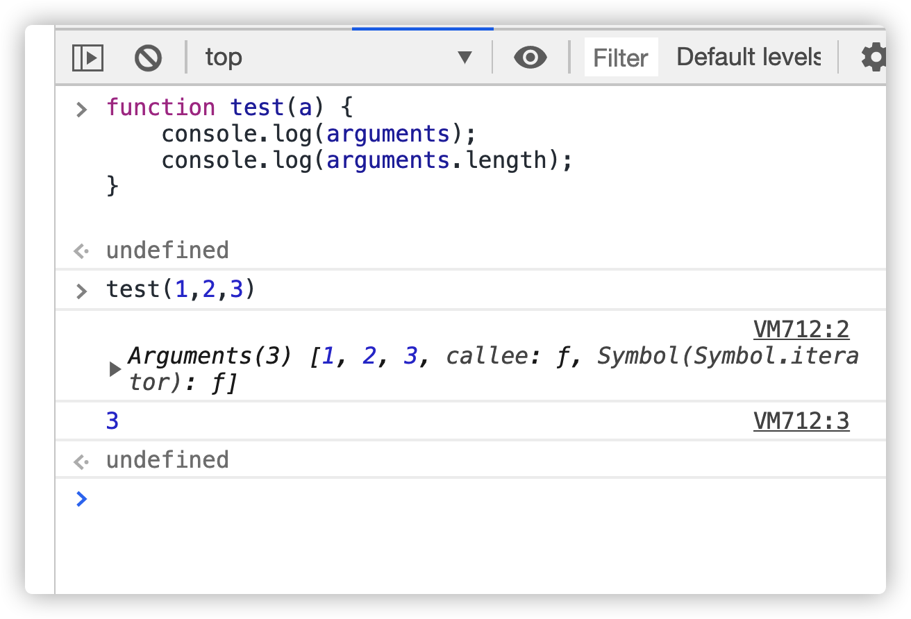
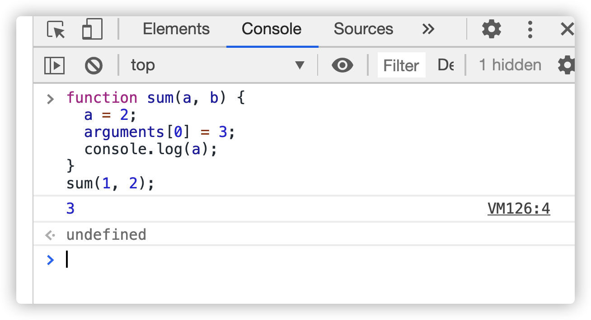
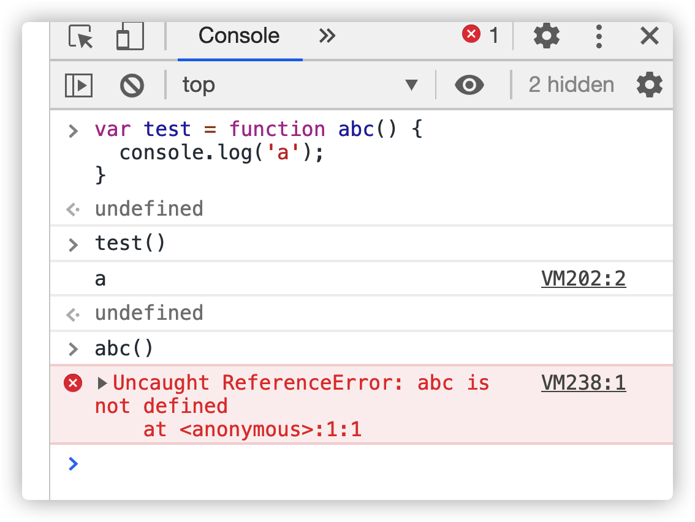
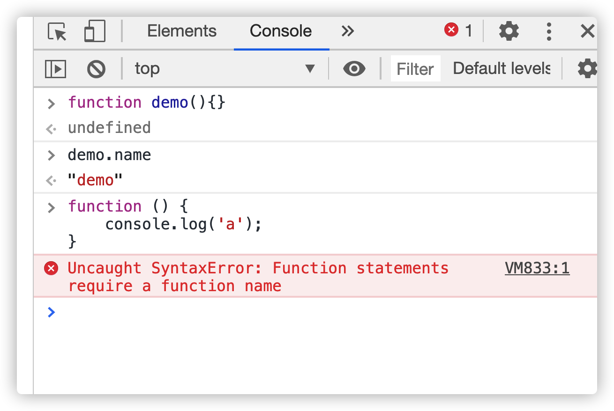

# 函数

函数是专门用于封装代码的, 函数是一段可以随时被反复执行的代码块

```js
function 函数名称(形参列表) {
  被封装的代码;
  return 数据; // 确定函数的返回值
}
函数名称(); // 执行函数
```

函数名起名:开发规范要求，函数名和变量名如果由多个单词拼接，必须符合小驼 峰原则(第一个单词首字母小写，后面的首字母大写)

形参: 定义函数时函数()中的变量我们就称之为形参

实参: 调用函数时传入的数据我们就称之为实参

js 参数不限制位置，天生不定参数

# arguments

在每一个函数里面都有一个隐式的东西 arguments 这个是实参列表。arguments 的作用：保存所有传递给函数的实参

arguments 是一个伪数组





arguments 里面一个变，一个跟着变，但是[1,2]是两个人，相当于映射关系。

1. 一个函数可以有形参也可以没有形参(零个或多个)
2. 一个函数可以有返回值也可以没有返回值
3. 函数没有通过 return 明确返回值，默认返回 undefined
4. return 的作用和 break 相似，所以 return 后面不能编写任何语句(永远执行不到)
   - break 作用立即结束 switch 语句或者循环语句
   - return 作用立即结束当前所在函数
5. 调用函数时实参的个数和形参的个数可以不相同
6. JavaScript 中的函数和数组一样，都是引用数据类型(对象类型)
7. 函数可以调用另外一个函数，因为每个函数都是独立的代码块，用于完成特殊任务，因此经常会用到函数相互调用的情况。

# 函数的两种声明方式

自定义函数方式(命名函数)



上面这个函数的函数名 name 是 abc，在控制台 console 直接输出 test()打印 a，在控制台直接输出 abc()报错，表达式就会忽略他的名字 abc

在上面例子中，`function abc(){console.log(‘a’);}`这一部分叫表达式，是会忽略 abc 这个地方的名字，会变成匿名函数表达式，不如直接写成匿名函数

匿名函数表达式：就是没有名称的函数（常用，一般说的函数表达式就是匿名函数表达式）

匿名函数不能够只定义不使用


