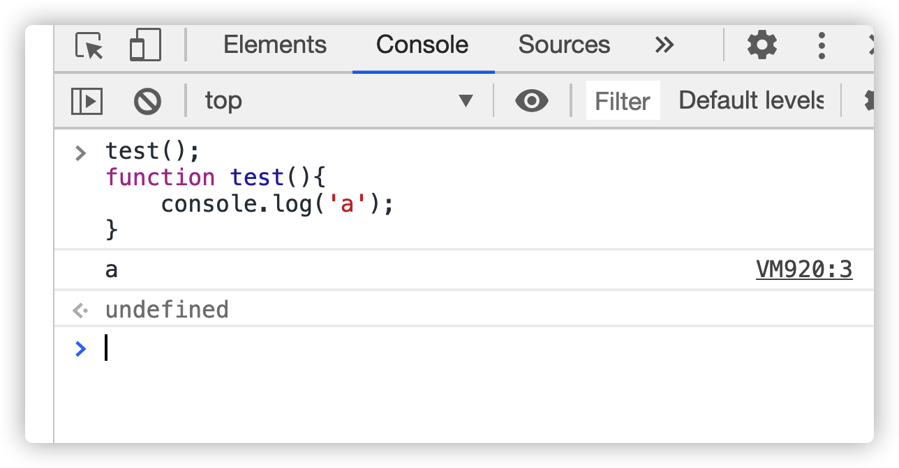
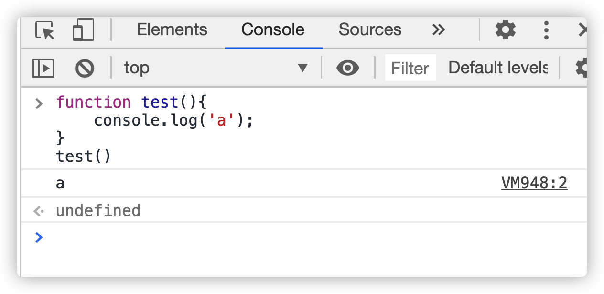
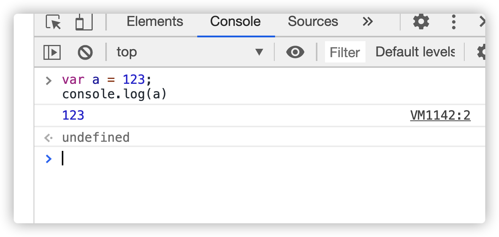
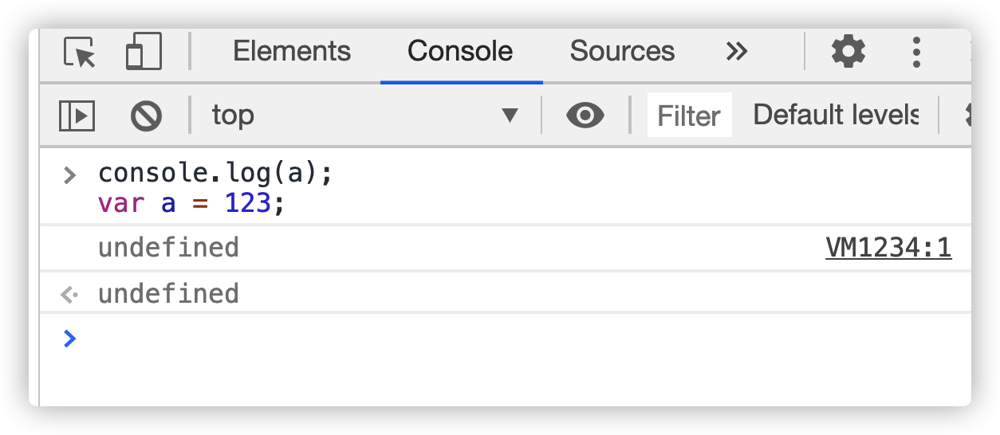
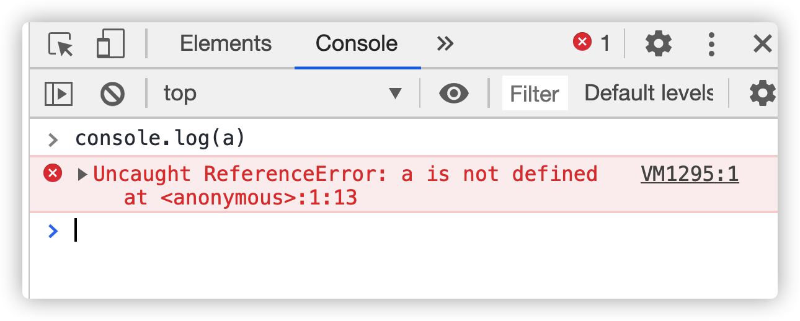
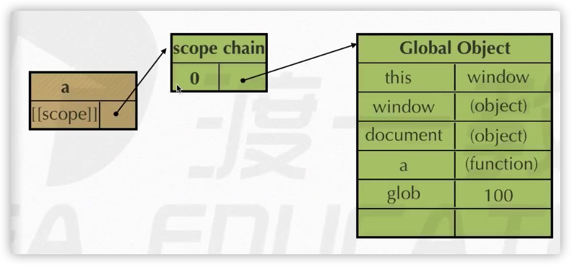
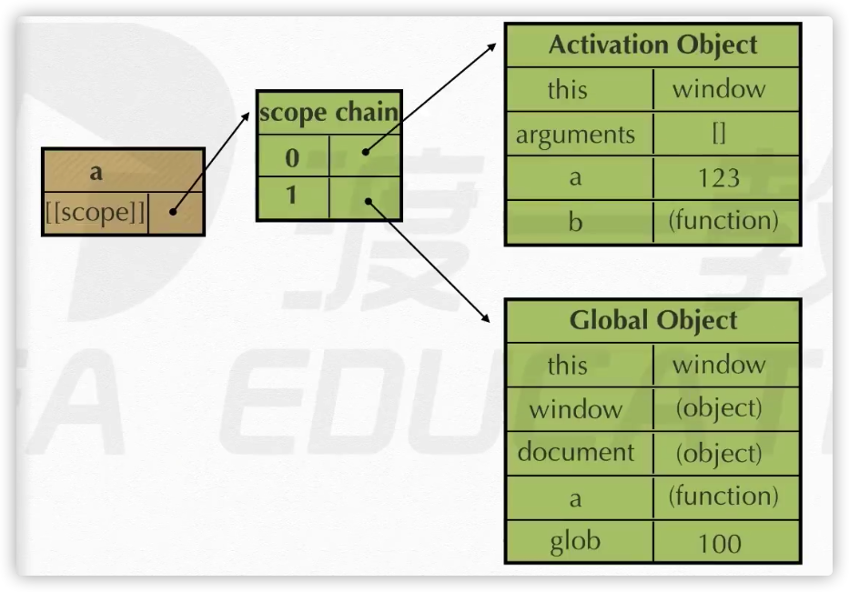
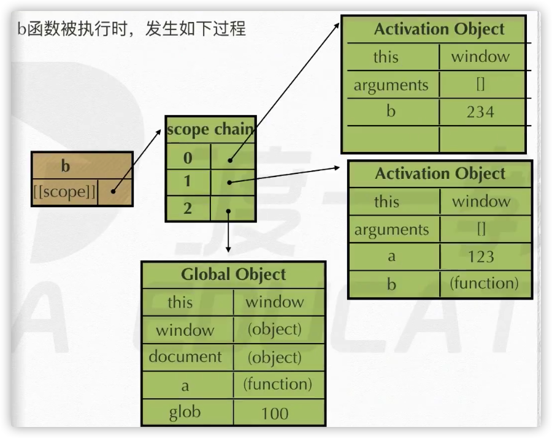

# 作用域

作用域定义：变量(变量作用域又称上下文)和函数生效(能被访问)的区域

通常来说，一段程序代码中所用到的名字并不总是有效和可用的，而限定这个名字的**可用性的代码范围**就是这个名字的**作用域**。作用域的使用提高了程序逻辑的局部性，增强了程序的可靠性，减少了名字冲突。

JavaScript（es6 前）中的作用域有两种：

- 全局作用域
- 局部作用域（函数作用域）

全局作用域：作用于所有代码执行的环境(整个 script 标签内部)或者一个独立的 js 文件。

局部作用域（函数作用域）：作用于函数内的代码环境，就是局部作用域。因为跟函数有关系，所以也称为函数作用域。

# 变量的作用域

变量作用域的分类，在 JavaScript 中，根据作用域的不同，变量可以分为两种：

- 全局变量
- 局部变量

在全局作用域下声明的变量叫做**全局变量（在函数外部定义的变量）**。

- 全局变量在代码的任何位置都可以使用
- 在全局作用域下 var 声明的变量 是全局变量
- 特殊情况下，在函数内不使用 var 声明的变量也是全局变量（不建议使用）

在局部作用域下声明的变量叫做**局部变量（在函数内部定义的变量）**

- 局部变量只能在该函数**内部**使用
- 在函数内部 var 声明的变量是局部变量
- 函数的**形参**实际上就是局部变量

全局变量和局部变量的区别：

- 全局变量：在任何一个地方都可以使用，只有在浏览器关闭时才会被销毁，因此比较占内存
- 局部变量：只在函数内部使用，当其所在的代码块被执行时，会被初始化；当代码块运行结束后，就会被销毁，因此更节省内存空间

# 预编译前奏

js 运行三部曲：

1. 语法分析
2. 预编译
3. 解释执行





声明函数后调用函数、声明函数前调用函数都可以执行，因为有预编译的存在







**函数声明整体提升**:函数不管写到哪里，都会被提到逻辑的最前面。所以不管在哪 里调用，本质上都是在后面调用

**变量声明提升**：把 var a 提升到最前面

```js
var a = 123; // 这是变量声明再赋值。
// 变量 声明提升是把他拆分成以下步骤：
var a;
a = 123; // 然后把 var a 提升到最前面
```

但是上面这两句话没办法解决所有的问题

- **imply global 暗示全局变量**：即任何变量，如果变量未经声明就赋值，此变量就为 全局对象(全局对象是 window)所有。
- **一切声明的全局变量，全是 window 的属性**。

```js
function test() {
  var a = (b = 123);
}
test();
// console.log(a); // 报错
console.log(b); // 123
// var a = b = 123;变量赋值自右向左，先将123 赋值给b,然后声明变量a,把b赋值给a
// 在这个过程中，b未经声明就赋值，任何变量未经声明就赋值，这个变量为全局对象所有。所以打印b为123。
// 访问 window.a 是 undefined，访问 window.b 是 123
```

预编译(解决执行顺序问题)发生在函数执行的前一刻

(函数)预编译的四部曲:

1.  创建 AO（Activation Object） 对象
2.  找形参和变量声明，将变量和形参名作为 AO 属性名，值为 undefined
    相当于 `AO { a : undefined, b : undefined }`
3.  将实参值和形参统一(把实参值传到形参里)
4.  在函数体里面找函数声明，值赋予函数体(先看自己的 AO，再看全局的 GO)

```js
function fn(a) {
  console.log(a); // function a() { }
  var a = 123;
  console.log(a); // 123
  function a() {}
  console.log(a); // 123
  var b = function () {};
  console.log(b); // function () { }
  function d() {}
}
fn(1);
```

这个例子的形参是（a），变量声明也是 a

上面的例子按四部曲变化如下:

1. 创建 AO 对象（Activation Object）（执行期上下文）,`AO = {}`
2. 找形参和变量声明，将变量和形参（a）名作为 AO 属性名，值为 undefined。`AO = { a: undefined, b: undefined }`
3. 将实参值和形参统一。`AO = { a: 1, b: undefined }`
4. 在函数体里面找函数声明，值赋予函数体。`function a () {}`和 `function d () {}`都是函数声明，但是 `var b = function (){}`不是。`AO = { a: function a () {}, b: undefined, d: function d() {} }`

执行第一行 `console.log(a);`时，用的是`AO = { a: function a () {}, b: undefined, d: function d() {} }`

执行 `var a =123;`改变的是`AO = { a: 123, b: undefined, d: function d() {} }`

在 `b = function (){}`时，`AO = { a: 123, b: function () {}, d: function d() {} }`

全局的预编译三部曲：

1. 生成了一个 GO 的对象 Global Object（window 就是 GO）
2. 找形参和变量声明，将变量和形参名作为 GO 属性名，值为 undefined
3. 在函数体里面找函数声明，值赋予函数体

任何全局变量都是 window 上的属性

没有声明就赋值了，归 window 所有，就是在 GO 里面预编译

```js
function test() {
  var a = (b = 123);
  console.log(window.b);
  console.log(a);
}
test();
console(b);
```

先生成 GO 还是 AO?

想执行全局，先生成 GO，在执行 test 的前一刻生成 AO

几层嵌套关系，近的优先，从近的到远的，有 AO 就看 AO，AO 没有才看 GO

先生成 `GO = { b : 123 }`，再有 `AO = { a : undefined }`

# 作用域链

**[[scope]]**：每个 javascript 函数都是一个对象，对象中有些属性我们可以访问，但有些不可以，这些属性仅供 javascript 引擎存取，[[scope]]就是其中一个。

**[[scope]]指的就是我们所说的作用域,其中存储了运行期上下文的集合**。

**作用域链**：[[scope]]中所存储的执行期上下文对象的集合，这个集合呈链式链接，我 们把这种链式链接叫做作用域链。

**运行期上下文**：当函数执行时，会创建一个称为**执行期上下文**的内部对象。一个执行期上下文定义了一个函数执行时的环境，函数每次执行时的执行上下文都是独一无二的，所以多次调用一个函数会导致创建多个执行上下文，函数每次执行时，都会把新生成的执行期上下文，填充到作用域链的最顶端。当函数执行完毕，它所产生的执行上下文被销毁。

**查找变量**：在哪个函数里面查找变量，就从哪个函数作用域链的顶端依次向下查找。

```js
function a() {
  function b() {
    var b = 234;
  }
  var a = 123;
  b();
}
var glob = 100;
a();
```

a 函数被定义时，发生如下过程：



a 函数被执行时，发生如下过程：



b 函数被创建时，发生如下过程：


b 函数被执行时，发生如下过程：



当函数执行完毕，会干掉自己的 AO，回到被创建时的状态。

```js
function a() {
  function b() {
    function c() {}
    c();
  }
  b();
}
a();
```

当 c 执行完后，会干掉自己的 c 的 AO，回到 c 被定义的状态，当 c 再被执行时，会生成一个新的 new 的 c 的 AO{}，其余都一样，因为基础都是 c 的被定义状态

如果 function a 不被执行，下面的 function b 和 function c 都是看不到的（也不会被执 行，被折叠）。只有 function a 被执行，才能执行 function a 里面的内容 a();不执行，根本看不到 function a (){}里面的内容
