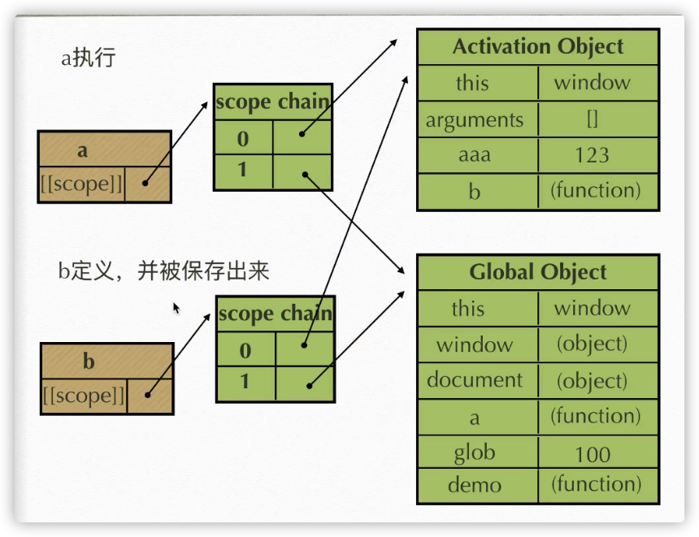

# 闭包

**闭包**：当内部函数被保存到外部时，将会生成闭包。闭包会导致原有作用域链不释放，造成内存泄露。

内存泄漏就是内存占用，内存被占用的越多，内存就变得越来越少了，就像内存被泄露了一样

```js
function a() {
  function b() {
    var bbb = 234;
    document.write(aaa);
  }
  var aaa = 123;
  return b;
}
var glob = 100;
var demo = a();
demo();
```



**但凡是内部的函数被保存到外部，一定生成闭包**

```js
function a() {
  var aa = 345;
  function b() {
    var bb = 234;
    function c() {
      var cc = 123;
    }
    c();
  }
  b();
}
a();
```

执行过程：

1. 先执行`function a(){ var aa = 345;function b (){}b();}`
2. 想要执行完上面的 b();就需要执行完 `function b(){var bb = 234; function c(){}c();}`
3. 想要执行 c();就要先执行完`function c(){var cc =123;}`
4. `b();`是一个复合语句，执行完 b 里面的每一句话，才能执行 `b();`

销毁顺序：

1. 哪个先被执行完，哪个先被销毁
2. 当 c 执行完，先销毁 c 自己的执行期的上下文
3. 当 c();执行完，那么 b 也执行完了，就销毁 b 的执行期上下文
4. 当 b();执行完，那么 a 也执行完了，就销毁 a 的执行期上下文

常见的闭包：

1. 将函数作为另一个函数的返回值
2. 将函数作为实参传递给另一个函数调用

```js
function fn1() {
  var a = 2;

  function fn2() {
    a++;
    console.log(a);
  }
  return fn2;
}
var f = fn1();
f(); // 3
f(); // 4

console.log('-------------------------------------------');

function showMsgDelay(msg, time) {
  setTimeout(function () {
    console.log(msg);
  }, time);
}
showMsgDelay('hello', 1000);
```

闭包的作用：

1. 实现公有变量，例如函数累加器
2. 可以做缓存（存储结构）。缓存是外部不可见的，但是确实有存储结构
3. 可以实现封装，属性私有化
4. 模块化开发，防止污染全局变量

# 立即执行函数

**IIFE**（ 立即调用函数表达式）是一个在定义时就会立即执行的 JavaScript 函数。

定义：此类函数没有声明，在一次执行过后即释放（被销毁）。适合做初始化工作。

针对初始化功能的函数：只想让它执行一次的函数

立即执行的函数也有参数，也有返回值，有预编译

立即执行函数的两种写法`(function () {} ());`、`(function () {})();`

只有表达式才能被执行符号执行

能被执行符号执行的表达式，这个函数的名字就会被自动忽略（放弃名字）

能被执行符号执行的表达式基本上就是立即执行函数

```js
// 函数声明和函数表达式是两个东西，虽然都能定义函数

// 函数声明
function test() {}

// 函数表达式
var test = function() {};

function () {
    var a = 123; // 这是函数声明，不能执行，报语法错误，因为只有表达式才能被执行符号执行
}()

function () {
    var a = 123;
}
test(); // test()；就是表达式，所以能执行
```

# 逗号操作符

对它的每个操作数求值（从左到右），并返回最后一个操作数的值。

```js
var a = (1 - 1, 1 + 2);
console.log(a); // 3
```
