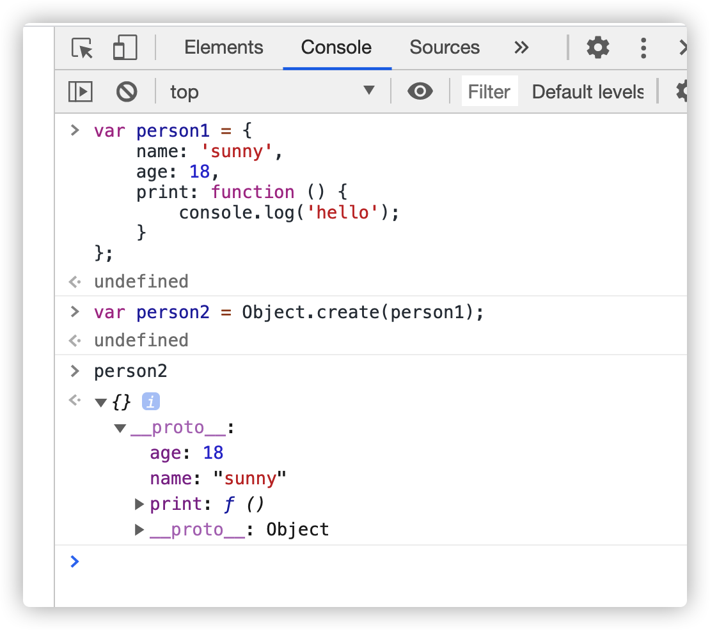
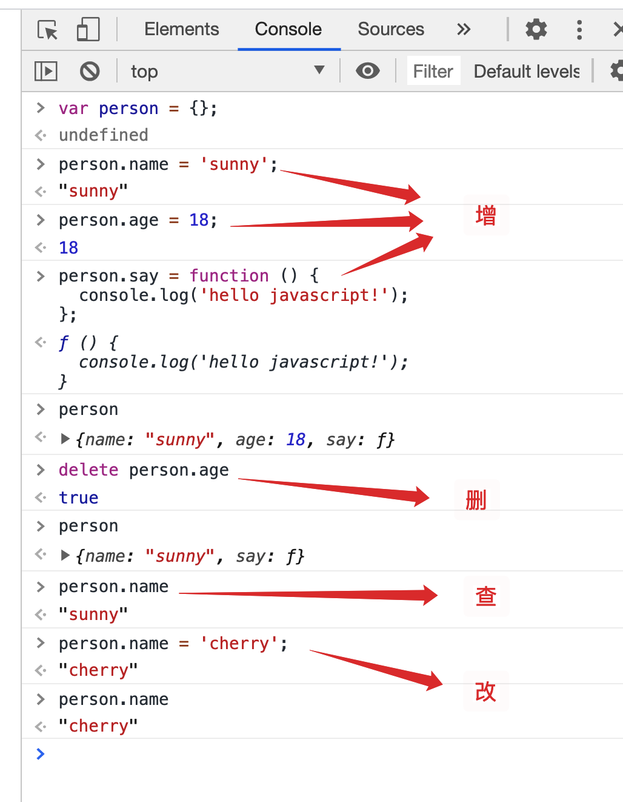
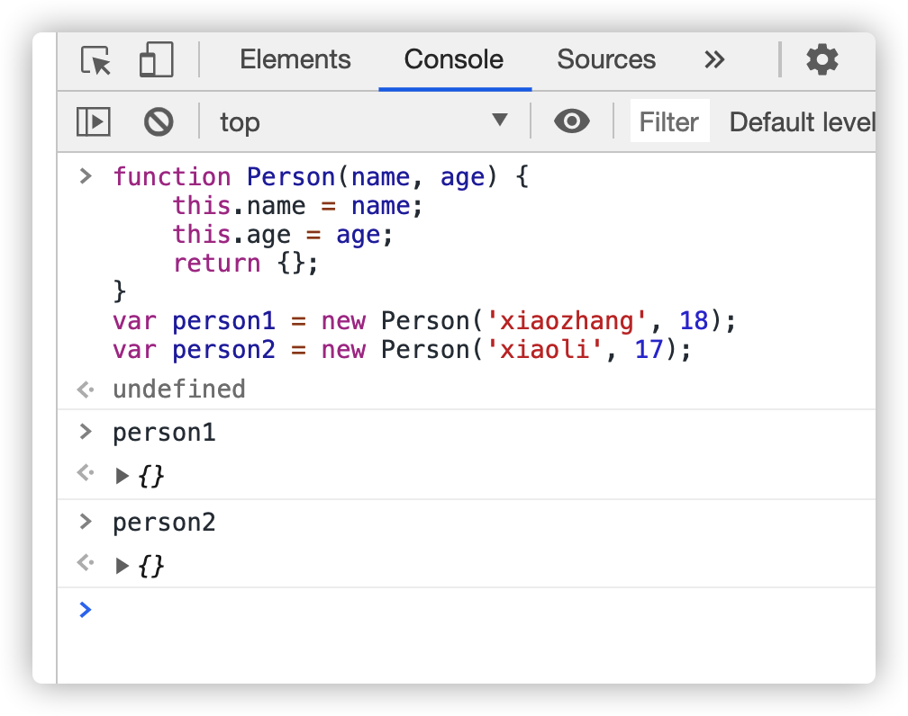
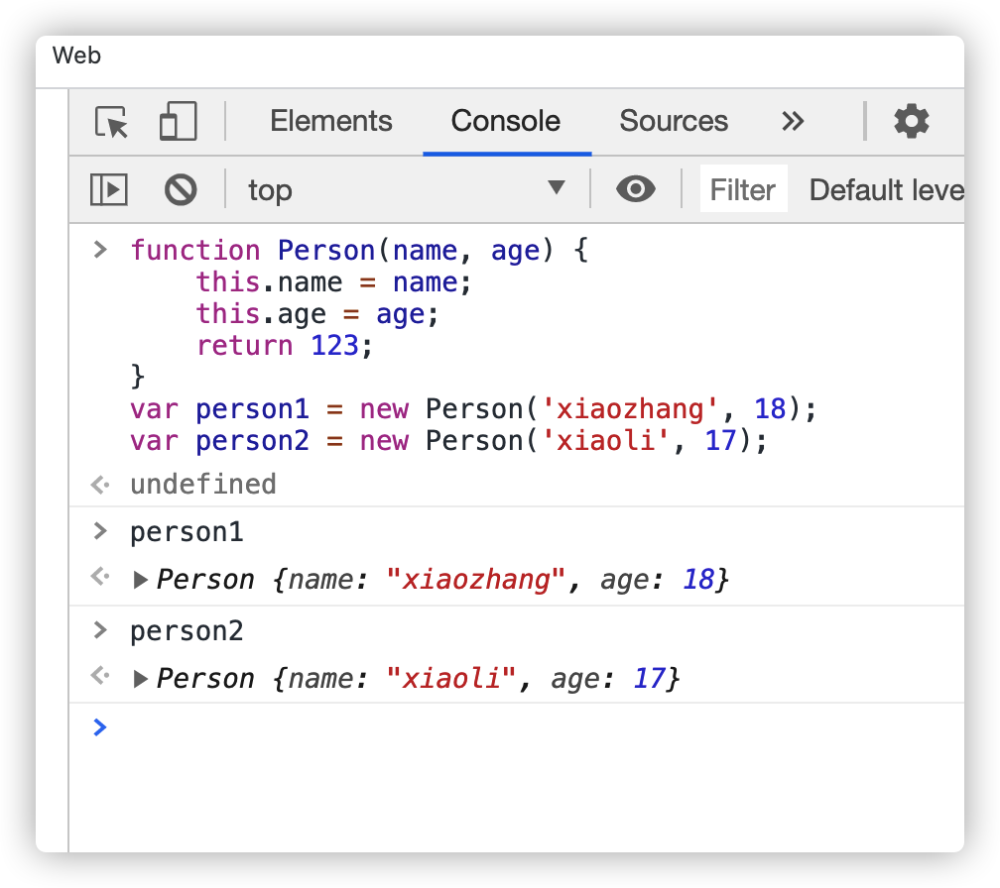

# 创建对象的方法

1. 对象字面量创建对象

   ```js
   var obj = {};
   obj.name = 'sunny';
   obj.age = 18;
   obj.say = function () {
     console.log('hello world');
   };
   ```

2. 构造函数创建对象：**构造函数**是一种特殊的函数，主要用来初始化对象，即为对象成员变量赋初始值，它总与 new 运算符一起使用。我们可以把对象中一些公共的属性和方法抽取出来，然后封装到这个函数里面。

   - 系统自带的构造函数

     ```js
     var obj = new Object();
     obj.name = 'sunny';
     obj.age = 18;
     obj.say = function () {
       console.log('hello world');
     };
     ```

   - 自定义构造函数

     ```js
     function Person(name, age, sex) {
       this.name = name;
       this.age = age;
       this.sex = sex;
     }
     var p = new Person('sunny', 18, 'female');
     ```

   在 js 中，使用构造函数要时要注意以下两点：

   - 构造函数用于创建某一类对象，其**首字母要大写**
   - 构造函数要**和 new 一起使用**才有意义

3. `Object.create()`创建实例对象。构造函数作为模板，可以生成实例对象。但是，有时拿不到构造函数，只能拿到一个现有的对象。我们希望以这个现有的对象作为模板，生成新的实例对象，这时就可以使用`Object.create()`方法。`Object.create()`方法接受一个对象作为参数，然后以它为原型，返回一个实例对象。

   

# 对象属性的增删改查



# 函数和方法区别

函数就是没有和其它的类显示的绑定在一起的, 我们就称之为函数

方法就是显示的和其它的类绑定在一起的, 我们就称之为方法

函数和方法的区别

1. 函数可以直接调用, 但是方法不能直接调用, 只能通过对象来调用
2. 函数内部的 this 输出的是 window, 方法内部的 this 输出的是当前调用的那个对象

无论是函数还是方法, 内部都有一个叫做 this 的东西

this 是什么? 谁调用了当前的函数或者方法, 那么当前的 this 就是谁

# 构造函数内部原理

1. 在函数体最前面隐式的加上`this = {}`
2. 执行`this.xxx = xxx;`
3. 隐式的返回 this

```js
function Student(name, age, sex) {
  // var this = {
  //     name: '',
  //     age: ''
  // };
  this.name = name;
  this.age = age;
  this.sex = sex;
  // return this
}
var student = new Student('cherry', 18, 'male');
```

new 之后返回的必须是对象(函数、数组也可以)，但如果是原始值，相当于隐式的执行 return this。（有 new 不可能返回原始值）





# 包装类

为了便于操作基本类型值，ECMAScript 还提供了 3 个特殊的引用类型：Boolean、Number 和 String。

```js
var s1 = 'some text';
var s2 = s1.substring(2);
```

基本类型值不是对象，因而从逻辑上讲它们不应该有方法（尽管如我们所愿，它们确实有方法）。其实，为了让我们实现这种直观的操作，后台已经自动完成了一系列的处理。

当第二行代码访问 s1 时，访问过程处于一种读取模式，也就是要从内存中读取这个字符串的值。而在读取模式中访问字符串时，后台都会自动完成下列处理。

1. 创建 String 类型的一个实例；
2. 在实例上调用指定的方法；
3. 销毁这个实例。

> _var str = 'abcd';_
>
> _str.a = '123'; // new String(str) str.a = 123 str = null;_
>
> _console.log(str.a) // new String(str) str.a 不存在，结果为 undefined_
>
> var str = 'abcdefg';
>
> str.length = 2; _// new String(str) str.length = 2; delete_
>
> console.log(str.length); \_// new String(str) str.length 属性存在，为 7

**undefined 和 null 不可以有属性**

```js
undefined.abc = 123; // 会报错
```

原始值不可能有属性和方法，但经过了包装类(加隐式)可以调用一些属性与方法

```js
var num = 4;
num.len = 3; // 系统隐式的加上 new Number(4).len = 3; 然后 delete
console.log(num.len); // 系统隐式的加上 new Number(4).len; 但是这个 new number 和上面的 new number 不是同一个，一个对象没有属性，所以返回 undefined
```

上面这些隐式的过程就是包装类
