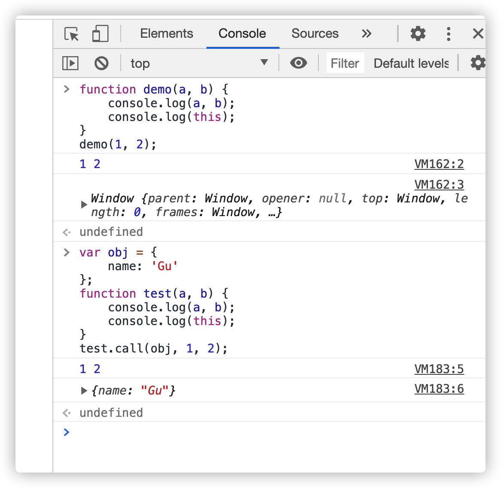
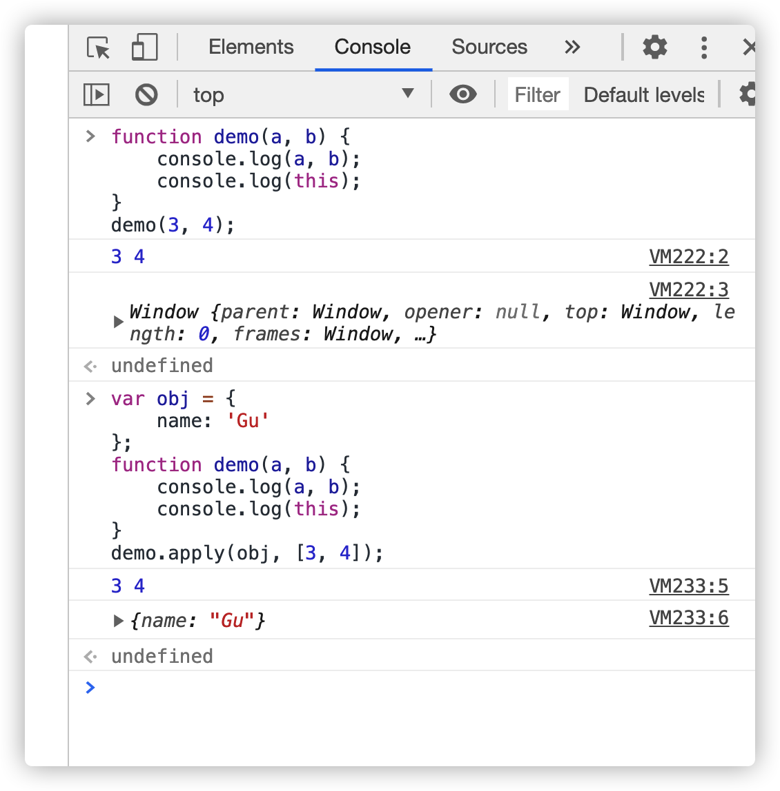
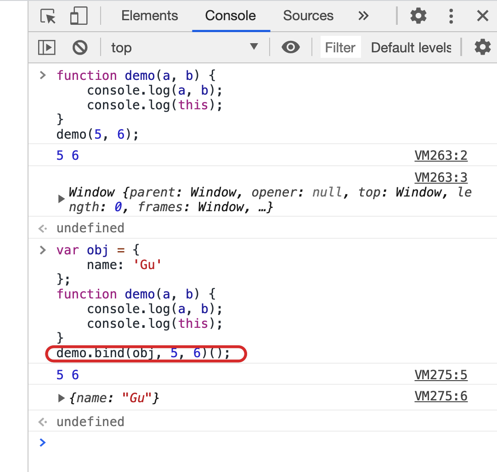
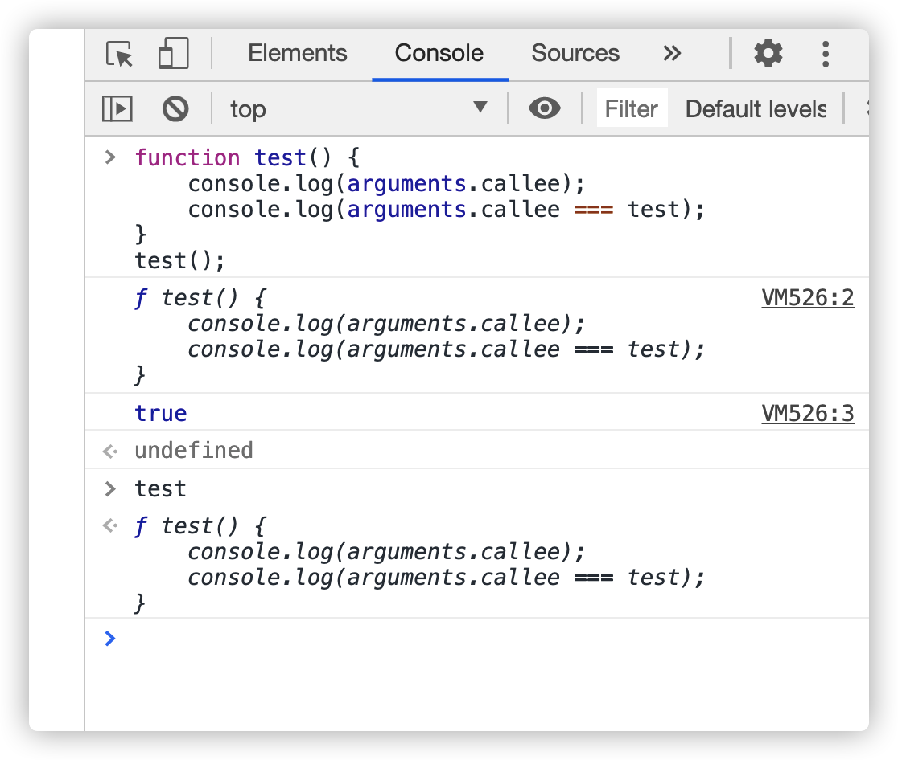
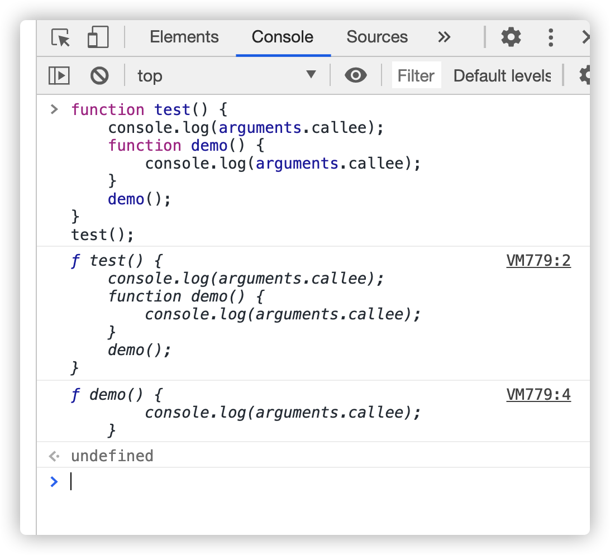
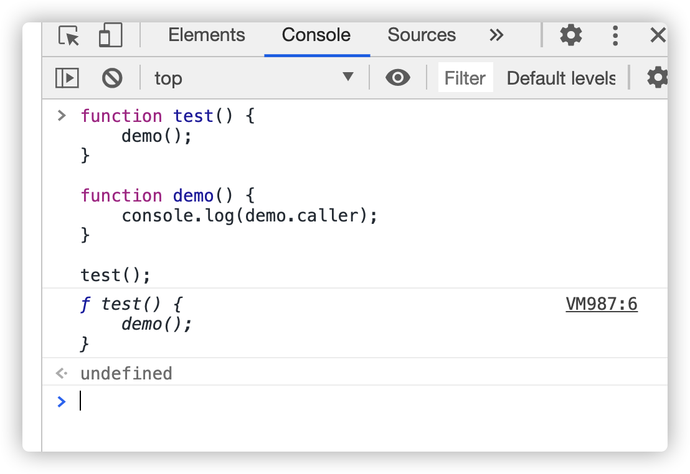
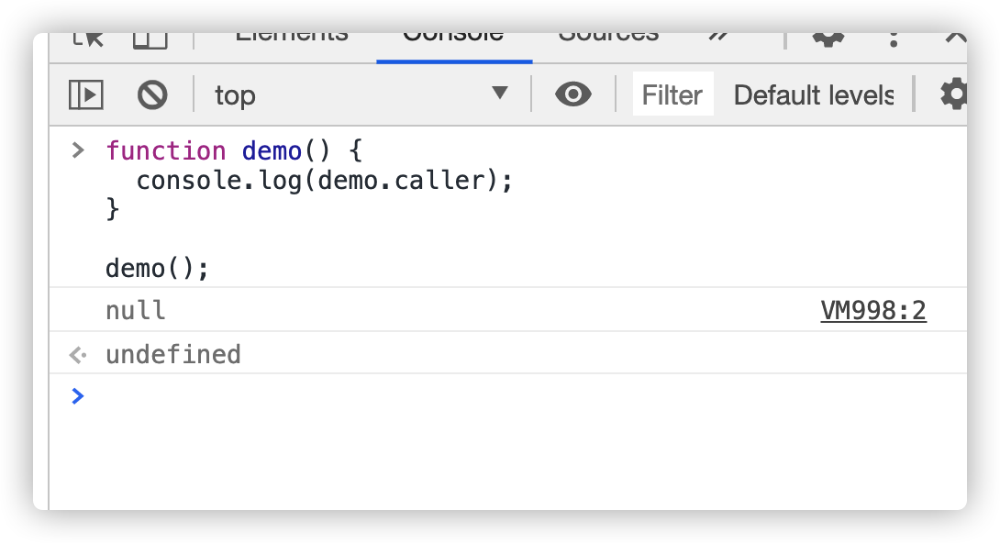

# call、apply、bind

作用：改变 this 指向

call：修改函数或者方法中的 this 为指定的对象, 并且会立即调用修改之后的函数

apply：修改函数或者方法中的 this 为指定的对象, 并且会立即调用修改之后的函数。**参数必须通过数组的方式传递**

bind：修改函数或者方法中的 this 为指定的对象, 并且会返回一个修改之后的新函数。

# callee 与 caller

arguments.callee 指向函数的引用(函数自己)

在哪个函数里面的，arguments.callee 就指代了哪个函数

function.caller，caller 谁叫他，caller 不能用在 arguments 里面

demo 被调用的环境是 test，所以这个 caller 指代的是 test

直接执行结果为：null

