# prototype 属性的作用

通过构造函数为实例对象定义属性，虽然很方便，但是有一个缺点。同一个构造函数的多个实例之间，无法共享属性，从而造成对系统资源的浪费。

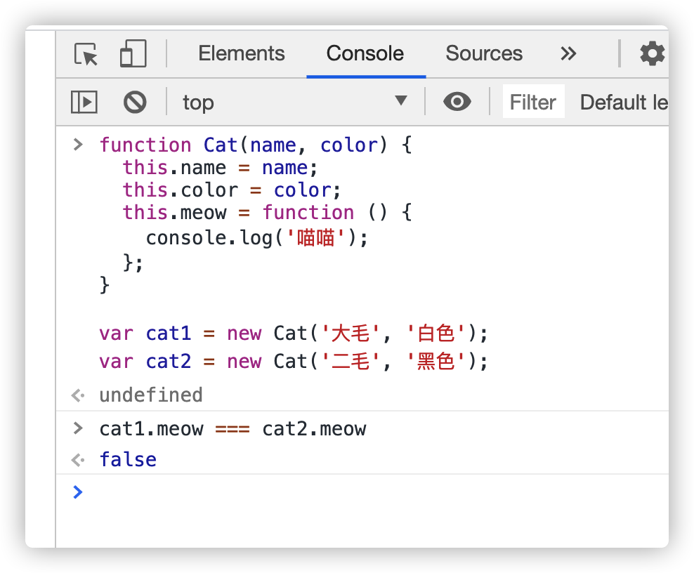

JavaScript 继承机制的设计思想就是，原型对象的所有属性和方法，都能被实例对象共享。也就是说，如果属性和方法定义在原型上，那么所有实例对象就能共享，不仅节省了内存，还体现了实例对象之间的联系。

JavaScript 规定，每个函数都有一个 prototype 属性，指向一个对象，即**显示原型**

每个实例对象都有一个`__proto__`，即**隐式原型**

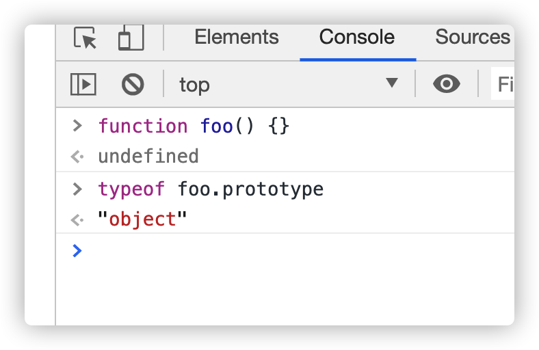

对于普通函数来说，该属性基本无用。但是，对于构造函数来说，生成实例的时候，该属性会自动成为实例对象的原型。

原型对象的属性不是实例对象自身的属性。只要修改原型对象，变动就立刻会体现在**所有**实例对象上。

如果实例对象自身就有某个属性或方法，它就不会再去原型对象寻找这个属性或方法。

原型对象的作用，就是定义所有实例对象共享的属性和方法。

对象的隐式原型的值为其对应构造函数的显示原型的值

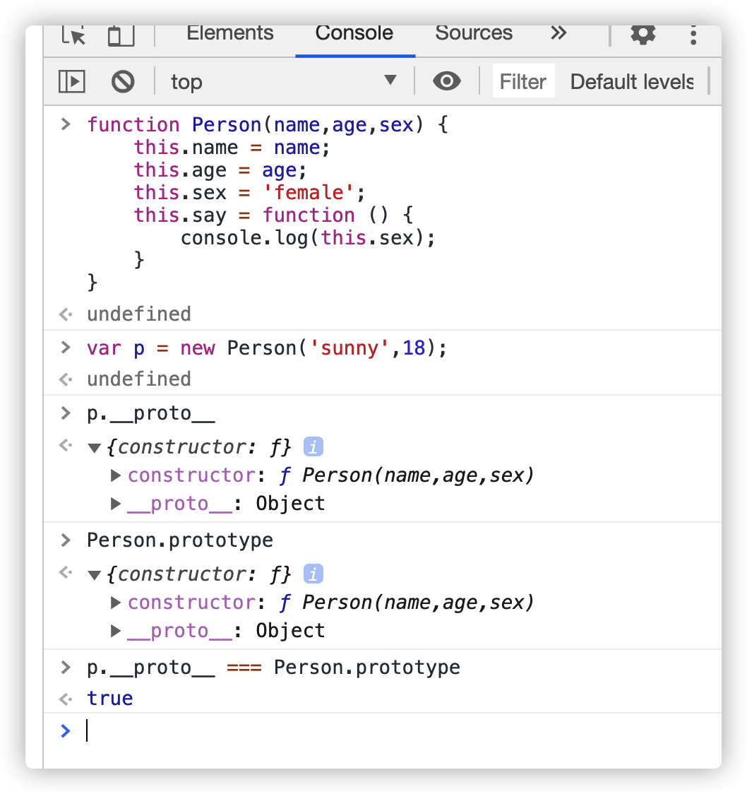

prototype 对象有一个 constructor 属性，默认指向 prototype 对象所在的构造函数。

由于 constructor 属性定义在 prototype 对象上面，意味着可以被所有实例对象继承。

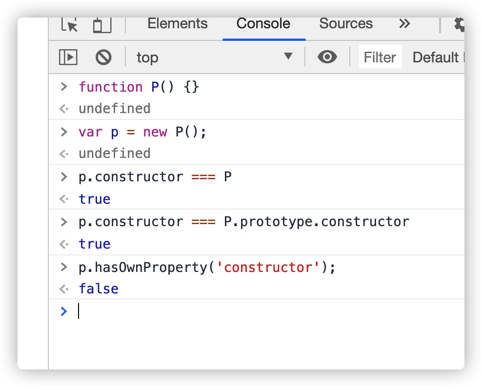

p 是构造函数 P 的实例对象，但是 p 自身没有 constructor 属性，该属性其实是读取原型链上面的 P.prototype.constructor 属性。

constructor 属性的作用是，可以得知某个实例对象，到底是哪一个构造函数产生的。

# 原型链

当访问一个对象的属性时，会先从这个对象身上查找。如果没有找到就会去它的`__proto__`隐式原型上查找，即它的构造函数的 prototype。如果还未找到就继续去它的构造函数的`__proto__`上找。这样一层一层的向上查找，就成了一个链式结构，称为原型链。

如果一层层地上溯，所有对象的原型最终都可以上溯到 Object.prototype，即 Object 构造函数的 prototype 属性。也就是说，所有对象都继承了 Object.prototype 的属性。这就是所有对象都有 valueOf 和 toString 方法的原因，因为这是从 Object.prototype 继承的。

那么，Object.prototype 对象有没有它的原型呢？回答是 Object.prototype 的原型是 null。null 没有任何属性和方法，也没有自己的原型。因此，原型链的尽头就是 null。

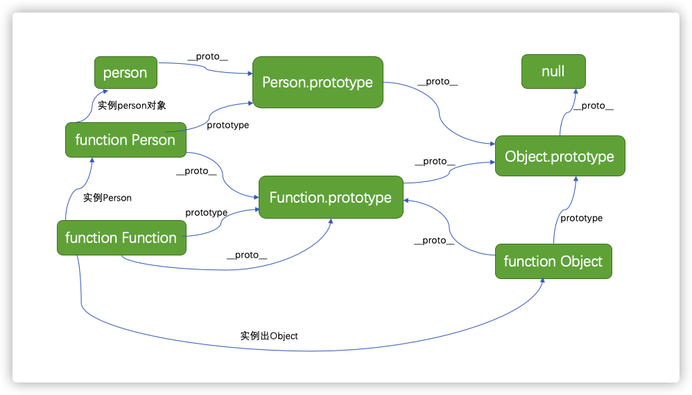

# 继承

## 传统形式

利用原型链实现继承，但是过多的继承了没用的属性

```js
Grand.prototype.lastName = 'Gu';

function Grand() {}
var grand = new Grand();
Father.prototype = grand;

function Father() {
  this.name = 'hehe';
}
var father = new Father();
Son.prototype = father;

function Son() {}
var son = new Son();
```

## 借用构造函数

利用 call、apply 所以不算标准的继承模式

1. 不能继承借用构造函数的原型

2. 每次构造函数都要多走一个函数，浪费效率

```js
function Person(name, age, sex) {
  this.name = name;
  this.age = age;
  this.sex = sex;
}

function Student(name, age, sex, tel, grade) {
  Person.call(this, name, age, sex);
  this.tel = tel;
  this.grad = grade;
}
var student = new Student('Gin', 18, 'male', 132, 100);
```

## 共享原型

较好的继承方法，但不能随便改动自己的原型

```js
Father.prototype.lastName = 'Gu';

function Father() {}

function Son() {}

function inherit(Target, Origin) {
  Target.prototype = Origin.prototype;
}
inherit(Son, Father);
Son.prototype.sex = 'male';
var son = new Son();
var father = new Father();
// 缺点：当给Son添加sex属性时，Father上也有该属性
```

## 圣杯模式

圣杯模式是在共有原型的基础上有改变。

共享原型是：`son.prototype=father.prototype`

圣杯模式是：另外加个构造函数 function F（）{}当做中间层，然后让 F 和 father 共 有一个原型 F.prototype=father.prototype，然后 son.prototype = new F（）；使用原 型链形成了继承关系，现在改 son.prototype 就不会影响 father.prototype

```js
function inherit(Target, Origin) {
  function F() {}
  F.prototype = Origin.prototype;
  Target.prototype = new F();
  Target.prototype.constructor = Target;
  Target.prototype.uber = Origin.prototype;
}
Father.prototype.lastName = 'Gu';

function Father() {}

function Son() {}
inherit(Son, Father);
Son.prototype.sex = 'female';
var son = new Son();
var father = new Father();
```

也可以在子类的构造函数中通过 call 借助父类的构造函数,将子类的原型对象修改为父类的实例对象

```js
function Person(name, age, sex) {
  this.name = name;
  this.age = age;
  this.sex = sex;
}
Person.prototype.say = function () {
  console.log('hello world');
};
function Student(name, age, sex, tel, grade) {
  Person.call(this, name, age, sex);
  this.tel = tel;
  this.grad = grade;
}
Student.prototype = new Person();
Student.prototype.constructor = Student;
var student = new Student('Gin', 18, 'male', 132, 100);
student.say();
```

# instanceof

instanceof 运算符返回一个布尔值，表示对象是否为某个构造函数的实例。

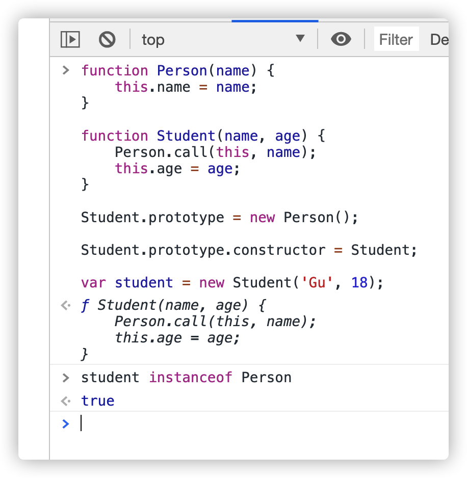

只要构造函数的原型对象出现在实例对象的原型链中都会返回 true

简单理解:`A instanceof B`看 A 对象的原型链上有没有 B 的原型

由于 instanceof 检查整个原型链，因此同一个实例对象，可能会对多个构造函数都返回 true。

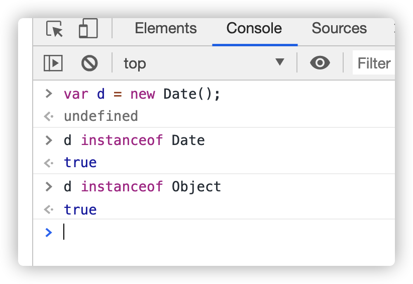

由于任意对象（除了 null）都是 Object 的实例，所以 instanceof 运算符可以判断一个值是否为非 null 的对象。

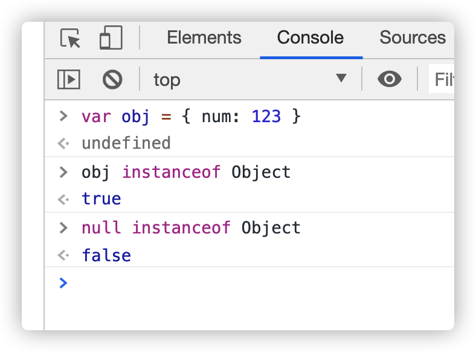

# isPrototypeOf

`isPrototypeOf`用于判断一个对象是否是另一个对象的原型

只要调用者在传入对象的原型链上都会返回 true

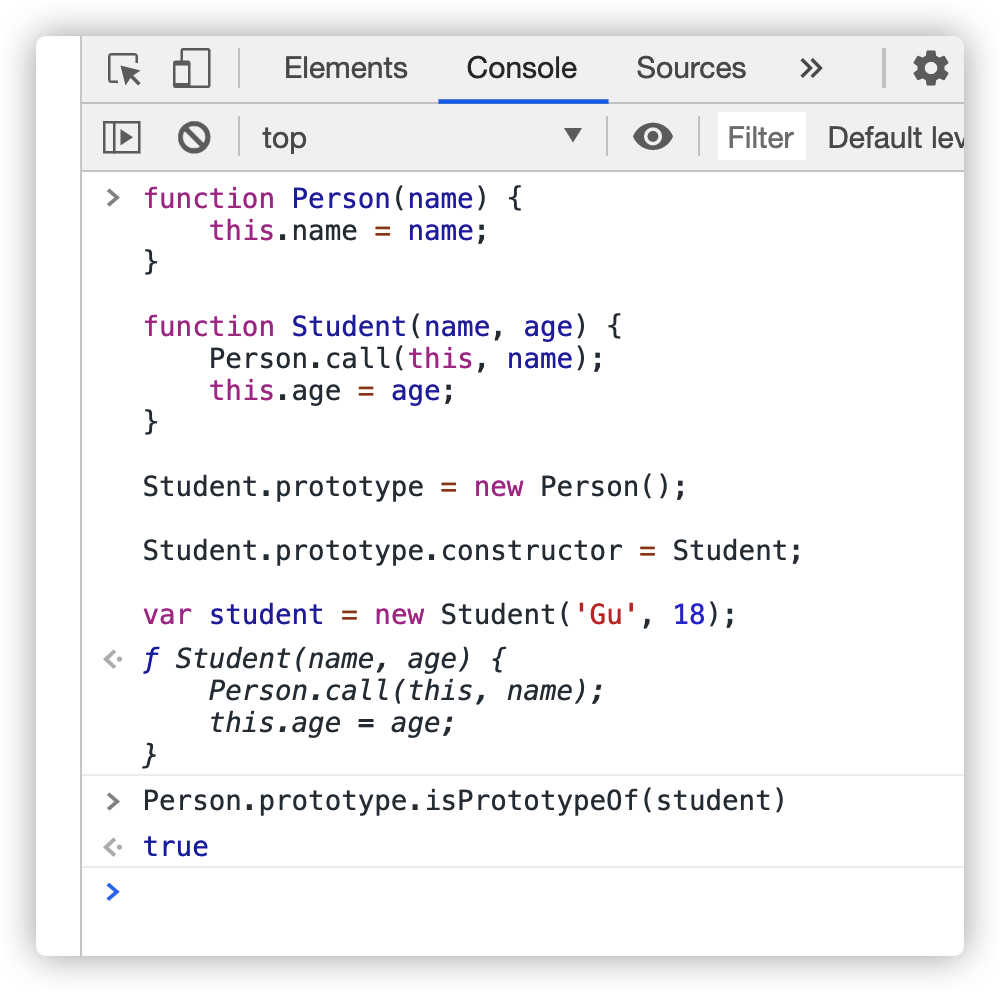

# hasOwnProperty

如果在遍历的时候，我们不想把原型上面的属性拿出来，可以用 hasOwnProperty

一般与 for in 循环成套出现

hasOwnProperty 是一个方法，来判断这个对象是你自己的还是原型的， 任何一个对 象里面都有 hasOwnProperty,里面是需要传参的，把属性名传进去（如 prop）。下面达到了如果不是自己的属性，是原型上的属性，就不会返回。

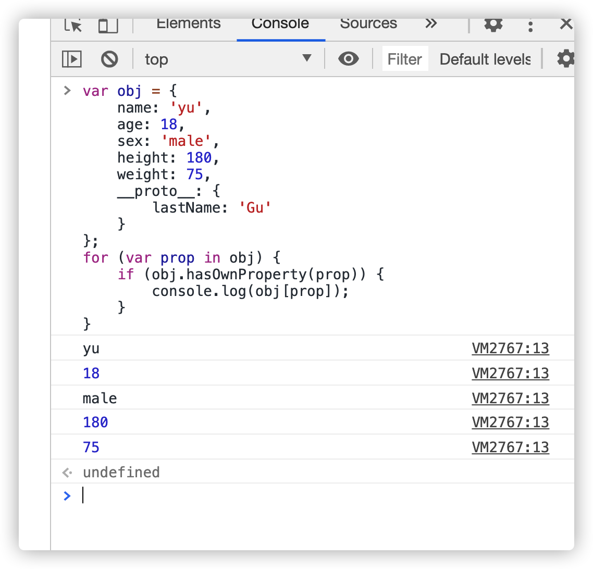

# in

in 操作符你的也是你的，你父亲的也是你的，只能判断这个对象能不能访问到这个属性，包括原型上；不是判断属性属不属于这个对象的

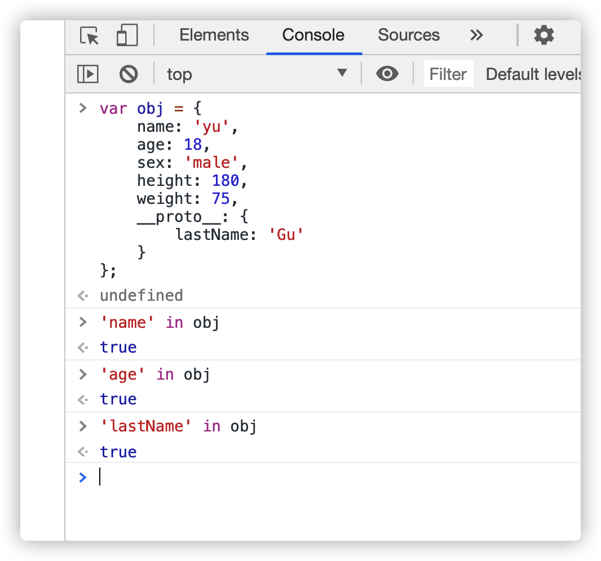

判断一个属性属不属于这个对象的只能用 hasOwnProperty

判断是否为对象的方法：

1. constructor

   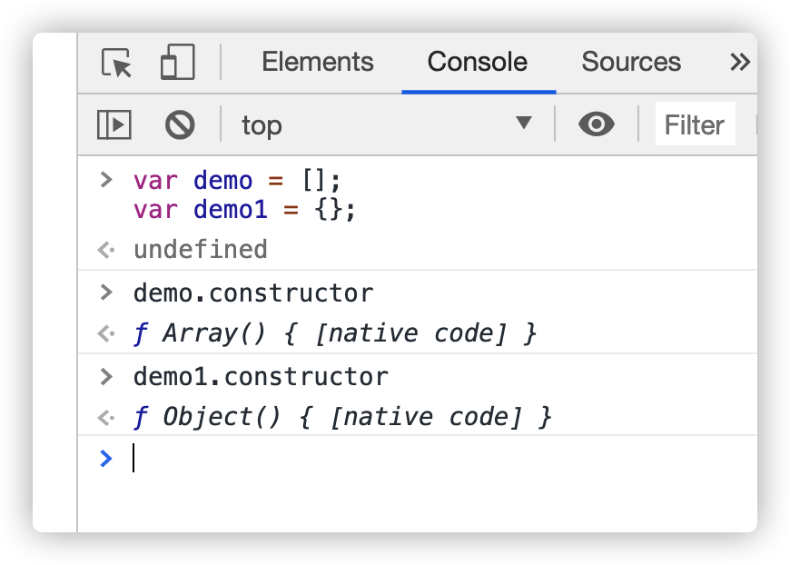

2. instanceof

   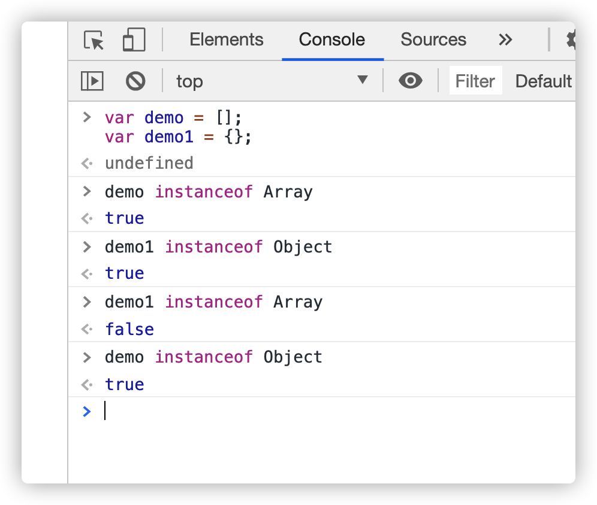

3. Object.prototype.toString()

   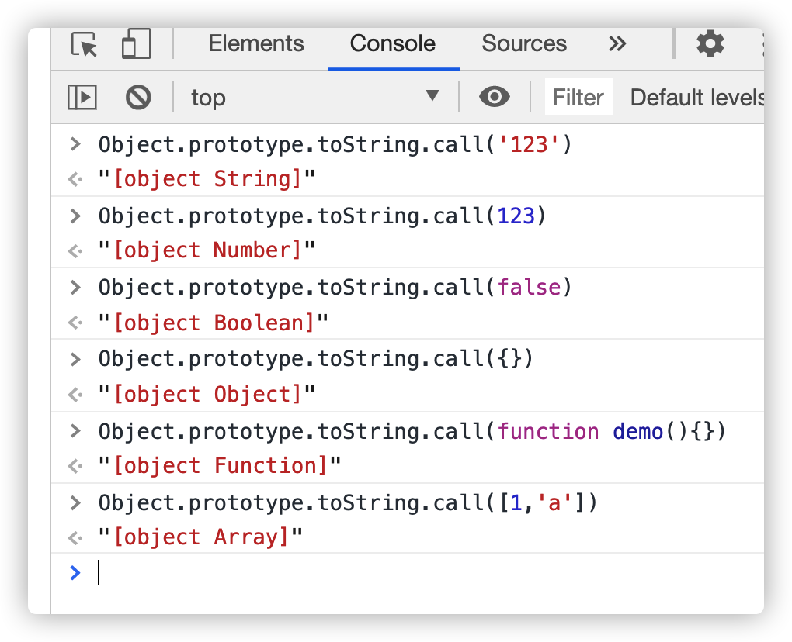

# this 指向

函数预编译过程 this 指向 window

```js
function test(c) {
  // var this = Object.create(test.prototype);
  // {
  //     __proto__: test.prototype
  // }
  var a = 123;
  function b() {}
}
// AO {
//     arguements: [1],
//     c: 1,
//     a: undefined,
//     b: function () {}
// }
test(1);
new test();
```

前面的 var this = Object.creat(test.prototype);是最标准的写法

new test（）；就会让 var this = Object.creat(test.prototype);如果不 new，this 指向 window

全局作用域里 this 指向 window

`call`、`apply`、`bind`可以改变函数运行时 this 指向

`obj.func();` func()里面的 this 指向 obj，谁调用这个方法，这个方法里的 this 就指向谁

# 深拷贝和浅拷贝

深拷贝:修改新变量的值不会影响原有变量的值,默认情况下基本数据类型都是深拷贝

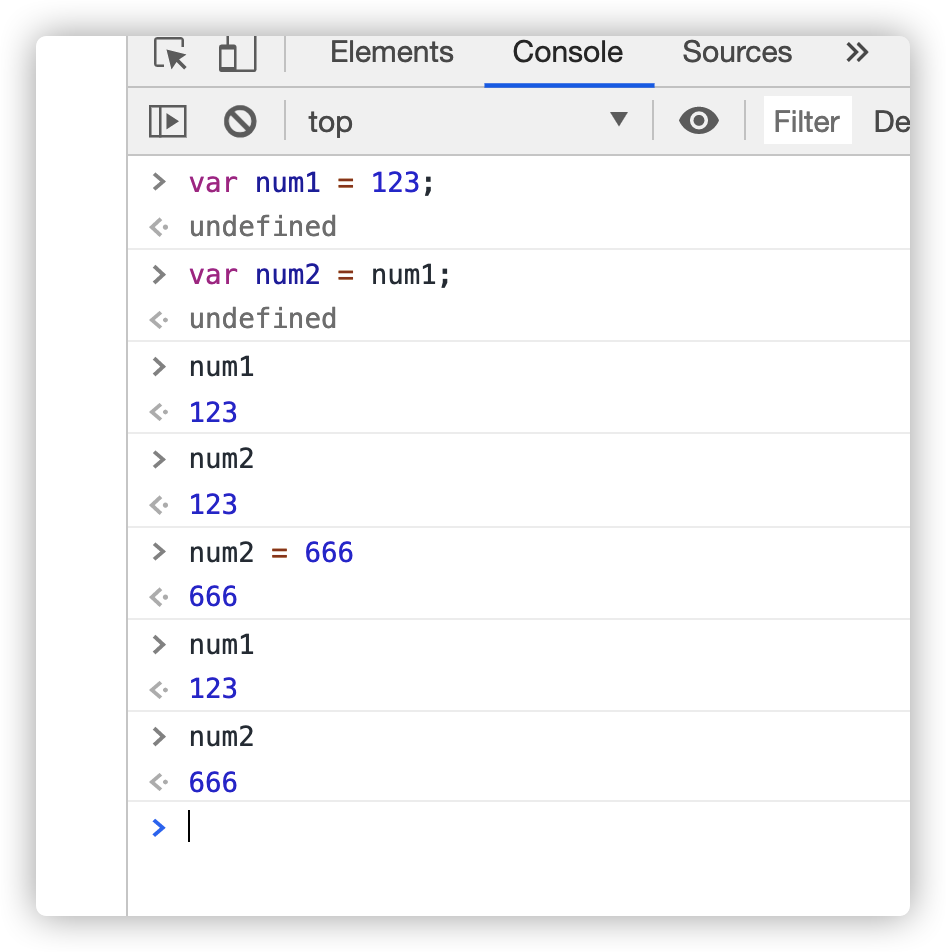

浅拷贝:修改新变量的值会影响原有的变量的值,默认情况下引用类型都是浅拷贝

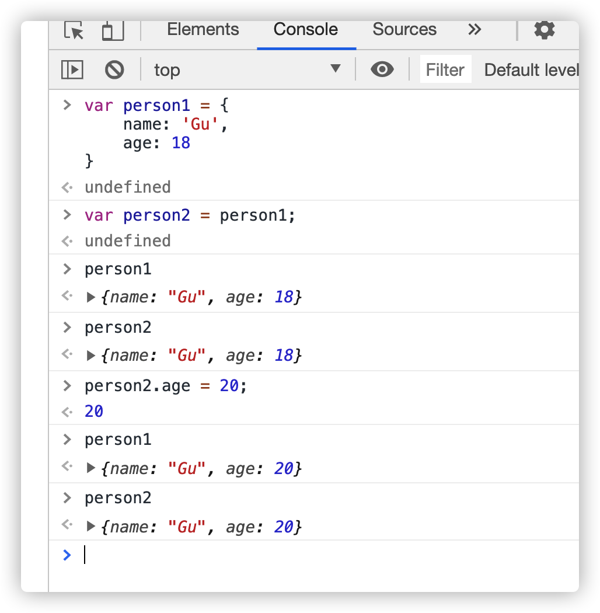

引用值是在栈内存里面放堆的地址，拷贝的也是地址

现在我们想实现深度克隆(只考虑数组和对象)，copy 过去后，我改，但是你不会改

```js
var obj = {
  name: 'abc',
  age: 123,
  sex: 'female',
  card: ['visa', 'master'],
  wife: {
    name: 'bcd',
    son: {
      name: 'aaa'
    }
  }
};
var obj1 = {};
// 遍历对象
// 1.判断是否为原始值			typeof(string、number、boolean、null、undefined、object、function)
// 2.判断是数组还是对象			1.consructor	2.instanceof	3.Object.prototype.toString()
// 3.建立相应的数组或是对象
// 递归

function deepClone(origin, target) {
  var target = target || {};
  for (var prop in origin) {
    if (origin.hasOwnProperty(prop)) {
      // 判断prop是origin的属性还是原形的，如果是原型的就返回false
      if (typeof origin[prop] == 'object') {
        if (origin[prop] instanceof Array) {
          target[prop] = [];
        } else {
          target[prop] = {};
        }
        deepClone(origin[prop], target[prop]);
      } else {
        target[prop] = origin[prop];
      }
    }
  }
  return target;
}
deepClone(obj, obj1);
```

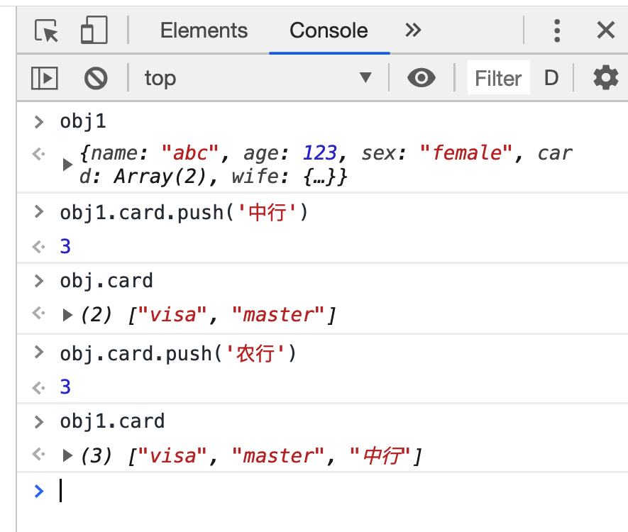
