# Object 对象的相关方法

## Object.getPrototypeOf()

`Object.getPrototypeOf()`方法返回参数对象的原型。这是获取原型对象的标准方法。

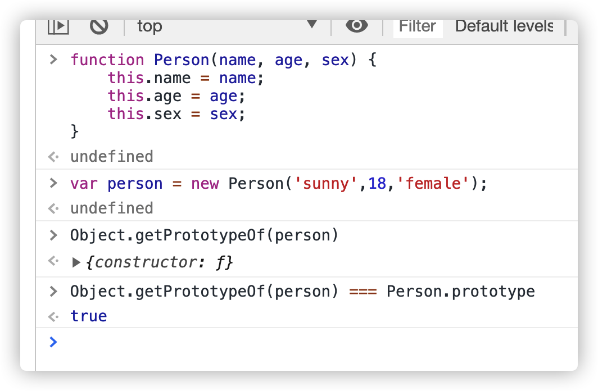

几种特殊对象的原型

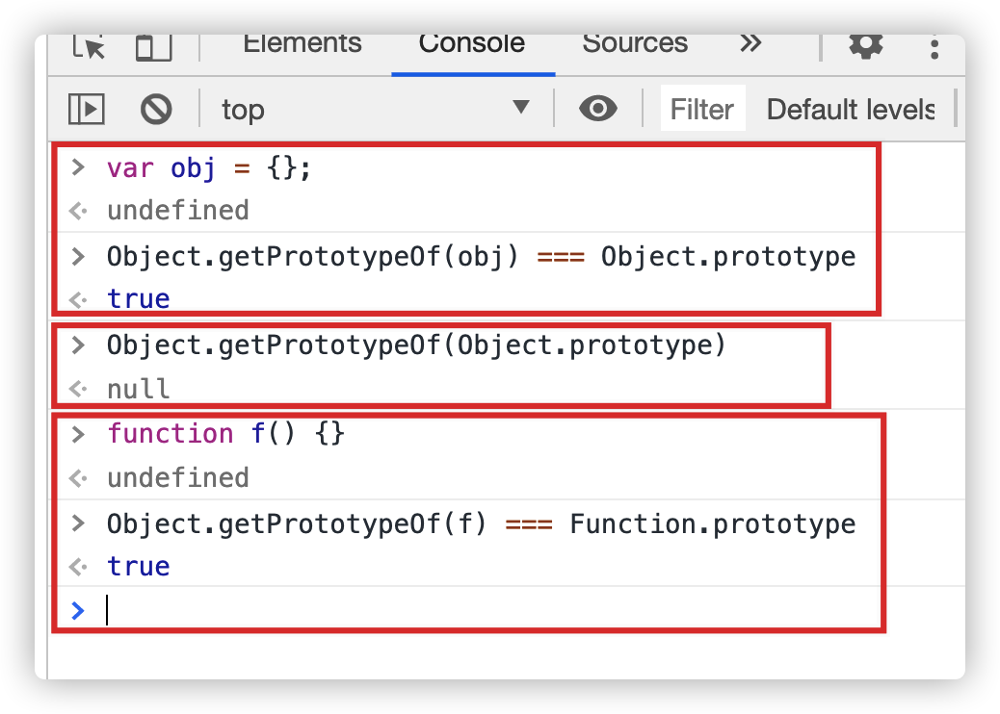

## Object.setPrototypeOf()

`Object.setPrototypeOf()`方法为参数对象设置原型，返回该参数对象。它接受两个参数，第一个是现有对象，第二个是原型对象。

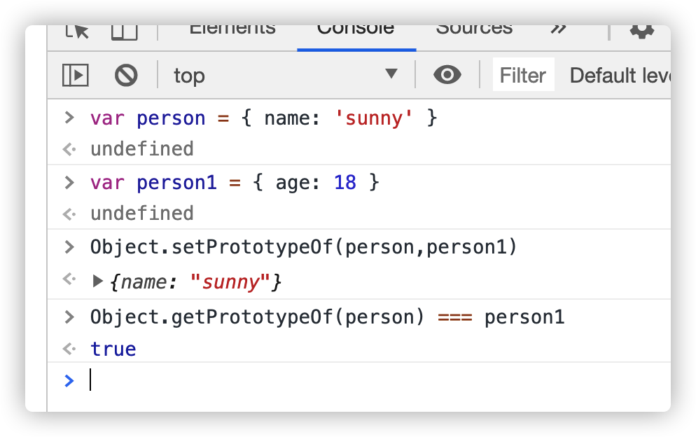

## Object.create()

生成实例对象的常用方法是，使用 new 命令让构造函数返回一个实例。但是很多时候，只能拿到一个实例对象，它可能根本不是由构建函数生成的，那么能不能从一个实例对象，生成另一个实例对象呢？

JavaScript 提供了 Object.create 方法，用来满足这种需求。该方法接受一个对象作为参数，然后以它为原型，返回一个实例对象。该实例完全继承原型对象的属性。

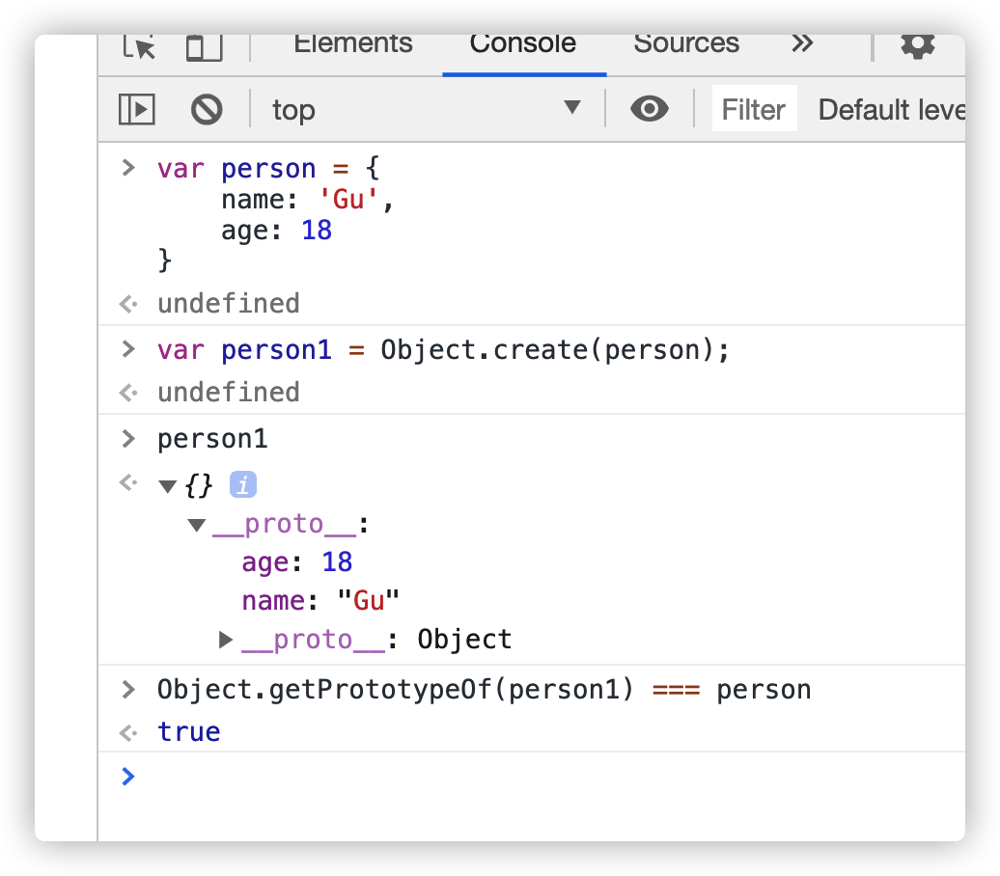

使用 Object.create 方法的时候，必须提供对象原型，即参数不能为空，或者不是对象，否则会报错。

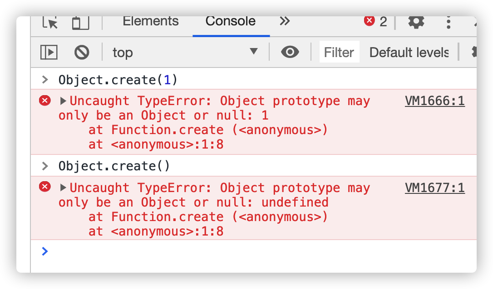

Object.create 方法生成的新对象，动态继承了原型。在原型上添加或修改任何方法，会立刻反映在新对象之上。

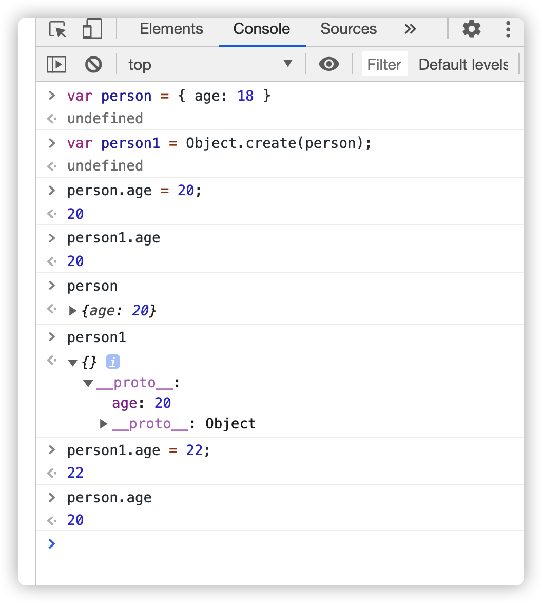

除了对象的原型，Object.create 方法还可以接受第二个参数。该参数是一个属性描述对象，它所描述的对象属性，会添加到实例对象，作为该对象自身的属性。

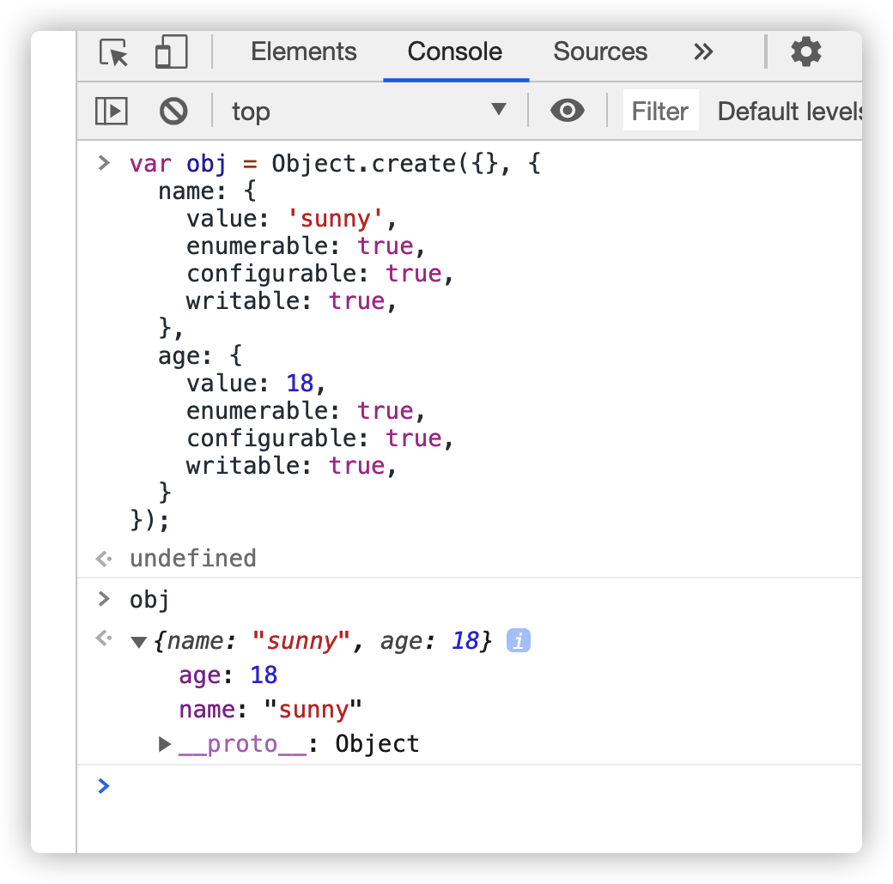

```js
// 上面代码等同如下：
var obj = Object.create({});
obj.name = 'sunny';
obj.age = 18;
```

# Object 对象

JavaScript 原生提供 Object 对象，JavaScript 的所有其他对象都继承自 Object 对象，即那些对象都是 Object 的实例。

Object 对象的原生方法分成两类：Object 本身的方法与 Object 的实例方法。

Object 对象本身的方法：所谓**本身的方法**就是直接定义在 Object 对象的方法。

```js
Object.print = function (data) {
  console.log(data);
};
```

Object 的实例方法：所谓**实例方法**就是定义在 Object 原型对象 Object.prototype 上的方法。它可以被 Object 实例直接使用。

```js
Object.prototype.print = function () {
  console.log(this);
};

var obj = new Object();
obj.print();
```

Object 本身是一个函数，可以当作工具方法使用，将任意值转为对象。这个方法常用于保证某个值一定是对象。

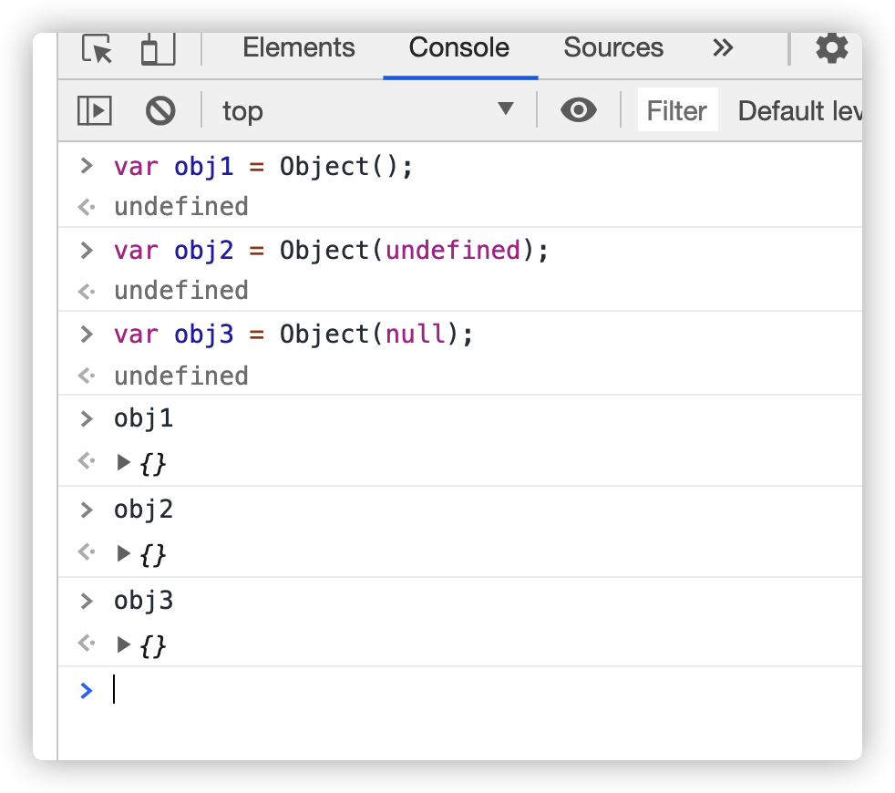

如果参数是原始类型的值，Object 方法将其转为对应的包装对象的实例

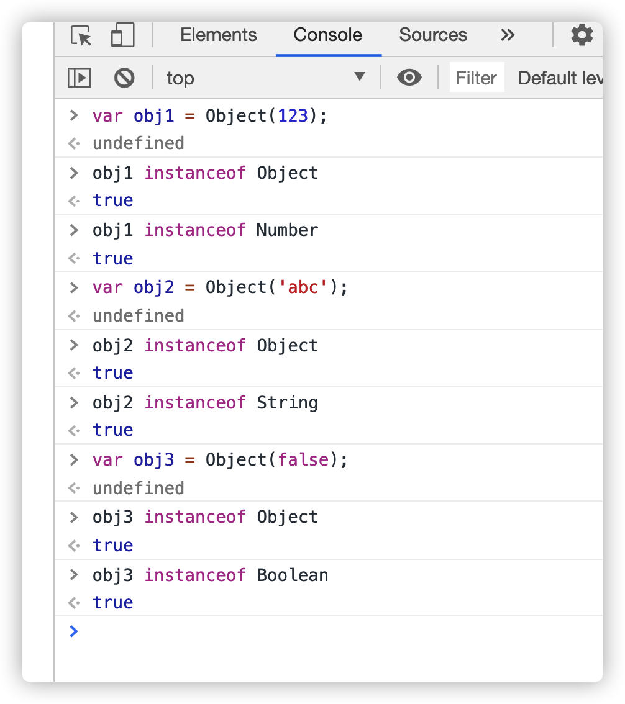

如果 Object 方法的参数是一个对象，它总是返回该对象，即不用转换。

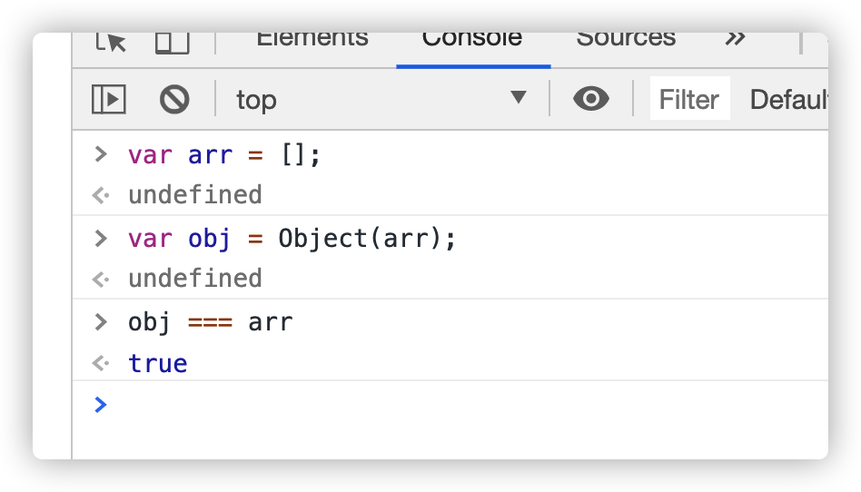

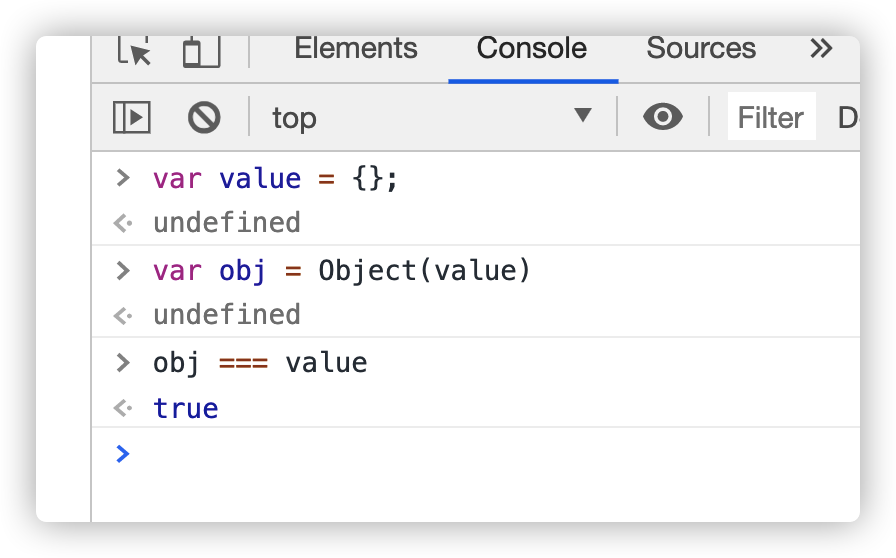

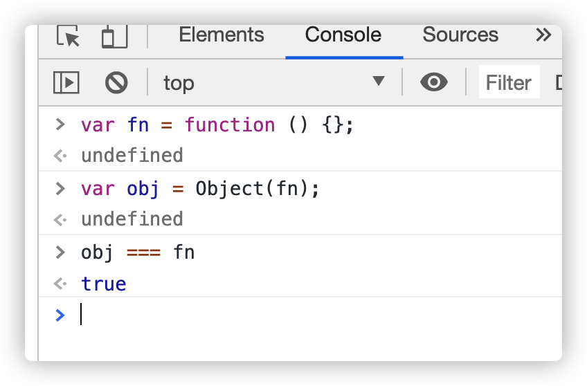

# Object 构造函数

Object 不仅可以当作工具函数使用，还可以当作构造函数使用，即前面可以使用 new 命令。

Object 构造函数使用时，可以接受一个参数，如果该参数是一个对象，则直接返回这个对象；如果是一个原始类型的值，则返回该值对应的包装对象

虽然用法相似，但是 `Object(value)` 与 `new Object(value)`两者的语义是不同的，`Object(value)`表示将 value 转成一个对象，`new Object(value)`则表示新生成一个对象，它的值是 value。

# Object 的静态方法

`Object.keys()`与`Object.getOwnPropertyNames()`都用来遍历对象的属性。

Object.keys 方法的参数是一个对象，返回一个数组。该数组的成员都是该对象自身的（而不是继承的）所有属性名。

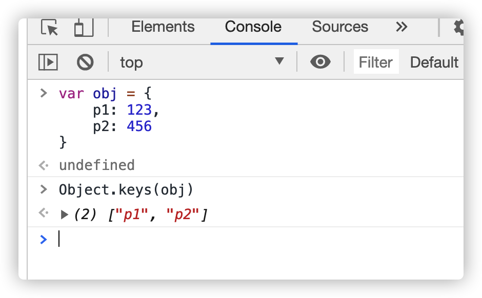

Object.getOwnPropertyNames 方法与 Object.keys 类似，也是接受一个对象作为参数，返回一个数组，包含了该对象自身的所有属性名。

对于一般的对象来说，`Object.keys()`和`Object.getOwnPropertyNames()`返回的结果是一样的。只有涉及不可枚举属性时，才会有不一样的结果。Object.keys 方法只返回可枚举的属性，Object.getOwnPropertyNames 方法还返回不可枚举的属性名。

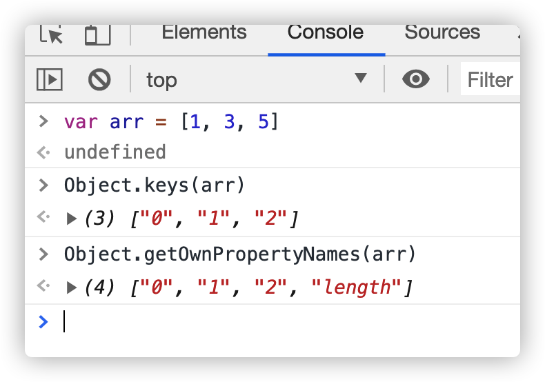

上面代码中，数组的 length 属性是不可枚举的属性，所以只出现在 Object.getOwnPropertyNames 方法的返回结果中。

由于 JavaScript 没有提供计算对象属性个数的方法，所以可以用这两个方法代替。

# Object 的实例方法

除了静态方法，还有不少方法定义在 Object.prototype 对象。它们称为实例方法，所有 Object 的实例对象都继承了这些方法。

Object 实例对象的方法，主要有以下六个。

- `Object.prototype.valueOf()`：返回一个对象的**值**，默认情况下返回对象本身。

  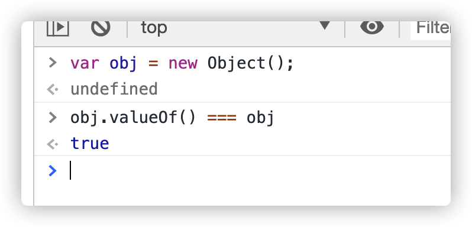

- `Object.prototype.toString()`：返回当前对象对应的字符串形式。
- `Object.prototype.toLocaleString()`：返回一个对象的字符串形式，默认情况下返回类型字符串。
- `Object.prototype.hasOwnProperty()`：判断某个属性是否为当前对象自身的属性，还是继承自原型对象的属性。
- `Object.prototype.isPrototypeOf()`：判断当前对象是否为另一个对象的原型。
- `Object.prototype.propertyIsEnumerable()`：判断某个属性是否可枚举。

# Math 对象

Math 是 JavaScript 的原生对象，提供各种数学功能。该对象不是构造函数，不能生成实例，所有的属性和方法都必须在 Math 对象上调用。

Math 对象提供以下一些静态方法：

- `Math.abs()`：绝对值
- `Math.ceil()`：向上取整
- `Math.floor()`：向下取整
- `Math.max()`：最大值
- `Math.min()`：最小值
- `Math.pow()`：幂运算
- `Math.sqrt()`：平方根
- `Math.log()`：自然对数
- `Math.exp()`：e 的指数
- `Math.round()`：四舍五入
- `Math.random()`：随机数

# Date 对象

Date 对象是 JavaScript 原生的时间库。它以国际标准时间（UTC）1970 年 1 月 1 日 00:00:00 作为时间的零点，可以表示的时间范围是前后各 1 亿天（单位为毫秒）。

## 普通函数的用法

Date 对象可以作为普通函数直接调用，返回一个代表当前时间的字符串。

即使带有参数，Date 作为普通函数使用时，返回的还是当前时间。

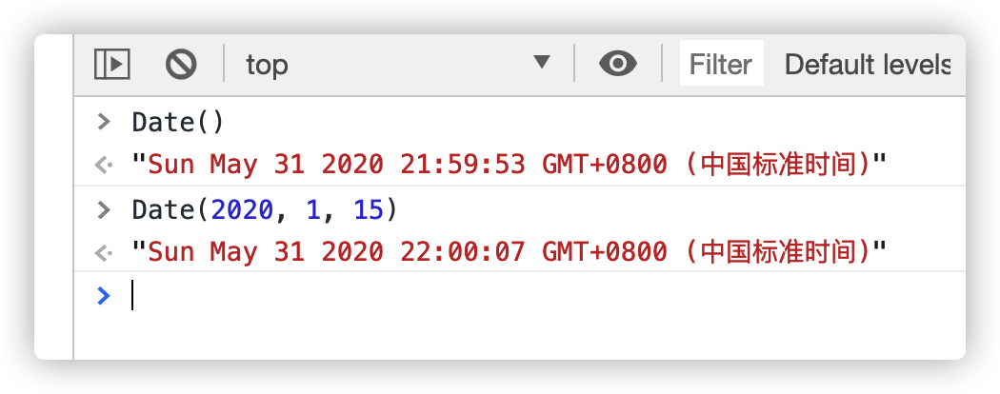

## 构造函数的用法

Date 还可以当作构造函数使用。对它使用 new 命令，会返回一个 Date 对象的实例。如果不加参数，实例代表的就是当前时间。

作为构造函数时，Date 对象可以接受多种格式的参数，返回一个该参数对应的时间实例。

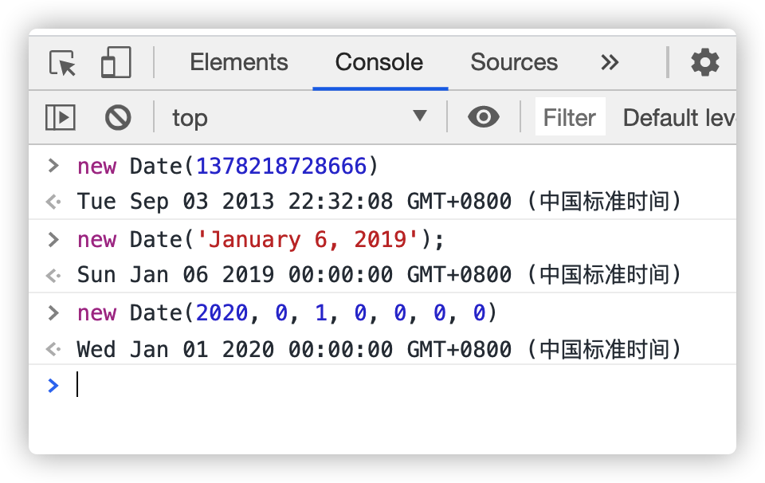

各个参数的取值范围如下：

- 年：使用四位数年份，比如 2000。如果写成两位数或个位数，则加上 1900，即 10 代表 1910 年。如果是负数，表示公元前。
- 月：0 表示一月，依次类推，11 表示 12 月。
- 日：1 到 31。
- 小时：0 到 23。
- 分钟：0 到 59。
- 秒：0 到 59
- 毫秒：0 到 999。

## 静态方法

### Date.now()

Date.now 方法返回当前时间距离时间零点（1970 年 1 月 1 日 00:00:00 UTC）的毫秒数，相当于 Unix 时间戳乘以 1000。

### Date.parse()

Date.parse 方法用来解析日期字符串，返回该时间距离时间零点（1970 年 1 月 1 日 00:00:00）的毫秒数。

如果解析失败，返回 NaN。

## 实例方法

Date 的实例对象，有几十个自己的方法，除了 valueOf 和 toString，可以分为以下三类。

- to 类：从 Date 对象返回一个字符串，表示指定的时间。
- get 类：获取 Date 对象的日期和时间。
- set 类：设置 Date 对象的日期和时间。

### get 类方法

Date 对象提供了一系列 get\*方法，用来获取实例对象某个方面的值。

- `getTime()`：返回实例距离 1970 年 1 月 1 日 00:00:00 的毫秒数，等同于 valueOf 方法。
- `getDate()`：返回实例对象对应每个月的几号（从 1 开始）。
- `getDay()`：返回星期几，星期日为 0，星期一为 1，以此类推。
- `getFullYear()`：返回四位的年份。
- `getMonth()`：返回月份（0 表示 1 月，11 表示 12 月）。
- `getHours()`：返回小时（0-23）。
- `getMilliseconds()`：返回毫秒（0-999）。
- `getMinutes()`：返回分钟（0-59）。
- `getSeconds()`：返回秒（0-59）。
- `getTimezoneOffset()`：返回当前时间与 UTC 的时区差异，以分钟表示，返回结果考虑到了夏令时因素。

所有这些 get\*方法返回的都是整数，不同方法返回值的范围不一样。

- 分钟和秒：0 到 59
- 小时：0 到 23
- 星期：0（星期天）到 6（星期六）
- 日期：1 到 31
- 月份：0（一月）到 11（十二月）
