# 构造函数

`Array`是 JavaScript 的原生对象，同时也是一个构造函数，可以用它生成新的数组。

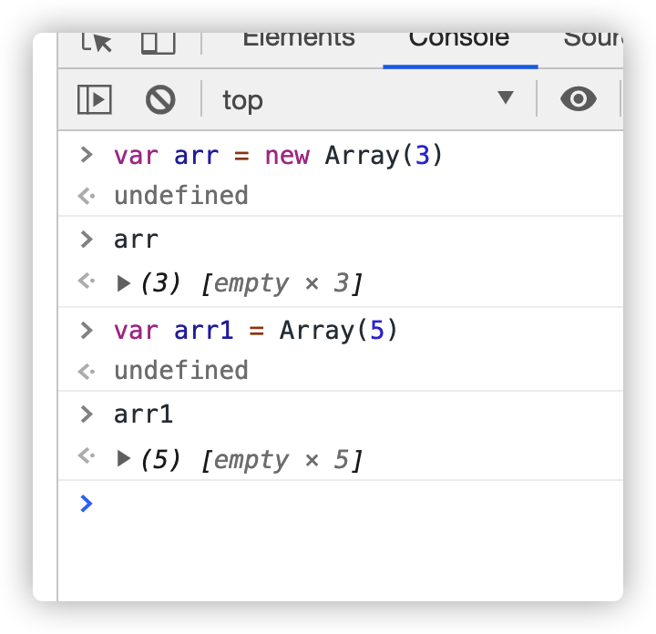

建议直接使用数组字面量生成数组

# 静态方法

## Array.isArray()

Array.isArray 方法返回一个布尔值，表示参数是否为数组。它可以弥补 typeof 运算符的不足。

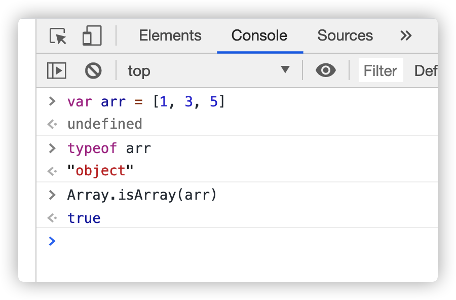

## 实例方法

### valueOf()，toString()

valueOf 方法是一个所有对象都拥有的方法，表示对该对象求值。不同对象的 valueOf 方法不尽一致，数组的 valueOf 方法返回数组本身。

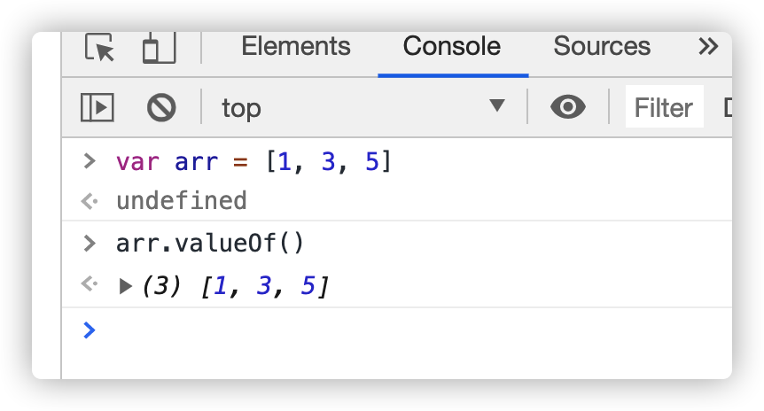

toString 方法也是对象的通用方法，数组的 toString 方法返回数组的字符串形式。

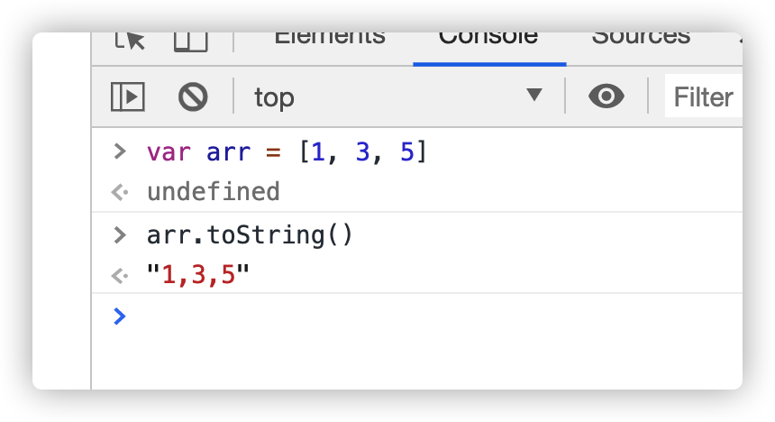

### 改变原数组的方法

#### push()，pop()

push 方法用于在数组的末端添加一个或多个元素，并返回添加新元素后的数组长度。

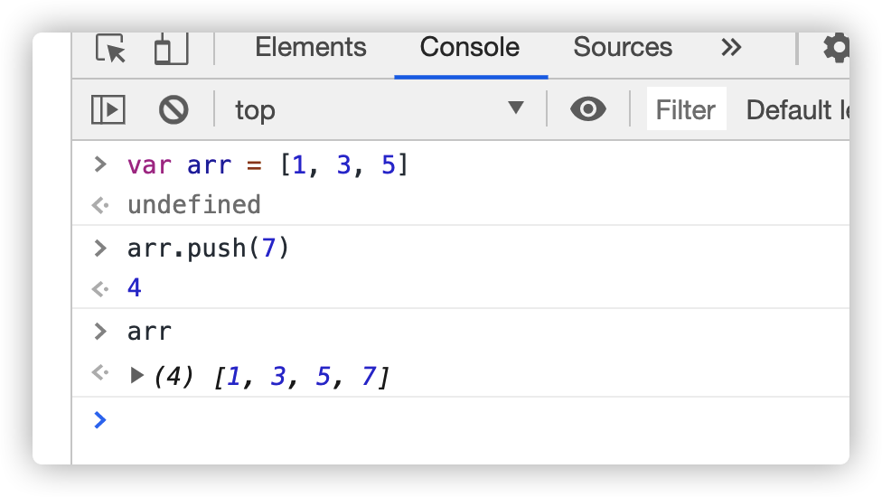

pop 方法用于删除数组的最后一个元素，并返回该元素。


#### shift()，unshift()

shift()方法用于删除数组的第一个元素，并返回该元素。

shift()方法可以遍历并清空一个数组。

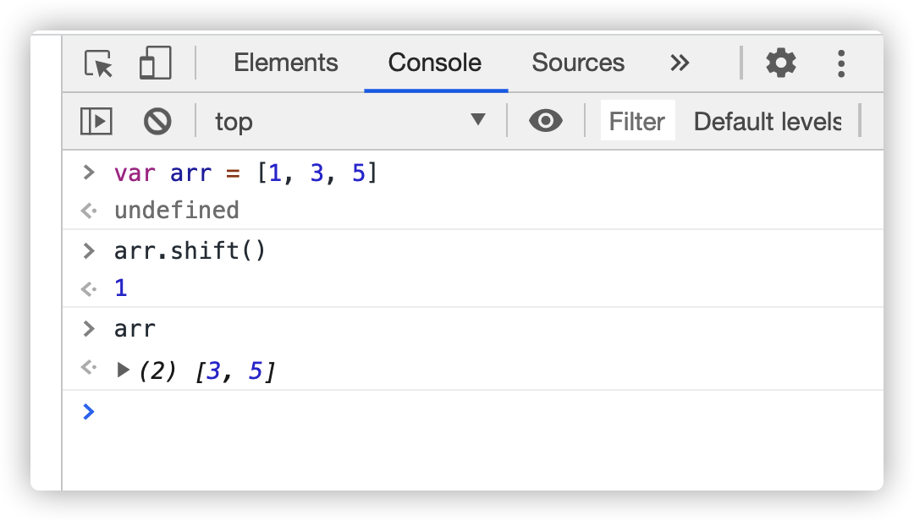

unshift()方法用于在数组的第一个位置添加元素，并返回添加新元素后的数组长度。

unshift()方法可以接受多个参数，这些参数都会添加到目标数组头部。

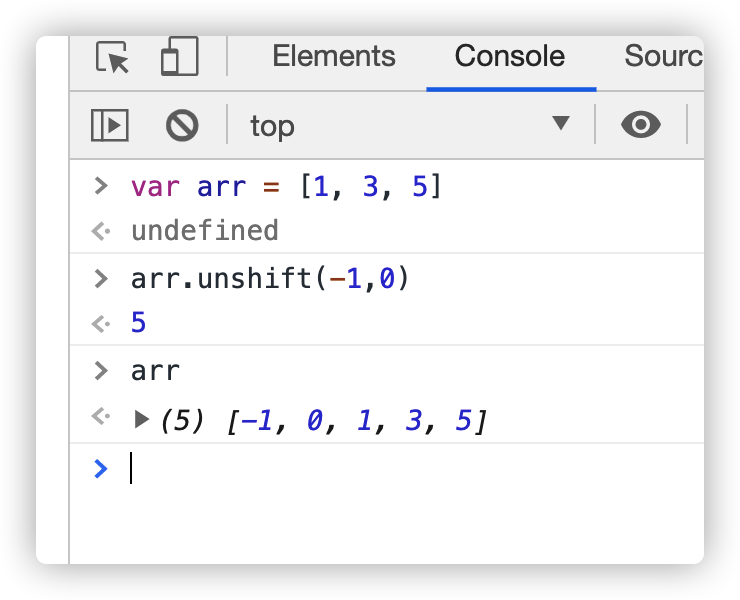

#### reverse()

reverse 方法用于颠倒排列数组元素，返回改变后的数组。

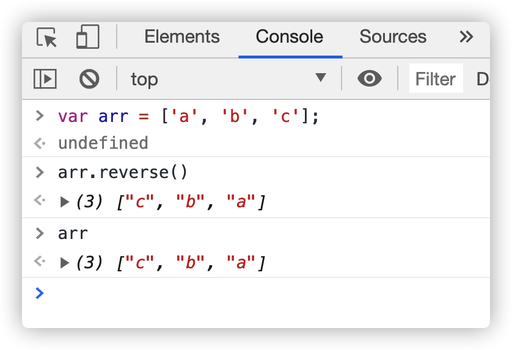

#### splice()

splice()方法用于删除原数组的一部分成员，并可以在删除的位置添加新的数组成员，返回值是被删除的元素。

splice 的第一个参数是删除的起始位置（从 0 开始），第二个参数是被删除的元素个数。

splice(从第几位开始，截取多少长度，传参在切口处添加新的数据)

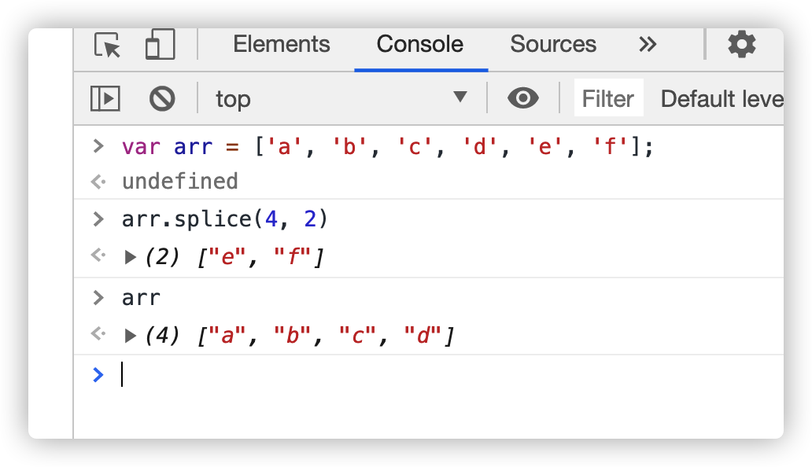

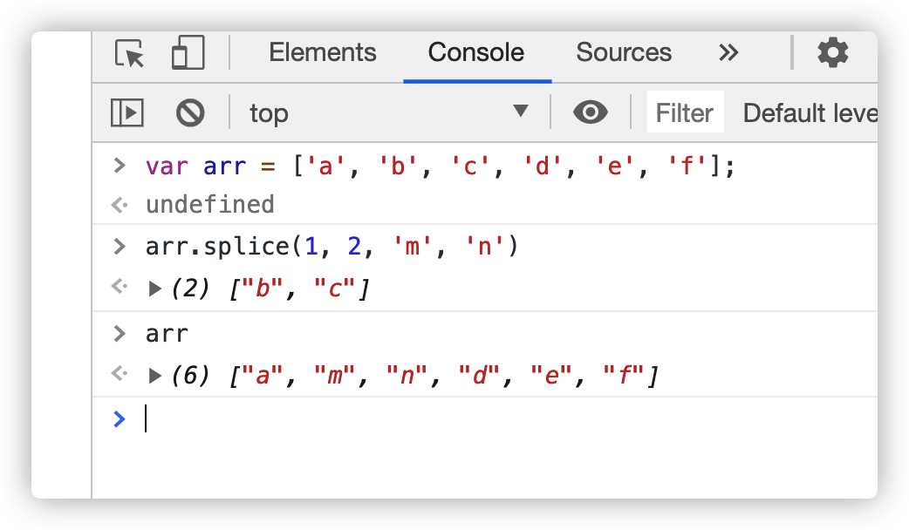

如果只提供第一个参数，等同于将原数组在指定位置拆分成两个数组。

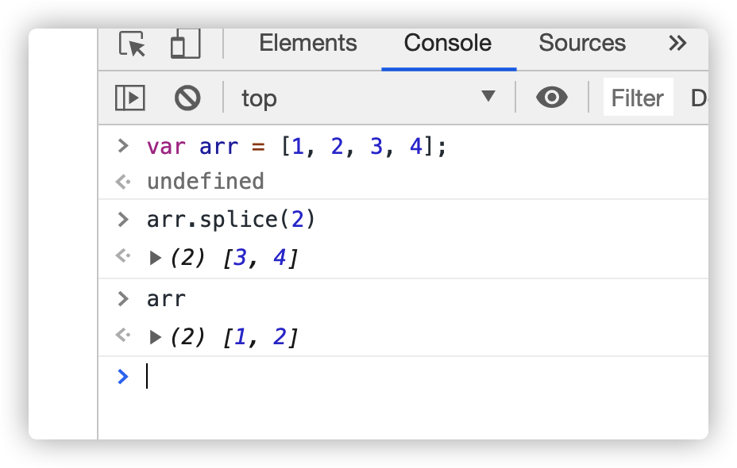

#### sort()

sort 方法对数组成员进行排序，默认是按照字典顺序排序。

- 必须写两形参
- 看返回值 return
  1.  当返回值为负数时，那么前面的数放在前面，
  2.  当返回值为正数时，那么后面的数在前，
  3.  为 0，不动

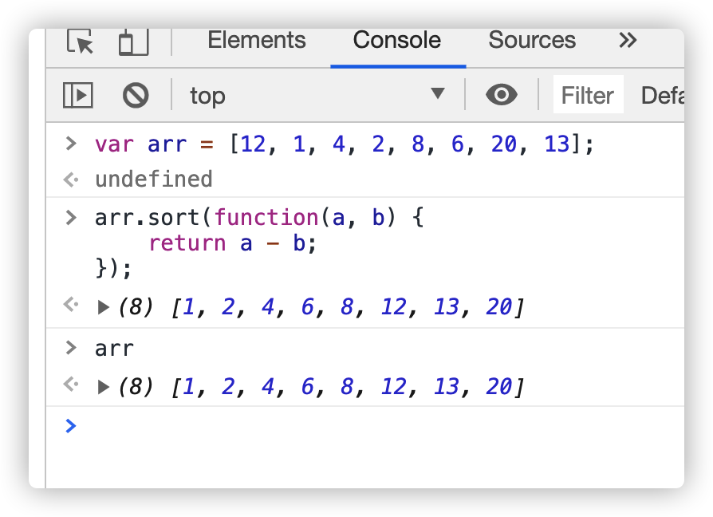

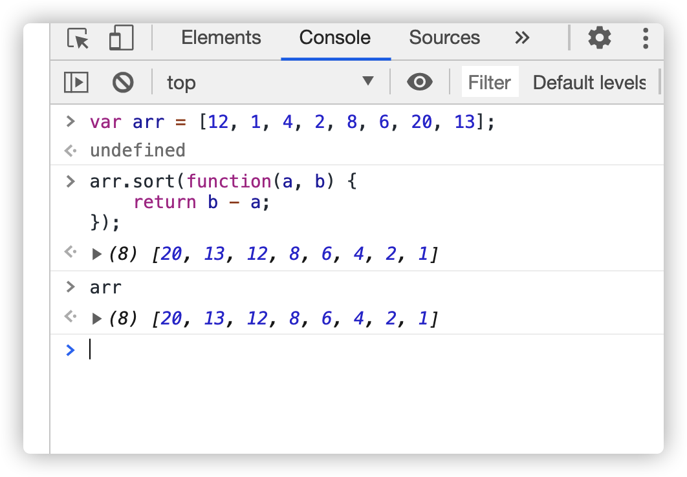

### 不改变原数组的方法

#### join()

join()方法以指定参数作为分隔符，将所有数组成员连接为一个字符串返回。如果不提供参数，默认用逗号分隔。

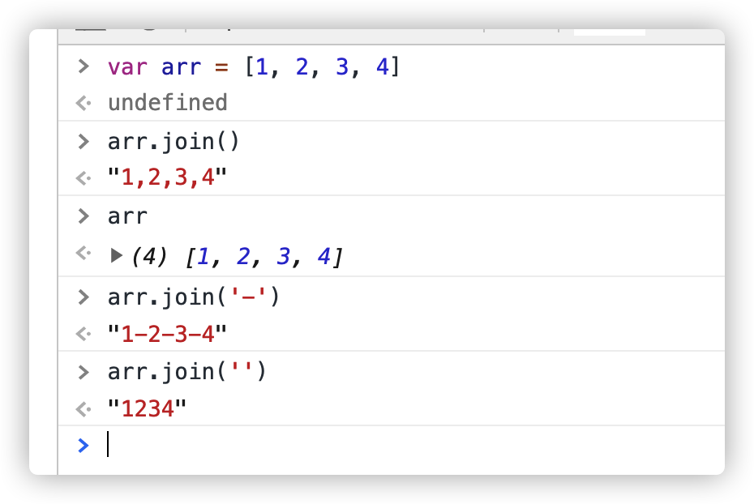

如果数组成员是 undefined 或 null 或空位，会被转成空字符串。

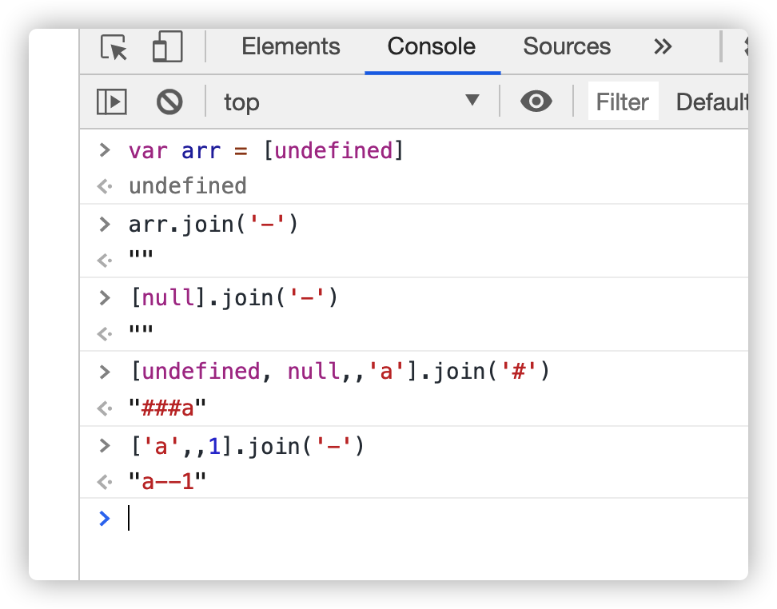

#### concat()

concat 方法用于多个数组的合并。它将新数组的成员，添加到原数组成员的后部，然后返回一个新数组。

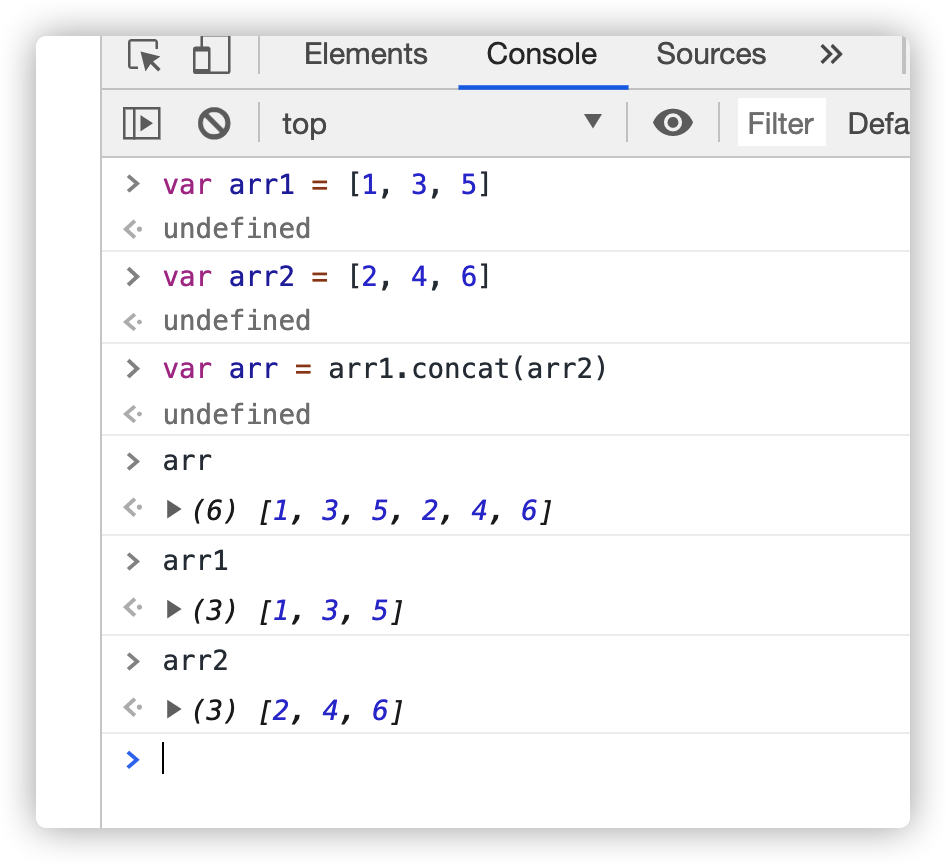
如果数组成员包括对象，concat 方法返回当前数组的一个浅拷贝。所谓“浅拷贝”，指的是新数组拷贝的是对象的引用。

#### slice()

slice()方法用于提取目标数组的一部分，返回一个新数组，原数组不变。

它的第一个参数为起始位置（从 0 开始，会包括在返回的新数组之中），第二个参数为终止位置（但该位置的元素本身不包括在内）。如果省略第二个参数，则一直返回到原数组的最后一个成员。


上面代码中，最后一个例子 slice()没有参数，实际上等于返回一个原数组的拷贝。

如果 slice()方法的参数是负数，则表示倒数计算的位置。

如果第一个参数大于等于数组长度，或者第二个参数小于第一个参数，则返回空数组。


slice()方法的一个重要应用，是将类似数组的对象转为真正的数组。

# 类数组

1. 可以利用属性名模拟数组的特性
2. 可以动态的增长 length 属性
3. 如果强行让类数组调用 push 方法，则会根据 length 属性值的位置进行属性的扩充。

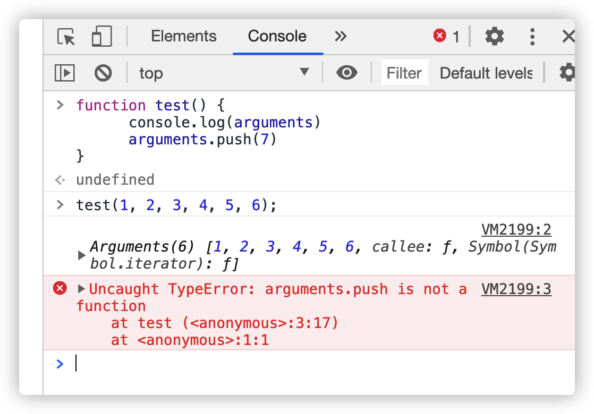

这个看着像数组，但是数组有的方法，他全部都没有，所以他是类数组，类数组长得像数组，但是没有数组所拥有的的方法。

类数组:属性要为索引（数字）属性，**必须要有 length 属性**，最好加上 push 方法。

如果给一个对象加上 splice 方法，那么这个对象就长得像数组了。但他仍然是对象，但是可以当做数组来用，需要自己添方法。

```js
var obj = {
  '2': 'a',
  '3': 'c',
  '4': 'd',
  length: 3,
  push: Array.prototype.push
};
obj.push('b');

// 属性要为索引（数字）属性，必须有length属性，最好加上push
// Array.prototype.push = function(target) {
//     this[this.length] = target;
//     this.length++;
// }
```

关键点在 length 上面，根据 length 改变而改变，走一下 length，即:

```js
Array.prototype.push = function (target) {
  this[obj.length] = target;
  this.length++;
};
```

# 数组遍历

利用传统循环来遍历数组

```js
var arr = [1, 3, 5, 7, 9];
for (var i = 0; i < arr.length; i++) {
  console.log(arr[i]);
}
```

利用 for...in 循环来遍历数组

```js
var arr = [1, 3, 5, 7, 9];
for (var key in arr) {
  // console.log(key); // 遍历的是索引号
  console.log(arr[key]);
}
```

对象中的属性是无序的,for...in 循环是专门用于遍历对象的,对象的属性是无序的,for...in 循环就是专门用于遍历无序的东西的, 所以不推荐使用 for...in 循环来遍历数组

# 数组的查找

## indexOf()

查找元素在数组中的位置，indexOf(参数 1,参数 2)，参数 1: 需要查找的元素，参数 2: 从什么位置开始查找。indexOf 方法默认是从左至右的查找, 一旦找到就会立即停止查找

indexOf 方法如果找到了指定的元素, 就会返回元素对应的位置

indexOf 方法如果没有找到指定的元素, 就会返回-1


## lastIndexOf

lastIndexOf 方法默认是从右至左的查找, 一旦找到就会立即停止查找。lastIndexOf(参数 1,参数 2)，参数 1: 需要查找的元素，参数 2: 从什么位置开始查找。

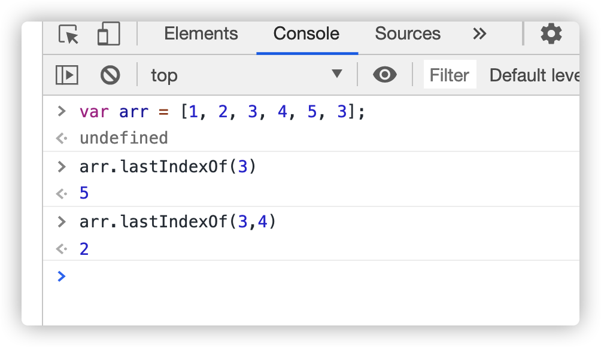

# 字符串常用方法

在 js 中字符串可以看做一个特殊的数组, 所以大部分数组的属性/方法字符串都可以使用

length 属性获取字符串长度

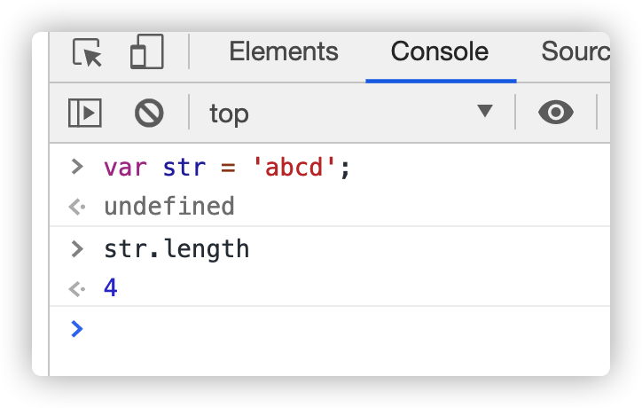

获取某个字符 [索引] / charAt

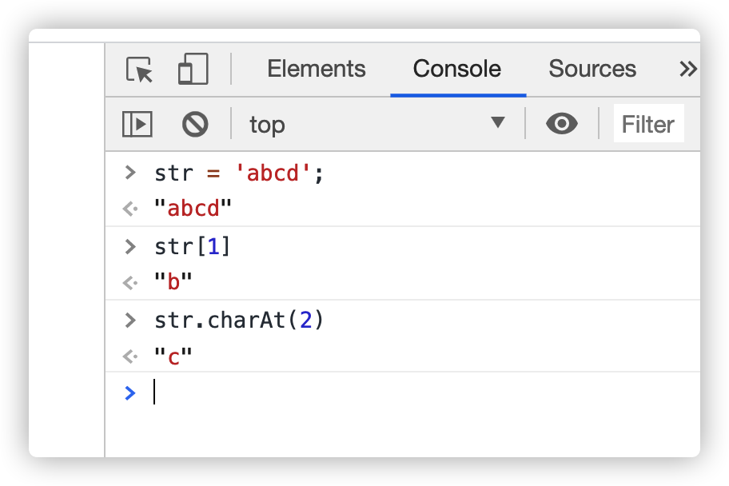

字符串查找 indexOf / lastIndexOf

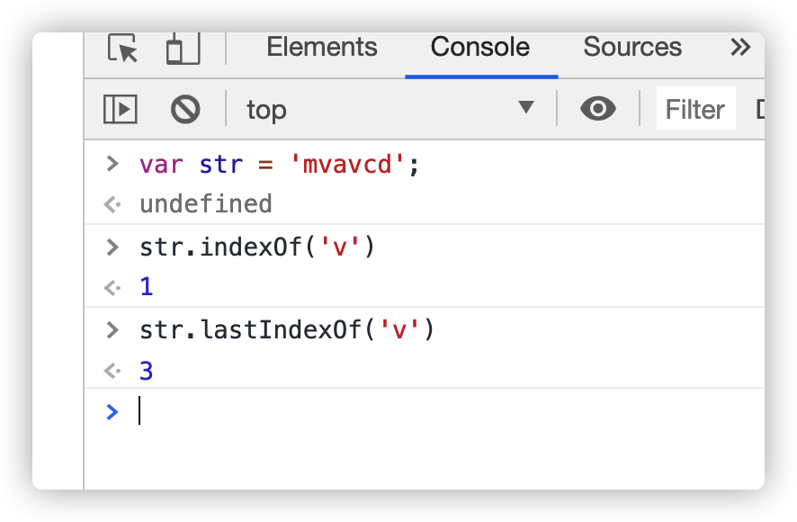

拼接字符串 concat / +
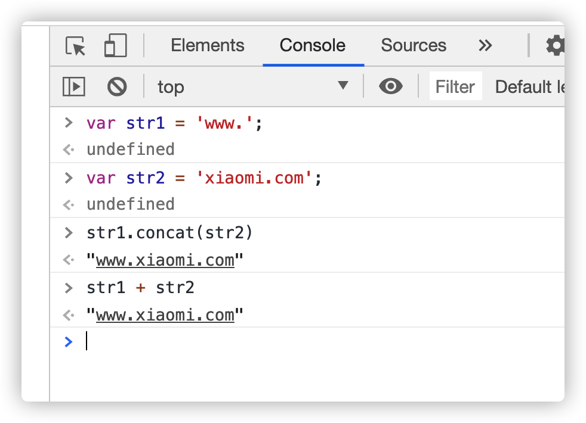

截取子串 slice / substring / substr

slice、substring 第二个参数为截取的结束位置（不包含）

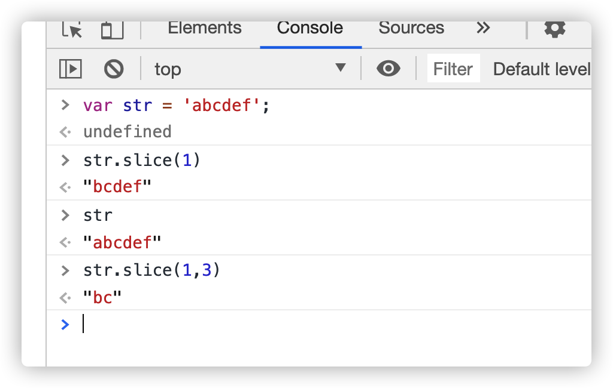

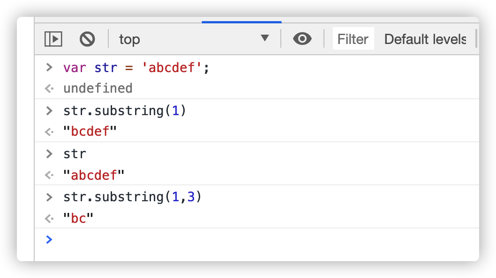

substr 第二个参数指定获取字符数量

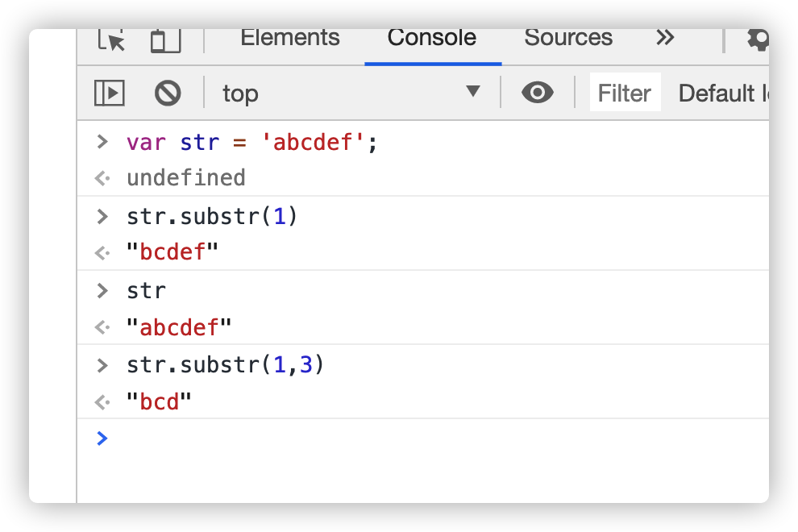

split() 方法使用指定的分隔符字符串将一个 String 对象分割成子字符串数组，以一个指定的分割字串来决定每个拆分的位置。

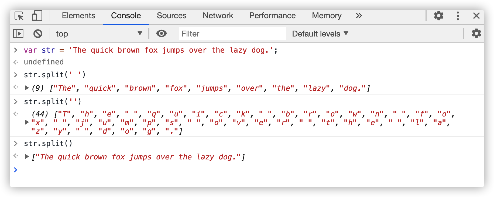
