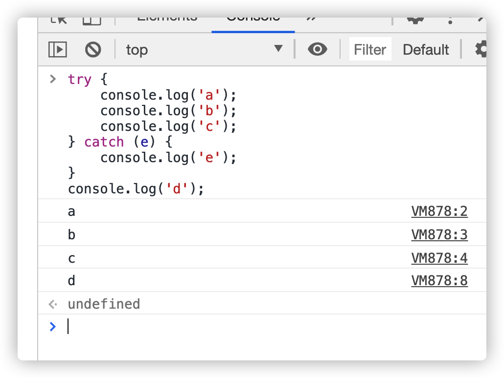
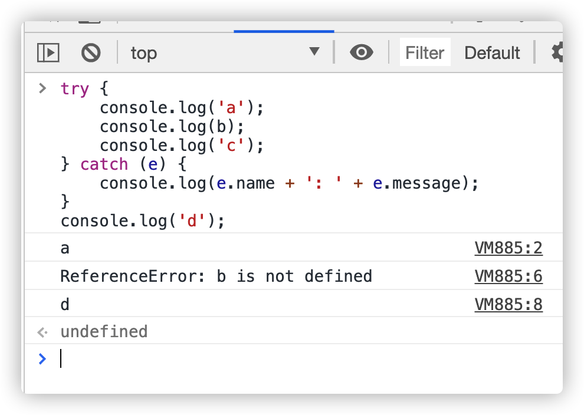
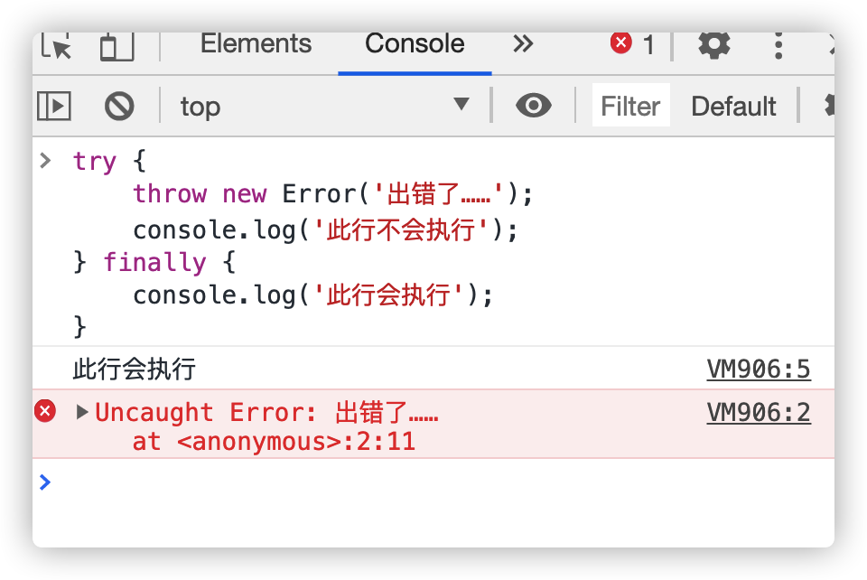
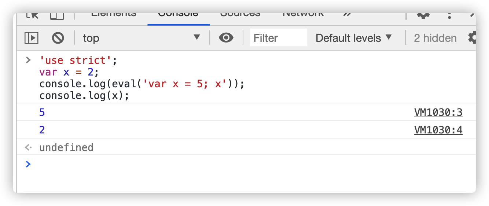

# Error 实例对象

JavaScript 解析或运行时，一旦发生错误，引擎就会抛出一个错误对象。JavaScript 原生提供 Error 构造函数，所有抛出的错误都是这个构造函数的实例。


我们调用 Error 构造函数，生成一个实例对象 err。Error 构造函数接受一个参数，表示错误提示，可以从实例的 message 属性读到这个参数。抛出 Error 实例对象以后，整个程序就中断在发生错误的地方，不再往下执行。

JavaScript 语言标准只提到，Error 实例对象必须有 message 属性，表示出错时的提示信息，没有提到其他属性。

大多数 JavaScript 引擎，对 Error 实例还提供 name 和 stack 属性，分别表示错误的名称和错误的堆栈，但它们是非标准的，不是每种实现都有。

- message：错误提示信息
- name：错误名称（非标准属性）
- stack：错误的堆栈（非标准属性）

使用 name 和 message 这两个属性，可以对发生什么错误有一个大概的了解

# 原生错误类型

Error 实例对象是最一般的错误类型，在它的基础上，JavaScript 还定义了其他 6 种错误对象。也就是说，存在 Error 的 6 个派生对象。SyntaxError 对象、ReferenceError 对象、RangeError 对象、TypeError 对象、URIError 对象、EvalError 对象

SyntaxError 对象是解析代码时发生的语法错误。比如：变量名错误，缺少括号...


ReferenceError 对象是引用一个不存在的变量时发生的错误。比如：使用一个不存在的变量，对函数的运行结果赋值...


RangeError 对象是一个值超出有效范围时发生的错误。主要有几种情况，一是数组长度为负数，二是 Number 对象的方法参数超出范围，以及函数堆栈超过最大值。


TypeError 对象是变量或参数不是预期类型时发生的错误。比如，对字符串、布尔值、数值等原始类型的值使用 new 命令，就会抛出这种错误，因为 new 命令的参数应该是一个构造函数。

调用对象不存在的方法，也会抛出 TypeError 错误


URI 处理函数使用不当（引用地址错误），就会抛出 URIError 错误

eval 函数没有被正确执行时，会抛出 EvalError 错误。该错误类型已经不再使用了，只是为了保证与以前代码兼容，才继续保留。

# 自定义错误

```js
function UserError(message) {
  this.message = message || '默认信息';
  this.name = 'UserError';
}

UserError.prototype = new Error();
UserError.prototype.constructor = UserError;
```

# throw 语句

throw 语句的作用是手动中断程序执行，抛出一个错误。throw 也可以抛出自定义错误。


实际上，throw 可以抛出任何类型的值。也就是说，它的参数可以是任何值。


对于 JavaScript 引擎来说，遇到 throw 语句，程序就中止了。引擎会接收到 throw 抛出的信息，可能是一个错误实例，也可能是其他类型的值

# try...catch 结构

一旦发生错误，程序就中止执行了。JavaScript 提供了 try...catch 结构，允许对错误进行处理，选择是否往下执行。


报错后，不执行后续的代码，但是依然可以执行外面的 d

在 try 里面的发生错误，不会执行错误后的 try 里面的代码





如果 try 里面的代码不出错，在 catch 里面的代码就不执行

如果 try 里面的代码出错，catch 负责补抓到错误信息封装到里面(error.massage error.name),错误对象只有 message 和 name

`try...catch`结构允许在最后添加一个 finally 代码块，表示不管是否出现错误，都必需在最后运行的语句。



上面代码中，由于没有 catch 语句块，一旦发生错误，代码就会中断执行。中断执行之前，会先执行 finally 代码块，然后再向用户提示报错信息。

# 严格模式

浏览器是基于 es3.0 和 es5.0 的新增方法使用的。如果两种发生了冲突，就用 es3.0。

es5.0 严格模式是指 es3.0 和 es5.0 产生冲突发部分就是用 es5.0，否则就用 es3.0。

es5.0 严格模式的启动 ‘use strict’；

用法在 写“use strict”，可以写在全局的最顶端，也可以写在某函 数(局部)的最顶端，推荐使用局部的。

在 es5.0 不能用 argument.callee，但是 es3.0 可以用


`function test( ){ }`里面加`“use strict”;`是局部启动严格模式


“use strict” ;不再兼容 es3 的一些不规则语法。使用全新的 es5 规范。两种用法:

- 全局严格模式
- 局部函数内严格模式(推荐)

就是一行字符串，不会对不兼容严格模式的浏览器产生影响。

不支持 with，arguments.callee，function.caller，变量赋值前必须声明，局部 this 必须被赋值(Person.call(null/undefined) 赋值什么就是什么),拒绝重复属性和参数(this 不在指向 window)


es5.0 严格模式不让使用 with。

# with 语句

with 可以改变作用域链

with()括号里面的代码会按照正常顺序执行，但是如果在括号里面添加了对象，就会把对象当做 with 要执行的代码体的作用域链的最顶端(最直接的最近的 AO)。

```js
var obj = {
  name: '0bj',
  age: 234
};
var name = 'window';

function show() {
  var age = 123;
  var name = 'scope';
  with (obj) {
    console.log(name);
    console.log(age);
  }
}
show();
```


with 还可以简化代码


with 过于强大，可以改作用域链，失去效率，所以 es5.0 不能用

# eval 作用域

正常模式下，JavaScript 语言有两种变量作用域（scope）：全局作用域和函数作用域。严格模式创设了第三种作用域：eval 作用域。

正常模式下，eval 语句的作用域，取决于它处于全局作用域，还是函数作用域。严格模式下，eval 语句本身就是一个作用域，不再能够在其所运行的作用域创设新的变量了，也就是说，eval 所生成的变量只能用于 eval 内部。



上面代码中，由于 eval 语句内部是一个独立作用域，所以内部的变量 x 不会泄露到外部。

如果希望 eval 语句也使用严格模式，有两种方式。


eval 很强大，能把字符串当成代码来执行。但是约定俗成在 es3.0 中都不能使用 eval。eval 是魔鬼，因为会改变作用域
