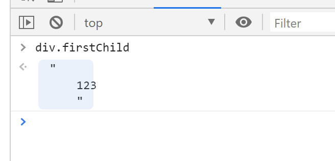
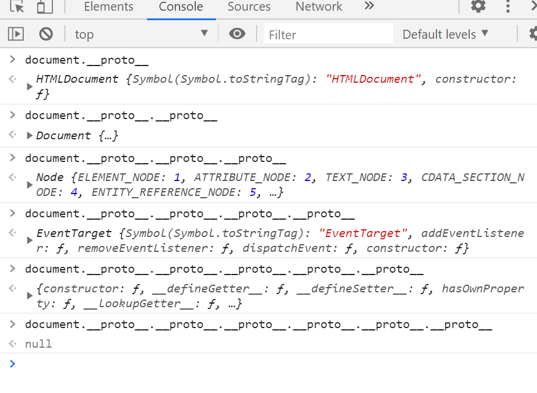

# DOM

DOM — > Document Object Model(文档对象模型)

DOM 定义了表示和修改文档所需的方法（对象、这些对象的行为和属性以及这些 对象之间的关系。）DOM 对象即为宿主对象，由浏览器厂商定义，用来操作 html 和 xml 功能的一类对象的集合。 也有人称 DOM 是对 HTML 以及 XML 的标准编程接口。

xml ==> xhtml ==> html

xml 是最早的版本，xml 里面的标签是可以自定义的，被 js 里面的 Json 取代了。DOM 不能改变 css 样式表,可以间接改变行间样式的 css

**window**：是一个全局对象, 代表浏览器中一个打开的窗口, 每个窗口都是一个 window 对象

**document** 是 window 的一个属性, 这个属性是一个对象

document: 代表当前窗口中的整个网页

document 对象保存了网页上所有的内容, 通过 document 对象就可以操作网页上的内容

学习 DOM 就是学习如何通过 document 对象操作网页上的内容

# DOM 基本操作(大部分都是类数组)——方法类操作

## 查

查看元素节点：

- document：代表整个文档
- `document.getElementById()`通过 id 获取指定元素
  - 由于 id 不可以重复, 所以找到了就会将找到的标签包装成一个对象返回给我们, 找不到就返回 Null
  - 元素 id 在 IE8 以下浏览器，不区分 id 大小写，而且也返回匹配 name 属性的元素
- `document.getElementsByTagName()`通过标签名称获取
  - 由于标签名称可以重复, 所以找到了就返回一个存储了标签对象的数组, 找不到就返回一个空数组
- `document.getElementByName()`通过 name 名称获取
  - 由于 name 可以重复, 所以找到了就返回一个存储了标签对象的数组, 找不到就返回一个空数组
  - 在不同的浏览器其中工作方式不同。在 IE 和 Opera 中， `document.getElementsByName()`方法还会返回那些 id 为指定值的元素。
- `document.getElementsByClassName()`通过 class 名称获取
  - 由于 class 可以重复, 所以找到了就返回一个存储了标签对象的数组, 找不到就返回一个空数组
  - IE8 和 IE8 以下的 IE 版本中没有
- `document.querySelector()`通过选择器获取
  - 只会返回根据指定选择器找到的第一个元素，不是实时的
  - 在 IE7 和 IE7 以下的版本中没有
- `document.querySelectorAll()`通过选择器获取
  - 会返回指定选择器找到的所有元素，不是实时的
  - 在 IE7 和 IE7 以下的版本中没有

`document.querySelector()`与`document.querySelectorAll()`不是实时的情况：

```html
<div></div>
<div class="demo"></div>
<div></div>
<script>
  var divGet = document.getElementsByTagName("div");
  var divQuery = document.querySelectorAll("div");
  var demo = document.getElementsByClassName("demo")[0];
  demo.remove();
</script>
```


```html
<div></div>
<div class="demo"></div>
<div></div>
<script>
  var divGet = document.getElementsByTagName("div");
  var divQuery = document.querySelectorAll("div");
  var newDiv = document.createElement("div");
  document.body.appendChild(newDiv);
</script>
```


## 增

- `document.createElement()`增加或创建元素节点（标签）
- `document.createTextNode()`创建文本节点
- `document.createComment()`创建注释节点
- `document.createDocumentFragment()`创建文档碎片节点

## 插——剪切操作

- `parentNode.appendChild()`可以理解为数组中的 push
- `parentNode.insertBefore(a,b)`一定是先 insert a，before b

```html
<div>
  <strong></strong>
  <span></span>
</div>
<script>
  var div = document.getElementsByTagName("div")[0];
  var span = document.getElementsByTagName("span")[0];
  var em = document.createElement("em");
  div.insertBefore(em, span);
</script>
```


## 删

```html
<div>
  <strong>我是strong</strong>
  <span>我是span</span>
</div>
<script>
  var div = document.getElementsByTagName("div")[0];
  var span = document.getElementsByTagName("span")[0];
</script>
```

- `parent.removeChild()`就是被剪切出来了
  
- `child.remove()`自尽，完全删除
  

## 替换

- `parent.replaceChild(new,origin)`

```html
<div>
  <strong></strong>
  <span></span>
</div>
<script>
  var div = document.getElementsByTagName("div")[0];
  var span = document.getElementsByTagName("span")[0];
  var em = document.createElement("em");
</script>
```


## cloneNode

`ele.cloneNode()`默认不会克隆子元素, 如果想克隆子元素需要传递一个 true

```html
<div>
  <h1>我是标题</h1>
  <span>我是span</span>
  <p>我是段落</p>
</div>
<script>
  var div = document.getElementsByTagName("div")[0];
  var newDiv1 = div.cloneNode();
  var newDiv2 = div.cloneNode(true);
</script>
```


# DOM 基本操作——非方法类的操作

## 节点（所有元素的超集接口）的四个属性

- nodeName：元素的标签名，以大写形式表示，只读
  ``html
  <div>
    123
    <!-- this is comment -->
    <strong>
      <del></del>
    </strong>
    <em></em>
    <ins></ins>
  </div>
  <script>
    var div = document.getElementsByTagName('div')[0]
  </script>
  ```
  
- nodeValue：Text 文本节点或 Comment 注释节点的文本内容,可读写
  
- nodeType：节点类型，只读（后面的数字是调用 nodeType 返回的数字）
  - 元素节点——1，就是 dom 元素 例如：div、span、p 等
  - 属性节点——2
  - 文本节点——3，包括空格回车等
  - 注释节点——8
  - document——9，一个 Document 节点。
  - 文档类型节点——10，描述文档类型的 DocumentType 节点。
  - documentFragment——11
    
- attributes：Element 节点的属性集合
  - 属性名不能改，属性值可以改，但是我们一般不用这种方法。我们一般用 getAttribute 和 setAttribute 去取
  ```html
  <div id="only" class="demo"></div>
  <script>
    var div = document.getElementsByTagName("div")[0];
  </script>
  ```
  

节点的一个方法`Node.hasChildNodes()`他有没有子节点，返回值是 true 或 false

```html
<div id="only"></div>
<div class="demo">
  
</div>
<script>
  var only = document.getElementById("only");
  var demo = document.getElementsByClassName("demo")[0];
</script>
```


## 遍历节点树

灵活，兼容好——关系类的选择

都为属性，但是会选出来文本或者注释

- parentNode，父节点（最顶端的 parentNode 为#document）
  ```html
  <div>
    <strong></strong>
    <em></em>
    <ins></ins>
  </div>
  <script>
    var strong = document.getElementsByTagName("strong")[0];
  </script>
  ```
  
- childNodes，子节点们
  ```html
  <div>
    123
    <!-- this is comment -->
    <strong>
      <del></del>
    </strong>
    <em></em>
    <ins></ins>
  </div>
  <script>
    var div = document.getElementsByTagName("div")[0];
  </script>
  ```
  
- firstChild，第一个子节点
  ```html
  <div>
    123
    <!-- this is comment -->
    <strong>
      <del></del>
    </strong>
    <em></em>
    <ins></ins>
  </div>
  <script>
    var div = document.getElementsByTagName("div")[0];
  </script>
  ```
  
- lastChild，最后一个子节点
- nextSibling，后一个兄弟节点
- previousSibling，前一个兄弟节点

## 基本元素节点树的遍历（不含文本节点）

都为属性，不兼容都为 IE9 及以下不兼容

- parentElement，返回当前元素的父元素节点（IE 不兼容）
  ```html
  <div>
    123
    <!-- this is commont -->
    <strong>
      <del></del>
    </strong>
    <em></em>
    <ins></ins>
  </div>
  <script>
    var del = document.getElementsByTagName("del")[0];
  </script>
  ```
  
- children，只返回当前元素的子节点
  ```html
  <div>
    123
    <!-- this is comment -->
    <strong>
      <del></del>
    </strong>
    <em></em>
    <ins></ins>
  </div>
  <script>
    var div = document.getElementsByTagName("div")[0];
  </script>
  ```
  
- node.childElementCount === node.children.length，当前元素节点的子元素节点个数（IE 不兼容）
  ```html
  <div>
    123
    <!-- this is comment -->
    <strong>
      <del></del>
    </strong>
    <em></em>
    <ins></ins>
  </div>
  <script>
    var div = document.getElementsByTagName("div")[0];
  </script>
  ```
  
- firstElementChild，返回的是第一个元素节点（IE 不兼容）
- lastElementChild，返回的是最后一个元素节点（IE 不兼容）
- nextElementSibling，返回后一个兄弟元素节点（IE 不兼容）
- previousSibling，前一个兄弟元素节点（IE 不兼容）

# DOM 结构树


document 继承自 HTMLDocument.prototype

HTMLDocument.prototype 继承自 Document.prototype

DOM 结构树中，Node 也是构造函数，comment 是注释

Node 原型为 EventTarget 原型为 Object 原型为 null



- `document.getElementById()`定义在 Document.prototype 上，即 Element 节点上不能使用
- `document.getElementByName()`定义在 HTMLDocument.prototype 上，即非 html 中的 document 不能使用（xml document，Element）
- `document.getElementsByTagName()`定义在 Document.prototype 和 Element.prototype 上
- HTMLDocument.prototype 定义了一些常用的属性，body、head 分别指代 HTML 文档中的<body><head>标签
- Document.prototype 上定义了 document.Element 属性，指代文档的根元素，在 HTML 文档中，他总是指代<html>元素
- `document.getElementsByClassName()`、`document.querySelector()`、`document.querySelectorAll()`在 Document.prototype，Element.prototype 类中均有定义


# Element 节点的一些属性

1. innerHTML 获取的内容包含标签, innerText/textContent 获取的内容不包含标签
2. innerHTML/textContent 获取的内容不会去除两端的空格, innerText 获取的内容会去除两端的空格

```html
<div>
  我是div
  <h1>我是标题</h1>
  <p>我是段落</p>
</div>
<script>
  let oDiv = document.querySelector("div");
  console.log(oDiv.innerHTML);
  console.log(oDiv.innerText);
  console.log(oDiv.textContent);
</script>
```


无论通过 innerHTML/innerText/textContent 设置内容, 新的内容都会覆盖原有的内容

区别:

- 如果通过 innerHTML 设置数据, 数据中包含标签, 会转换成标签之后再添加
- 如果通过 innerText/textContent 设置数据, 数据中包含标签, 不会转换成标签, 会当做一个字符串直接设置

```html
<div class="demo1">
  我是div
  <h1>我是标题</h1>
  <p>我是段落</p>
</div>
<hr />
<div class="demo2">
  我是div
  <h1>我是标题</h1>
  <p>我是段落</p>
</div>
<hr />
<div class="demo3">
  我是div
  <h1>我是标题</h1>
  <p>我是段落</p>
</div>
<script>
  var demo1 = document.getElementsByClassName("demo1")[0];
  var demo2 = document.getElementsByClassName("demo2")[0];
  var demo3 = document.getElementsByClassName("demo3")[0];
  demo1.innerHTML = "<span>我是span</span>";
  demo2.innerText = "<span>我是span</span>";
  demo3.textContent = "<span>我是span</span>";
</script>
```


# Element 节点的一些方法

- `ele.setAttribute()`属性存在就是修改，属性不存在就是新增
  ```html
  
  <script>
    var img = document.getElementsByTagName("img")[0];
  </script>
  ```
  
- `ele.getAttribute()`可以获取属性的取值
- `ele.removeAttribute()`删除元素属性
  

# 脚本化 CSS

dom 不能操作 css，是间接操作 css，这一部分需要记下

## 读写元素 css 属性（间接控制）

`dom.style.prop`常用，只有这个可读可写，其余只能读

1. 可读写行间样式，没有兼容性问题，碰到 float 这样的关键字属性，前面应加 css(行间样式以外没用)
2. 符合属性必须拆解（建议），组合单词变成小驼峰式写法
3. 写入的值必须是字符串格式

CSSStyleDeclaration 是 css 样式表声明（类数组，有索引类的属性），把你能够用的 所有的 css 都展示出来了，里面不填写就有没有值是空串。

可以用 div.style[‘width’]拿出属性，也可以用 div.style.width，效果一样。

在 js 访问属性的时候没有-杠的形式，不能写 background-color，要写小驼峰。

不在 html 文件里面写的值也可以利用 js 调用，如 `div.style.borderRadius='50';`

## 查询计算样式

1. `window.getComputedStyle(ele,null)`原生底层的方法。展示权重最高的
   - 获取伪元素的方法：`window.getComputedStyle(ele,null)`括号里面要填两个东西，第一个 ele 是填的是你要获取谁，第二个先填写 null（null 解决的就是伪元素的问题，用 它可以获取伪元素的样式表）。
2. 计算样式只读，不可以写入
3. 返回的计算样式的值都是绝对值，没有相对单位
4. IE8 及 IE8 以下不兼容

window.getComputedStyle 不管填不填都有值，这里面的值都是默认值，这会**获取的是这个当前元素所展现出的一切 css 属性的显示值**（**显示值是你最终看到的值**）

## 查询样式

1. `ele.currentStyle`展示权重最高的
2. 计算样式只读，不可以写入
3. 返回的计算样式的值不是经过转换的绝对值，是原封不动的
4. IE 独有的属性

## 脚本化样式表

`document.styleSheets`该属性存储了一个 html 文档里面的所有 css 样式表的集合

# 查看滚动条的滚动距离（网页滚动距离）

window.pageXOffset 横向滚动条

window.pageYOffset 纵向滚动条

IE8 及 IE8 以下不兼容（IE9 部分兼容）IE9 以上能用

IE8 及 IE8 以下的使用方法：

1. `document.body.scrollLeft`、`document.body.scrollTop`——求横向距离和纵向距离
2. `document.documentElement.scrollLeft`、`document.documentElement.scrollTop`

上面两个兼容性比较混乱，其中一个有值，另外一个的值一定是 0。这两个最好的用法是取两个值相加，因为不可能存在两个同时有值

# 查看视口的尺寸（网页宽高）

可视区窗口就是编写的 html 文档可以看到的部分，不含菜单栏、地址栏、控制台

1. `window.innerWidth`、`window.innerHeight`可视区域的宽高（加上滚动条宽度/高度），w3c 标准方法，但是 IE8 及 IE8 以下不兼容
2. `document.documentElement.clientWidth`、`document.documentElement.clientHeight`标准模式下，任意浏览器都兼容
3. `document.body.clientWidth`、`document.body.clientHeight`适用于怪异模式下的浏览器

注意**渲染模式**：

1. 默认情况下都是以标准模式来进行渲染的(CSS1Compat),通过`document.compatMode`获取的值为 CSS1Compat
2. 如果网页没有书写文档声明`<!DOCTYPE html>`, 那么就会按照**混杂模式/怪异模式**来进行渲染的(BackCompat),通过`document.compatMode`获取的值为 BackCompat

# 查看元素的几何尺寸

`domEle.getBoundingClientRect();`这是 es5.0 的方法，但是只用了解。兼容性很好

该方法返回一个对象，对象里面有 left,top,right,bottom 等属性。left 和 top 代表 该元素左上角的 X 和 Y 坐标，right 和 bottom 代表元素右下角的 X 和 Y 坐标

height 和 width 属性老版本 IE 并未实现。在老版本的 ie 里面，利用右侧边减左侧面解决

返回的结果并不是**实时的**

# 查看元素的尺寸（获取元素宽高）

`dom.offsetWidth`、`dom.offsetHeight`求得值是包括 padding 的

`dom.offsetWidth`和`domEle.getBoundingClientRect();`出现的值是一样的，求的值都是 padding+content（视觉尺寸），可以被代替。右上是间接的求这个 div 的宽高

- 获取的宽高包含边框 + 内边距 + 元素宽高
- 即可以获取行内设置的宽高也可以获取 CSS 设置的宽高
- 只支持获取, 不支持设置

总结:

1. `getComputedStyle` `currentStyle` `style` 获取的宽高不包括 边框和内边距
2. `offsetWidth` `offsetHeight` 获取的宽高包括 边框和内边距
3. `getComputedStyle` `currentStyle` `offsetXXX` 只支持获取, 不支持设置
4. `style` 可以获取, 也可以设置
5. `getComputedStyle` `currentStyle` `offsetXXX` 即可以获取行内,也可以获取外链和内联样式
6. `style` 只能获取行内样式

# 查看元素的位置

`dom.offsetLeft`、`dom.offsetTop`

对于无定位父级的元素，返回相对文档的坐标。

对于有定位父级的元素，返回相对于最近的有定位的父级的坐标。(无论是 left 还是 margin-left 等都是距离。)

`dom.offsetParent`返回最近的有定位的父级，如无，返回 body, `body.offsetParent`返回 null。这个方法能求有定位的父级

# 让滚动条滚动

window 上有三个方法 `scroll()`、`scrollTo()`两个功能一样，`scrollBy()`累加滚动距离

`scroll(x，y)`、`scrollTo(x，y)`功能是一样的，里面能填两个参数。scroll(x 轴滚动条的距离，y 轴滚动条的距离)，里面的 x 与 y 可以填负数

`scrollBy(x，y)`是累加滚动距离，填负数就往上滚动

三个方法功能类似，用法都是将 x,y 坐标传入。即实现让滚动轮滚动到当前位置。

区别：scrollBy()会在之前的数据基础之上做累加。

# scroll 属性

1. 内容没有超出元素范围时

   scrollWidth: = 元素宽度 + 左内边距 + 右内边距 == clientWidth
   scrollHeight: = 元素高度 + 上内边距 + 下内边距 == clientHeight

   ```css
   * {
     margin: 0;
     padding: 0;
   }

   div {
     width: 100px;
     height: 100px;
     padding: 50px;
     border: 50px solid #000;
     background: red;
     background-clip: content-box;
     color: deepskyblue;
   }
   ```

   

2. 内容超出元素范围时

   scrollWidth: = 元素宽度 + 左内边距 + 右内边距 + 超出的宽度
   scrollHeight: = 元素高度 + 上内边距 + 下内边距 + 超出的高度(从不在内边距范围开始算)

   

3. scrollTop、scrollLeft

   scrollTop: 超出元素内边距顶部的距离
   scrollLeft: 超出元素内边距左边的距离

   ```html
   <!DOCTYPE html>
   <html lang="en">
     <head>
       <meta charset="UTF-8" />
       <title>Document</title>
       <style>
         * {
           margin: 0;
           padding: 0;
         }

         div {
           width: 100px;
           height: 100px;
           padding: 50px;
           border: 50px solid #000;
           background: red;
           background-clip: content-box;
           color: deepskyblue;
           overflow: auto;
         }
       </style>
     </head>

     <body>
       <div>
         我是内容<br />
         我是内容<br />
         我是内容<br />
         我是内容<br />
         我是内容<br />
         我是内容<br />
         我是内容<br />
         我是内容<br />
         我是内容<br />
         我是内容<br />
         我是内容<br />
         我是内容<br />
         我是内容<br />
         我是内容<br />
         我是内容<br />
         我是内容<br />
       </div>
       <script>
         let div = document.querySelector("div");
         div.onscroll = function () {
           console.log(this.scrollTop);
         };
       </script>
     </body>
   </html>
   ```

   

# client 属性

- offsetWidth = 宽度 + 左内边距 + 右内边距 + 左边框 + 右边框
- offsetHeight = 高度 + 上内边距 + 下内边距 + 上边框 + 下边框
- clientWidth = 宽度 + 左内边距 + 右内边距
- clientHeight = 高度 + 上内边距 + 下内边距
- offsetLeft/offsetTop: 距离第一个定位祖先元素偏移位 || body
- clientLeft/clientTop: 左边框 和 顶部边框
