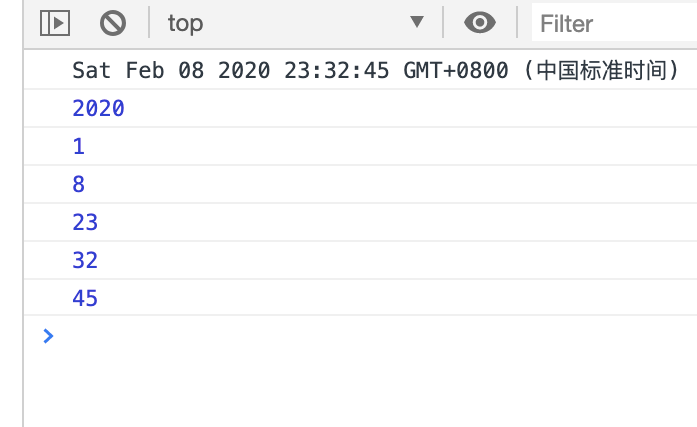

# Date 对象

## 获取当前时间

```js
let date = new Date();
console.log(date);
```


## 时间戳

获取当前时间距离 1970 年 1 月 1 日（世界标准时间）起的毫秒

- Date.now()
- valueOf()

```js
let date1 = Date.now();
console.log(date1);
let date2 = new Date();
console.log(date2.valueOf());
```


由于代码执行需要时间,所以相差几毫秒

## 创建指定时间

```js
let date1 = new Date("2019-11-11 09:08:07");
console.log(date1);
let date2 = new Date(2019, 11, 11, 9, 8, 7);
console.log(date2);
```


注意:在创建指定时间的时候,如果月份是单独传入的,那么会多一个月

## 获取指定时间年月日时分秒

```js
let date = new Date();
console.log(date);
console.log(date.getFullYear());
console.log(date.getMonth());
console.log(date.getDate());
console.log(date.getHours());
console.log(date.getMinutes());
console.log(date.getSeconds());
```



通过 getMonth 方法获取到的月份会少一个月

## 时间格式化

```js
let date = new Date();
let res = formartDate(date);
console.log(res);
function formartDate(date) {
  return `${date.getFullYear()}-${
    date.getMonth() + 1
  }-${date.getDate()} ${date.getHours()}:${date.getMinutes()}:${date.getSeconds()}`;
}
```


# 定时器

在 JavaScript 中有两种定时器, 一种是重复执行的定时器, 一种是只执行一次的定时器

## setInterval

`setInerval(function () {},1000);`定时器，意思是 每 1000 毫秒执行一次这个函数

setInterval 计算时间非常不准

注意:setInterval();是 window 的方法，在全局上就算不写 window. setInterval();他 也会上全局的 GO 里面查找，所以不写 window.也行。

每一个 setInterval();都会返回一个一个数字，作为唯一的标识，有唯一标识就可以把他清除掉(利用 clearInerval 清除)

clearInterval()能让 setInterval 停止。一般写了 setInterval 就要写 clearInterval

```html
<html>
  <head>
    <meta http-equiv="Content-Type" content="text/html; charset=UTF-8" />
    <title>Untitled Document</title>
  </head>

  <body>
    <button id="start">开始</button>
    <button id="close">结束</button>
    <script>
      let startBtn = document.querySelector("#start");
      let timer;
      startBtn.onclick = function () {
        timer = setInterval(function () {
          console.log("hello world");
        }, 1000);
      };
      let closeBtn = document.querySelector("#close");
      closeBtn.onclick = function () {
        clearInterval(timer);
      };
    </script>
  </body>
</html>
```

## setTimeOut

真正的定时器，隔了一段时间后再执行(起推迟作用)，并且只执行一次

清除 setTimeout();让他停止执行

这种写法，setTimeout();还没执行就被清除了，就执行不了

setInterval();setTimeout();clearInterval();clearTimeout();这四个都是全局对象，都是 window 上的方法，内部函数 this 指向 window

```html
<html>
  <head>
    <meta http-equiv="Content-Type" content="text/html; charset=UTF-8" />
    <title>Untitled Document</title>
  </head>

  <body>
    <button id="start">开始</button>
    <button id="close">结束</button>
    <script>
      let startBtn = document.querySelector("#start");
      let closeBtn = document.querySelector("#close");
      let timer;
      startBtn.onclick = function () {
        timer = window.setTimeout(function () {
          console.log("hello world");
        }, 5000);
      };
      closeBtn.onclick = function () {
        clearTimeout(timer);
      };
    </script>
  </body>
</html>
```
