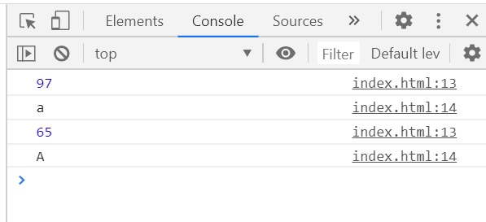

# 事件

用户和浏览器之间的交互行为我们就称之为事件, 比如：点击，移入/移出

在 JavaScript 中所有的 HTML 标签都可以添加事件`元素.事件名称 = function(){};`

当对应事件被触发时候就会自动执行 function 中的代码

如果给元素添加了和系统同名的事件, 我们添加的事件不会覆盖系统添加的事件

```html
<html>
  <head>
    <meta http-equiv="Content-Type" content="text/html; charset=UTF-8" />
    <title>Untitled Document</title>
  </head>

  <body>
    <button>我是按钮</button>
    <a href="http://www.baidu.com">我是a标签</a>
    <script>
      let oBtn = document.querySelector("button");
      oBtn.onclick = function () {
        alert("按钮被点击了");
      };
      let oA = document.querySelector("a");
      oA.onclick = function () {
        alert("a标签被点击了");
      };
    </script>
  </body>
</html>
```

a 点击弹出 alert，点击确定后会跳转到百度的首页

```js
oA.onclick = function () {
  alert("a标签被点击了");
  return false;
};
```

加上`return false`后，不会跳转到百度首页了

# 绑定事件

1. `ele.onxxx = function (event) {}`
   - 兼容性很好，但是一个元素只能绑定一个事件处理程序
   - 基本等同于写在 HTML 行间上，onclick=”consolo.log(‘a’)”是句柄的绑定方式，写在行间不用写 function(){}
   ```html
   <div
     style="width: 100px;height: 100px;background-color: #f00;"
     onclick="console.log('a')"
   ></div>
   ```
2. `ele.addEventListener(type, fn, false);`里面可以填三个参数。IE9 以下不兼容，可以为一个事件绑定多个处理程序 IE9 以下不兼容，可以为一个事件绑定多个处理程序
3. `ele.attachEvent(‘on’ + type, fn);`IE 独有，一个事件同样可以绑定多个处理程序，同一个函数绑定多次都可以

## 事件处理程序的运行环境

`ele.onxxx = function (event) {}`程序 this 指向是 dom 元素本身（指向自己）

`obj.addEventListener(type, fn, false);`程序 this 指向是 dom 元素本身（指向自己）

`obj.attachEvent(‘on’ + type, fn);`程序 this 指向 window

## 解除事件处理程序

`ele.onclick = false/null;`解除`ele.onxxx = function (event) {}`

`ele.removeEventListener(type, fn, false);`解除`addEventListener(type, fn, false)`

`ele.detachEvent(‘on’ + type, fn);`解除`obj.attachEvent(‘on’ + type, fn);`

# 事件处理模型 — 事件冒泡、捕获

事件处理的两个模型：事件冒泡、捕获（不能同时存在）

事件冒泡： 结构上（非视觉上）嵌套关系的元素，会存在事件冒泡的功能，即同一事件，自子元素冒泡向父元素。（自底向上）

结构上存在父子关系的元素，如果点击到子元素，会一级级向父元素传递这个事件 （从代码的角度是自底向上一层层冒泡的）

`obj.addEventListener(type, fn, true);`第三个参数为 true 就是事件捕获

事件捕获：（只有谷歌有，最新火狐有）

1. 结构上（非视觉上）嵌套关系的元素，会存在事件捕获的功能，即同一事件，自 父元素捕获至子元素（事件源元素）。（自底向上）
2. IE 没有捕获事件
   - 一个对象的一个事件类型，只能存在一个事件处理模型（冒泡或捕获）
3. 触发顺序，先捕获，后冒泡
   - 同一个对象的一个事件处理类型，上面绑定了两个事件处理，分别执行事件冒泡和事件执行
4. focus，blur，change，submit，reset，select 等事件不冒泡

```html
<div style="width: 300px;height: 300px;background-color: red;" class="wrapper">
  <div
    style="width: 200px;height: 200px;background-color: palegreen;"
    class="content"
  >
    <div
      style="width: 100px;height: 100px;background-color: pink;"
      class="box"
    ></div>
  </div>
</div>
<script>
  var wrapper = document.getElementsByTagName("div")[0];
  var content = document.getElementsByTagName("div")[1];
  var box = document.getElementsByTagName("div")[2];

  wrapper.addEventListener(
    "click",
    function () {
      console.log("wrapperBubble");
    },
    false
  );
  content.addEventListener(
    "click",
    function () {
      console.log("contentBubble");
    },
    false
  );
  box.addEventListener(
    "click",
    function () {
      console.log("boxBubble");
    },
    false
  );

  wrapper.addEventListener(
    "click",
    function () {
      console.log("wrapper");
    },
    true
  );
  content.addEventListener(
    "click",
    function () {
      console.log("content");
    },
    true
  );
  box.addEventListener(
    "click",
    function () {
      console.log("box");
    },
    true
  );
</script>
```


注意:

- 三个阶段只有两个会被同时执行
- 要么捕获和当前, 要么当前和冒泡
- onxx 的属性, 不接收任何参数, 所以默认就是冒泡
- attachEvent 方法, 只能接收两个参数, 所以默认就是冒泡
- 不是所有的事件都能冒泡，以下事件不冒泡：blur、focus、load、unload

# 取消冒泡和阻止默认事件

在每一个事件处理函数中`div.onclick=function(){}`，我们可以写一个形参（如 e）， 系统可以传递事件对象（记载了数据发生时的状态和信息）到这个参数里面去

取消冒泡：

- W3C 标准`event.stopPropagation();`不支持 ie9 以下版本
- IE 独有`event.cancelBubble = true;`实际上谷歌也实现了

阻止默认事件：

默认事件 — 表单提交，a 标签跳转，右键菜单等。浏览器点右键出菜单，是一个事件（默认事件）

- `return false;`兼容性非常好，以对象属性的方式注册的事件才生效（这是句柄的方式阻止默认事件，只有句柄的方式绑定事件才好使）
- `event.preventDefault();`W3C 标注，IE9 以下不兼容
- `event.returnValue = false;`兼容 IE

# 事件分类

## 鼠标事件

click、mousedown、mousemove、mouseup、contextmenu、mouseover、mouseout、 mouseenter、 mouseleave

click=mousedown+mousemove

这三个事件的触发顺序是 mousedown，mouseup，click

contextmenu 右键取消菜单，mousemove 是鼠标移动的事件

相对应 mouseover、mouseout 鼠标覆盖区域与 mouseenter 、mouseleave 鼠标离开 但是 mouseenter 、mouseleave 是 html5 的，都是鼠标进去，出来发生的变化

onmouseover 和 onmouseenter 的区别

- onmouseover 移入到子元素,父元素的移入事件也会被触发
- onmouseenter 移入到子元素,父元素的移入事件不会被触发

onmouseout 和 onmouseleave 的区别

- onmouseout 移出到子元素,父元素的移入事件也会被触发
- onmouseleave 移出到子元素,父元素的移入事件不会被触发

用 button 来区分鼠标的按键，0/1/2

只有 mouseup、mousedown 两个能区分鼠标垫左右键

button 返回值，右键是 0，左键是 2，中间是 1

```js
document.onmousedown = function (e) {
  if (e.button == 2) {
    console.log("right");
  } else if (e.button == 0) {
    console.log("left");
  }
};
```

DOM3 标准规定:click 事件只能监听左键,只能通过 mousedown 和 mouseup 来判断鼠标键

click 不能监听右中

## 键盘事件

keydown，keyup，keypress

触发顺序是 keydown > keypress > keyup

keydown 和 keypress 的区别

1. keydown 可以响应任意键盘按键，keypress 只可以相应字符类键盘按键
   - 检测字符类不准确，keypress 检测字符很准。但是 keydown 能监控所有，包括上下 左右都能监控，但是 keypress 只能监视字符
   - 如果你想监控字符类按键，并想区分大小写，就用 keypress，如果是操作类按 键的话，就用 keydown（which：39 是给按键牌号 39，不是 asc 码）
2. keypress 返回 ASCII 码，可以转换成相应字符
   - 连续按键盘按键的时候就是连续触发 keydown 和 keypress，松开触发 keyup

```js
document.onkeypress = function (e) {
  console.log(e.charCode);
  console.log(String.fromCharCode(e.charCode));
};
```



## 文本操作事件

input，change，focus，blur

框里面所有变化（增删改）都会触发 input 事件，input 事件只有在 IE9 以及 IE9 以上的浏览器才能使用。在 IE9 以下, 如果想时时的获取到用户修改之后的数据, 可以通过`propertychange`事件来实现

change 对比鼠标聚焦，或失去焦点的时，两个状态是否发生改变，如果两个状态，没有改变就不触发，如果发生改变就触发

focus，blur 聚焦和失去焦点

## 窗体操作类(window 上的事件) scroll，load

scroll 当滚动条一滚动，scroll 事件就触发了

load 重要但是不用。利用了 onload 就能操作写在下面的 div 了，但是我们不能这样用。

```html
<script>
  window.onload = function () {
    var div = document.getElementsByTagName("div")[0];
    console.log(div);
    div.style.width = "100px";
    div.style.height = "100px";
    div.style.backgroundColor = "red";
  };
</script>
<div></div>
```

理由：html 和 css 是一起解析的，在解析的时候会有 html 有 domTree，css 有 cssTree 生成（树形图的顶底是 document，然后是 html，然后是 head，body），两个树拼在一起是 renderTree。

什么时候把节点放在树里？dom 节点解析，如确定是 img 标签就把他放到树里。（先 解析完 img，同时开启一个线程异步的去下载里面的内容，后下载完）。

我们把 js 的 script 标签写在最下面的好处是，这些刚刚解析完 js 就能操作页面了， 就更快了。而 window.onload 要等整个页面解析完，下载完才能操作 js，才能触发事 件（效率很差）。onload 能提醒我们什么时候整个页面解析完毕。在设计广告时，就 要用 onload，等整个页面下载完了才开始用，但是 onload 绝对用于主程序里面。

# 事件对象

非 ie 浏览器会把事件对象（记载了数据发生时的状态和信息）打包传到参数里面去。 ie 浏览器在 window.event 里面储存事件对象。

event || window.event 这是储存事件对象的兼容性写法，window.event 用于 IE，event 只能用于非 ie 浏览器

```html
<div class="wrapper" style="width: 100px;height: 100px;background-color: #f00;">
  <div
    class="box"
    style="width: 50px;height: 50px;background-color: #bfa;"
  ></div>
</div>
<script>
  var wrapper = document.getElementsByClassName("wrapper")[0];
  var box = document.getElementsByClassName("box")[0];
  wrapper.onclick = function (e) {
    var e = e || window.e;
    console.log(e);
    console.log(e.target);
  };
</script>
```


点红色会执行，点绿色会冒泡执行。点红色是点击到他自己来执行；点绿色身上， 触发事件的点在绿色身上，是绿色传递的，我们**把触发事件的地方叫事件源**。

事件对象上有个专门的信息是存储事件源的。

点击之后查看控制台 srcElement:这就是储存事件源的地方

# 事件源对象:（找事件源对象的方法）

event.target 火狐独有的

event.srcElement Ie 独有的

这俩 chrome 都有

事件源对象的兼容性写法

```html
<div class="wrapper" style="width: 100px;height: 100px;background-color: #f00;">
  <div
    class="box"
    style="width: 50px;height: 50px;background-color: #bfa;"
  ></div>
</div>
<script>
  var wrapper = document.getElementsByClassName("wrapper")[0];
  var box = document.getElementsByClassName("box")[0];
  wrapper.onclick = function (e) {
    var e = e || window.e;
    var target = event.target || event.srcElement;
    console.log(target);
  };
</script>
```

# 事件委托

事件委托：利用事件冒泡，和事件源对象进行处理

优点：

1. 性能 不需要循环所有的元素一个个绑定事件
2. 灵活 当有新的子元素时不需要重新绑定事件

```html
<ul>
  <li>1</li>
  <li>2</li>
  <li>3</li>
  <li>4</li>
  <li>5</li>
  <li>6</li>
  <li>7</li>
  <li>8</li>
  <li>9</li>
  <li>10</li>
</ul>
<script>
  var ul = document.getElementsByTagName("ul")[0];
  ul.onclick = function (e) {
    var e = e || window.e;
    var target = e.target || e.srcElement;
    console.log(target.innerHTML);
  };
</script>
```

# 事件位置获取

offsetX/offsetY: 事件触发相对于当前元素自身的位置

clientX/clientY: 事件触发相对于浏览器可视区域的位置,可视区域是不包括滚动出去的范围的

pageX/pageY: 事件触发相对于整个网页的位置,整个网页包括滚动出去的范围的

screenX/screenY: 事件触发相对于屏幕的位置

注意:

- clientX/clientY 无论高级浏览器还是低级浏览器都支持
- pageX/pageY 只有高级浏览器支持, 低级浏览器是不支持的(IE9 以下)
