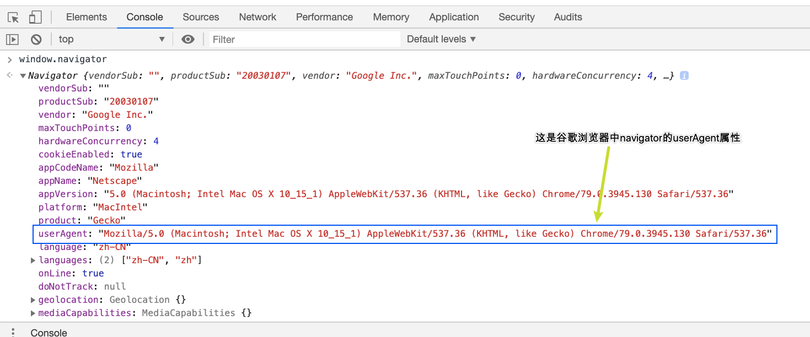
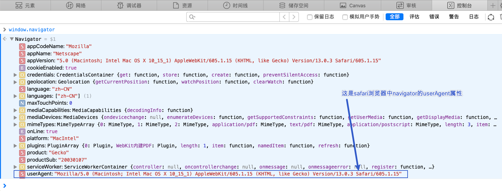
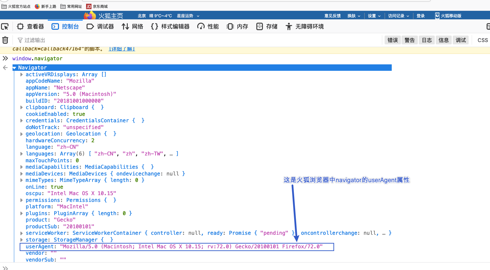

# BOM

DOM 就是一套操作 HTML 标签的 API(接口/方法/属性)

BOM 就是一套操作浏览器的 API(接口/方法/属性)

BOM 中常见的对象

- window: 代表整个浏览器窗口
  - 注意: window 是 BOM 中的一个对象, 并且是一个顶级的对象(全局)
- Navigator: 代表当前浏览器的信息, 通过 Navigator 我们就能判断用户当前是什么浏览器
- Location: 代表浏览器地址栏的信息, 通过 Location 我们就能设置或者获取当前地址信息
- History: 代表浏览器的历史信息, 通过 History 来实现刷新/上一步/下一步
  - 注意点: 出于隐私考虑, 我们并不能拿到用户所有的历史记录, 只能拿到当前的历史记录
- Screen: 代表用户的屏幕信息

# Navigator

代表当前浏览器的信息, 通过 Navigator 我们就能判断用户当前是什么浏览器

由于历史原因，Navigator 对象中的大部分属性都已经不能帮助我们识别浏览器了。

**一般我们只会使用`navigator.userAgent`来获取浏览器的信息**。

userAgent 的值是一个字符串，简称 UA，这个字符串中包含了用来描述浏览器信息的内容，不同的浏览器会有不同的 userAgent。







# History

History: 代表浏览器的历史信息, 通过 History 来实现刷新/前进/后退

出于隐私考虑, 我们并不能拿到用户所有的历史记录, 只能拿到当前的历史记录

## History 对象的属性

`history.length`获取浏览器历史列表中的 url 数量。注意，只是统计当次的数量，如果浏览器关了，数量会重置为 1。

## History 对象的方法

`history.back();`用来回退到上一个页面，作用和浏览器的「回退按钮」一样。
`history.forward();`用来跳转下一个页面，作用和浏览器的「前进按钮」一样。
`history.go( int n);`向前/向后跳转 n 个页面。需要整数作为参数

# Location

Location: 代表浏览器地址栏的信息, 通过 Location 我们就能设置或者获取当前地址信息

## Location 对象的属性

- `location.href`获取当前页面的 url 路径（或者设置 url 路径）。
- `location.hash`返回 url 中#后面的内容，包含#
- `location.host`主机名，包括端口
- `location.hostname`主机名
- `location.pathname`url 中的路径部分
- `location.protocol`协议 一般是 http、https
- `location.search`查询字符串

```js
location.href = "www.baidu.com"; // 跳转到指定的页面链接。通俗理解就是：跳转到其他的页面
```

## Location 对象的方法

- `location.assign(str);`用来跳转到其他的页面，作用和直接修改 location.href 一样。设置`location.href` 就会调用 assign()。一般使用 location.href 进行页面之间的跳转。
- `location.reload();`用于重新加载当前页面，作用和刷新按钮一样。在方法的参数中传递一个 true，则会强制清空缓存刷新页面。
- `location.replace();`使用一个新的页面替换当前页面，调用完毕也会跳转页面。但不会生成历史记录，不能使用「后退按钮」后退。

```html
<!DOCTYPE html>
<html lang="en">
  <head>
    <meta charset="UTF-8" />
    <title>Document</title>
  </head>

  <body>
    <button id="btn1">获取</button>
    <button id="btn2">设置</button>
    <button id="btn3">刷新</button>
    <button id="btn4">强制刷新</button>
    <script>
      let oBtn1 = document.querySelector("#btn1");
      let oBtn2 = document.querySelector("#btn2");
      let oBtn3 = document.querySelector("#btn3");
      let oBtn4 = document.querySelector("#btn4");
      // 获取当前地址栏的地址
      oBtn1.onclick = function () {
        console.log(window.location.href);
      };
      // 设置当前地址栏的地址
      oBtn2.onclick = function () {
        window.location.href = "http://www.baidu.com";
      };
      // 重新加载界面
      oBtn3.onclick = function () {
        window.location.reload();
      };
      // 强制刷新
      oBtn4.onclick = function () {
        window.location.reload(true);
      };
    </script>
  </body>
</html>
```
