# RegExp 正则表达式

正则表达式的作用：匹配特殊字符或有特殊搭配原则的字符的最佳选择。

RegExp 对象表示正则表达式，它是对字符串执行模式匹配的强大工具（判断字符串 满不满足要求）。正则表达式其他语言也有，规则是一样的，在这个基础上，js 增加 了自己独特的方法。

# 基础语法

创建一个正则表达式

- 直接量（推荐）
  ```js
  var reg = /abc/;
  var str = "abcd";
  ```
  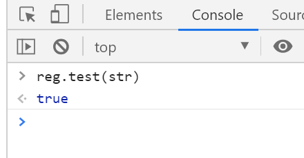
- new RegExp()

`reg.test()`只能判断这个字符串有没有符合要求的片段，返回结果只有 true 和 false

`str.match()`可以把所有东西都匹配出来，返回给你，比上一种方法更直观，还能告诉你返回了多少个

```js
var str = "abababababab";
var reg = /ab/g;
```

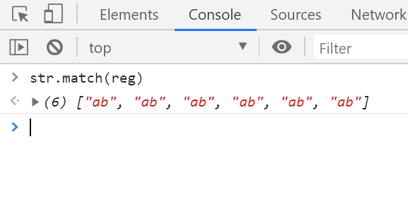

# 修饰符

- i：忽略大小写
- g：全局搜索，而不是查找到第一个匹配后停止
- m：多行匹配

```js
var str = "abcdef\na"; // \n换行
var reg = /^a/gm; // 全局搜索以a开关的
```

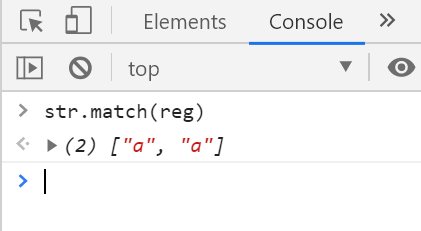

# 表达式

- [abc]：查找方括号内的任何字符
  ```js
  var str = "abcdef11a";
  var reg = /[abc]/g;
  ```
  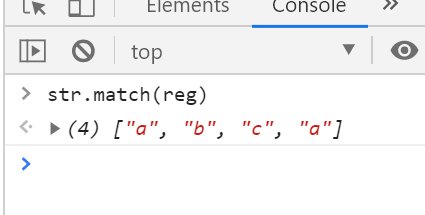
- [0-9]：查找任何从 0 至 9 的数字。
- (x|y)：查找由 | 分隔的任何选项。匹配 x 或 y
  ```js
  var str = "abcdef11a";
  var str1 = "bcdef1fg";
  var reg = /(abc|bcd)/g;
  ```
  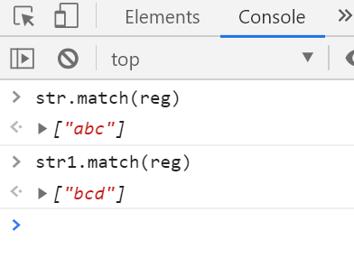
- [^a]：查找除 a 以外的
  ```js
  var str = "abcdef11a";
  var reg = /[^a]/g;
  ```
  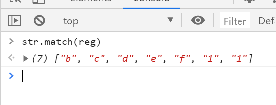
- [A-z]：这个是按照 ASC 码排序的，从大写到小写可以写成 A-z

# 元字符

- `\w`：完全等于[0-9A-z_]
  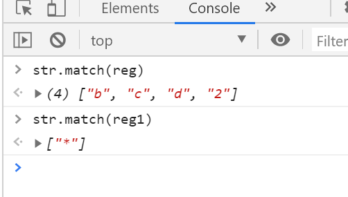
- `\W`：完全等于[^\w]
- `\d`：完全等于[0-9]
- `\D`：完全等于[^0-9]
- `\s`：完全等于`[ \t\n\r\v\f]`
- `\S`：完全等于[非空白字符]
- `\b`：单词边界
  ```js
  var str = "abc cde cfgc";
  var reg = /\bc/g; // c前面要有一个单词边界
  ```
  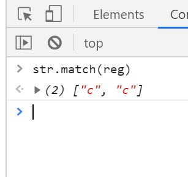
- `\B`：非单词边界
  ```js
  var str = "abc de fgc";
  var reg = /\Bc/g;
  ```
  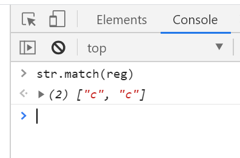
- 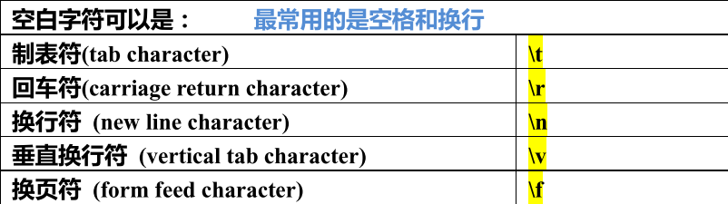
  ```js
  var str = "abc\tde fgc";
  var reg = /\td/g;
  ```
  - 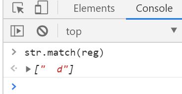
- `.`：查找单个字符，除了换行和行结束符

# 量词

- `n+`：匹配任何包含至少一个 n 的字符串。这个变量可以出现 1 到无数次。
- `n*`：匹配任何包含零个或多个 n 的字符串。这个变量可以出现 0 到无数次。
  - n 是一个变量，`n+`代表这个变量可以重复出现 1 次到无数次，`n*`代表{0 到正无穷}
  - 正则表达式有一个贪婪匹配原则，能多就不少
- `n?`：匹配任何包含零个或一个 n 的字符串。这个变量 0 或 1 个一匹配。
- `n{X}`：匹配包含 X 个 n 的序列的字符串。
- `n{X,Y}`：匹配包含 X 至 Y 个 n 的序列的字符串。
- `n{X, }`：匹配包含至少 X 个 n 的序列的字符串。
- `n$`：匹配任何结尾为 n 的字符串。

# 正向预查/正向断言

- `?=n`：匹配任何其后紧接指定字符串 n 的字符串。
- `?!n`：匹配任何其后没有紧接指定字符串 n 的字符串。后面不跟着 n
