# ECMASript 相关介绍

ECMA（European Computer Manufacturers Association）中文名称为欧洲计算机制 造商协会，这个组织的目标是评估、开发和认可电信和计算机标准。1994 年后该 组织改名为 Ecma 国际。

ECMAScript 是由 Ecma 国际通过 ECMA-262 标准化的脚本程序设计语言。

Ecma 国际制定了许多标准，而 ECMA-262 只是其中的一个，所有标准列表查看http://www.ecma-international.org/publications/standards/Standard.htm

ECMA-262（ECMAScript）历史版本查看网址http://www.ecma-international.org/publications/standards/Ecma-262-arch.htm

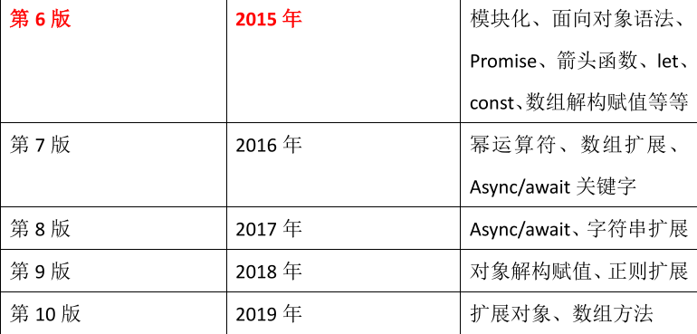

http://kangax.github.io/compat-table/es6/ 可查看兼容性

# ECMASript 6 新特性

## let 关键字

let 关键字用来声明变量，使用 let 声明的变量有几个特点：

1. 不允许重复声明
2. 块儿级作用域
3. 不存在变量提升
4. 不影响作用域链

应用场景：以后声明变量使用 let 就对了

## const 关键字

const 关键字用来声明常量，const 声明有以下特点

1. 声明必须赋初始值
2. 标识符一般为大写
3. 不允许重复声明
4. 值不允许修改
5. 块儿级作用域

对象属性修改和数组元素变化不会出发 const 错误

应用场景：声明对象类型使用 const，非对象类型声明选择 let

## 变量的解构赋值

ES6 允许按照一定模式，从数组和对象中提取值，对变量进行赋值，这被称为**解构赋值**。

数组的解构赋值：

```js
const arr = ["张学友", "刘德华", "黎明", "郭富城"];
let [zhang, liu, li, guo] = arr;
```

对象的解构赋值：

```js
const lin = {
  name: "林志颖",
  tags: ["车手", "歌手", "小旋风", "演员"],
};
let { name, tags } = lin;
```

复杂解构：

```js
let wangfei = {
  name: "王菲",
  age: 18,
  songs: ["红豆", "流年", "暧昧", "传奇"],
  history: [{ name: "窦唯" }, { name: "李亚鹏" }, { name: "谢霆锋" }],
};
let {
  songs: [one, two, three],
  history: [first, second, third],
} = wangfei;
```

## 模板字符串

模板字符串（template string）是增强版的字符串，用反引号（`）标识，特点：

1. 字符串中可以出现换行符
2. 可以使用`${xxx}`形式输出变量

```js
let str = `<ul>
              <li>沈腾</li> 
              <li>玛丽</li> 
              <li>魏翔</li> 
              <li>艾伦</li>
          </ul>`;

let star = "王宁";
let result = `${star}在前几年离开了开心麻花`;
```

当遇到字符串与变量拼接的情况使用模板字符串

## 简化对象写法

ES6 允许在大括号里面，直接写入变量和函数，作为对象的属性和方法。这 样的书写更加简洁。

```js
let name = "cherry";
let age = 18;
let say = function () {
  console.log("hello world");
};

let person = {
  name,
  age,
  say,
};
```

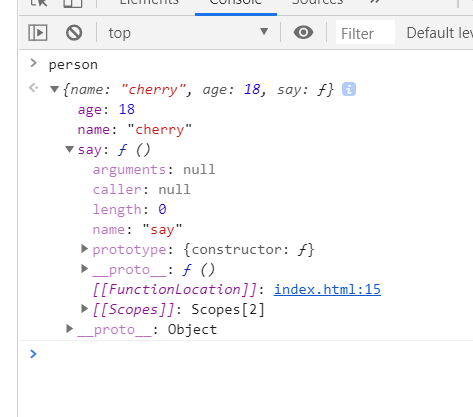

## 箭头函数

ES6 允许使用「箭头」（=>）定义函数。

```js
let fn = (arg1, arg2, arg3) => {
  return arg1 + arg2 + arg3;
};
```

箭头函数的注意点:

1. 如果形参只有一个，则小括号可以省略
2. 函数体如果只有一条语句，则花括号可以省略，函数的返回值为该条语句的 执行结果
3. 箭头函数 this 指向声明时所在作用域下 this 的值
4. 箭头函数不能作为构造函数实例化
5. 不能使用 arguments

箭头函数不会更改 this 指向，用来指定回调函数会非常合适

## rest 参数

ES6 引入 rest 参数，用于获取函数的实参，用来代替 arguments

rest 参数必须是**最后一个形参**

```js
function add(...args) {
  console.log(args);
}
add(1, 2, 3, 4, 5);

function minus(a, b, ...args) {
  console.log(a, b, args);
}
minus(100, 1, 2, 3, 4, 5, 19);
```

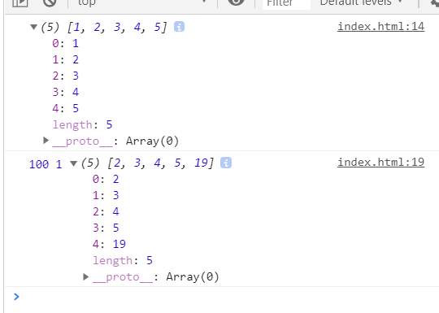

rest 参数非常适合不定个数参数函数的场景

## spread 扩展运算符

扩展运算符（spread）也是三个点（...）。它好比 rest 参数的逆运算，将一个数组转为用逗号分隔的参数序列，对数组进行解包。

```js
let tfboys = ["王源", "王俊凯", "易洋千玺"];
function fn() {
  console.log(arguments);
}
fn(...tfboys);
```

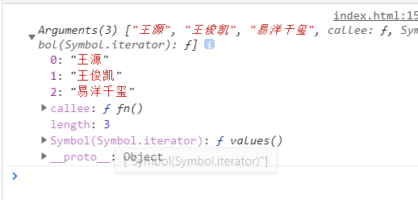

```js
let skillOne = { q: "致命打击" };
let skillTwo = { w: "勇气" };
let skillThree = { e: "审判" };
let skillFour = { r: "德玛西亚正义" };
let gailun = { ...skillOne, ...skillTwo, ...skillThree, ...skillFour };
```

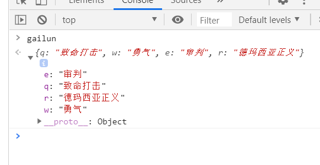

## Symbol

ES6 引入了一种新的原始数据类型 Symbol，表示独一无二的值。它是
JavaScript 语言的第七种数据类型，是一种类似于字符串的数据类型。
Symbol 特点

1. Symbol 的值是唯一的，用来解决命名冲突的问题
2. Symbol 值不能与其他数据进行运算
3. Symbol 定义的对象属性不能使用 for…in 循环遍历，但是可以使用 Reflect.ownKeys 来获取对象的所有键名

遇到唯一性的场景时要想到 Symbol

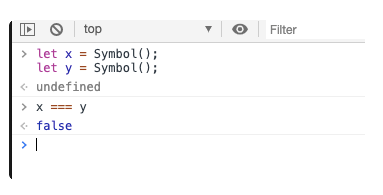

```js
//创建 Symbol
let s1 = Symbol();
console.log(s1, typeof s1);
//添加标识的 Symbol
let s2 = Symbol("a");
let s2_2 = Symbol("a");
console.log(s2 === s2_2); //使用 Symbol for 定义
let s3 = Symbol.for("b");
let s3_2 = Symbol.for("b");
console.log(s3 === s3_2);
```

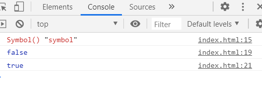

如果想使用变量作为对象属性的名称, 那么必须加上[]

```js
let name = Symbol("name");
let say = Symbol("say");
let obj = {
  // 注意点: 如果想使用变量作为对象属性的名称, 那么必须加上[]
  [name]: "sunny",
  [say]: function () {
    console.log("say");
  },
};
console.log(obj);
obj[Symbol("name")] = "merry";
console.log(obj);
console.log(obj.name);
console.log(obj[name]);
```

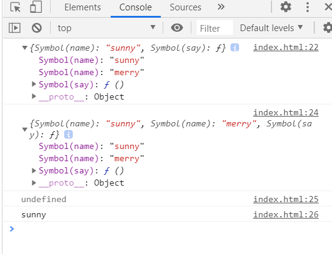

## 迭代器

iterator 是一种接口机制，为各种不同的数据结构提供统一的访问机制

作用：

1. 为各种数据结构，提供一个统一的、简便的访问接口
2. 使得数据结构的成员参够按某种次序排列
3. ES6 创造了一种新的遍历命令`for...of`循环，iterator 接口主要供`for...of`消费

工作原理：

1. 只要一个数据已经实现了 Iterator 接口, 那么这个数据就有一个叫做`[Symbol.iterator]`的属性

2. `[Symbol.iterator]`的属性会返回一个函数

3. `[Symbol.iterator]`返回的函数执行之后会返回一个对象

4. `[Symbol.iterator]`函数返回的对象中又一个名称叫做 next 的方法

5. next 方法每次执行都会返回一个对象{value: 当前成员的值, done: 布尔值}

   - value 表示当前成员的值，done 对应的布尔值表示当前的数据的结构是否遍历结束。
   - 当遍历结束的时候返回的 value 值是 undefined，done 值为 false

6. 这个对象中存储了当前取出的数据和是否取完了的标记

默认情况下以下数据类型都实现的 Iterator 接口：Array/Map/Set/String/TypedArray/函数的 arguments 对象/NodeList 对象

```js
class MyIterator {
  constructor() {
    for (let i = 0; i < arguments.length; i++) {
      // this[0] = 1;
      // this[1] = 3;
      // this[2] = 5;
      this[i] = arguments[i];
    }
    this.length = arguments.length;
  }
  [Symbol.iterator]() {
    let index = 0;
    let that = this;
    return {
      next() {
        if (index < that.length) {
          return { value: that[index++], done: false };
        } else {
          return { value: that[index], done: true };
        }
      },
    };
  }
}
```

## 生成器

## Generator

Generator 函数是 ES6 提供的一种异步编程解决方案

Generator 函数内部可以封装多个状态，因此又可以理解为是一个状态机

特点：

1. function 与函数名之间有一个星号
2. 内部用 yield 表达式来定义不同的状态
3. 调用 Generator 函数后，无论函数有没有返回值, 都会返回一个迭代器对象
4. 调用 Generator 函数后， 函数中封装的代码不会立即被执行

在 Generator 函数内部使用 yield 关键字定义状态，并且 yield 关键字可以让 Generator 内部的逻辑能够切割成多个部分。

通过调用迭代器对象的 next 方法执行一个部分代码，执行哪个部分就会返回哪个部分定义的状态

在调用 next 方法的时候可以传递一个参数, 这个参数会传递给上一个 yield

注意点：yield 关键字只能在 Generator 函数中使用, 不能在普通函数中使用

```js
function* gen() {
  console.log(1);
  let res = yield "abc";
  console.log(res);
  console.log(2);
  yield "def";
  console.log(3);
  yield "ghi";
}
let res = gen();
console.log(res.next());
console.log(res.next("hey~"));
console.log(res.next());
```

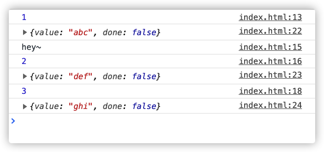

generator 函数应用场景：

- 让函数返回多个值

- 利用 Generator 函数，可以在任意对象上快速部署 Iterator 接口

  ```js
  let obj = {
    name: "cherry",
    age: 18,
    sex: "female",
  };

  function* gen() {
    let keys = Object.keys(obj);
    for (let i = 0; i < keys.length; i++) {
      yield obj[keys[i]];
    }
  }

  obj[Symbol.iterator] = gen;
  let res = obj[Symbol.iterator]();
  console.log(res.next());
  console.log(res.next());
  console.log(res.next());
  console.log(res.next());
  ```

  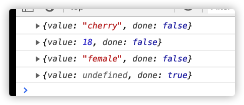

- 用同步的流程来表示异步的操作

## Promise

Promise 是 ES6 中新增的一个对象，通过 Promise 就可以实现用同步的流程来表示异步的操作。通过 Promise 就可以避免回调函数层层嵌套(回调地狱)问题

通过`new Promise(function(resolve, reject){});`创建 Promise 对象

promise 对象不是异步的，只要创建 promise 对象就会立即执行存放的代码

promise 对象是通过状态的改变来实现的, 只要状态发生改变就会自动触发对应的函数

Promise 对象三种状态：

- `pending`: 默认状态，只要没有告诉 promise 任务是成功还是失败就是 pending 状态
- `fulfilled(resolved)`: 只要调用 resolve 函数, 状态就会变为 fulfilled, 表示操作成功
- `rejected`: 只要调用 rejected 函数, 状态就会变为 rejected, 表示操作失败

注意点: 状态一旦改变既不可逆, 既从 pending 变为 fulfilled, 那么永远都是 fulfilled

### then 方法

1. then 方法接收两个参数，第一个参数是状态切换为成功时的回调，第二个参数是状态切换为失败时的回调
2. 在修改 promise 状态时，可以传递参数给 then 方法中的回调函数

   ```js
   let promise = new Promise(function (resolve, reject) {
     // resolve(1)
     reject("a");
   });
   promise.then(
     (data) => {
       console.log("成功1", data);
     },
     (data) => {
       console.log("失败1", data);
     }
   );
   ```

3. 同一个 promise 对象可以多次调用 then 方法，当该 promise 对象的状态发生改变时所有 then 方法都会被执行

   ```js
   let promise = new Promise(function (resolve, reject) {
     // resolve(); // 将状态修改为成功
     reject(); // 将状态修改为失败
   });
   promise.then(
     function () {
       console.log("成功1");
     },
     function () {
       console.log("失败1");
     }
   );
   promise.then(
     function () {
       console.log("成功2");
     },
     function () {
       console.log("失败2");
     }
   );
   ```

4. then 方法每次执行完毕后会返回一个新的 promise 对象
5. 可以通过上一个 promise 对象的 then 方法给下一个 promise 对象的 then 方法传递参数

   - 无论是在上一个 promise 对象成功的回调还是失败的回调传递的参数，都会传递给下一个 promise 对象成功的回调

   ```js
   let promise = new Promise(function (resolve, reject) {
     // resolve(1)
     reject("a");
   });
   let p2 = promise.then(
     (data) => {
       console.log("成功1", data);
       return "222";
     },
     (data) => {
       console.log("失败1", data);
       return "bbb";
     }
   );
   p2.then(
     (data) => {
       console.log("成功2", data);
     },
     (data) => {
       console.log("失败2", data);
     }
   );
   ```

   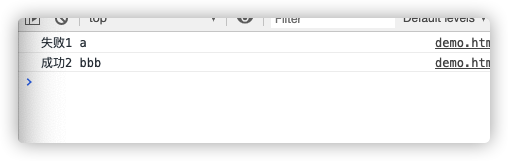

6. 如果 then 方法返回的是一个 Promise 对象，那么会将返回的 Promise 对象的执行结果中的值传递给下一个 then 方法

   ```js
   let promise = new Promise(function (resolve, reject) {
     resolve("111"); // 将状态修改为成功
     // reject("aaa"); // 将状态修改为失败
   });
   let p = new Promise(function (resolve, reject) {
     // resolve("222"); // 将状态修改为成功
     reject("bbb"); // 将状态修改为失败
   });
   let p2 = promise.then(
     function (data) {
       console.log("成功1", data);
       return p;
     },
     function (data) {
       console.log("失败1", data);
       return "bbb";
     }
   );
   p2.then(
     function (data) {
       console.log("成功2", data);
     },
     function (data) {
       console.log("失败2", data);
     }
   );
   ```

   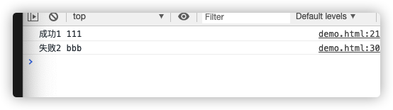

### catch 方法

1. catch 方法和 then 一样，在修改 promise 状态时，可以传递参数给 catch 方法中的回到函数
2. 和 then 一样，同一个 promise 对象可以多次调用 catch 方法，当该 promise 对象的状态时所有 catch 方法都会被执行
3. 和 then 一样，catch 方法每次执行完毕后会返回一个新的 promise 对象
4. 和 then 方法一样，上一个 promise 对象也可以给下一个 promise 成功的传递参数

   - 无论是在上一个 promise 对象成功的回调还是失败的回调传递的参数，都会传递给下一个 promise 对象成功的回调

5. 和 then 一样，catch 方法如果返回的是一个 Promise 对象，那么会将返回的 Promise 对象的执行结果中的值传递给下一个 catch 方法
6. 和 then 方法第二个参数的区别在于，catch 方法可以捕获上一个 promise 对象 then 方法中的异常

catch 其实是 then(undefined, () => {}) 的语法糖

如果需要分开监听，也就是通过 then 监听成功通过 catch 监听失败。那么必须使用链式编程，否则会报错

不使用链式编程的原因是

1. 如果 promise 的状态是失败, 但是没有对应失败的监听就会报错
2. then 方法会返回一个新的 promise, 新的 promise 会继承原有 promise 的状态
3. 如果新的 promise 状态是失败, 但是没有对应失败的监听也会报错

### all 方法

Promise 的 all 静态方法:

1. all 方法接收一个数组
2. 如果数组中有多个 Promise 对象,只有都成功才会执行 then 方法，并且会按照添加的顺序, 将所有成功的结果重新打包到一个数组中返回给我们
3. 如果数组中不是 Promise 对象，那么会直接执行 then 方法

应用场景: 批量加载, 要么一起成功, 要么一起失败

```js
let p1 = new Promise((resolve, reject) => {
  resolve(1);
});
let p2 = new Promise((resolve, reject) => {
  setTimeout(() => {
    resolve(2);
  }, 5000);
});
let p3 = new Promise((resolve, reject) => {
  setTimeout(() => {
    resolve(3);
  }, 3000);
});
Promise.all([p1, p3, p2])
  .then((result) => {
    console.log("成功", result);
  })
  .catch((err) => console.log("失败", err));
```

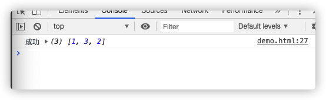

### race 方法

Promise 的 race 静态方法:

1. all 方法接收一个数组
2. 如果数组中有多个 Promise 对象，谁先返回状态就听谁的，后返回的会被抛弃
3. 如果数组中不是 Promise 对象，那么会直接执行 then 方法

应用场景: 接口调试，超时处理

## Set

ES6 提供了新的数据结构 Set（集合）。它类似于数组，但成员的值都是唯一的，集合实现了 iterator 接口，所以可以使用『扩展运算符』和『for…of…』进 行遍历，集合的属性和方法：

1. size 返回集合的元素个数
2. add 增加一个新元素，返回当前集合
3. delete 删除元素，返回 boolean 值
4. has 检测集合中是否包含某个元素，返回 boolean 值
5. clear 清空集合，返回 undefined

```js
// 创建一个空集合
let s = new Set();
// 创建一个非空集合
let s1 = new Set([1, 2, 3, 1, 2, 3]);
// 集合属性与方法
// 返回集合的元素个数
console.log(s1.size);
// 添加新元素
console.log(s1.add(4));
// 删除元素
console.log(s1.delete(1));
// 检测是否存在某个值
console.log(s1.has(2));
// 清空集合
console.log(s1.clear());
```

## Map

ES6 提供了 Map 数据结构。它类似于对象，也是键值对的集合。但是“键” 的范围不限于字符串，各种类型的值（包括对象）都可以当作键。Map 也实现了 iterator 接口，所以可以使用『扩展运算符』和『for…of…』进行遍历。Map 的属 性和方法：

1. size 返回 Map 的元素个数
2. set 增加一个新元素，返回当前 Map
3. get 返回键名对象的键值
4. has 检测 Map 中是否包含某个元素，返回 boolean 值
5. clear 清空集合，返回 undefined

```js
// 创建一个空 map
let m = new Map();
// 创建一个非空 map
let m2 = new Map([
  ["name", "尚硅谷"],
  ["slogon", "不断提高行业标准"],
]);
// 属性和方法
// 获取映射元素的个数
console.log(m2.size);
// 添加映射值
console.log(m2.set("age", 6));
// 获取映射值
console.log(m2.get("age"));
// 检测是否有该映射
console.log(m2.has("age"));
// 清除 console.log(m2.clear());
```

## class 类

ES6 提供了更接近传统语言的写法，引入了 Class（类）这个概念，作为对象的模板。通过 class 关键字，可以定义类。基本上，ES6 的 class 可以看作只是一个语法糖，它的绝大部分功能，ES5 都可以做到，新的 class 写法只是让对象 原型的写法更加清晰、更像面向对象编程的语法而已。

1. class 声明类
2. constructor 定义构造函数初始化
3. extends 继承父类
4. super 调用父级构造方法
5. static 定义静态方法和属性
6. 父类方法可以重写

```js
// 父类
class Phone {
  // 构造方法
  constructor(brand, color, price) {
    this.brand = brand;
    this.color = color;
    this.price = price;
  }
  // 对象方法
  call() {
    console.log("我可以打电话!!!");
  }
}

// 子类
class SmartPhone extends Phone {
  constructor(brand, color, price, screen, pixel) {
    super(brand, color, price);
    this.screen = screen;
    this.pixel = pixel;
  }

  // 子类方法
  photo() {
    console.log("我可以拍照!!");
  }
  playGame() {
    console.log("我可以玩游戏!!");
  }

  // 方法重写
  call() {
    console.log("我可以进行视频通话!!");
  }

  // 静态方法
  static run() {
    console.log("我可以运行程序");
  }
  static connect() {
    console.log("我可以建立连接");
  }
}

// 实例化对象
const Nokia = new Phone("诺基亚", "灰色", 230);
const iPhone6s = new SmartPhone("苹果", "白色", 6088, "4.7inch", "500w");

// 调用子类方法
iPhone6s.playGame();

// 调用重写方法
iPhone6s.call();

// 调用静态方法
SmartPhone.run();
```

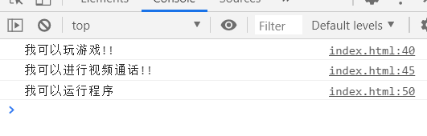

## 数值扩展

### 二进制和八进制

ES6 提供了二进制和八进制数值的新的写法，分别用前缀 0b 和 0o 表示。

### Number.isFinite() 与 Number.isNaN()

Number.isFinite() 用来检查一个数值是否为有限的
Number.isNaN() 用来检查一个值是否为 NaN

### Number.parseInt() 与 Number.parseFloat()

ES6 将全局方法 parseInt 和 parseFloat，移植到 Number 对象上面，使用不变。

### Math.trunc

用于去除一个数的小数部分，返回整数部分。

### Number.isInteger

Number.isInteger() 用来判断一个数值是否为整数

## 对象扩展

ES6 新增了一些 Object 对象的方法

1. `Object.is`比较两个值是否严格相等，与『===』行为基本一致（+0 与 NaN）
2. `Object.assign`对象的合并，将源对象的所有可枚举属性，复制到目标对象
3. `__proto__`、`setPrototypeOf`、`setPrototypeOf`可以直接设置对象的原型

# ECMASript 7 新特性

## Array.prototype.includes

Includes 方法用来检测数组中是否包含某个元素，返回布尔类型值

## 指数操作符

在 ES7 中引入指数运算符「\*\*」，用来实现幂运算，功能与 Math.pow 结果相同

# ECMASript 8 新特性

## async 和 await

async 和 await 两种语法结合可以让异步代码像同步代码一样

async 函数：

1. async 函数的返回值为 promise 对象
2. promise 对象的结果由 async 函数执行的返回值决定

await 表达式：

1. await 必须写在 async 函数中
2. await 右侧的表达式一般为 promise 对象
3. await 返回的是 promise 成功的值
4. await 的 promise 失败了, 就会抛出异常, 需要通过 try...catch 捕获处理

## Object.values 和 Object.entries

1. Object.values()方法返回一个给定对象的所有可枚举属性值的数组
2. Object.entries()方法返回一个给定对象自身可遍历属性 [key,value] 的数组

## Object.getOwnPropertyDescriptors

该方法返回指定对象所有自身属性的描述对象

# ECMASript 9 新特性

## Rest/Spread 属性

Rest 参数与 spread 扩展运算符在 ES6 中已经引入，不过 ES6 中只针对于数组， 在 ES9 中为对象提供了像数组一样的 rest 参数和扩展运算符

```js
function connect({ host, port, ...user }) {
  console.log(host);
  console.log(port);
  console.log(user);
}
connect({
  host: "127.0.0.1",
  port: 3306,
  username: "root",
  password: "root",
  type: "master",
});
```

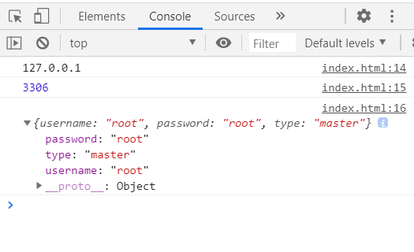

## 正则表达式命名捕获组

ES9 允许命名捕获组使用符号『?<name>』,这样获取捕获结果可读性更强

```js
let str = '<a href="http://www.mi.com">小米</a>';
const reg = /<a href="(?<url>.*)">(?<text>.*)<\/a>/;
const result = reg.exec(str);
console.log(result.groups.url);
console.log(result.groups.text);
```

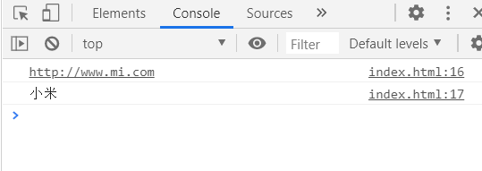

## 正则表达式反向断言

ES9 支持反向断言，通过对匹配结果前面的内容进行判断，对匹配进行筛选。

```js
//声明字符串
let str = "JS5211314 你知道么 555 啦啦啦";

//正向断言
const reg = /\d+(?=啦)/;
const result = reg.exec(str);

//反向断言
const reg = /(?<=么)\d+/;
const result = reg.exec(str);
console.log(result);
```

## 正则表达式 dotAll 模式

正则表达式中点.匹配除回车外的任何单字符，标记『s』改变这种行为，允许行终止符出现

# ECMASript 10 新特性

1. Object.fromEntries
2. trimStart 和 trimEnd
3. Array.prototype.flat 与 flatMap
4. Symbol.prototype.description

# ECMASript 11 新特性

1. String.prototype.matchAll
2. 类的私有属性
3. Promise.allSettled
4. 可选链操作符
5. 动态 import 导入
6. globalThis 对象
