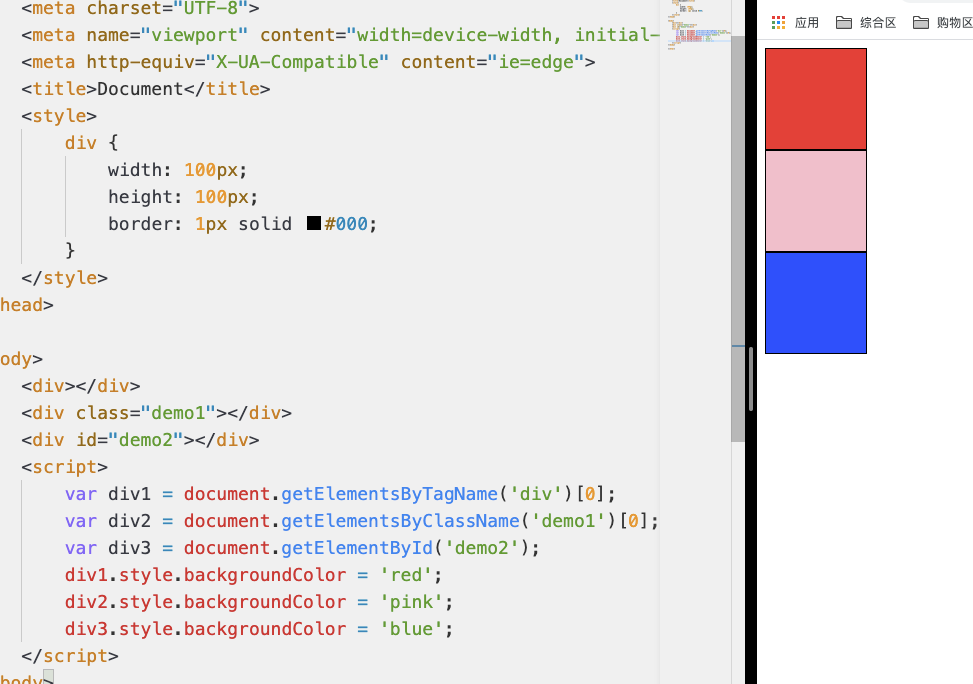
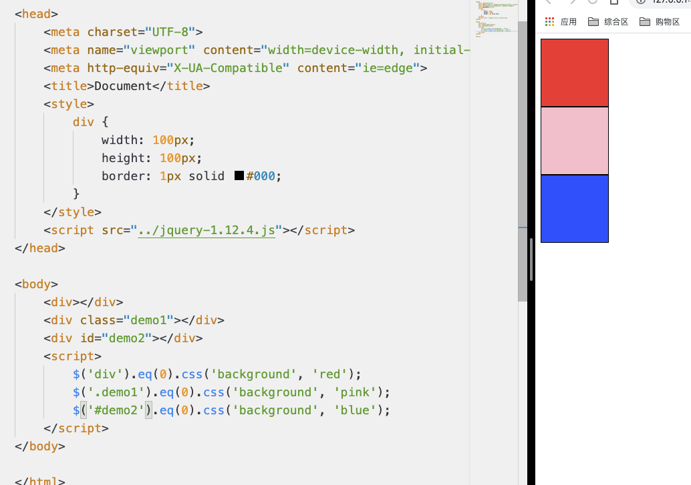
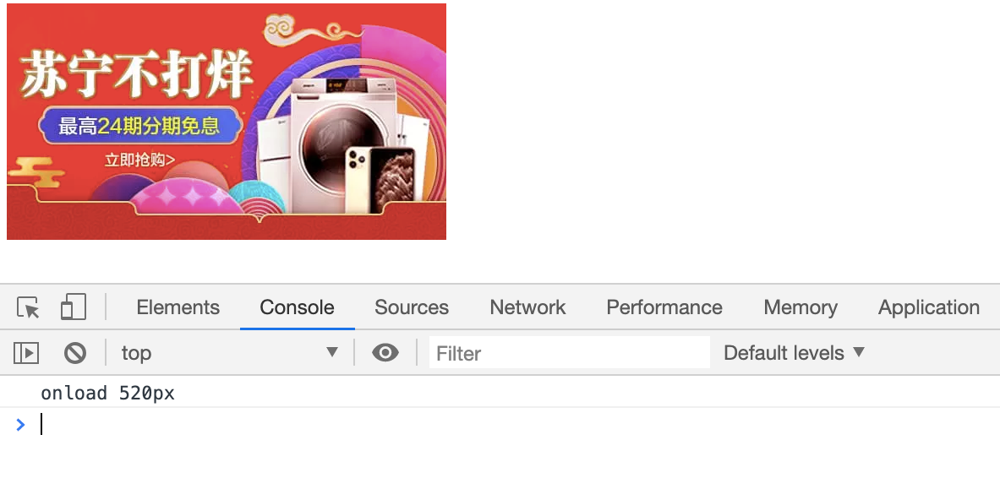
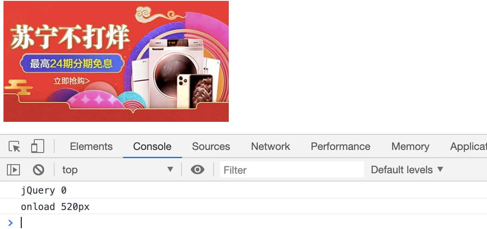
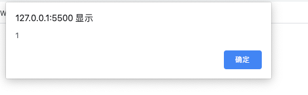
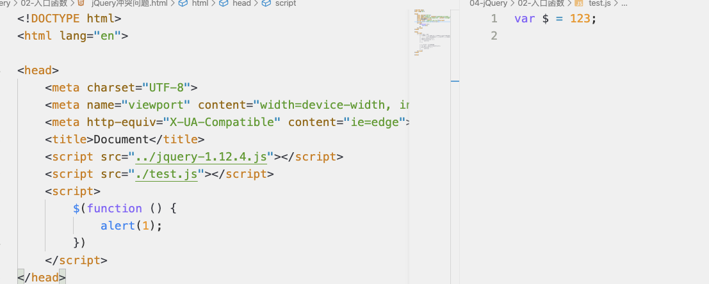

# jQuery 是什么

-   jQuery 是一款优秀的 JavaScript 库，从命名可以看出 jQuery 最主要的用途是用来做查询（jQuery=js+Query）
-   jQuery 除了查询以外,还能让我们对 HTML 文档遍历和操作、事件处理、动画以及 Ajax 变得更加简单

体验 jQuery

原生 JS 设置背景

```html
<!DOCTYPE html>
<html lang="en">
    <head>
        <meta charset="UTF-8" />
        <meta name="viewport" content="width=device-width, initial-scale=1.0" />
        <meta http-equiv="X-UA-Compatible" content="ie=edge" />
        <title>Document</title>
        <style>
            div {
                width: 100px;
                height: 100px;
                border: 1px solid #000;
            }
        </style>
    </head>

    <body>
        <div></div>
        <div class="demo1"></div>
        <div id="demo2"></div>
        <script>
            var div1 = document.getElementsByTagName('div')[0];
            var div2 = document.getElementsByClassName('demo1')[0];
            var div3 = document.getElementById('demo2');
            div1.style.backgroundColor = 'red';
            div2.style.backgroundColor = 'pink';
            div3.style.backgroundColor = 'blue';
        </script>
    </body>
</html>
```



使用 jQuery 设置背景

```html
<!DOCTYPE html>
<html lang="en">
    <head>
        <meta charset="UTF-8" />
        <meta name="viewport" content="width=device-width, initial-scale=1.0" />
        <meta http-equiv="X-UA-Compatible" content="ie=edge" />
        <title>Document</title>
        <style>
            div {
                width: 100px;
                height: 100px;
                border: 1px solid #000;
            }
        </style>
        <script src="../jquery-1.12.4.js"></script>
    </head>

    <body>
        <div></div>
        <div class="demo1"></div>
        <div id="demo2"></div>
        <script>
            $('div')
                .eq(0)
                .css('background', 'red');
            $('.demo1')
                .eq(0)
                .css('background', 'pink');
            $('#demo2')
                .eq(0)
                .css('background', 'blue');
        </script>
    </body>
</html>
```



# 为什么要使用 jQuery？

-   强大选择器: 方便快速查找 DOM 元素
    -   如上面实例所展示一样，通过 jQuery 查找 DOM 元素要比原生 js 快捷很多
    -   jQuery 允许开发者使用 CSS1-CSS3 几乎所有的选择器,以及 jQuery 独创的选择器
-   链式调用: 可以通过.不断调用 jQuery 对象的方法
    -   如上面实例所展示一样，jQuery 可以通过.（点）.不断调用 jQuery 对象的方法，而原生 JavaScript 则不一定
-   隐式遍历(迭代): 一次操作多个元素
-   读写合一: 读数据/写数据使用是一个函数
-   事件处理
-   DOM 操作(C 增 U 改 D 删)
-   样式操作
-   动画
-   丰富的插件支持
-   浏览器兼容(前端开发者痛点)
    -   1.x：兼容 ie678，但相对其它版本文件较大，官方只做 BUG 维护，功能不再新增，最终版本：1.12.4 (2016 年 5 月 20 日).
    -   2.x：不兼容 ie678，相对 1.x 文件较小，官方只做 BUG 维护，功能不再新增，最终版本：2.2.4 (2016 年 5 月 20 日)
    -   3.x：不兼容 ie678，只支持最新的浏览器，很多老的 jQuery 插件不支持这个版本，相对 1.x 文件较小，提供不包含 Ajax/动画 API 版本。

# 如何使用 jQuery？

下载 jQuery 库

引入下载的 jQuery 库

```html
<script src="../jquery-1.12.4.js"></script>
```

# jQuery 与 JavaScript 加载模式对比

使用原生 js 的入口函数获取 DOM 元素的宽高

```html
<!DOCTYPE html>
<html lang="en">
    <head>
        <meta charset="UTF-8" />
        <meta name="viewport" content="width=device-width, initial-scale=1.0" />
        <meta http-equiv="X-UA-Compatible" content="ie=edge" />
        <title>Document</title>
        <script src="./../jquery-1.12.4.js"></script>
        <script>
            window.onload = function() {
                var img = document.getElementsByTagName('img')[0];
                var width = window.getComputedStyle(img).width;
                console.log('onload ' + width);
            };
        </script>
    </head>

    <body>
        
    </body>
</html>
```



使用 jQuery 入口函数获取 DOM 元素宽高

```html
<!DOCTYPE html>
<html lang="en">
    <head>
        <meta charset="UTF-8" />
        <meta name="viewport" content="width=device-width, initial-scale=1.0" />
        <meta http-equiv="X-UA-Compatible" content="ie=edge" />
        <title>Document</title>
        <script src="./../jquery-1.12.4.js"></script>
        <script>
            window.onload = function() {
                var img = document.getElementsByTagName('img')[0];
                var width = window.getComputedStyle(img).width;
                console.log('onload ' + width);
            };

            $(function() {
                $width = $('img').width();
                console.log('jQuery ' + $width);
            });
        </script>
    </head>

    <body>
        
    </body>
</html>
```

清除浏览器数据后查看



原生 js 和 jQuery 入口函数的加载模式不同

原生 js 会等到 DOM 元素加载完毕，并且图片也加载完毕才会执行

jQuery 会等到 DOM 元素加载完毕，但不会等到图片也加载完毕就会执行

# jQuery 入口函数的写法

```html
<script src="../jquery-1.12.4.js"></script>
<script>
    // 方式一
    $(document).ready(function() {
        alert('1');
    });
    // 方式二
    $(function() {
        alert('2');
    });
    // 方式三
    jQuery(document).ready(function() {
        alert('3');
    });
    // 方式四
    jQuery(function() {
        alert('4');
    });
</script>
```

# 解决`$`符号冲突问题

`$`符号冲突怎么办?

很多 js 的框架都提供了类似 jQuery 这样的便捷访问方式,所以很有可能某一天我们在使用多个框架的时,多个框架作者提供的便捷访问方式冲突(A 框架通过`$`访问,B 框架也通过`$`访问)

```html
<!DOCTYPE html>
<html lang="en">
    <head>
        <meta charset="UTF-8" />
        <meta name="viewport" content="width=device-width, initial-scale=1.0" />
        <meta http-equiv="X-UA-Compatible" content="ie=edge" />
        <title>Document</title>
        <script src="../jquery-1.12.4.js"></script>
        <script>
            $(function() {
                alert(1);
            });
        </script>
    </head>

    <body></body>
</html>
```



```html
<!DOCTYPE html>
<html lang="en">
    <head>
        <meta charset="UTF-8" />
        <meta name="viewport" content="width=device-width, initial-scale=1.0" />
        <meta http-equiv="X-UA-Compatible" content="ie=edge" />
        <title>Document</title>
        <script src="../jquery-1.12.4.js"></script>
        <script src="./test.js"></script>
        <script>
            $(function() {
                alert(1);
            });
        </script>
    </head>

    <body></body>
</html>
```

不再 alert

有两种方法解决`$`冲突问题

-   通过`jQuery.noConflict();`释放`$`的使用权
-   自定义一个访问符号，例如：`var gin = jQuery.noConflict();`

注意:

1. 释放操作必须在编写其它 jQuery 代码之前编写
2. 释放之后就不能再使用`$`，改为使用 jQuery

```html
<!DOCTYPE html>
<html lang="en">
    <head>
        <meta charset="UTF-8" />
        <meta name="viewport" content="width=device-width, initial-scale=1.0" />
        <meta http-equiv="X-UA-Compatible" content="ie=edge" />
        <title>Document</title>
        <script src="../jquery-1.12.4.js"></script>
        <script src="./test.js"></script>
        <script>
            // 1.释放$的使用权
            // jQuery.noConflict();
            // jQuery(function () {
            //     alert(1)
            // })

            // 2.自定义一个访问符号
            var gin = jQuery.noConflict();
            gin(function() {
                alert(1);
            });
        </script>
    </head>

    <body></body>
</html>
```
