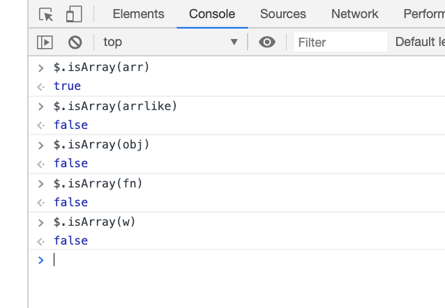

# jQuery 的核心函数

`$();`就代表调用 jQuery 的核心函数

能够接受的参数：

-   接收一个函数
    -   ```js
        $(function() {});
        ```
-   接收一个字符串

    -   接收一个字符串选择器
    -   ```js
        var $box1 = $('.box1');
        var $box2 = $('#box2');
        console.log($box1);
        console.log($box2);
        ```

        

        返回一个 jQuery 对象，对象中保存了找到的 DOM 元素

    -   接收一个字符串代码片段
    -   ```js
        $(function() {
            // 接受一个字符串选择器
            var $box1 = $('.box1');
            var $box2 = $('#box2');
            console.log($box1);
            console.log($box2);
            // 接受一个字符串代码片段
            var $p = $('<p>这是一个段落</p>');
            console.log($p);
        });
        ```

        

        返回一个 jQuery 对象，对象中保存了创建的 DOM 元素

-   接收一个 DOM 元素

    -   ```js
        $(function() {
            // 接受一个字符串选择器
            var $box1 = $('.box1');
            var $box2 = $('#box2');
            console.log($box1);
            console.log($box2);
            // 接受一个字符串代码片段
            var $p = $('<p>这是一个段落</p>');
            console.log($p);
            // 接受一个DOM元素
            var span = document.getElementsByTagName('span')[0];
            var $span = $(span);
            console.log($span);
        });
        ```

        

        会被包装成一个 jQuery 对象返回给我们

# jQuery 对象

jQuery 对象是一个伪数组(有 0 到 length-1 的属性, 并且有 length 属性)

```html
<!DOCTYPE html>
<html lang="en">
    <head>
        <meta charset="UTF-8" />
        <meta name="viewport" content="width=device-width, initial-scale=1.0" />
        <meta http-equiv="X-UA-Compatible" content="ie=edge" />
        <title>Document</title>
        <script src="../jquery-1.12.4.js"></script>
        <script>
            $(function() {
                var $div = $('div');
                console.log($div);
            });
        </script>
    </head>

    <body>
        <div></div>
    </body>
</html>
```


[TOC]

# jQuery 静态方法

## each

**利用原生的 forEach 方法遍历**

-   第一个参数: 遍历到的元素
-   第二个参数: 当前遍历到的索引

注意点: 原生的 forEach 方法只能遍历数组, 不能遍历伪数组

```js
let arr = [1, 3, 5, 7, 9];
let obj = { 0: 1, 1: 3, 2: 5, length: 3 };
arr.forEach(function(value, index) {
    console.log(value, index);
});
obj.forEach(function(value, index) {
    console.log(value, index);
});
```


**利用 jQuery 的 each 静态方法遍历**

-   第一个参数: 当前遍历到的索引
-   第二个参数: 遍历到的元素

jQuery 的 each 方法是可以遍历伪数组的

```js
let arr = [1, 3, 5, 7, 9];
let obj = { 0: 1, 1: 3, 2: 5, length: 3 };
$.each(arr, function(index, value) {
    console.log(index, value);
});
console.log('----------');
$.each(obj, function(index, value) {
    console.log(index, value);
});
```


## map

**利用原生的 map 方法遍历**

-   第一个参数: 当前遍历到的元素
-   第二个参数: 当前遍历到的索引
-   第三个参数: 当前被遍历的数组

注意点: 和原生的 forEach 一样,不能遍历的伪数组

```js
var arr = [1, 3, 5, 7, 9];
var obj = { 0: 1, 1: 3, 2: 5, 3: 7, 4: 9, length: 5 };
arr.map(function(value, index, array) {
    console.log(value, index, array);
});
obj.map(function(value, index, array) {
    console.log(value, index, array);
});
```


**利用 jQuery 的 map 静态方法遍历**

-   第一个参数: 要遍历的数组
-   第二个参数: 每遍历一个元素之后执行的回调函数

回调函数的参数:

-   第一个参数: 遍历到的元素
-   第二个参数: 遍历到的索引

和 jQuery 中的 each 静态方法一样, map 静态方法也可以遍历伪数组

```js
var arr = [1, 3, 5, 7, 9];
var obj = { 0: 1, 1: 3, 2: 5, 3: 7, 4: 9, length: 5 };
$.map(arr, function(value, index) {
    console.log(index, value);
});
console.log('---------');
$.map(obj, function(value, index) {
    console.log(index, value);
});
```


**jQuery 中的 each 静态方法和 map 静态方法的区别**

-   each 静态方法默认的返回值就是, 遍历谁就返回谁
-   map 静态方法默认的返回值是一个空数组
-   each 静态方法不支持在回调函数中对遍历的数组进行处理
-   map 静态方法可以在回调函数中通过 return 对遍历的数组进行处理, 然后生成一个新的数组返回

```js
var arr = [1, 3, 5, 7, 9];
var obj = { 0: 1, 1: 3, 2: 5, 3: 7, 4: 9, length: 5 };
var res1 = $.each(obj, function(index, value) {
    console.log(index, value);
});
console.log('------------');
var res2 = $.map(obj, function(value, index) {
    console.log(index, value);
});
console.log('------------');
console.log(res1);
console.log(res2);
```


```js
var obj = { 0: 1, 1: 3, 2: 5, 3: 7, 4: 9, length: 5 };
var res1 = $.each(obj, function(index, value) {
    return value + index;
});
var res2 = $.map(obj, function(value, index) {
    return value + index;
});
console.log(res1);
console.log('------------');
console.log(res2);
```


## trim

`$.trim();`

-   作用: 去除字符串两端的空格
-   参数: 需要去除空格的字符串
-   返回值: 去除空格之后的字符串

```js
var str = '    zs    ';
console.log(str);
var res = $.trim(str);
console.log(res);
```


## isWindow

`$.isWindow();`

-   作用: 判断传入的对象是否是 window 对象
-   返回值: true/false

```js
// 真数组
var arr = [1, 3, 5, 7, 9];
// 伪数组
var arrlike = { 0: 1, 1: 3, 2: 5, 3: 7, 4: 9, length: 5 };
// 对象
var obj = { name: 'lnj', age: '33' };
// 函数
var fn = function() {};
// window对象
var w = window;
```


## isArray

`$.isArray();`

-   作用: 判断传入的对象是否是真数组
-   返回值: true/false

```js
// 真数组
var arr = [1, 3, 5, 7, 9];
// 伪数组
var arrlike = { 0: 1, 1: 3, 2: 5, 3: 7, 4: 9, length: 5 };
// 对象
var obj = { name: 'lnj', age: '33' };
// 函数
var fn = function() {};
// window对象
var w = window;
```



## isFunction

`$.isFunction()`

-   作用: 判断传入的对象是否是一个函数
-   返回值: true/false

注意点: jQuery 框架本质上是一个函数

```js
// 真数组
var arr = [1, 3, 5, 7, 9];
// 伪数组
var arrlike = { 0: 1, 1: 3, 2: 5, 3: 7, 4: 9, length: 5 };
// 对象
var obj = { name: 'lnj', age: '33' };
// 函数
var fn = function() {};
// window对象
var w = window;
```


## holdReady

`$.holdReady(true);` 作用: 暂停 ready 执行(入口函数的执行)
