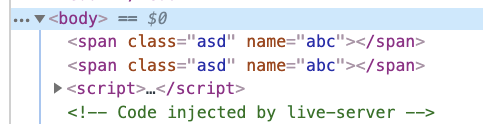

# 基础选择器

| 选择器                          | 名称         | 描述                                   | 返回     | 示例                                                                     |
| ------------------------------- | ------------ | -------------------------------------- | -------- | ------------------------------------------------------------------------ |
| `#id`                           | id 选择器    | 根据给定的 id 匹配一个元素             | 单个元素 | `$("#box");`选取 id 为 box 元素                                          |
| `.class`                        | 类选择器     | 根据给定的类名匹配元素                 | 集合元素 | `$(".box");`选取所有类名为 box 元素                                      |
| `element`                       | 元素选择器   | 根据给定的元素名称匹配元素             | 集合元素 | `$("p");`选取所有`<p>`元素                                               |
| `*`                             | 通配符选择器 | 匹配所有元素                           | 集合元素 | `$("*");`选取所有元素                                                    |
| `selector1,selector2,selectorN` | 并集选择器   | 将所有选择器匹配到的元素合并后一起返回 | 集合元素 | `$("div,p,.box");`选取所有`<div>`元素,所有`<p>`元素和所有类名为 box 元素 |

# 层次选择器

| 选择器                     | 名称           | 描述                                                                       | 返回     | 示例                                                           |
| -------------------------- | -------------- | -------------------------------------------------------------------------- | -------- | -------------------------------------------------------------- |
| `$("ancestor descendant")` | 后代选择器     | 选取 ancestor 元素的所有 descendant 后代标签(不光是儿子,包括孙子/重孙子等) | 集合元素 | `$("div span");`选取`<div>`元素里所有的`<span>`元素            |
| `$("parent > child")`      | 子元素选择器   | 找到选取 parent 元素中所有直接子元素 child(只有儿子,不包括孙子/重孙子等)   | 集合元素 | `$("div>span");`选取`<div>`元素下元素名称是`<span>`的子元素    |
| `$("prev + next")`         | 相邻兄弟选择器 | 选取 prev 元素后面紧跟的那个 next 元素                                     | 集合元素 | `$(".one+div");`选取类名为 one 的下一个同级的`<div>`元素       |
| `$("prev ~ siblings")`     | 通用兄弟选择器 | 选取 prev 元素后面的所有 next 元素                                         | 集合元素 | `$("#two~div");`选取 id 名为 two 元素后面所有同级的`<div>`元素 |

# 内容过滤选择器

-   `:empty` 作用:找到既没有文本内容也没有子元素的指定元素
-   `:parent` 作用: 找到有文本内容或有子元素的指定元素
-   `:contains(text)` 作用: 找到包含指定文本内容的指定元素
-   `:has(selector)` 作用: 找到包含指定子元素的指定元素

```html
<!DOCTYPE html>
<html lang="en">
    <head>
        <meta charset="UTF-8" />
        <meta name="viewport" content="width=device-width, initial-scale=1.0" />
        <title>Document</title>
        <style>
            div {
                width: 100px;
                height: 100px;
                background-color: red;
                margin-top: 5px;
            }
        </style>
        <script src="./../jquery-1.12.4.js"></script>
    </head>

    <body>
        <div></div>
        <div>我是div2</div>
        <div>我是div3</div>
        <div><span></span></div>
        <div>
            <p></p>
        </div>
        <script>
            var $div1 = $('div:empty');
            var $div2 = $('div:parent');
            var $div3 = $('div:contains("我是div")');
            var $div4 = $('div:has("span")');
        </script>
    </body>
</html>
```


其余参考：http://jquery.cuishifeng.cn/

# 属性和属性节点

**属性**

对象身上保存的变量就是属性

通过`对象.属性名称 = 值;` `对象.属性名称;` `对象["属性名称"] = 值;` `对象["属性名称"];`操作属性

**属性节点**

在编写 HTML 代码时,在 HTML 标签中添加的属性就是属性节点`<span name="baidu"></span>`

在浏览器中找到 span 这个 DOM 元素之后, 展开看到的都是属性

在 attributes 属性中保存的所有内容都是属性节点

通过`DOM元素.setAttribute('属性名称', '值');` `DOM元素.getAttribute('属性名称');`操作属性节点

属性和属性节点区别：任何对象都有属性, 但是只有 DOM 对象才有属性节点

# attr 和 removeAttr

## attr(name|pro|key,val|fn)

-   作用: 获取或者设置属性节点的值
-   可以传递一个参数, 也可以传递两个参数
-   如果传递一个参数, 代表获取属性节点的值
-   如果传递两个参数, 代表设置属性节点的值

注意点:

-   如果是获取:无论找到多少个元素, 都只会返回第一个元素指定的属性节点的值

    ```html
    <!DOCTYPE html>
    <html lang="en">
        <head>
            <meta charset="UTF-8" />
            <meta
                name="viewport"
                content="width=device-width, initial-scale=1.0"
            />
            <title>Document</title>
            <script src="./../jquery-1.12.4.js"></script>
        </head>

        <body>
            <span class="span1" name="abc"></span>
            <span class="span2" name="abc"></span>
        </body>
    </html>
    ```

    

-   如果是设置:找到多少个元素就会设置多少个元素

    ```js
    $('span').attr('class', 'asd');
    ```

    

-   如果是设置: 如果设置的属性节点不存在, 那么系统会自动新增

    ```js
    $('span').attr('class', 'asd');
    $('span').attr('hd', 'xyz');
    ```

    

## removeAttr

删除属性节点

注意点: 会删除所有找到元素指定的属性节点

```js
$('span').removeAttr('class');
```


```js
$('span').removeAttr('class name');
```


# prop 和 removeProp

prop 方法特点和 attr 方法一致

removeProp 方法特点和 removeAttr 方法一致

注意点: prop 方法不仅能够操作属性, 他还能操作属性节点

推荐在操作属性节点时,具有 true 和 false 两个属性的属性节点，如 checked, selected 或者 disabled 使用 prop()，其他的使用 attr()

# 类操作相关方法

-   `addClass(class|fn)`作用: 添加一个类。如果要添加多个, 多个类名之间用空格隔开即可
-   `removeClass([class|fn])`作用: 删除一个类。如果想删除多个, 多个类名之间用空格隔开即可
-   `toggleClass(class|fn[,sw])`作用: 切换类。有就删除, 没有就添加

# 文本值相关方法

-   `html([val|fn]);`和原生 JS 中的 innerHTML 一模一样
-   `text([val|fn])`和原生 JS 中的 innerText 一模一样
-   `val([val|fn|arr])`

# 操作 css 样式方法

1. 逐个设置
    ```js
    $('div').css('width', '100px');
    $('div').css('height', '100px');
    $('div').css('background', 'red');
    ```
2. 链式设置。注意点: 链式操作如果大于 3 步, 建议分开
    ```js
    $('div')
        .css('width', '100px').css('height', '100px').css('background', 'blue');
    ```
1. 批量设置
    ```js
    $('div').css({
        width: '100px',
        height: '100px',
        background: 'red'****
    });
    ```
2. 获取 CSS 样式值
    ```js
    console.log($('div').css('background'));
    ```

# 尺寸和位置操作

## offset

获取匹配元素在当前视口的相对偏移。

## postition

获取匹配元素相对父元素的偏移。

## scrollTop

获取网页滚动的偏移位，为了保证浏览器的兼容，获取网页滚动的偏移位需要按照如下写法`$("body").scrollTop()+$("html").scrollTop()`

设置网页滚动偏移位，为了保证浏览器的兼容，设置网页滚动偏移位的时候必须按照如下写法`$("html,body").scrollTop(300);`
