# NodeJs 简介

Node.js 是一个 Javascript 运行环境(runtime)。它让 JavaScript 可以开发后端程序，它几乎能实现其他后端语言能实现的所有功能。

Nodejs 是基于 Google V8 引擎，V8 引擎是 Google 发布的一款开源的 JavaScript 引擎，原来主要用于 Chrome 浏览器的 JS 解释部分，但是 Ryan Dahl 这哥们，鬼才般的，把这个 V8 引擎搬到了服务器上，用于做服务器的软件。

Nodejs 最擅长高并发。Node.js 不为每个客户连接创建一个新的线程，而仅仅使用一个线程。 当有用户连接了，就触发一个内部事件，通过非阻塞 I/O、事件驱动机制，让 Node.js 程序 宏观上也是并行的。

Nodejs 可实现的功能多：Nodejs 不仅可以像其他后端语言一样写动态网站、写接口，还可以应用在云计算平台、游戏开发、区块链开发、即时通讯、跨平台 App 开发、桌面应用 开发（electron）、云直播、物联网领域等

# node 中的函数

Node 中任何一个模块（js 文件）都被一个外层函数所包裹

通过`arguments.callee.toString()`可以看到一个函数：`function(exports,require,module,__filename,__dirname){}`

这个函数是所有模块都有的，node 编译时往其中注入 5 个参数：

- `exports`：暴露模块
- `require`：引入模块
- `module`：exports 属性暴露模块
- `__filename`：当前文件所在的绝对路径
- `__dirname`：当前文件所在文件夹的绝对路径

# Node 中引入模块的流程

## 路径分析

核心模块：在 Node 源码编译就完成了，直接被加进内在中，如（http、fs、path）

路径形式的文件模块：以`./`、`../`、路径形式的文件模块，将其转化为真实路径，根据真实路径索引去查找。

第三方模块：它会从文件的`node_modules`逐层往上找，直到根目录的`node_modules`。

## 文件定位

`require()`中的文件，如果没有后缀名，会以`.js`、`.json`、`.node`次序补充扩展名，依次尝试。

## 编译执行

`.js`：fs 模块同步读取文件编译执行

`.json`：fs 模块同步读取文件，用`JSON.parse()`解析返回结果

`.node`：这是 c/c++编写的扩展文件，通过`dlopen()`方法编译

其他扩展名会以`.js`文件载入

# CommonJs 和 Nodejs 模块、自定义模块

## CommonJs

JavaScript 是一个强大面向对象语言，它有很多快速高效的解释器。然而，JavaScript 标准定义的 API 是为了构建基于浏览器的应用程序。并没有制定一个用于更广泛的应用程序 的标准库。CommonJS 规范的提出,主要是为了弥补当前 JavaScript 没有标准库的缺陷。它的终极目标就是：提供一个类似 Python，Ruby 和 Java 语言的标准库，而不只是让 JavaScript 停留在小脚本程序的阶段。用 CommonJS API 编写出的应用，不仅可以利用 JavaScript 开发客户端应用，而且还可以编写以下应用。

- 服务器端 JavaScript 应用程序。（nodejs）
- 命令行工具
- 桌面图形界面应用程序

CommonJS 就是模块化的标准，nodejs 就是 CommonJS（模块化）的实现。

## Nodejs 中的模块化

Node 应用由模块组成，采用 CommonJS 模块规范。

在 Node 中，模块分为两类：一类是 Node 提供的模块,称为**核心模块**；另一类是用户编写的模块，称为**文件模块**。

核心模块部分在 Node 源代码的编译过程中，编译进了二进制执行文件。在 Node 进程启动时，部分核心模块就被直接加载进内存中，所以这部分核心模块引入时，文件定位和 编译执行这两个步骤可以省略掉，并且在路径分析中优先判断，所以它的加载速度是最快的。如：HTTP 模块 、URL 模块、Fs 模块都是 nodejs 内置的核心模块，可以直接引入使用。

文件模块则是在运行时动态加载，需要完整的路径分析、文件定位、编译执行过程、速度相比核心模块稍微慢一些，但是用的非常多。这些模块需要我们自己定义。接下来我 们看一下 nodejs 中的自定义模块。

CommonJS（Nodejs）中自定义模块的规定：

1. 我们可以把公共的功能抽离成为一个单独的 js 文件作为一个模块，默认情况下面这个模块里面的方法或者属性，外面是没法访问的。如果要让外部可以访问模块里面的方法或 者属性，就必须在模块里面通过 exports 或者 module.exports 暴露属性或者方法。
2. 在需要使用这些模块的文件中，通过 require 的方式引入这个模块。这个时候就可 以使用模块里面暴露的属性和方法。

# 包与 NPM

Nodejs 中除了它自己提供的**核心模块**外，我们可以**自定义模块**，也可以使用**第三方的模块**。Nodejs 中**第三方模块由包组成**，可以通过**包**来对一组具有相互依赖关系的模块进行统一管理。

完全符合 CommonJs 规范的包目录一般包含如下这些文件

- package.json：包描述文件
- bin：用于存放可执行二进制文件的目录
- lib：用于存放 JavaScript 代码的目录
- doc：用于存放文档的目录。

在 NodeJs 中通过 NPM 命令来下载第三方的模块（包）。

## NPM 命令

npm 是世界上最大的开放源代码的生态系统。我们可以通过 npm 下载各种各样的包，这些源代码（包）我们可以在 https://www.npmjs.com找到。

NPM 命令详解：

1. `npm -v`查看 npm 版本
2. 使用 npm 命令安装模块。`npm install Module Name`
3. `npm uninstall moudleName`卸载模块
4. `npm list`查看当前目录下已安装的 node 包
5. `npm info jquery`查看 jquery 的版本
6. 指定版本安装`npm install jquery@1.8.0`
7. 查看当前项目的依赖模块`npm ls --depth 0`
8. 查看全局依赖模块`npm ls -g --depth 0`
9. 查看全局安装的位置`npm root -g`

npm 设置淘宝源`npm config set registry https://registry.npm.taobao.org`

## yarn 的使用

初始化项目：`yarn init -y`

下载项目的所有声明的依赖：`yarn`

下载指定的运行时依赖包：`yarn add webpack@3.2.1`

下载指定的开发时依赖包：`yarn add webpack@3.2.1 -d`

全局下载指定包：`yarn global add webpack`

删除依赖包：`yarn remove webpack`、`yarn global remove webpack`

运行项目中配置的 script：`yarn run xxx`

查看某个包的信息：`yarn info xxx`

设置淘宝镜像：`yarn config set registry https://registry.npm.taobao.org`

## package.json

`npm init -y`生成 package.json。package.json 定义了这个项目所需要的各种模块，以及项目的配置信息(比如名称、版本、许可证等元数据)

dependencies 与 devDependencies 之间的区别

- dependencie 配置当前程序所依赖的其他包（运行依赖）
- devDependencie 配置当前程序所依赖的其他包，比如一些工具之类的配置在这里（开发依赖）

`^3.x.x`：锁定大版本，以后安装包的时候，保证包是 3.x.x 版本，x 默认取最新的

`~3.1.x`：锁定小版本，以后安装包的时候，保证包是 3.1.x 版本，x 默认取最新的

`3.1.1`：锁定完整版本，以后安装包的时候，保证包必须是 3.1.1 版本

# Buffer 缓冲器

Buffer 是一个和数组类似的对象，用于存储数据，不同的是 Buffer 是专门用来保存二进制数据的。

Buffer 的效率很高，存储和读取很快，直接对计算机的内在进行操作。

Buffer 的大小一旦确定了，不可修改。

每个元素占用内在的大小为 1 字节。

Buffer 是 Node 中的非常核心的模块，无需下载、无需引入即可使用。

创建 Buffer 对象：

1. 将一个字符串存入 Buffer 中

   ```js
   let str = "hello world";
   let buf1 = Buffer.from(str);
   ```

2. alloc 这种方式去创建 Buffer 实例，效率一般

   ```js
   let buf2 = Buffer.alloc(10);
   ```

3. allocUnsafe 这种方式去创建 Buffer 实例效率很好，但是存在一些安全问题

   ```js
   let buf3 = Buffer.allocUnsafe(10);
   ```

4. 使用 new 关键字创建一个 Buffer 实例（即将被弃用），效率很低

   ```js
   let buf4 = new Buffer(10);
   ```

注意：通过`console.log();`输出 Buffer 会自动将存储的内容转换成十六进制再输出

## Buffer 实例方法

`buf.write(string[, offset[, length]][, encoding])`

- `string` 要写入 buf 的字符串。
- `offset` 开始写入 string 之前要跳过的字节数。默认值: 0。
- `length` 要写入的字节数。默认值: buf.length - offset。
- `encoding` string 的字符编码。默认值: 'utf8'。

```js
// let buf = Buffer.alloc(5, 17);
let buf = Buffer.alloc(5);
buf.write("abcdefg");
console.log(buf);
```

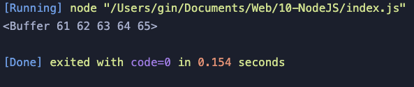

```js
let buf = Buffer.alloc(5);
buf.write("abcdefg", 2);
console.log(buf);
```

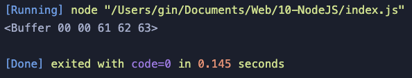

```js
let buf = Buffer.alloc(5);
buf.write("abcdefg", 2, 1);
console.log(buf);
```

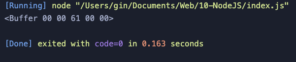

```js
let buf = Buffer.alloc(5);
buf.write("abcdefg");
console.log(buf.toString());
let res1 = buf.slice().toString();
let res2 = buf.slice(2).toString();
let res3 = buf.slice(2, 4).toString();
console.log(res1);
console.log(res2);
console.log(res3);
```

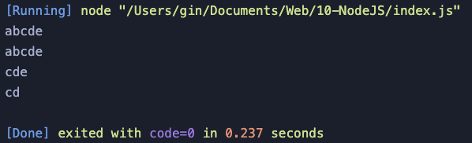

## Buffer 静态方法

1. `Buffer.isEncoding(encoding)`检查是否支持某种编码格式
2. `Buffer.isBuffer(obj)`检查是否是 Buffer 类型对象
3. `Buffer.byteLength(string[, encoding])`获取 Buffer 实际字节长度。注意点: 一个汉字占用三个字节
4. `Buffer.concat(list[, totalLength])`合并 Buffer 中的数据

```js
let buf1 = Buffer.from("123");
let buf2 = Buffer.from("abc");
let res = Buffer.concat([buf1, buf2]);
console.log(res.toString());
```

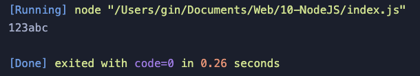

# fs 文件系统

## 简单文件写入

fs.writeFile(file, data[,options], callback)

- file：文件路径 + 文件名
- data：要写入的数据
- options：配置选项（可选参数）
  - flag：打开文件要进行的操作，默认是 w。w 直接写入，a 追加
  - mode：文件权限的限制，默认值是 0o666。0o111：文件可被执行。0o111：文件可被执行。0o222：文件可被写入。0o444：文件可被读取
  - encoding：默认 utf8
- callback：回调函数
  - err：错误对象

不足之处：简单文件写入是一次性把所有要写入的数据加载到内在中，对于比较在的文件容易产生内在溢出，适用于较小的文件写入。

## 流式文件写入

fs.createWriteStream(path[, options])

- path：文件路径 + 文件名
- options：配置选项（可选参数）
  - flags：打开文件要进行的操作，默认是 w。w 直接写入，a 追加
  - mode：文件权限的限制，默认值是 0o666。0o111：文件可被执行。0o111：文件可被执行。0o222：文件可被写入。0o444：文件可被读取
  - encoding：默认 utf8
- fd：文件的唯一标识。
- autoClose：自动关闭，当数据操作完毕，自动关闭文件，默认是 true
- start：文件写入的起始位置

```js
let fs = require("fs");
let ws = fs.createWriteStream("./demo.txt");
// 只要使用了流，必须给流回监听
ws.on("open", () => {
  console.log("可写流打开了");
});
ws.on("open", () => {
  console.log("可写流关闭了");
});
// 写入数据
ws.write("hello");
ws.write("吃饭了吗");
ws.write("没吃你就饿着吧");
ws.close(); // 一定要关闭流
```

## 简单文件读取

fs.readFile(path[,options],callback)

- path：文件路径 + 文件名
- options：配置选项（可选参数）
  - flag：打开文件要进行的操作，默认是 w。w 直接写入，a 追加
  - encoding：默认 utf8
- callback：回调函数
  - err：错误对象
  - data：数据

## 流式文件读取

fs.createReadStream(path[, options])

- highWaterMark：每次读取数据的大小，默认值是：64 \* 1024
- start：读取的起始点
- end：读取的结束点

```js
let fs = require("fs");
// 对于可读流来说，当没有数据可继续读取的时候，会自动关闭可读流
let rs = fs.createReadStream("./demo.txt");
let ws = fs.createWriteStream("../demo.txt");
// 只要使用了流，必须给流回监听
rs.on("open", () => {
  console.log("可读流打开了");
});
rs.on("close", () => {
  console.log("可读流关闭了");
  ws.close(); // 注意在此处关闭可写流
});
ws.on("open", () => {
  console.log("可写流打开了");
});
ws.on("close", () => {
  console.log("可写流关闭了");
});
// 当可可读流绑定一个data事件，会自动触发流读取文件
rs.on("data", () => {
  console.log(data);
});
```

# path 内置模块

不同操作系统的路径分隔符不统一, 所以要进行路径拼接 `path.join('路径', '路径', ...)`

Windows 上是  `\`, Linux 上是  `/`

- 大多数情况下使用绝对路径，因为相对路径有时候相对的是命令行工具的当前工作目录
- 在读取文件或者设置文件路径时都会选择绝对路径

# Node.js 异步编程

## 同步 API, 异步 API

同步 API：只有当前 API 执行完成后，才能继续执行下一个 API

异步 API：当前 API 的执行不会阻塞后续代码的执行

同步 API 可以从返回值中拿到 API 执行的结果, 但是异步 API 是不可以的

使用回调函数获取异步 API 执行结果

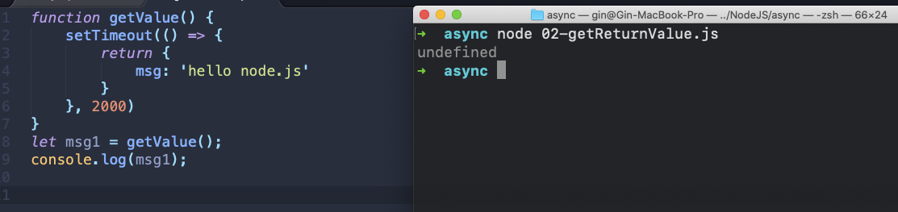

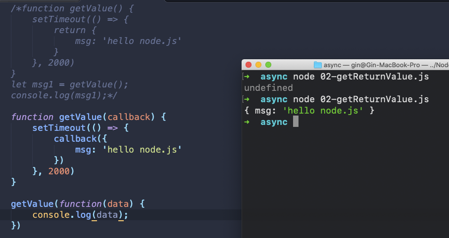

同步 API, 异步 API 的区别（代码执行顺序）:

- 同步 API 从上到下依次执行，前面代码会阻塞后面代码的执行
- 异步 API 执行代码的时候并不是遇到什么执行什么，而是先将所有的同步 API 执行完，再去执行异步 API。

node.js 从上到下依次执行代码，遇到同步 API 把它拿到同步代码执行区中去执行，遇到异步 API 不会执行，而是把它放到异步代码执行区中，当代码中所有的同步代码执行完后，再到异步代码执行区中去依次的执行代码，当异步代码执行完成后，系统会去回调函数队列中去找异步 API 所对应的回调函数，然后把回调函数放到同步代码执行区中再去执行。

## Promise

Promise 出现的目的是解决 Node.js 异步编程中回调地狱的问题。

```js
const fs = require("fs");

let promise = new Promise((resolve, reject) => {
  fs.readFile("./100.txt", "utf8", (err, result) => {
    if (err != null) {
      reject(err);
    } else {
      resolve(result);
    }
  });
});

promise
  .then((result) => {
    console.log(result);
  })
  .catch((err) => {
    console.log(err);
  });
```

异步函数是异步编程语法的终极解决方案，它可以让我们将异步代码写成同步的形式，让代码不再有回调函数嵌套，使代码变得清晰明了。

**async** 关键字

1. 普通函数定义前加 async 关键字 普通函数变成异步函数
2. 异步函数默认返回 promise 对象
3. 在异步函数内部使用 return 关键字进行结果返回 结果会被包裹的 promise 对象中 return 关键字代替了 resolve 方法
4. 在异步函数内部使用 throw 关键字抛出程序异常
5. 调用异步函数再链式调用 then 方法获取异步函数执行结果
6. 调用异步函数再链式调用 catch 方法获取异步函数执行的错误信息

**await** 关键字

1. await 关键字只能出现在异步函数中
2. await promise await 后面只能写 promise 对象 写其他类型的 API 是不不可以的
3. await 关键字可以暂停异步函数向下执行，直到 promise 返回结果

```js
const fs = require("fs");
// 改造现有异步函数api 让其返回promise对象 从而支持异步函数语法
const promisify = require("util").promisify;
// 调用promisify方法改造现有异步API 让其返回promise对象
const readFile = promisify(fs.readFile);

async function run() {
  let r1 = await readFile("./1.txt", "utf8");
  let r2 = await readFile("./2.txt", "utf8");
  let r3 = await readFile("./3.txt", "utf8");
  console.log(r1);
  console.log(r2);
  console.log(r3);
}

run();
```

# MongoDB

## 数据库概述

数据库即存储数据的仓库，可以将数据进行有序的分门别类的存储。它是独立于语言之外的软件，可以通过 API 去操作它。

数据库的分类：

- 关系型数据库：MySQL、Oracle、DB2...
  - 特点：关系紧密，都是表
  - 优点：
    1. 易于维护：都是使用表结构，格式一致;
    2. 使用方便：SQL 语言通用，可用于复杂查询;
    3. 高级查询：可用于一个表以及多个表之间非常复杂的查询。
  - 缺点：
    1. 读写性能比较差，尤其是少量数据的高效率读写;
    2. 有固定的表结构，字段不可随意更改，灵活度稍欠;
    3. 高并发读写需求，传统关系型数据库来说，硬盘 I/O 是一个很大的瓶颈。
- 非关系型数据库：MongoDB、Redis...
  - 特点：关系不紧密，有文档，有键值对
  - 优点：
    1. 格式灵活：存储数据的格式可以是 key，value 形式。
    2. 速度快：非关系型数据库可以内在作为载体，而关系型数据库只能使用硬盘。
    3. 易用：非关系型数据库部署简单。
  - 缺点：
    1. 不支持 sql，学习和使用成本较高
    2. 不支持事务
    3. 复杂查询时语句过于繁琐。

MongoDB 可视化操作软件，是使用图形界面操作数据库的一种方式。

在一个数据库软件中可以包含多个数据仓库，在每个数据仓库中可以包含多个数据集合，每个数据集合中可以包含多条文档（具体的数据）。

| 术语         | 解释说明                                                   |
| ------------ | ---------------------------------------------------------- |
| `database`   | 数据库，mongoDB 数据库软件中可以建立多个数据库             |
| `collection` | 集合，一组数据的集合，可以理解为 JavaScript 中的数组       |
| `document`   | 文档，一条具体的数据，可以理解为 JavaScript 中的对象       |
| `field`      | 字段，文档中的属性名称，可以理解为 JavaScript 中的对象属性 |

## MongoDB 基本命令

1. db : 查看当前在操作哪一个数据库
2. show dbs ：查看数据库列表（一共有几个数据库，备注：如果数据库为空，不出现在列表中）
3. use test :切换到 test 数据库，如果不存在，则创建一个 test 库
4. db.students.insert({}) ：向当前数据库的 students 集合中插入一个文档。
5. show collections ：展示当前数据库中所有的集合。

## Mongoose 的使用

Mongoose 是一个对象文档模型（ODM）库，它对 Node 原生的 MongoDB 模块进行了进一步的优化封装，并提供了更多的功能。

优势：

1. 可以为文档创建一个模式结构（Schema）
2. 可以对模型中的对象/文档进行验证
3. 数据可以通过类型转换为对象模型
4. 可以使用中间件来应用业务逻辑挂钩
5. 比 Node 原生的 MongoDB 驱动更容易

核心对象：

- Schema：模式对象，通过 Schema 可以对集合进行约束

- Model：模型对象，相当于数据库中的集合，通过该对象可以对集合进行操作
- Document：文档对象，它和数据库中的文档相对就，通过它可以读取文档的信息，也可以对文档进行各种操作

使用 Node.js 操作 MongoDB 数据库需要依赖 Node.js 第三方包 mongoose

使用 mongoose 提供的 connect 方法即可连接数据库。

```js
const mongoose = require("mongoose");
mongoose
  .connect("mongodb://localhost/playground", {
    useNewUrlParser: true,
    useUnifiedTopology: true,
  })
  .then(() => {
    console.log("数据库连接成功");
  })
  .catch((err) => {
    console.log("数据库连接失败", err);
  });
```

在 MongoDB 中不需要显式创建数据库，如果正在使用的数据库不存在，MongoDB 会自动创建。

## MongoDB 增删改查操作

### 创建集合

创建集合分为两步，一是对对集合设定规则，二是创建集合，创建 mongoose.Schema 构造函数的实例即可创建集合。

```js
// 设定集合规则
const courseSchema = new mongoose.Schema({
  name: String,
  author: String,
  isPublished: Boolean,
});
// 创建集合并应用规则
const Course = mongoose.model("Course", courseSchema);
```

### 创建文档

创建文档实际上就是向集合中插入数据。

方法一：分为两步：第一步创建集合实例。第二步调用实例对象下的 save 方法将数据保存到数据库中。

```js
const course = new Course({
  name: "node.js",
  author: "gin",
  isPublished: true,
});
course.save();
```

方法二：create 方法创建

```js
Course.create(
  { name: "javascript", author: "sunny", isPublished: false },
  (err, result) => {
    console.log(err);
    console.log(result);
  }
);
```

### mongoDB 数据库导入数据

找到 mongodb 数据库的安装目录，将安装目录下的 bin 目录放置在环境变量中。

`mongoimport –d 数据库名称 –c 集合名称 –-file 要导入的数据文件`

```js
mongoimport -d playground -c users --file ./user.json
```

### 查询文档

查询用户集合中的所有文档 `User.find().then(result => console.log(result));`

通过`_id`字段查找文档`User.find({_id: '5c09f267aeb04b22f8460968'}).then(result => console.log(result))`

findOne 方法返回一条文档 默认返回当前集合中的第一条文档`User.findOne({name: '李四'}).then(result => console.log(result))`

查询用户集合中年龄字段大于 20 并且小于 40 的文档`User.find({age: {$gt: 20, $lt: 40}}).then(result => console.log(result))`

查询用户集合中 hobbies 字段值包含足球的文档`User.find({hobbies: {$in: ['足球']}}).then(result => console.log(result))`

选择要查询的字段`User.find().select('name email -_id').then(result => console.log(result))`

根据年龄字段进行升序排列`User.find().sort('age').then(result => console.log(result))`

根据年龄字段进行降序排列`User.find().sort('-age').then(result => console.log(result))`

查询文档跳过前两条结果 限制显示 3 条结果`User.find().skip(2).limit(3).then(result => console.log(result))`

注意：

- find 方法不管有没有数据，都返回一个数组
- findOne 方法找到了返回一个对象，没找到返回 null

### 删除文档

`Course.findOneAndDelete({}).then(result => console.log(result))`查找到一条文档并且删除，返回删除的文档，如果查询条件匹配了多个文档 那么将会删除第一个匹配的文档

删除多条文档`User.deleteMany({}).then(result => console.log(result))`

### 更新文档

`User.updateOne({查询条件}, {要修改的值}).then(result => console.log(result))`更新单个

`User.updateMany({查询条件}, {要更改的值}).then(result => console.log(result))`更新多个

mongoose 中的增删改查方法中如果没有指定回调函数，则返回值是一个 Promise 对象

### mongoose 验证

在创建集合规则时，可以设置当前字段的验证规则，验证失败就则输入插入失败。

- `required: true` 必传字段
- `minlength：3` 字符串最小长度
- `maxlength: 20` 字符串最大长度
- `min: 2` 数值最小为 2
- `max: 100` 数值最大为 100
- `enum: ['html', 'css', 'javascript', 'node.js']`
- `trim: true` 去除字符串两边的空格
- `validate`: 自定义验证器
- `default`: 默认值

获取错误信息：`error.errors['字段名称'].message`

```js
const postSchema = new mongoose.Schema({
  publishDate: {
    type: Date,
    // 默认值
    default: Date.now,
  },
  category: {
    type: String,
    // 枚举 列举出当前字段可以拥有的值
    enum: {
      values: ["html", "css", "javascript", "node.js"],
      message: "分类名称要在一定的范围内才可以",
    },
  },
  author: {
    type: String,
    validate: {
      validator: (v) => {
        // 返回布尔值
        // true 验证成功
        // false 验证失败
        // v 要验证的值
        return v && v.length > 4;
      },
      // 自定义错误信息
      message: "传入的值不符合验证规则",
    },
  },
});

const Post = mongoose.model("Post", postSchema);
```

### 集合关联

通常**不同集合的数据之间是有关系的**，例如文章信息和用户信息存储在不同集合中，但文章是某个用户发表的，要查询文章的所有信息包括发表用户，就需要用到集合关联。

- 使用 id 对集合进行关联
- 使用 populate 方法进行关联集合查询

```js
// 用户集合
const User = mongoose.model(
  "User",
  new mongoose.Schema({ name: { type: String } })
);
// 文章集合
const Post = mongoose.model(
  "Post",
  new mongoose.Schema({
    title: { type: String },
    // 使用ID将文章集合和作者集合进行关联
    author: { type: mongoose.Schema.Types.ObjectId, ref: "User" },
  })
);
//联合查询
Post.find()
  .populate("author")
  .then((err, result) => console.log(result));
```

# Node 原生服务器

网站的组成

- 网站应用程序主要分为两大部分：客户端和服务器端。
- 客户端：在浏览器中运行的部分，就是用户看到并与之交互的界面程序。使用 HTML、CSS、JavaScript 构建。
- 服务器端：在服务器中运行的部分，负责存储数据和处理应用逻辑。

Node 网站服务器：能够提供网站访问服务的机器就是网站服务器，它能够接收客户端的**请求**，能够对请求做出**响应**。

IP 地址：互联网中设备的唯一标识。IP 是 Internet Protocol Address 的简写，代表互联网协议地址

由于 IP 地址难于记忆，所以产生了域名的概念，所谓域名就是平时上网所使用的网址。http://www.baidu.com => https://182.61.200.6:443
虽然在地址栏中输入的是网址, 但是最终还是会将域名转换为 ip 才能访问到指定的网站服务器。

本机域名：localhost

本地 IP ：127.0.0.1

```js
const http = require("http");

const app = http.createServer((request, response) => {
  response.setHeader("content-type", "text/html;charset=utf8");
  response.end("<h1>中国</h1>");
});

app.listen(3000, (err) => {
  if (!err) {
    console.log("服务器启动成功");
    return;
  }
  console.log(err);
});
```

## GET 请求与 POST 请求

HTTP 请求，最初设定了八种方法（也称为“动作”）。这八种方法本质上没有任何区别。只是让请求，更加有主义而已。

八种方法分别为：OPETIONS、HEAD、GET、POST、PUT、DELETE、TRACE、CONNECT

这八种方法最终经过“岁月沉淀”后，常用的只有两种，即：GET 和 POST

**GET**：

含义：从指定的资源获取数据（一种“索取”的感觉）。

单纯获取数据、请求中不包含敏感数据时使用 GET 较为合适。

**POST**：

含义：向指定的资源提交要被处理的数据（一种“交差”的感觉）

传送相对敏感数据、请求的结果有持续性的副作用，例如：传递的数据要作为数据源写入数据库时使用 POST 较为合适。

备注：使用了 POST 不代表绝对的安全

常见的 GET 请求：

1. 浏览器地址输入网址时（浏览器请求网页时 GET 请求，且不可更改）
2. 可以请求外部资源的 html 标签，例如：`img`、`a`、`link`、`script`
3. 发送 Ajax 时明确指出了使用 GET 请求
4. form 表单提交时没有指明方式，默认使用 GET

常见的 POST 请求：

1. 发送 Ajax 时明确指出了使用 POST 请求
2. 使用第三方发送 Ajax 请求库时明确指出用 POST
3. form 表单提交时明确指出使用 POST 方式
   客户端向服务器端发送请求时，有时需要携带一些客户信息，客户信息需要通过请求参数的形式传递到服务器端，比如登录操作。

## GET 请求参数

- 参数被放置在浏览器地址栏中，例如：http://localhost:3000/?name=zhangsan&age=20
- 参数获取需要借助系统模块 url，url 模块用来处理 url 地址

```js
const http = require("http");
// 导入url系统模块 用于处理url地址
const url = require("url");
const app = http.createServer();
app.on("request", (req, res) => {
  // 将url路径的各个部分解析出来并返回对象
  // true 代表将参数解析为对象格式
  let { query } = url.parse(req.url, true);
  console.log(query);
});
app.listen(3000);
```

## POST 请求参数

- 参数被放置在请求体中进行传输
- 获取 POST 参数需要使用 data 事件和 end 事件
- 使用 querystring 系统模块将参数转换为对象格式

```js
// 用于创建网站服务器的模块
const http = require("http");
// app对象就是网站服务器对象
const app = http.createServer();
// 处理请求参数模块
const querystring = require("querystring");
// 当客户端有请求来的时候
app.on("request", (req, res) => {
  // post参数是通过事件的方式接受的
  // data 当请求参数传递的时候出发data事件
  // end 当参数传递完成的时候出发end事件

  let postParams = "";

  req.on("data", (params) => {
    postParams += params;
  });

  req.on("end", () => {
    console.log(querystring.parse(postParams));
  });

  res.end("ok");
});
// 监听端口
app.listen(3000);
console.log("网站服务器启动成功");
```

# HTTP 协议

协议是指计算机通信网络中两台计算机之间进行通信所必须共同遵守的规定或规则。

HTTP（HyperText Transfer Protocol）协议也叫超文本传输协议，是一种基于 TCP/IP 的应用层通信，这个协议详细规定了浏览器和万维网服务器之间互相通信的规则。

客户端与服务端通信时传输的内容我们称之为报文。

HTTP 就是一个通信规则，这个规则规定了客户端发送给服务器的报文格式，也规定了服务器发送给客户端的报文格式。实际我们要学习的就是这两种报文。客户端发送给服务器的称为**请求报文**，服务器发送给客户端的称为**响应报文**。

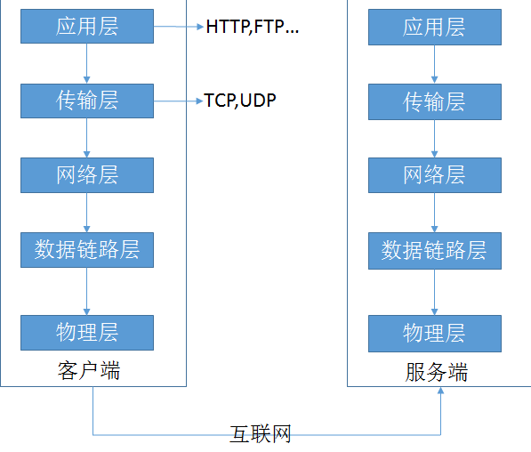

版本：

- http1.0（老版本）：不支持长连接
- http1.1（主流版本）
  - 优点：支持长连接
  - 弊端：同时发送资源的数量过小
- Http2.0（最新版）：同时发送资源的数量稍有提升

报文（请求报文、响应报文）的组成：

1. 报文首行
2. 报文头
3. 空行（仅仅作为一个分割）
4. 报文体

## 分析 GET 请求报文(给服务器看的)

> ```
> GET http://localhost:3000/meishi HTTP/1.1
> Host: localhost:3000
> Connection: keep-alive
> Upgrade-Insecure-Requests: 1
> User-Agent: Mozilla/5.0 (Windows NT 10.0; Win64; x64) AppleWebKit/537.36 (KHTML, like Gecko) Chrome/75.0.3770.142 Safari/537.36
> DNT: 1
> Accept: text/html,application/xhtml+xml,application/xml;q=0.9,image/webp,image/apng,*/*;q=0.8,application/signed-exchange;v=b3
> Accept-Encoding: gzip, deflate, br
> Accept-Language: zh-CN,zh;q=0.9,en-US;q=0.8,en;q=0.7
> 空行
> 空行
> ```

**报文首行：**

> ```
> GET http://localhost:3000/two HTTP/1.1
>     -请求类型 协议名://主机名:端口号/路由关键词 使用协议的版本
> ```

**报文头：**

> ```
> Host: localhost:3000
>       --访问的主机名（地址，仅仅包含主机名+端口号）
>       --防盗链、广告计费
> Connection: keep-alive
>       --告诉服务器，浏览器端支持长连接
> Upgrade-Insecure-Requests: 1
>       --告诉服务器，浏览器端支持https协议
> User-Agent: Mozilla/5.0 (Windows NT 10.0; Win64; x64) AppleWebKit/537.36 (KHTML, like Gecko) Chrome/75.0.3770.142 Safari/537.36
>       --用户代理，告知服务器你的浏览器内核以及品牌，早期的时候用于判断用户的浏览器是拿一个品牌，现在不可用了。
> DNT: 1
>       --禁止跟踪，告知服务器禁止跟踪，并不是写了该字段服务器就一定遵守。
> Accept: text/html,application/xhtml+xml,application/xml;q=0.9,image/webp,image/apng,*/*;q=0.8,application/signed-exchange;v=b3
>       --告知服务器浏览器能接受的文件类型，q是资源的优先级，取值范围是0-1,1的权限最高，默认是1
> Accept-Encoding: gzip, deflate, br
>       --告诉服务器浏览器能支持的文件压缩格式
> Accept-Language: zh-CN,zh;q=0.9,en-US;q=0.8,en;q=0.7
>       --告诉服务器，浏览器能够接受的语言
> ```

**空行：**

**报文体：**

> ```
> GET 请求没有报文体
> ```

## 分析 POST 请求报文(给服务器看的)

> ```
> POST http://localhost:3000/demo HTTP/1.1
> Host: localhost:3000
> Connection: keep-alive
> Content-Length: 16
> Cache-Control: max-age=0
> Origin: http://localhost:63342
> Upgrade-Insecure-Requests: 1
> DNT: 1
> Content-Type: application/x-www-form-urlencoded
> User-Agent: Mozilla/5.0 (Windows NT 10.0; Win64; x64) AppleWebKit/537.36 (KHTML, like Gecko) Chrome/75.0.3770.142 Safari/537.36
> Accept: text/html,application/xhtml+xml,application/xml;q=0.9,image/webp,image/apng,*/*;q=0.8,application/signed-exchange;v=b3
> Referer: http://localhost:63342/node/day04/1.express%E6%9C%8D%E5%8A%A1%E5%99%A8/demo.html?_ijt=tjfnb0cpos62ql8umjmm9v24ve
> Accept-Encoding: gzip, deflate, br
> Accept-Language: zh-CN,zh;q=0.9,en-US;q=0.8,en;q=0.7
> Cookie: Webstorm-9af2238=09820128-3adb-43e4-8242-a6f65c9e523a
>
> name=kobe&age=18
> ```

**报文首行：**

> ```
> POST http://localhost:3000/demo HTTP/1.1
> ```

**报文头：**

> ```
> Host: localhost:3000
>     --访问的主机名（地址，仅仅包含主机名+端口号）
> Connection: keep-alive
>     --告诉服务器，浏览器端支持长连接
> Content-Length: 16
>     --请求体的长度
> Cache-Control: max-age=0
>     --用于控制强缓存
> Origin: http://localhost:63342
>     --当前所处位置（主机位置+端口位置）
> Upgrade-Insecure-Requests: 1
>     --告诉服务器，浏览器端支持https协议
> DNT: 1
>     --禁止跟踪，告知服务器禁止跟踪，并不是写了该字段服务器就一定遵守。
> Content-Type: application/x-www-form-urlencoded
>     --标识该请求是来自于一个form表单，并且以urlencoded形式进行编码
> User-Agent: Mozilla/5.0 (Windows NT 10.0; Win64; x64) AppleWebKit/537.36 (KHTML, like Gecko) Chrome/75.0.3770.142 Safari/537.36
>     --用户代理，告知服务器你的浏览器内核以及品牌，早期的时候用于判断用户的浏览器是拿一个品牌，现在不可用了。
> Accept: text/html,application/xhtml+xml,application/xml;q=0.9,image/webp,image/apng,*/*;q=0.8,application/signed-exchange;v=b3
>     --告知服务器浏览器能接受的文件类型，q是资源的优先级，取值范围是0-1,1的权限最高，默认是1
> Referer: http://localhost:63342/node/day04/1.express%E6%9C%8D%E5%8A%A1%E5%99%A8/demo.html?_ijt=tjfnb0cpos62ql8umjmm9v24ve
>     --在当前url下发出去的请求，是一个完整url，也可以做防盗链、同时也可以做广告计费
> Accept-Encoding: gzip, deflate, br
>     --告诉服务器浏览器能支持的文件压缩格式
> Accept-Language: zh-CN,zh;q=0.9,en-US;q=0.8,en;q=0.7
>     --告诉服务器，浏览器能够接受的语言
> Cookie: Webstorm-9af2238=09820128-3adb-43e4-8242-a6f65c9e523a
>     --Webstorm帮你“种”的一个cookie
> ```

**空行：**

**报文体：**

> ```
> name=kobe&age=18
>     --携带过去的数据，以urlencoded进行编码
> ```

## 分析响应报文(给浏览器看的)

> HTTP/1.1 200 OK
>
> X-Powered-By: Express
>
> Content-Type: text/html; charset=utf-8
>
> Content-Length: 27
>
> ETag: W/"1b-q8c2w67PUz7P4t0CNbDw9xqw6bo"
>
> Date: Tue, 23 Jul 2019 06:20:18 GMT
>
> Connection: keep-alive
>
> 我是 first

**报文首行：**

> HTTP/1.1 200 OK 协议名/协议版本 状态码

**报文头：**

> X-Powered-By: Express -服务器所使用的框架
>
> Content-Type: text/html; charset=utf-8 -告诉浏览器解析文件的方式；文件编码方式
>
> Content-Length: 27 -响应体的长度
>
> ETag: W/"1b-NFYx6TA4AihYceTsWYDlBLJferg" -协商缓存（资源唯一标识）
>
> Date: Tue, 23 Jul 2019 06:20:18 GMT -日期
>
> Connection: keep-alive -告诉浏览器，服务器支持长连接

**空行：**

**报文体：**

> 我是 first

# HTTP 状态码

http 状态码的分类：

- 1xx：服务器已经收到了本次请求，但是还需要进一步的处理才可以
- 2xx：服务器已经收到了本次请求，且已经分析、处理等...最终处理完毕
- 3xx：服务器已经收到了本次请求，还需要其他的资源，或者重定向到其他位置，甚至交给其他服务器处理
- 4xx：一般指请求的参数或者地址有错误，出现了服务器无法理解的请求（一般是前端的锅）
- 5xx：服务器内部错误（不是因为请求地址或者请求参数不当造成的），无法响应用户请求（一般是后端人员的锅）

常见的几个状态码：

- 200：成功（最理想状态）
- 301：重定向，被请求的旧资源永久移除了（不可以访问了），将会跳转到一个新资源，搜索引擎在抓取新内容
- 302：重定向，被请求的旧资源还在（仍然可以访问），但会临时跳转到一个新资源，搜索引擎会抓取新的内容
- 304：请求资源重定向到缓存中（命中了协商缓存）
- 404：资源未找到，一般是客户端请求了不存在的资源
- 500：服务器收到了请求，但是服务器内部产生了错误
- 502：连接服务器失败（服务器在处理一个请求的时候，或许需要其他的服务器配合，但是联系不上其他的及服务器）

用户输入 URL 按下回车，一直到用户能看到界面，期间经历了什么？

一、DNS 解析（缓存）：

    1. 找浏览器DNS缓存解析域名
    2. 找本机 DNS 缓存：`ipconfig/displaydns > 盘符`
    3. 找路由器 DNS 缓存
    4. 找运营商 DNS 缓存（百分之 80 的 DNS 查找，到这一步就结束）
    5. 递归查询

二、进行 TCP（协议）连接，三次握手（根据上一步请求回来的 ip 地址，去联系服务器）

    - 第一次握手：由浏览器发给服务器，我想和你说话，你能听见吗
    - 第二次握手：由服务器发给浏览器，我能听得见，你说吧
    - 第三次握手：由浏览器发给服务器，好，那我就开始说话

三、发送请求（请求报文）

四、得到响应（响应报文）

五、浏览器开始解析 html

    - 预解析：将所有外部的资源，以请求出去
    - 解析html，生成DOM树
    - 解析CSS，生成CSSDOM树
    - 合并成一个render树
    -   js 是否操作了 DOM 或样式
        - 有：进行重绘重排（不好，1.尽量避免；2.最小化重绘重排）
        - 没有：null
    - 最终展示界面

六、断开 TCP 连接，四次挥手（确保数据的完整性）

    - 第一次挥手：由浏览器发给服务器，我的东西接受完了，你关闭吧。
    - 第二次挥手：由服务器发给浏览器，我还有一些东西没接收完，你等一会，我接收好了我告诉你
    - 第三次挥手：由服务器发给浏览器，我接收完了，你断开吧
    - 第四次挥手：由浏览器发给服务器，好的，那我断开了

# Express 框架

Express 是一个基于 Node 平台的极简、灵活的 web 应用开发框架，它提供一系列强大的特性，帮助你快速伊娃各种 web 和移动设备应用。

简单来说 Express 就是运行在 node 中的用来搭建服务器的模块。

Express 框架特性

- 提供了方便简洁的路由定义方式
- 对获取 HTTP 请求参数进行了简化处理
- 对模板引擎支持程度高，方便渲染动态 HTML 页面
- 提供了中间件机制有效控制 HTTP 请求
- 拥有大量第三方中间件对功能进行扩展

## 路由的使用

路由是由一个 URI、HTTP 请求（GET、POST 等）和若干个句柄组成的。通俗的说：路由指的就是针对不同请求的 URL，处理不同的业务逻辑。

我们可以将路由定义为三个部分：

第一部分：HTTP 请求的方法（get 或 post）

第二部分：URI 路径

第三部分：回调函数

Express 中提供了一系列函数，可以让我们很方便的实现路由

> app.<method>(path,callback);

## Request 对象

Request 对象是路由回调函数中的第一个参数，代表了用户发送给服务器的请求信息

通过 Request 对象可以读取用户发送的请求包括 URL 地址中的查询字符串中的参数，和 post 请求的请求体中的参数。

Request 对象属性和方法：

- `request.query`：获取 get 请求查询字符串的参数，拿到的是一个对象
- `request.params`：获取 get 请求参数路由的参数，拿到的是一个对象
- `request.body`：获取 post 请求体，拿到的是一个对象（要借助一个中间件）
- `request.get(xxx)`：获取请求头中指定 key 对应的 value

> app.get('/find/:id', (req, res) => {
> console.log(req.params); // {id: 123}
> });
> // localhost:3000/find/123

## Response 对象

Response 对象是路由回调函数中的第二个参数，代表了服务器发送给用户的响应信息。

通过 Response 对象可以设置响应报文中的各个内容，包括响应头和响应体。

Response 对象的属性和方法：

`res.send()`：给浏览器做出一个响应

`res.end()`：给浏览器做出一个响应（不会自动追加响应头，容易乱码）

`res.download()`：告诉浏览器下载一个文件（相对路径）

`res.sendFile()`：给浏览器发送一个文件（绝对路径）

`res.redirect()`：重定向到一个新的地址（url）

`res.set(header,value)`：自定义响应头内容

`res.get()`：获取响应头指定 key 对应的 value

`res.status(code)`：设置响应状态码

## 中间件

Express 是一个自身功能极简，完全是由路由和中间件构成一个的 web 开发框架：从本质上来说，一个 Express 应用就是在调用各种中间件。

中间件（Middleware）是一个函数，它可以访问请求对象，响应对象，和 web 应用中处于请求响应循环流程中的中间件，一般被命名为 next 的变量。

本质上就是一个函数，包含三个参数：request、response、next

中间件功能：

1. 执行任何代码
2. 修改请求和响应对象
3. 终结请求-响应循环
4. 调用堆栈中的下一个中间件或路由

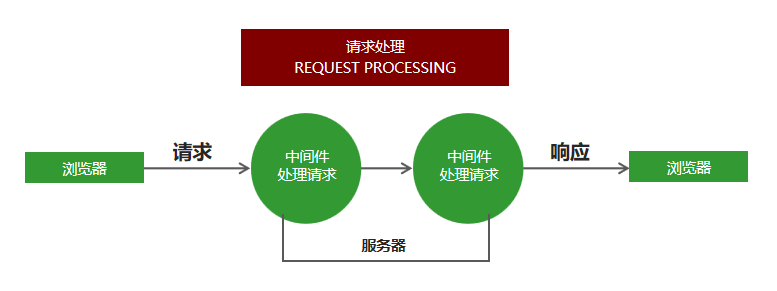

分类：

1. 应用(全局)级中间件（过滤非法的请求，例如防盗链）
2. 第三方中间件（通过 npm 下载的中间件，例如 body-parser）
3. 内置中间件（express 内部封装好的中间件）
4. 路由器中间件 （Router）

- 可以针对同一个请求设置多个中间件，对同一个请求进行多次处理。
- 默认情况下，请求从上到下依次匹配中间件，一旦匹配成功，终止匹配。
- 可以调用 next 方法将请求的控制权交给下一个中间件，直到遇到结束请求的中间件。

```js
const express = require("express");

const app = express();

app.use((req, res, next) => {
  res.send("我是中间件的响应");
  next(); // 让一个匹配的中间件或路由生效
});

app.get("/", (req, res) => {
  res.send("我是根路由的响应");
});

app.get("/two", (req, res) => {
  res.send("我是一级路由的响应");
});

app.listen(3000, (err) => {
  if (!err) return console.log("http://localhost:3000");
  console.log(err);
});
```

### app.use 中间件用法

app.use 匹配所有的请求方式，可以直接传入请求处理函数，代表接收所有的请求。

```js
app.use((req, res, next) => {
  console.log(req.url);
  next();
});
```

app.use 第一个参数也可以传入请求地址，代表不论什么请求方式，只要是这个请求地址就接收这个请求。

```js
app.use("/admin", (req, res, next) => {
  console.log(req.url);
  next();
});
```

### 错误处理中间件

在程序执行的过程中，不可避免的会出现一些无法预料的错误，比如文件读取失败，数据库连接失败。
错误处理中间件是一个集中处理错误的地方。

```js
app.use((err, req, res, next) => {
  res.status(500).send("服务器发生未知错误");
});
```

当程序出现错误时，调用 next()方法，并且将错误信息通过参数的形式传递给 next()方法，即可触发错误处理中间件。

```js
app.get("/", (req, res, next) => {
  fs.readFile("/file-does-not-exist", (err, data) => {
    if (err) {
      next(err);
    }
  });
});
```

### 捕获错误

在 node.js 中，异步 API 的错误信息都是通过回调函数获取的，支持 Promise 对象的异步 API 发生错误可以通过 catch 方法捕获。

异步函数执行如果发生错误通过 try catch

try catch 可以捕获异步函数以及其他同步代码在执行过程中发生的错误，但是不能其他类型的 API 发生的错误。

```js
app.get("/", async (req, res, next) => {
  try {
    await User.find({ name: "张三" });
  } catch (ex) {
    next(ex);
  }
});
```

## Router 路由器

Router 是一个完整的中间件和路由系统，也可以看做是琴小型的 app 对象。

使用 Router 可以更好的分类管理 route

构建模块化路由：

```js
const express = require("express");
// 创建路由对象
const home = express.Router();
// 将路由和请求路径进行匹配
app.use("/home", home);
// 在home路由下继续创建路由
home.get("/index", () => {
  //  /home/index
  res.send("欢迎来到博客展示页面");
});
```

```js
// home.js
const home = express.Router();
home.get("/index", () => {
  res.send("欢迎来到博客展示页面");
});
module.exports = home;
```

```js
// admin.js
const admin = express.Router();
admin.get("/index", () => {
  res.send("欢迎来到博客管理页面");
});
module.exports = admin;
```

```js
// app.js
const home = require("./route/home.js");
const admin = require("./route/admin.js");
app.use("/home", home);
app.use("/admin", admin);
```

## GET 参数的获取

Express 框架中使用 req.query 即可获取 GET 参数，框架内部会将 GET 参数转换为对象并返回。

```js
 // 接收地址栏中问号后面的参数
 // 例如: http://localhost:3000/?name=zhangsan&age=30
 app.get('/', (req, res) => {
    console.log(req.query); // {"name": "zhangsan", "age": "30"}
```

## POST 参数的获取

Express 中接收 post 请求参数需要借助第三方包 body-parser。使用 body-parser 中间件解析 post 请求过来的请求体参数为一个对象，随后挂载到 request 上

```js
// 引入body-parser模块
const bodyParser = require("body-parser");
// 配置body-parser模块
app.use(bodyParser.urlencoded({ extended: false }));
// 接收请求
app.post("/add", (req, res) => {
  // 接收请求参数
  console.log(req.body);
});
```

也可以使用内置中间件解析 post 请求过来的请求体参数为一个对象，随后挂载到 request 上

```js
app.use(express.urlencoded({ extended: true }));
```

## 静态资源的处理

通过 Express 内置的 express.static 可以方便地托管静态文件，例如 img、CSS、JavaScript 文件等。

```js
app.use(express.static("public"));
```

## express-art-template 模板引擎

- 为了使 art-template 模板引擎能够更好的和 Express 框架配合，模板引擎官方在原 art-template 模板引擎的基础上封装了 express-art-template。
- 使用`npm install art-template express-art-template`命令进行安装。

```js
// 1.告诉express框架使用什么模板引擎渲染什么后缀的模板文件
//  1.模板后缀
//  2.使用的模板疫情
app.engine("art", require("express-art-template"));
// 2.告诉express框架模板存放的位置是什么
app.set("views", path.join(__dirname, "views"));
// 3.告诉express框架模板的默认后缀是什么
app.set("view engine", "art");

app.get("/index", (req, res) => {
  // render做的事情：
  // 1. 拼接模板路径
  // 2. 拼接模板后缀
  // 3. 哪一个模板和哪一个数据进行拼接
  // 4. 将拼接结果响应给了客户端
  res.render("index", {
    msg: "message",
  });
});
```

**app.locals 对象**

将变量设置到 app.locals 对象下面，这个数据在所有的模板中都可以获取到。（15.js）

# 会话控制

## cookie

cookie 本质是一个字符串，里面包含着浏览器和服务器沟通的信息（交互时产生的信息）。

存储的形式以：key-value 的形式存储。

浏览器会自动携带该网站的 cookie，只要是该网站下的 cookie，全部携带。

分类：

- 会话 cookie：关闭浏览器后，会话 cookie 会自动消失，会话 cookie 存储在浏览器运行的那块内存上
- 持久化 cookie：看过期时间，一旦到了过期时间，看上去销毁，存储在用户的硬盘上

工作原理：

- 当浏览器第一次请求服务器的时候，服务器可能返回一个或多个 cookie 给浏览器
- 浏览器判断以下 cookie 种类
  - 会话 cookie：存储在浏览器运行的那块内存上
  - 持久化 cookie：存储在用户的硬盘上
- 以后请求该网站的时候，自动携带上该网站的所有 cookie（无法进行干预）
- 服务器拿到之前自己种下 cookie，分析里面的内容，校验 cookie 的合法性，根据 cookie 里保存的内容，进行具体的业务逻辑

应用：解决 http 无状态的问题，例如：7 天免登录，一般来说不会单独使用 cookie，一般配合后台的 session 存储使用

不同的语言、不同的后端架构 cookie 的具体语法是不一样的，但是 cookie 原理和工作过程是不变的

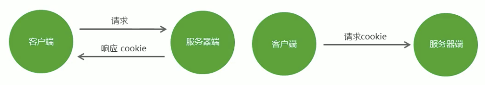

种下 cookie 以及获取、删除

```js
const express = require("express");
const cookieParser = require("cookie-parser");

const app = express();

// 使用cookie-parser解析浏览器携带过来的cookie为一个对象，随后挂载到req上
app.use(cookieParser());

// 种下cookie
app.get("/test1", (req, res) => {
  // 会话cookie
  res.cookie("demo", 123);
  // 持久化cookie
  res.cookie("demo1", 456, { maxAge: 30 * 1000 });
  res.send("我给你种下了一个cookie");
});

// 获取cookie
app.get("/test2", (req, res) => {
  let result = req.cookies;
  console.log(result);
  res.send("我读到了你的cookie");
});

// 删除cookie
app.get("/test3", (req, res) => {
  // 第一种方法
  // res.cookie('demo', '', { maxAge: 0 });

  // 第二种方法
  res.clearCookie("demo"); // 删除demo这个cookie
  res.send("我删除了一个cookie");
});

app.listen(3000, (err) => {
  if (!err) console.log("服务器启动成功");
  else console.log(err);
});
```

操作 cookie：

1. 设置 cookie（给客户端种 cookie）
   - 直接使用`res.cookie('','',{})`即可
2. 获取 cookie（要第三方中间件）
   - 安装`cookie-parser`
   - 引入：`const cookieParser = require('cookie-parser')`
   - 使用：`app.use(cookieParser())`
3. 返回客户端一个 cookie
   - `res.cookie('username','sunny',{maxAge:1000*60*60})`
   - 备注：
     1. cookie 是以：key-value 的形式存在的，前两个参数分别为 key、value
     2. maxAge 用于配置 cookie 有效期（单位毫秒）
     3. 如果不传入 maxAge 配置对象，则为会话 cookie，随着浏览器的关闭 cookie 自动消失
     4. 如果传入 maxAge，且 maxAge 不为 0，则 cookie 为持久化 cookie，即使用户关闭浏览器，cookie 也不会消失，直到过了它的有效期
4. 接收客户端传递过来的 cookie：
   - `req.cookies.xxx`：获取 cookie 上 xxx 属性对应的值。cookie-parser 中间件会自动把客户端发送过来的 cookie 解析到 request 对象上

## session

标准来说，session 指的是会话，但是后端人员常说的 session，全称叫：服务器 session 会话存储。

特点：

1. 存在于服务端
2. 存储的是浏览器和服务器之间沟通产生的一些信息

默认 session 的存储在服务器的内在中，每当一个新客户端发来请求，服务器都会新开辟出一场空间，供 session 会话存储使用

工作流程：

- 第一次浏览器请求服务器的时候，服务器会开辟出一场内在空间，供 session 会话存储使用
- 返回响应的时候，会自动返回一个 cookie（有时候会返回多个，为了安全），cookie 里包含着，上一步产生会话存储容器的编号（id）
- 以后请求的时候，会自动携带这个 cookie，给服务器
- 服务器从该 cookie 中拿到对应的 session 的 id，去服务器中匹配
- 服务器会根据匹配信息，决定下一步具体的业务逻辑

一般来说 cookie 一定会配合 session 使用

服务端一般会做 session 的持久化，防止由于服务器重启，造成 session 的丢失

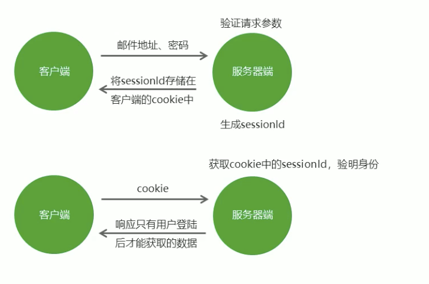

操作 session（cookie 配合 session）：

1. 下载安装：express-session 用于在 express 中操作 session，connect-mongo 用于将 session 写入数据库（session 持久化）

2. 引入模块：

   > const session = require('express-session');
   >
   > const MongoStore = require('connect-mongo')(session);

3. 编写全局配置对象

   ```js
   app.use(
     session({
       name: "userId", //设置cookie的name，默认值是：connect.sid
       secret: "hello", //参与加密的字符串（又称签名）
       // saveUninitialized: false, //是否在存储内容之前创建会话
       // resave: true, //是否在每次请求时，强制重新保存session，即使他们没有变化
       // store: new MongoStore({
       //     url: 'mongodb://localhost:27017/cookies_container',
       //     touchAfter: 1800 //修改频率（例：//在24小时之内只更新一次）
       // }),
       cookie: {
         // httpOnly: true, // 开启后前端无法通过 JS 操作cookie
         maxAge: 1000 * 30, // 设置cookie的过期时间
       },
     })
   );
   ```

4. 向 session 中添加一个 xxx，值为 yyy：`req.session.xxx = yyy`

5. 获取 session 上的 xxx 属性：const {xxx} = req.session

整个过程是：

1. 客户端第一次发起请求，服务器开启一个 session 专门用于存储这次请求的一些信息
2. 根据配置对象的信息，服务器决定是不进行：session 持久化等其他操作
3. 与此同时服务器创建了一个 cookie，它的 key 我们可以自己指定，但是它的 value 一定是上一步 session 的唯一标识
4. 服务器将我们指定好的内容添加进 session 对象，例如：`req.session.xxx = yyy`
5. 等请求再次过来时，客户端的请求中包含着之前种的 cookie
6. 服务器检查携带过来的 cookie 是否有效，决定是否去读取对应 session 中的信息

# Gulp

基于 node 平台开发的前端构建工具, 将机械化操作编写成任务, 想要执行机械化操作时执行一个命令行命令任务就能自动执行了, 用机器代替手工，提高开发效率。

Gulp 使用：

1. 使用`npm install gulp`下载 gulp 库文件
2. 在项目根目录下建立 gulpfile.js 文件
3. 重构项目的文件夹结构 src 目录放置源代码文件 dist 目录放置构建后文件
4. 在 gulpfile.js 文件中编写任务.
5. 在命令行工具中执行 gulp 任务

Gulp 中提供的方法：

- `gulp.src()`：获取任务要处理的文件
- `gulp.dest()`：输出文件
- `gulp.task()`：建立 gulp 任务
- `gulp.watch()`：监控文件的变化

```js
const gulp = require("gulp"); // 使用gulp.task()方法建立任务
gulp.task("first", () => {
  // 获取要处理的文件
  gulp
    .src("./src/css/base.css")
    // 将处理后的文件输出到dist目录
    .pipe(gulp.dest("./dist/css"));
});
```

Gulp 插件：

- `gulp-htmlmin` ：html 文件压缩
- `gulp-csso` ：压缩 css
- `gulp-babel` ：JavaScript 语法转化
- `gulp-less`: less 语法转化
- `gulp-uglify` ：压缩混淆 JavaScript
- `gulp-file-include` 公共文件包含
- `browsersync` 浏览器实时同步

# 模板引擎 artTemplate

模板引擎是第三方模块。让开发者以更加友好的方式拼接字符串，使项目代码更加清晰、更加易于维护。

art-template 模板引擎

- 在命令行工具中使用 `npm install art-template` 命令进行下载
- 使用`const template = require('art-template')`引入模板引擎
- 告诉模板引擎要拼接的数据和模板在哪 `const html = template(‘模板路径’, 数据)`;
- 使用模板语法告诉模板引擎，模板与数据应该如何进行拼接

## 模板引擎的语法

- art-template 同时支持两种模板语法：标准语法和原始语法。标准语法：`{{ 数据 }}` 原始语法：`<%=数据 %>`
- 标准语法可以让模板更容易读写，原始语法具有强大的逻辑处理能力。

将某项数据**输出**在模板中，标准语法和原始语法如下：

- 标准语法：`{{ 数据 }}`
- 原始语法：`<%= 数据 %>`

如果数据中携带 HTML 标签，默认模板引擎不会解析标签，会将其转义后输出。

- 标准语法：`{{@ 数据 }}`
- 原始语法：`<%- 数据 %>`

**条件判断**

```art
{{ if age > 18 }}
年龄大于18
{{ else if age < 15 }}
年龄小于15
{{ else }}
年龄不符合要求
{{ /if }}

<% if (age > 18) { %>
年龄大于18
<%}else if (age < 15){%>
年龄小于15
<% }else{ %>
年龄不符合要求
<% } %>
```

**循环**

- 标准语法：`{{each 数据}} {{/each}}`
- 原始语法：`<% for() { %> <% } %>`

```art
<ul>
    {{each users}}
    <li>
        {{$value.name}}
        {{$value.age}}
        {{$value.sex}}
    </li>
    {{/each}}
</ul>

<ul>
    <% for (var i = 0; i < users.length; i++) { %>
        <li>
            <%= users[i].name %>
            <%= users[i].age %>
            <%= users[i].sex %>
        </li>
    <% } %>
</ul>
```

使用**子模板**可以将网站公共区块(头部、底部)**抽离**到单独的文件中。

- 标准语法：`{{include '模板路径'}}`
- 原始语法：`<%include('模板路径') %>`

使用模板**继承**可以将网站 HTML 骨架抽离到单独的文件中，其他页面模板可以继承骨架文件。代码 05.js 和 05.art

模板配置:

- 向模板中导入变量 `template.defaults.imports.变量名 = 变量值;`
- 设置模板根目录 `template.defaults.root = 模板目录`
- 设置模板默认后缀 `template.defaults.extname = '.art'`
