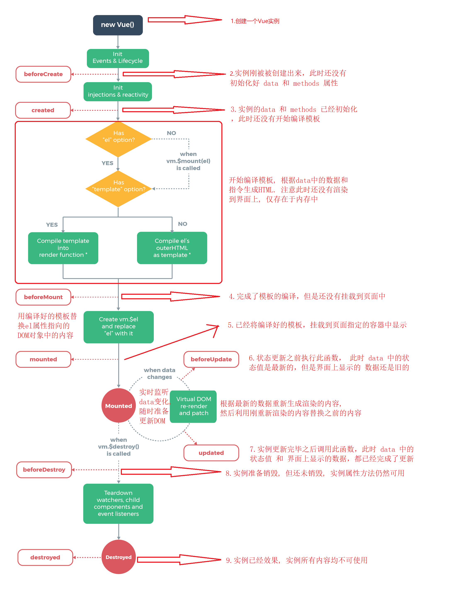

# Vue 开篇

Vue.js 是一套构建用户界面的`框架`，它不仅易于上手，还可以与其它第三方库整合(Swiper、IScroll、...)。

框架：是一套完整的解决方案；对项目的`侵入性`较大，项目如果需要更换框架，则需要重构整个项目。

库（插件）：提供某一个小功能，对项目的`侵入性`较小，如果某个库无法完成某些需求，可以很容易切换到其它库实现需求。

- 从 jQuery 切换到 Zepto， 无缝切换
- 从 IScroll 切换到 ScrollMagic， 只需要将用到 IScroll 的代码替换成 ScrollMagic 代码即可

Vue 优势：

- 通过数据驱动界面更新， 无需操作 DOM 来更新界面
- 使用 Vue 我们只需要关心如何获取数据， 如何处理数据， 如何编写业务逻辑代码，我们只需要将处理好的数据交给 Vue， Vue 就会自动将数据渲染到模板中(界面上)

# Vue 基本模板

1. 引入 Vue.js。`<script src="https://cdn.jsdelivr.net/npm/vue/dist/vue.js"></script>`
2. 创建一个 Vue 的实例对象
3. 告诉 Vue 的实例对象， 将来需要控制界面上的哪个区域
4. 告诉 Vue 的实例对象， 被控制区域的数据是什么

```js
let vue = new Vue({
  // 3.告诉Vue的实例对象， 将来需要控制界面上的哪个区域
  el: "#app"，
  // 4.告诉Vue的实例对象， 被控制区域的数据是什么
  data: {
    name: "sunny"，
  }，
});
```

# MVVM 设计模式

在 MVVM 设计模式中由 3 个部分组成

- M : Model。数据模型(保存数据， 处理数据业务逻辑)
- V : View。视图(展示数据， 与用户交互)
- VM: View Model。数据模型和视图的桥梁(M 是中国人， V 是美国人， VM 就是翻译)

MVVM 设计模式最大的特点就是支持数据的双向传递

数据可以从 M -> VM -> V

也可以从 V -> VM -> M

Vue 其实是基于 MVVM 设计模式的

- 被控制的区域: View
- Vue 实例对象 : View Model
- 实例对象中的 data: Model

```html
<!-- 这里就是MVVM中的View -->
<div id="app">
  <h1>{{msg}}</h1>
</div>
<script src="https://cdn.jsdelivr.net/npm/vue/dist/vue.js"></script>
<script>
  // 这里就是MVVM中的View Model
  new Vue({
    el: "#app",

    // 这里就是MVVM中的Model
    data: {
      msg: "hello vue.js",
    },
  });
</script>
```

# 数据双向绑定

默认情况下 Vue 只支持数据单向传递 M -> VM -> V，但是由于 Vue 是基于 MVVM 设计模式的， 所以也提供了双向传递的能力

在<input>、<textarea> 及 <select> 元素上可以用 v-model 指令创建双向数据绑定

注意点: v-model 会忽略所有表单元素的 value、checked、selected 特性的初始值，而总是将 Vue 实例的数据作为数据来源

# 常用指令

指令就是 Vue 内部提供的一些自定义属性，这些属性中封装好了 Vue 内部实现的一些功能，只要使用这些指令就可以使用 Vue 中实现的这些功能

Vue 数据绑定的特点：只要数据发生变化，界面就会跟着变化

## v-once

让界面不要跟着数据变化，只渲染一次

```html
<div id="app">
  <h1 v-once>这是有v-once指令的信息：{{msg}}</h1>
  <h1>这是没有v-once指令的信息：{{msg}}</h1>
</div>
<script src="https://cdn.jsdelivr.net/npm/vue/dist/vue.js"></script>
<script>
  new Vue({
    el: "#app",
    data: {
      msg: "hello vue.js",
    },
  });
</script>
```


## v-cloak

Vue 数据绑定过程

1. 会先将未绑定数据的界面展示给用户
2. 然后再根据模型中的数据和控制的区域生成绑定数据之后的 HTML 代码
3. 最后再将绑定数据之后的 HTML 渲染到界面上

正是在最终的 HTML 被生成渲染之前会先显示模板内容，所以如果用户网络比较慢或者网页性能比较差，那么用户会看到模板内容

如何解决这个问题？

利用 v-cloak 配合`[v-cloak]:{display: none}`默认先隐藏未渲染的界面，等到生成 HTML 渲染之后再重新显示

v-cloak 指令作用：数据渲染之后自动显示元素

```html
<style>
    [v-cloak] {
      display: none;
    }
  </style>
</head>

<body>
  <div id="app">
    <h1 v-cloak>{{msg}}</h1>
  </div>
  <script src="https://cdn.jsdelivr.net/npm/vue/dist/vue.js"></script>
  <script>
    setTimeout(() => {
      new Vue({
        el: '#app',
        data: {
          msg: 'hello vue.js'
        }
      })
    }, 3000)
  </script>
```

## v-text、v-html

v-text 就相当于过去学习的 innerText

v-html 就相当于过去学习的 innerHTML

```html
<div id="app">
  <h1>
    这是v-text指令显示的信息：
    <p v-text="url"></p>
  </h1>
  <h1>
    这是v-html指令显示的信息：
    <p v-html="url"></p>
  </h1>
</div>
<script src="https://cdn.jsdelivr.net/npm/vue/dist/vue.js"></script>
<script>
  new Vue({
    el: "#app",
    data: {
      url: '<a href="http://www.baidu.com">百度一下</a>',
    },
  });
</script>
```


## v-if、v-else、v-else-if

条件渲染: 如果 v-if 取值是 true 就渲染元素，如果不是就不渲染元素

**如果条件不满足根本就不会创建这个元素**

v-if 注意点：

- v-if 可以从模型中获取数据
- v-if 也可以直接赋值一个表达式

v-else 指令可以和 v-if 指令配合使用，当 v-if 不满足条件时就执行 v-else 就显示 v-else 中的内容

v-else 注意点：

- v-else 不能单独出现
- v-if 和 v-else 中间不能出现其它内容

v-else-if 可以和 v-if 指令配合使用, 当 v-if 不满足条件时就依次执行后续 v-else-if, 哪个满足就显示哪个

## v-show

v-show 和 v-if 的能够一样都是条件渲染, 取值为 true 就显示, 取值为 false 就不显示

v-if 和 v-show 区别

- v-if: 只要取值为 false 就不会创建元素
- v-show: 哪怕取值为 false 也会创建元素, 只是如果取值是 false 会设置元素的 display 为 none

## v-for

相当于 JS 中的 for in 循环, 可以根据数据多次渲染元素

v-for 可以遍历 数组, 字符, 数字, 对象

```html
<div id="app">
  <ul>
    <li v-for="(item,index) in movies">{{item}}-{{index}}</li>
  </ul>
</div>
<script src="https://cdn.jsdelivr.net/npm/vue/dist/vue.js"></script>
<script>
  new Vue({
    el: "#app",
    data: {
      movies: ["星际穿越", "大话西游", "少年派", "盗梦空间"],
    },
  });
</script>
```


## v-bind

在企业开发中想要给**元素**绑定数据, 我们可以使用{{}}, v-text, v-html

但是如果想给**元素的属性**绑定数据, 就必须使用 v-bind

所以 v-bind 的作用是专门用于给**元素的属性**绑定数据的

v-bind 格式：

- `v-bind:属性名称="绑定的数据"`
- `:属性名称="绑定的数据"`

v-bind 特点：赋值的数据可以是任意一个合法的 JS 表达式。例如：`:属性名称="age + 1"`

### 绑定类名

v-bind 指令给**任意标签**的**任意属性**绑定数据，对于大部分的属性而言我们只需要直接赋值即可，例如`:value="name"`

但是对于 class 和 style 属性而言, 它的格式比较特殊

通过 v-bind 绑定类名格式`:class="['需要绑定类名', ...]"`

注意点:

1. 直接赋值一个类名(没有放到数组中)默认回去 Model 中查找`:class="需要绑定类名"`
2. 数组中的类名没有用引号括起来也会去 Model 中查找`:class="[需要绑定类名]"`
3. 数组的每一个元素都可以是一个三目运算符按需导入`:class="[flag?'active':'']"`
4. 可以使用对象来替代数组中的三目运算符按需导入`:class="[{'active': true}]"`
5. 绑定的类名太多可以将类名封装到 Model 中`obj: {'color': true, 'size': true,'active': false}`

### 绑定样式

通过 v-bind 给 style 属性绑定数据

- 将数据放到对象中`:style="{color:'red','font-size':'50px'}"`
- 将数据放到 Model 对象中`obj: {color: 'red', 'font-size': '80px'}`

注意点：

1. 如果属性名称包含-，那么必须用引号括起来
2. 如果需要绑定 Model 中的多个对象，可以放到一个数组中赋值

## v-on

v-on 指令专门用于给元素绑定监听事件

v-on 指令格式：

- `v-on:事件名称="回调函数名称"`
- `@事件名称="回调函数名称"`

v-on 绑定的事件被触发之后，会去 Vue 实例对象的 methods 中查找对应的回调函数

在事件中有很多东西需要我们处理，例如事件冒泡,事件捕获，阻止默认行为等

那么在 Vue 中如何处理以上内容呢，我们可以通过 v-on 修饰符来处理

常见修饰符：

- `.once`只触发一次回调。
- `.prevent`调用 event.preventDefault()。
- `.stop`调用 event.stopPropagation()。
- `.self`只当事件是从侦听器绑定的元素本身触发时才触发回调。
- `.capture`添加事件侦听器时使用 capture 模式。

v-on 注意点：

1. 绑定回调函数名称的时候，后面可以写()也可以不写
   - `v-on:click="myFn"`
   - `v-on:click="myFn()"`
2. 可以给绑定的回调函数传递参数`v-on:click="myFn('abc', 33)"`
3. 如果在绑定的函数中需要用到 data 中的数据必须加上 this

我们可以通过按键修饰符监听特定按键触发的事件。例如：可以监听当前事件是否是回车触发的，可以监听当前事件是否是 ESC 触发的等

```js
Vue.config.keyCodes.f2 = 113;
```

## 自定义全局指令

在 Vue 中除了可以使用 Vue 内置的一些指令以外，我们还可以自定义指令

自定义全局指令语法：

```js
Vue.directive("自定义指令名称", {
  生命周期名称: function (el) {
    指令业务逻辑代码;
  },
});
```

指令生命周期方法：自定义指令时一定要明确指令的业务逻辑代码更适合在哪个阶段执行

- bind：指令被绑定到元素上的时候执行
- inserted：绑定指定的元素被添加到父元素上的时候调用

自定义指令注意点：使用时需要加上 v-，而在自定义时不需要加上 v-

```html
<div id="app">
  <p v-color>
    Lorem ipsum dolor sit amet consectetur, adipisicing elit. Culpa tempora quis
    quibusdam asperiores itaque voluptas praesentium iusto at aliquid,
    voluptatum impedit facilis nisi neque, animi eos voluptates illo nemo
    similique.
  </p>
</div>
<script src="https://cdn.jsdelivr.net/npm/vue/dist/vue.js"></script>
<script>
  Vue.directive("color", {
    bind: function (el) {
      el.style.color = "palegreen";
    },
  });
  new Vue({
    el: "#app",
  });
</script>
```

## 自定义局部指令

自定义全局指令的特点：在任何一个 Vue 实例控制的区域中都可以使用

定义局部指令的特点：只能在自定义的那个 Vue 实例中使用

如何自定义一个局部指令？给创建 Vue 实例时传递的对象添加

```js
directives: {
    // key: 指令名称
    // value: 对象
    'color': {
        bind: function (el, obj) {
            el.style.color = obj.value;
        }
    }
}
```

```html
<div id="app">
  <p v-color="'skyblue'">
    Lorem ipsum dolor sit amet consectetur, adipisicing elit. Culpa tempora quis
    quibusdam asperiores itaque voluptas praesentium iusto at aliquid,
    voluptatum impedit facilis nisi neque, animi eos voluptates illo nemo
    similique.
  </p>
</div>
<script src="https://cdn.jsdelivr.net/npm/vue/dist/vue.js"></script>
<script>
  new Vue({
    el: "#app",
    directives: {
      color: {
        bind: function (el, obj) {
          el.style.color = obj.value;
        },
      },
    },
  });
</script>
```

# 计算属性

插值语法特点：可以在{{}}中编写合法的 JavaScript 表达式

在插值语法中编写 JavaScript 表达式缺点

1. 没有代码提示
2. 语句过于复杂不利于我们维护

对于任何复杂逻辑，都应当使用计算属性

```html
<!-- 这里就是MVVM中的View -->
<div id="app">
  <!-- <h1>{{msg.split('').reverse().join('')}}</h1> -->
  <h1>{{message}}</h1>
</div>
<script src="https://cdn.jsdelivr.net/npm/vue/dist/vue.js"></script>
<script>
  // 这里就是MVVM中的View Model
  new Vue({
    el: "#app",

    // 这里就是MVVM中的Model
    data: {
      msg: "abcdef",
    },
    computed: {
      message: function () {
        return this.msg.split("").reverse().join("");
      },
    },
  });
</script>
```

虽然在定义计算属性的时候是通过一个函数返回的数据，但是在使用计算属性的时候不能在计算属性名称后面加上`()`，因为它是一个属性不是一个函数(方法)

计算属性和函数区别：

1. 函数**不会**将计算的结果缓存起来，每一次访问都会重新求值
2. 计算属性**会**将计算的结果缓存起来，只要数据没有发生变化，就不会重新求值

计算属性：比较适合用于计算不会频繁发生变化的的数据

# 过滤器

过滤器和函数和计算属性一样都是用来处理数据的，但是过滤器一般用于格式化插入的文本数据

自定义全局过滤器：`Vue.filter("过滤器名称", 过滤器处理函数)`

使用全局过滤器：`{{msg | 过滤器名称}}`、`:value="msg | 过滤器名称"`

过滤器注意点：

1. 只能在插值语法和 v-bind 中使用
2. 过滤器可以连续使用

```html
<div id="app">
  <h1>{{msg|formatMsg}}</h1>
</div>
<script src="https://cdn.jsdelivr.net/npm/vue/dist/vue.js"></script>
<script>
  Vue.filter("formatMsg", function (value) {
    console.log(value);
    return value.join("").replace(/大学/g, "学院");
  });
  new Vue({
    el: "#app",
    data: {
      msg: ["html大学", "css大学", "javascript大学"],
    },
  });
</script>
```

自定义局部过滤器的特点：只能在自定义的那个 Vue 实例中使用

自定义一个局部过滤器：给创建 Vue 实例时传递的对象添加

```js
filters: {
    // key: 过滤器名称
    // value: 过滤器处理函数
    'formatMsg': function (value) {}
}
```

# 过渡动画

将需要执行动画的元素放到 transition 组件中

当 transition 组件中的元素显示时会自动查找`.v-enter/.v-enter-active/.v-enter-to`类名

当 transition 组件中的元素隐藏时会自动查找`.v-leave/ .v-leave-active/.v-leave-to`类名

我们只需要在`.v-enter`和`.v-leave-to`中指定动画动画开始的状态，在`.v-enter-active`和`.v-leave-active`中指定动画执行的状态即可完成过渡动画

```html
<style>
  .demo {
    width: 200px;
    height: 200px;
    background-color: red;
  }

  .one-enter {
    opacity: 0;
  }

  .one-enter-to {
    opacity: 1;
  }

  .one-enter-active {
    transition: all 3s;
  }

  .two-enter {
    opacity: 0;
  }

  .two-enter-to {
    opacity: 1;
    margin-left: 500px;
  }

  .two-enter-active {
    transition: all 3s;
  }
</style>
<div id="app">
  <button @click="toggle">按钮</button>
  <transition appear name="one">
    <div v-show="isShow" class="demo"></div>
  </transition>
  <transition appear name="two">
    <div v-show="isShow" class="demo"></div>
  </transition>
</div>
<script src="https://cdn.jsdelivr.net/npm/vue/dist/vue.js"></script>
<script>
  new Vue({
    el: "#app",
    data: {
      isShow: true,
    },
    methods: {
      toggle() {
        this.isShow = !this.isShow;
      },
    },
  });
</script>
```

transition 注意点：

- transition 中只能放一个元素，多个元素无效。如果想给多个元素添加过渡动画，那么就必须创建多个 transition 组件
- 默认情况下第一次进入的时候没没有动画的，如果想一进来就有动画，我们可以通过给 transition 添加 appear 属性的方式告诉 Vue 第一次进入就需要显示动画
- 如果有多个不同的元素需要执行不同的过渡动画，那么我们可以通过给 transition 指定 name 的方式来指定**进入之前/进入之后/进入过程中，离开之前/离开之后/离开过程中**对应的类名来实现不同的元素执行不同的过渡动画

通过 transition+类名的方式确实能够实现过渡效果，但是实现的过渡效果并不能保存动画之后的状态。因为 Vue 内部的实现是在过程中动态绑定类名，过程完成之后删除类名，正是因为删除了类名，所以不能保存最终的效果

在 Vue 中如何保存过渡最终的效果？通过 Vue 提供的 JS 钩子来实现过渡动画

- `v-on:before-enter="beforeEnter"`进入动画之前
- `v-on:enter="enter"`进入动画执行过程中
- `v-on:after-enter="afterEnter"`进入动画完成之后
- `v-on:enter-cancelled="enterCancelled"`进入动画被取消
- `v-on:before-leave="beforeLeave"`离开动画之前
- `v-on:leave="leave"`离开动画执行过程中
- `v-on:after-leave="afterLeave"`离开动画完成之后
- `v-on:leave-cancelled="leaveCancelled"`离开动画被取消

JS 钩子实现过渡注意点：

1. 在动画过程中必须写上 el.offsetWidth 或者 el.offsetHeight
2. 在 enter 和 leave 方法中必须调用 done 方法，否则 after-enter 和 after-leave 不会执行
3. 需要需要添加初始动画，那么需要把 done 方法包裹到 setTimeout 方法中调用

```html
<div id="app">
  <button @click="toggle">按钮</button>
  <transition
    appear
    name="one"
    v-on:before-enter="beforeEnter"
    v-on:enter="enter"
    v-on:after-enter="afterEnter"
    v-bind:css="false"
  >
    <div v-show="isShow" class="demo"></div>
  </transition>
</div>
<script src="https://cdn.jsdelivr.net/npm/vue/dist/vue.js"></script>
<script>
  new Vue({
    el: "#app",
    data: {
      isShow: true,
    },
    methods: {
      toggle() {
        this.isShow = !this.isShow;
      },
      beforeEnter(el) {
        // console.log('beforeEnter')
        el.style.opacity = "0";
      },
      enter(el, done) {
        // console.log('enter')
        el.offsetWidth;
        el.style.transition = "all 3s";
        setTimeout(function () {
          done();
        }, 0);
      },
      afterEnter(el) {
        // console.log('afterEnter')
        el.style.opacity = "1";
        el.style.marginLeft = "500px";
      },
    },
  });
</script>
```

## 配合 Velocity 实现过渡动画

在 Vue 中我们除了可以自己实现过渡动画以外，还可以结合第三方框架实现过渡动画

- 导入 Velocity 库
- 在动画执行过程钩子函数中编写 Velocity 动画

# 自定义全局组件

Vue 两大核心：

1. 数据驱动界面改变
2. 组件化

在前端开发中组件就是把一个很大的界面拆分为多个小的界面，每一个小的界面就是一个组件。将大界面拆分成小界面就是组件化

组件化的好处：

1. 可以简化 Vue 实例的代码
2. 可以提高复用性

创建组件步骤：

1. 创建组件构造器
   ```js
   let Profile = Vue.extend({
     // 注意点: 在创建组件指定组件的模板的时候, 模板只能有一个根元素
     template: `
           <div>
                <p>我是创建的组件构造器</p>
            </div>
        `,
   });
   ```
2. 注册已经创建好的组件`Vue.component("abc", Profile );`
   - 第一个参数：指定注册的组件的名称
   - 第二个参数：传入已经创建好的组件构造器
3. 使用注册好的组件
   ```html
   <abc></abc>
   ```

创建组件的其它方式：

1. 在注册组件的时候，除了传入一个组件构造器以外，还可以直接传入一个对象
2. 在编写组件模板的时候，除了可以在字符串模板中编写以外，还可以像过去的 art-template 一样在 script 中编写
3. 在编写组件模板的时候，除了可以在 script 中编写以外，vue 还专门提供了一个编写模板的标签 template

```html
<div id="app">
  <abc></abc>
</div>
<template id="demo">
  <h1>
    Lorem ipsum dolor sit amet consectetur adipisicing elit. Reiciendis ducimus
    autem eius. Odio culpa cupiditate, omnis reiciendis inventore, quidem
    recusandae rerum eum, praesentium quis soluta unde magni officia atque
    aspernatur!
  </h1>
</template>
<script src="https://cdn.jsdelivr.net/npm/vue/dist/vue.js"></script>
<script>
  Vue.component("abc", {
    template: "#demo",
  });

  new Vue({
    el: "#app",
  });
</script>
```

# 自定义局部组件

自定义局部组件特点：只能在自定义的那个 Vue 实例控制的区域中可以使用

自定义一个局部组件：在 vue 实例中新增`components: {}`，在{}中通过 key/vue 形式注册组件

```js
components: {
  abc: {
  }
}
```

Vue 实例控制的区域相当于一个大的组件，在大组件中我们可以使用 data 和 methods，而我们自定义的组件也是一个组件，所以在自定义的组件中也能使用 data 和 methods

在自定义组件中不能像在 vue 实例中一样直接使用 data，在自定义组件中使用 data 必须赋值一个函数，然后通过函数的返回值来定义有哪些数据

因为自定义组件可以复用，为了保证复用时每个组件的数据都是独立的，所以必须是一个函数

组件中的 data 如果不是通过函数返回的，那么多个组件就会公用一份数据，就会导致数据混乱。如果组件中的 data 是通过函数返回的，那么每创建一个新的组件，都会调用一次这个方法

将这个方法返回的数据和当前创建的组件绑定在一起，这样就有效的避免了数据混乱

# 动态组件

通过 v-if/v-else-if/v-else 确实能够切换组件，但是在 Vue 中切换组件还有一种更专业的方式`<component v-bind:is="需要显示组件名称"></component>`，component 我们称之为动态组件，也就是你让我显示谁我就显示谁

```html
<div id="app">
  <button @click="toggle">按钮</button>
  <!-- <home v-if="isShow"></home>
    <demo v-else></demo> -->
  <keep-alive>
    <component v-bind:is="name"></component>
  </keep-alive>
</div>
<template id="home">
  <div>
    <h1>我是home组件</h1>
    <input type="checkbox" />
  </div>
</template>
<template id="demo">
  <h1>我是demo组件</h1>
</template>
<script src="https://cdn.jsdelivr.net/npm/vue/dist/vue.js"></script>
<script>
  Vue.component("home", {
    template: "#home",
  });
  Vue.component("demo", {
    template: "#demo",
  });
  new Vue({
    el: "#app",
    data: {
      isShow: true,
      name: "home",
    },
    methods: {
      toggle() {
        // this.isShow = !this.isShow
        this.name = this.name === "home" ? "demo" : "home";
      },
    },
  });
</script>
```

# 父子组件

在一个组件中又定义了其它组件就是父子组件，其实局部组件就是最简单的父子组件，因为我们说过可以把 Vue 实例看做是一个大组件

我们在 Vue 实例中定义了局部组件，就相当于在大组件里面定义了小组件，所以实局部组件就是最简单的父子组件

## 父子组件数据传递

在 Vue 中子组件是不能访问父组件的数据的，如果子组件想要访问父组件的数据，必须通过父组件传递

- 在父组件中通过 v-bind 传递数据，传递格式`v-bind:自定义接收名称 = "要传递数据"`
- 在子组件中通过 props 接收数据，接收格式`props: ["自定义接收名称"]`

```html
<div id="app">
  <father></father>
</div>
<template id="father">
  <div>
    <p>{{name}}</p>
    <p>{{age}}</p>
    <h1>我是父组件</h1>
    <son v-bind:parent-name="name" :my-age="age"></son>
  </div>
</template>
<template id="son">
  <div>
    <h2>我是子组件</h2>
    <p>{{parentName}}</p>
    <p>{{myAge}}</p>
  </div>
</template>
<script src="https://cdn.jsdelivr.net/npm/vue/dist/vue.js"></script>
<script>
  new Vue({
    el: "#app",
    components: {
      father: {
        template: "#father",
        data() {
          return {
            name: "sunny",
            age: 18,
          };
        },
        components: {
          son: {
            template: "#son",
            props: ["parentName", "myAge"],
          },
        },
      },
    },
  });
</script>
```

props的值有两种方式：

- 字符串数组，数组中的字符串就是传递时的名称。

- 对象，对象可以设置传递时的类型，也可以设置默认值等。当需要对props进行类型等验证时，就需要对象写法了。

  ```js
  Vue.component('Home',{
      props:{
          propA:Number,
          propB:[String,Number],
          // 必填的字符串
          poprC:{
              type:String,
              required:true
          },
          // 带有默认值的数字
          propD:{
              type:Number,
              default:100
          },
          // 带有默认值的对象
          propE:{
              type:Object,
              // 对象或数组默认值必须从一个工厂函数获取
              default:function() {
                  return {
                      message: 'hello vue.js'
                  }
              }
          },
          // 自定义验证函数
          propF:{
              validator:function(value) {
                  // 这个值必须匹配下列字符串中的一个
                  return ['success','warning','danger'].indexOf(value) !== -1
              }
          }
      }
  })
  ```

## 父子组件方法传递

在 Vue 中子组件是不能访问父组件的方法的，如果子组件想要访问父组件的方法，必须通过父组件传递

- 在父组件中通过 v-on 传递方法：`传递格式 v-on:自定义接收名称 = "要传递方法"`
- 在子组件中自定义一个方法
- 在自定义方法中通过`this.$emit('自定义接收名称')`触发传递过来的方法

```html
<div id="app">
  <father></father>
</div>
<template id="father">
  <div>
    <button @click="say">按钮</button>
    <son @parent-say="say"></son>
  </div>
</template>
<template id="son">
  <div>
    <button @click="foo">按钮子组件</button>
  </div>
</template>
<script src="https://cdn.jsdelivr.net/npm/vue/dist/vue.js"></script>
<script>
  new Vue({
    el: "#app",
    components: {
      father: {
        template: "#father",
        methods: {
          say() {
            alert("hello vue.js");
          },
        },
        components: {
          son: {
            template: "#son",
            methods: {
              foo() {
                this.$emit("parent-say");
              },
            },
          },
        },
      },
    },
  });
</script>
```

## 子组件数据传递给父组件

子组件数据传递给父组件和父子组件方法传递是一样的，只不过`this.$emit()`方法有两个参数

- 第一个参数：需要调用的函数名称
- 后续的参数：给调用的函数传递的参数

组件中的命名注意点：

1. 注册组件的时候使用了**驼峰命名**，那么在使用时需要转换成**短横线分隔命名**
   - 例如：注册时：myFather -> 使用时：my-father
2. 在传递参数的时候如果想使用**驼峰名称**, 那么就必须写**短横线分隔命名**
   - 例如： 传递时： parent-name="name" -> 接收时： props: ["parentName"]
3. 在传递方法的时候不能使用**驼峰命名**, 只能用**短横线分隔命名**
   - `@parent-say="say"` -> `this.$emit("parent-say")`

# 插槽

默认情况下使用子组件时在子组件中编写的元素是不会被渲染的，如果子组件中有部分内容是使用时才确定的，那么我们就可以使用插槽。插槽就是在子组件中放一个**坑**，以后由父组件来**填**

没有名字的插槽，会利用使用时指定的能容替换整个插槽。如果有多个匿名插槽，每一个匿名插槽都会被指定的内容替换。虽然写多个匿名插槽不会报错，但是在企业开发中推荐只能有一个匿名插槽

默认情况下有多少个匿名插槽，我们填充的数据就会被拷贝多少份。这导致了所有插槽中填充的内容都是一样的，那么如果我们想给不同的插槽中填充不同的内容怎么办呢？这个时候就可以使用具名插槽。如通插槽指定了名称, 那么我们就称之为**具名插槽**

具名插槽使用：

- 通过插槽的 name 属性给插槽指定名称
- 在使用时可以通过`slot="name"`方式, 指定当前内容用于替换哪一个插槽

如果没有指定要替换哪个插槽中的内容, 则不会被替换

# v-slot

v-slot 指令是 Vue2.6 中用于替代 slot 属性的一个指令

在 Vue2.6 之前, 我们通过 slot 属性告诉 Vue 当前内容填充到哪一个具名插槽

从 Vue2.6 开始, 我们通过 v-slot 指令告诉 Vue 当前内容填充到哪一个具名插槽

注意点：

- v-slot 指令只能用在 template 标签上
- 可以使用#号替代 v-slot:

```html
<template id="father">
  <div>
    <h1>我是父组件</h1>
    <son>
      <template v-slot:one>
        <div>我是子组件追加的内容</div>
      </template>
      <template #one>
        <div>我是子组件追加的内容</div>
      </template>
    </son>
  </div>
</template>
<template id="son">
  <div>
    <h2>我是子组件</h2>
    <slot name="one">我是子组件默认的插槽内容</slot>
  </div>
</template>
```

# 作用域插槽

作用域插槽就是带数据的插槽，就是让父组件在填充子组件插槽内容时也能使用子组件的数据

1. 在 slot 中通过`v-bind:数据名称="数据名称"`方式暴露数据
2. 在父组件中通过`<template slot-scope="作用域名称">`接收数据
3. 在父组件的`<template></template>`中通过`作用域名称.数据名称`方式使用数据

```html
<div id="app">
  <father></father>
</div>
<template id="father">
  <div>
    <h1>我是父组件</h1>
    <son>
      <template slot-scope="demo">
        <p>我是插槽中使用子组件的学生数据{{demo.students}}</p>
        <ul>
          <li v-for="(name,index) in demo.students">{{name}}</li>
        </ul>
      </template>
    </son>
  </div>
</template>
<template id="son">
  <div>
    <h2>我是子组件</h2>
    <p>{{students}}</p>
    <slot v-bind:students="students">我是子组件默认的插槽内容</slot>
  </div>
</template>
<script src="https://cdn.jsdelivr.net/npm/vue/dist/vue.js"></script>
<script>
  new Vue({
    el: "#app",
    components: {
      father: {
        template: "#father",
        components: {
          son: {
            template: "#son",
            data() {
              return {
                students: ["sunny", "cherry", "kobe"],
              };
            },
          },
        },
      },
    },
  });
</script>
```

在 2.6.0 中，我们为具名插槽和作用域插槽引入了一个新的统一的语法 (即 v-slot 指令)。
它取代了 slot 和 slot-scope

也就是说我们除了可以通过 v-slot 指令告诉 Vue 内容要填充到哪一个具名插槽中，还可以通过 v-slot 指令告诉 Vue 如何接收作用域插槽暴露的数据`v-slot:插槽名称="作用域名称"`

```html
<template id="father">
  <div>
    <h1>我是父组件</h1>
    <son>
      <template v-slot:one="demo">
        <p>我是插槽中使用子组件的学生数据{{demo.students}}</p>
        <ul>
          <li v-for="name in demo.students">{{name}}</li>
        </ul>
      </template>
    </son>
  </div>
</template>
<template id="son">
  <div>
    <h2>我是子组件</h2>
    <p>{{students}}</p>
    <slot name="one" v-bind:students="students">我是子组件默认的插槽内容</slot>
  </div>
</template>
```

# Vue 生命周期方法

在从生到死的特定阶段调用的方法

生命周期钩子 = 生命周期函数 = 生命周期事件

Vue 生命周期方法分类：

1. 创建期间的生命周期方法
2. 运行期间的生命周期方法
3. 销毁期间的生命周期方法



## 创建期间的生命周期方法

- beforeCreate：在调用 beforeCreate 的时候，仅仅表示 Vue 实例刚刚被创建出来，此时此刻还没有初始化好 Vue 实例中的数据和方法，所以此时此刻还不能访问 Vue 实例中保存的数据和方法
- created：在调用 created 的时候，是我们最早能够访问 Vue 实例中保存的数据和方法的地方
- beforeMount：在调用 beforeMount 的时候，表示 Vue 已经编译好了最终模板，但是还没有将最终的模板渲染到界面上
- mounted：在调用 mounted 的时候，表示 Vue 已经完成了模板的渲染，表示我们已经可以拿到界面上渲染之后的内容了

## 运行期间的生命周期方法

- beforeUpdate：在调用 beforeUpdate 的时候，表示 Vue 实例中保存的数据被修改了
  - 只有保存的数据被修改了才会调用 beforeUpdate，否则不会调用
  - 在调用 beforeUpdate 的时候，数据已经更新了，但是界面还没有更新
- updated：在调用 updated 的时候，表示 Vue 实例中保存的数据被修改了，并且界面也同步了修改的数据了。也就是说：数据和界面都同步更新之后就会调用 updated

## 销毁期间的生命周期方法

- beforeDestroy：在调用 beforeDestroy 的时候，表示当前组件即将被销毁了
  - 只要组件不被销毁，那么 beforeDestroy 就不会调用。beforeDestroy 函数是我们最后能够访问到组件数据和方法的函数
- destroyed：在调用 destroyed 的时候，表示当前组件已经被销毁了
  - 只要组件不被销毁，那么 destroyed 就不会调用，不要在这个生命周期方法中再去操作组件中数据和方法
