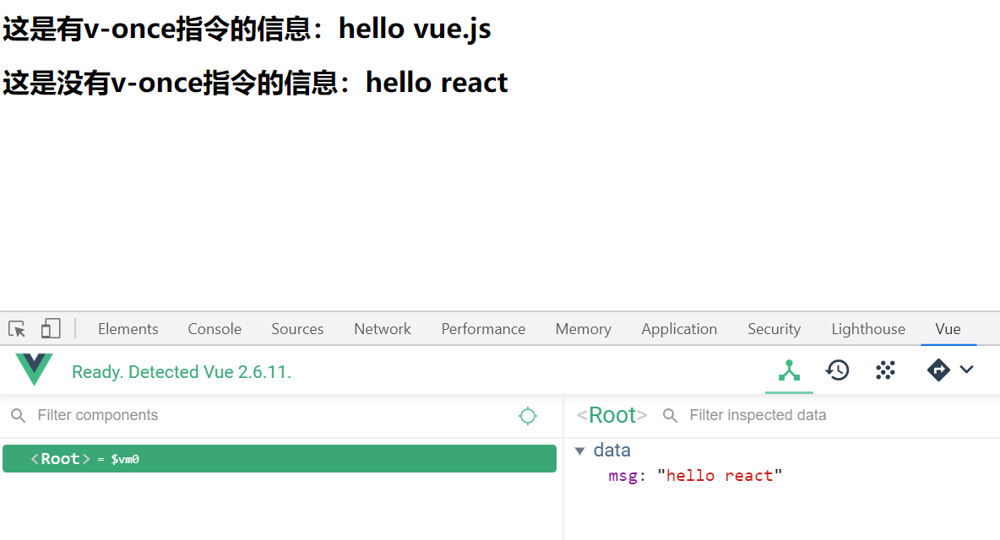

# Vue 开篇

Vue.js 是一套构建用户界面的`框架`，它不仅易于上手，还可以与其它第三方库整合(Swiper、IScroll、...)。

框架：是一套完整的解决方案；对项目的`侵入性`较大，项目如果需要更换框架，则需要重构整个项目。

库（插件）：提供某一个小功能，对项目的`侵入性`较小，如果某个库无法完成某些需求，可以很容易切换到其它库实现需求。

- 从 jQuery 切换到 Zepto， 无缝切换
- 从 IScroll 切换到 ScrollMagic， 只需要将用到 IScroll 的代码替换成 ScrollMagic 代码即可

Vue 优势：

- 通过数据驱动界面更新， 无需操作 DOM 来更新界面
- 使用 Vue 我们只需要关心如何获取数据， 如何处理数据， 如何编写业务逻辑代码，我们只需要将处理好的数据交给 Vue， Vue 就会自动将数据渲染到模板中(界面上)

# Vue 基本模板

1. 引入 Vue.js。`<script src="https://cdn.jsdelivr.net/npm/vue/dist/vue.js"></script>`
2. 创建一个 Vue 的实例对象
3. 告诉 Vue 的实例对象， 将来需要控制界面上的哪个区域
4. 告诉 Vue 的实例对象， 被控制区域的数据是什么

```js
let vue = new Vue({
  // 3.告诉Vue的实例对象， 将来需要控制界面上的哪个区域
  el: "#app"，
  // 4.告诉Vue的实例对象， 被控制区域的数据是什么
  data: {
    name: "sunny"，
  }，
});
```

# MVVM 设计模式

在 MVVM 设计模式中由 3 个部分组成

- M : Model。数据模型(保存数据， 处理数据业务逻辑)
- V : View。视图(展示数据， 与用户交互)
- VM: View Model。数据模型和视图的桥梁(M 是中国人， V 是美国人， VM 就是翻译)

MVVM 设计模式最大的特点就是支持数据的双向传递

数据可以从 M -> VM -> V

也可以从 V -> VM -> M

Vue 其实是基于 MVVM 设计模式的

- 被控制的区域: View
- Vue 实例对象 : View Model
- 实例对象中的 data: Model

```html
<!-- 这里就是MVVM中的View -->
<div id="app">
  <h1>{{msg}}</h1>
</div>
<script src="https://cdn.jsdelivr.net/npm/vue/dist/vue.js"></script>
<script>
  // 这里就是MVVM中的View Model
  new Vue({
    el: "#app",

    // 这里就是MVVM中的Model
    data: {
      msg: "hello vue.js",
    },
  });
</script>
```

# 常用指令

指令就是 Vue 内部提供的一些自定义属性，这些属性中封装好了 Vue 内部实现的一些功能，只要使用这些指令就可以使用 Vue 中实现的这些功能

Vue 数据绑定的特点：只要数据发生变化，界面就会跟着变化

## v-once

让界面不要跟着数据变化，只渲染一次

```html
<div id="app">
  <h1 v-once>这是有v-once指令的信息：{{msg}}</h1>
  <h1>这是没有v-once指令的信息：{{msg}}</h1>
</div>
<script src="https://cdn.jsdelivr.net/npm/vue/dist/vue.js"></script>
<script>
  new Vue({
    el: "#app",
    data: {
      msg: "hello vue.js",
    },
  });
</script>
```



## v-cloak

Vue 数据绑定过程：

1. 会先将未绑定数据的界面展示给用户
2. 然后再根据模型中的数据和控制的区域生成绑定数据之后的 HTML 代码
3. 最后再将绑定数据之后的 HTML 渲染到界面上

正是在最终的 HTML 被生成渲染之前会先显示模板内容，所以如果用户网络比较慢或者网页性能比较差，那么用户会看到模板内容

如何解决这个问题？

利用 v-cloak 配合`[v-cloak]:{display: none}`默认先隐藏未渲染的界面，等到生成 HTML 渲染之后再重新显示

v-cloak 指令作用：数据渲染之后自动显示元素

```html
<style>
    [v-cloak] {
      display: none;
    }
  </style>
</head>

<body>
  <div id="app">
    <h1 v-cloak>{{msg}}</h1>
  </div>
  <script src="https://cdn.jsdelivr.net/npm/vue/dist/vue.js"></script>
  <script>
    setTimeout(() => {
      new Vue({
        el: '#app',
        data: {
          msg: 'hello vue.js'
        }
      })
    }, 3000)
  </script>
```

## v-text、v-html

v-text 就相当于过去学习的 innerText

v-html 就相当于过去学习的 innerHTML

```html
<div id="app">
  <h1>
    这是v-text指令显示的信息：
    <p v-text="url"></p>
  </h1>
  <h1>
    这是v-html指令显示的信息：
    <p v-html="url"></p>
  </h1>
</div>
<script src="https://cdn.jsdelivr.net/npm/vue/dist/vue.js"></script>
<script>
  new Vue({
    el: "#app",
    data: {
      url: '<a href="http://www.baidu.com">百度一下</a>',
    },
  });
</script>
```


## v-if、v-else、v-else-if

条件渲染: 如果 v-if 取值是 true 就渲染元素，如果不是就不渲染元素

**如果条件不满足根本就不会创建这个元素**

v-if 注意点：

- v-if 可以从模型中获取数据
- v-if 也可以直接赋值一个表达式

v-else 指令可以和 v-if 指令配合使用，当 v-if 不满足条件时就执行 v-else 就显示 v-else 中的内容

v-else 注意点：

- v-else 不能单独出现
- v-if 和 v-else 中间不能出现其它内容

v-else-if 可以和 v-if 指令配合使用，当 v-if 不满足条件时就依次执行后续 v-else-if，哪个满足就显示哪个

**v-for**注意点：

1. v-for 为了提升性能，在更新已渲染过的元素列表时，会采用**就地复用**策略。也正是因为这个策略，在某些时刻会导致我们的数据混乱。例如: 在列表前面新增了内容
2. 为了解决这个问题，我们可以在渲染列表的时候给每一个元素加上一个独一无二的 key。v-for 在更新已经渲染过的元素列表时，会先判断 key 是否相同，如果相同则复用，如果不同则重新创建

## v-show

v-show 和 v-if 的能够一样都是条件渲染，取值为 true 就显示，取值为 false 就不显示

v-if 和 v-show 区别

- v-if: 只要取值为 false 就不会创建元素
- v-show: 哪怕取值为 false 也会创建元素，只是如果取值是 false 会设置元素的 display 为 none

## v-for

相当于 JS 中的 for in 循环，可以根据数据多次渲染元素

v-for 可以遍历 数组，字符，数字，对象

```html
<div id="app">
  <ul>
    <li v-for="(item,index) in movies">{{item}}-{{index}}</li>
  </ul>
</div>
<script src="https://cdn.jsdelivr.net/npm/vue/dist/vue.js"></script>
<script>
  new Vue({
    el: "#app",
    data: {
      movies: ["星际穿越", "大话西游", "少年派", "盗梦空间"],
    },
  });
</script>
```


## v-bind

在企业开发中想要给**元素**绑定数据, 我们可以使用{{}}, v-text, v-html

但是如果想给**元素的属性**绑定数据, 就必须使用 v-bind

所以 v-bind 的作用是专门用于给**元素的属性**绑定数据的

v-bind 格式：

- `v-bind:属性名称="绑定的数据"`
- `:属性名称="绑定的数据"`

v-bind 特点：赋值的数据可以是任意一个合法的 JS 表达式。例如：`:属性名称="age + 1"`

### 绑定类名

v-bind 指令给**任意标签**的**任意属性**绑定数据，对于大部分的属性而言我们只需要直接赋值即可，例如`:value="name"`

但是对于 class 和 style 属性而言, 它的格式比较特殊

通过 v-bind 绑定类名格式`:class="['需要绑定类名', ...]"`

注意点:

1. 直接赋值一个类名(没有放到数组中)默认回去 Model 中查找`:class="需要绑定类名"`
2. 数组中的类名没有用引号括起来也会去 Model 中查找`:class="[需要绑定类名]"`
3. 数组的每一个元素都可以是一个三目运算符按需导入`:class="[flag?'active':'']"`
4. 可以使用对象来替代数组中的三目运算符按需导入`:class="[{'active': true}]"`
5. 绑定的类名太多可以将类名封装到 Model 中`obj: {'color': true, 'size': true,'active': false}`

### 绑定样式

通过 v-bind 给 style 属性绑定数据

- 将数据放到对象中`:style="{color:'red','font-size':'50px'}"`
- 将数据放到 Model 对象中`obj: {color: 'red', 'font-size': '80px'}`

注意点：

1. 如果属性名称包含-，那么必须用引号括起来
2. 如果需要绑定 Model 中的多个对象，可以放到一个数组中赋值

## v-on

v-on 指令专门用于给元素绑定监听事件

v-on 指令格式：

- `v-on:事件名称="回调函数名称"`
- `@事件名称="回调函数名称"`

v-on 绑定的事件被触发之后，会去 Vue 实例对象的 methods 中查找对应的回调函数

在事件中有很多东西需要我们处理，例如事件冒泡,事件捕获，阻止默认行为等

那么在 Vue 中如何处理以上内容呢，我们可以通过 v-on 修饰符来处理

常见修饰符：

- `.once`只触发一次回调。
- `.prevent`调用 event.preventDefault()。
- `.stop`调用 event.stopPropagation()。
- `.self`只当事件是从侦听器绑定的元素本身触发时才触发回调。
- `.capture`添加事件侦听器时使用 capture 模式。

v-on 注意点：

1. 绑定回调函数名称的时候，后面可以写()也可以不写
   - `v-on:click="myFn"`
   - `v-on:click="myFn()"`
2. 可以给绑定的回调函数传递参数`v-on:click="myFn('abc', 33)"`
3. 如果在绑定的函数中需要用到 data 中的数据必须加上 this

我们可以通过按键修饰符监听特定按键触发的事件。例如：可以监听当前事件是否是回车触发的，可以监听当前事件是否是 ESC 触发的等

```js
Vue.config.keyCodes.f2 = 113;
```
