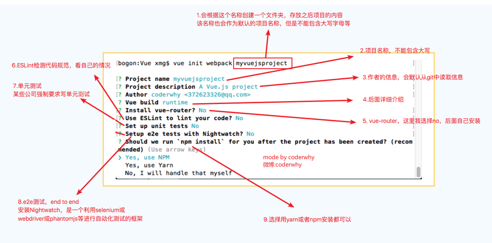
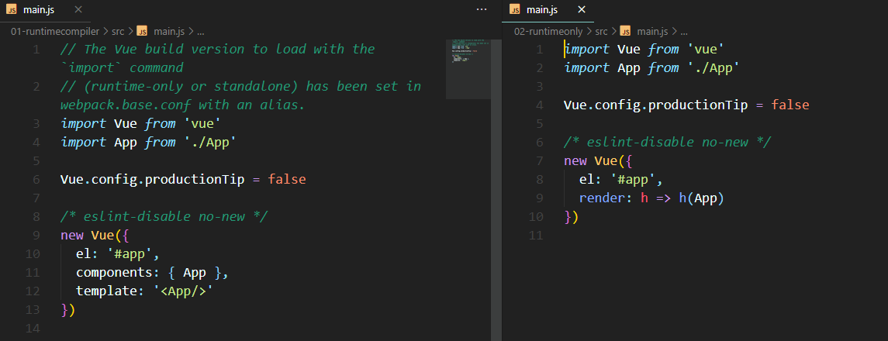

# Vue CLI 简介

使用 Vue.js 开发大型应用时，我们需要考虑代码目录结构、项目结构和部署、热加载、代码单元测试等事情。

如果每个项目都要手动完成这些工作，那无以效率比较低效，所以通常我们会使用一些脚手架工具来帮助完成这些事情。

CLI 是 Command-Line Interface，翻译为命令行界面，但是俗称脚手架

Vue CLI 是一个官方发布 vue.js 项目脚手架

使用 vue-cli 可以快速搭建 Vue 开发环境以及对应的 webpack 配置

Vue CLI 使用前提：Node 环境要求 8.9 以上或者更高版本、Webpack

# Vue CLI 的使用

安装 Vue 脚手架`npm install -g @vue/cli`

上面安装的是 Vue CLI3 的版本，如果需要想按照 Vue CLI2 的方式初始化项目时不可以的

如果需要使用旧版本的`vue init webpack 项目`，可以全局安装一个桥接`npm i @vue/cli-init -g`

Vue CLI2 初始化项目`vue init webpack my-project`

Vue CLI3 初始化项目`vue create my-project`

# Vue CLI2

Runtime-Compiler 和 Runtime-only 的区别

1. runtime-only代码中不可以有任何的template
2. runtime-compiler代码中，可以有template，因为有compiler可以用于编译template

* template -> ast -> render -> vdom -> 真实DOM
* render: (h) => h, -> createElement

# Vue CLI3

vue-cli 3 是基于 webpack 4 打造，vue-cli 2 还是 webapck 3

vue-cli 3 的设计原则是**0 配置**，移除的配置文件根目录下的，build 和 config 等目录

vue-cli 3 提供了 vue ui 命令，提供了可视化配置，更加人性化

移除了 static 文件夹，新增了 public 文件夹，并且 index.html 移动到 public 中
