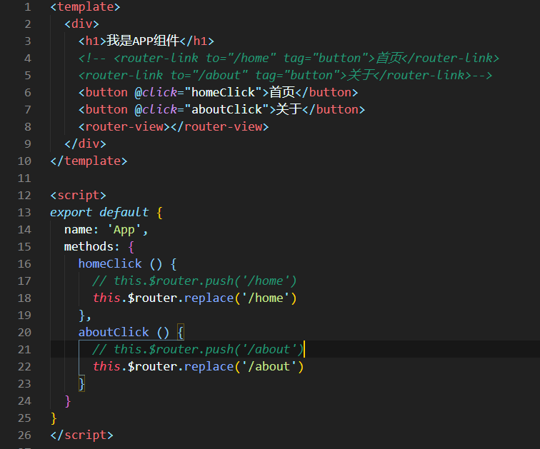
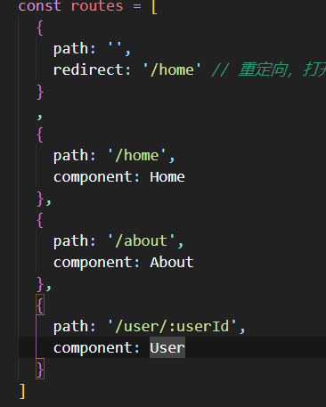
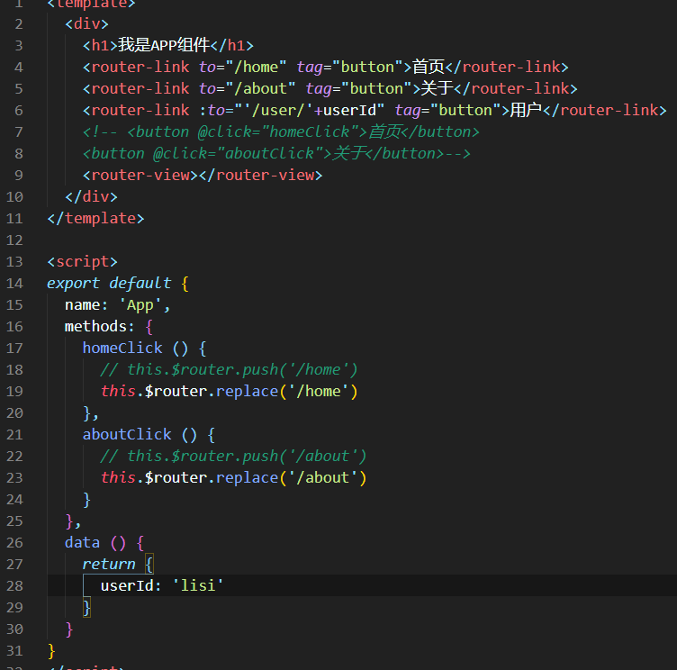
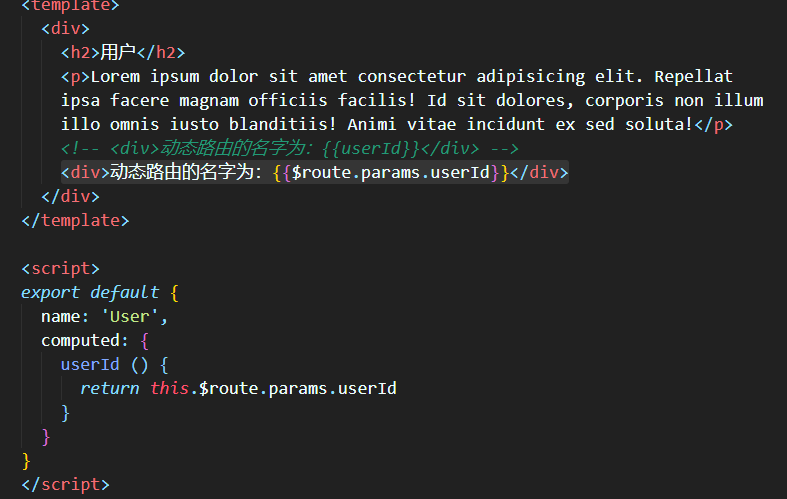
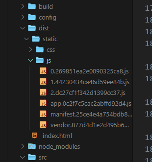

# 认识路由

路由是一个网络工程里面的术语。路由（routing）就是通过互联的网络把信息从源地址传输到目的地址的活动

路由是决定数据包从来源到目的地的路径

转送将输入端的数据转移到合适的输出端

路由中有一个非常重要的概念叫路由表。路由表本质上就是一个映射表，决定了数据包的指向

## 后端路由阶段

早期的网站开发整个 HTML 页面是由服务器来渲染的，服务器直接生产渲染好对应的 HTML 页面，返回给客户端进行展示

但是，一个网站，这么多页面服务器如何处理呢?

- 一个页面有自己对应的网址，也就是 URL
- URL 会发送到服务器，服务器会通过正则对该 URL 进行匹配，并且最后交给一个 Controller 进行处理
- Controller 进行各种处理，最终生成 HTML 或者数据，返回给前端
- 这就完成了一个 IO 操作

上面的这种操作,，就是后端路由

当我们页面中需要请求不同的路径内容时，交给服务器来进行处理，服务器渲染好整个页面，并且将页面返回给客户端。这种情况下渲染好的页面，不需要单独加载任何的 js 和 css，可以直接交给浏览器展示，这样也有利于 SEO 的优化

后端路由的缺点:

- 一种情况是整个页面的模块由后端人员来编写和维护的
- 另一种情况是前端开发人员如果要开发页面，需要通过 PHP 和 Java 等语言来编写页面代码
- 而且通常情况下 HTML 代码和数据以及对应的逻辑会混在一起，编写和维护都是非常糟糕的事情

## 前端路由阶段

前后端分离阶段：

- 随着 Ajax 的出现，有了前后端分离的开发模式.
- 后端只提供 API 来返回数据，前端通过 Ajax 获取数据，并且可以通过 JavaScript 将数据渲染到页面中.
- 这样做最大的优点就是前后端责任的清晰，后端专注于数据上，前端专注于交互和可视化上.
- 并且当移动端(iOS/Android)出现后，后端不需要进行任何处理，依然使用之前的一套 API 即可.
- 目前很多的网站依然采用这种模式开发

单页面富应用阶段:其实 SPA 最主要的特点就是在前后端分离的基础上加了一层前端路由。也就是前端来维护一套路由规则

前端路由的核心：改变 URL，但是页面不进行整体的刷新

# 前端路由的规则

## URL 的 hash

URL 的 hash 也就是锚点(#)，本质上是改变 window.location 的 href 属性

我们可以通过直接赋值 location.hash 来改变 href，但是页面不发生刷新

## HTML5 的 history 模式：pushState

history 接口是 HTML5 新增的, 它有五种模式改变 URL 而不刷新页面

- `history.pushState()`
- `history.replaceState()`
- `history.go()`
- `history.back()`
- `history.forward()`

# vue-router 基础

Vue Router 和`v-if/v-show`一样，是用来切换组件的显示的
`v-if/v-show`是标记来切换(true/false)，Vue Router 用哈希来切换(#/xxx)，`比v-if/v-show`强大的是 Vue Router 不仅仅能够切换组件的显示，还能够在切换的时候传递参数

vue-router 是 Vue.js 官方的路由插件，它和 vue.js 是深度集成的，适合用于构建单页面应用。

我们可以访问其官方网站对其进行学习: https://router.vuejs.org/zh/

vue-router 是基于路由和组件的

- 路由用于设定访问路径，将路径和组件映射起来.
- 在 vue-router 的单页面应用中，页面的路径的改变就是组件的切换.

在模块化工程中使用它(因为是一个插件，所以可以通过 Vue.use()来安装路由功能)

1. 导入路由对象，并且调用 Vue.use(VueRouter)
2. 创建路由实例，并且传入路由映射配置
3. 在 Vue 实例中挂载创建的路由实例

使用 vue-router 的步骤

1. 创建路由组件
2. 配置路由映射: 组件和路径映射关系
3. 使用路由: 通过<router-link>和<router-view>

```js
// 配置路由相关的信息
import Vue from "vue";
import VueRouter from "vue-router";

// 1.通过Vue.use(插件)，安装插件
Vue.use(VueRouter);

// 2.创建VueRouter对象
const routes = [];

const router = new VueRouter({
  // 配置路由与组件之间的关系
  routes,
});

export default router;
```

细节处理：

## 1.路由的默认路径

默认情况下，进入网站的首页，我们希望<router-view>渲染首页的内容。但是我们的实现中，默认没有显示首页组件，必须让用户点击才可以

如何可以让路径默认跳到到首页，并且<router-view>渲染首页组件呢?

只需要多配置一个映射就可以了

```js
const routes = [
  {
    path: "",
    redirect: "/home", // 重定向，打开网页时直接显示首页内容
  },
];
```

## 2.HTML5 的 Hist 模式

前面说过改变路径的方式有两种:

- URL 的 hash
- HTML5 的 history

默认情况下，路径的改变使用的 URL 的 hash

如果希望使用 HTML5 的 history 模式，非常简单，进行如下配置即可

```js
const router = new VueRouter({
  mode: "history",
});
```

## 3.router-link

在前面的<router-link>中，我们只是使用了一个属性: to，用于指定跳转的路径

<router-link>还有一些其他属性：

- tag: tag 可以指定<router-link>之后渲染成什么组件，比如上面的代码会被渲染成一个<li>元素，而不是<a>
- replace: replace 不会留下 history 记录，所以指定 replace 的情况下，后退键返回不能返回到上一个页面中
- active-class: 当<router-link>对应的路由匹配成功时，会自动给当前元素设置一个 router-link-active 的 class，设置 active-class 可以修改默认的名称

## 4.修改 linkActiveClass

通过 active-class 修改默认的 router-link-active 的类名

```js
const router = new VueRouter({
  linkActiveClass: "active",
});
```

## 5.路由代码跳转

有时候, 页面的跳转可能需要执行对应的 JavaScript 代码，这个时候，就可以使用第二种跳转方式了



## 6.动态路由

在某些情况下，一个页面的 path 路径可能是不确定的，比如我们进入用户界面时，希望是如下的路径`/user/aaaa或/user/bbbb`，除了有前面的/user 之外，后面还跟上了用户的 ID

这种 path 和 Component 的匹配关系，我们称之为动态路由(也是路由传递数据的一种方式)。







# 路由懒加载

当打包构建应用时，Javascript 包会变得非常大，影响页面加载。

如果我们能把不同路由对应的组件分割成不同的代码块，然后当路由被访问的时候才加载对应组件，这样就更加高效了

路由懒加载的主要作用就是将路由对应的组件打包成一个个的 js 代码块

只有在这个路由被访问到的时候，才加载对应的组件

路由懒加载的效果如下：



懒加载的方式：在 ES6 中，我们可以有更加简单的写法来组织 Vue 异步组件和 Webpack 的代码分割`const Home = () => import('../components/Home.vue')`

# 路由嵌套

嵌套路由是一个很常见的功能。比如在 home 页面中，我们希望通过/home/news 和/home/message 访问一些内容。一个路径映射一个组件，访问这两个路径也会分别渲染两个组件

实现嵌套路由有两个步骤:

- 创建对应的子组件，并且在路由映射中配置对应的子路由
- 在组件内部使用<router-view>标签

# 传递参数

传递参数主要有两种类型: params 和 query

params 的类型:

- 配置路由格式: /router/:id
- 传递的方式: 在 path 后面跟上对应的值
- 传递后形成的路径: /router/123, /router/abc

query 的类型:

- 配置路由格式: /router, 也就是普通配置
- 传递的方式: 对象中使用 query 的 key 作为传递方式
- 传递后形成的路径: /router?id=123, /router?id=abc

使用也有两种方式: <router-link>的方式和 JavaScript 代码方式

获取参数通过$route 对象获取的。在使用了 vue-router 的应用中，路由对象会被注入每个组件中，赋值为 this.$route ，并且当路由切换时，路由对象会被更新

# $route和$router

$router为VueRouter实例，想要导航到不同URL，则使用$router.push 方法。

`$route` 为当前 router 跳转对象里面可以获取 name、path、query、params 等。

# 导航守卫

vue-router 提供的导航守卫主要用来监听监听路由的进入和离开的

vue-router 提供了 beforeEach 和 afterEach 的钩子函数, 它们会在路由即将改变前和改变后触发

导航钩子的三个参数解析:

- to: 即将要进入的目标的路由对象.
- from: 当前导航即将要离开的路由对象.
- next: 调用该方法后, 才能进入下一个钩子

如果是后置钩子, 也就是 afterEach, 不需要主动调用 next()函数

https://router.vuejs.org/zh/guide/advanced/navigation-guards.html#%E8%B7%AF%E7%94%B1%E7%8B%AC%E4%BA%AB%E7%9A%84%E5%AE%88%E5%8D%AB

# keep-alive

keep-alive 是 Vue 内置的一个组件，可以使被包含的组件保留状态，或避免重新渲染

它们有两个非常重要的属性:

- include - 字符串或正则表达，只有匹配的组件会被缓存
- exclude - 字符串或正则表达式，任何匹配的组件都不会被缓存

router-view 也是一个组件，如果直接被包在 keep-alive 里面，所有路径匹配到的视图组件都会被缓存
