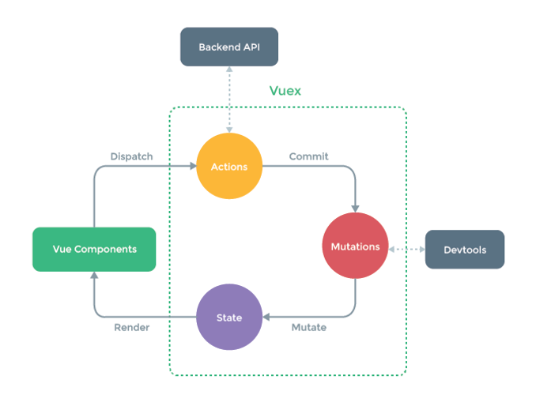

# Vuex 基本使用

1. 如果想要在子组件中使用祖先组件中的数据，那么就必须一层一层的传递(非常麻烦)
2. 兄弟组件之间不能直接传递数据，如果兄弟组件之间想要传递数据，那么就必须借助父组件(非常麻烦)

解决方案: 使用 Vuex

vuex 是 Vue 配套的 公共数据管理工具，我们可以将共享的数据保存到 vuex 中，方便整个程序中的任何组件都可以获取和修改 vuex 中保存的公共数据

1. 创建 Vuex 对象
   ```js
   const store = new Vuex.Store({
     // 这里的state就相当于组件中的data, 就是专门用于保存共享数据的
     state: {
       age: 18,
     },
   });
   ```
2. 在祖先组件中添加 store 的 key 保存 Vuex 对象，只要祖先组件中保存了 Vuex 对象，那么祖先组件和所有的后代组件就可以使用 Vuex 中保存的共享数据了
3. 在使用 Vuex 中保存的共享数据的时候, 必须通过如下的格式来使用`this.$store.state.xxx`

```html
<div id="app">
  <grandfather></grandfather>
</div>
<template id="grandfather">
  <div>
    <h1>我是grandfather</h1>
    <p>{{this.$store.state.age}}</p>
    <father></father>
  </div>
</template>
<template id="father">
  <div>
    <h1>我是father</h1>
    <p>{{this.$store.state.age}}</p>
    <son></son>
  </div>
</template>
<template id="son">
  <div>
    <h1>我是son</h1>
    <p>{{this.$store.state.age}}</p>
  </div>
</template>
<script src="https://cdn.jsdelivr.net/npm/vue/dist/vue.js"></script>
<script src="./vuex.js"></script>
<script>
  const store = new Vuex.Store({
    state: {
      age: 18,
    },
  });

  Vue.component("grandfather", {
    template: "#grandfather",
    store,
    components: {
      father: {
        template: "#father",
        components: {
          son: {
            template: "#son",
          },
        },
      },
    },
  });
  new Vue({
    el: "#app",
  });
</script>
```

注意点：

- 必须在引入 Vue 之后再引入 Vuex
- 只有需要共享的才放到 vuex 上，不需要共享的数据依然放到组件自身的 data 上

# 认识 Vuex

Vuex 是一个专为 Vue.js 应用程序开发的状态管理模式。

- 它采用**集中式存储管理**应用的所有组件的状态，并以相应的规则保证状态以一种可预测的方式发生变化。
- Vuex 也集成到 Vue 的官方调试工具  devtools extension，提供了诸如零配置的 time-travel 调试、状态快照导入导出等高级调试功能。

状态管理模式、集中式存储管理可以简单的将其看成把需要多个组件共享的变量全部存储在一个对象里面。然后，将这个对象放在顶层的 Vue 实例中，让其他组件可以使用。

但是多个组件是不可以共享这个对象中的所有变量属性的，Vuex 就是为了提供这样一个在多个组件间共享状态的插件，用它就可以了。

有什么状态时需要我们在多个组件间共享的呢？

- 过多个状态，在多个界面间的共享问题。
- 比如用户的登录状态、用户名称、头像、地理位置信息等等。
- 比如商品的收藏、购物车中的物品等等。

这些状态信息，我们都可以放在统一的地方，对它进行保存和管理，而且它们还是响应式的

## 单界面的状态管理


- State：就是我们的状态。就是我们的状态
- View：视图层，可以针对 State 的变化，显示不同的信息。
- Actions：这里的 Actions 主要是用户的各种操作：点击、输入等等，会导致状态的改变。

```vue
<template>
  <div id="#app">
    <div>当前计数：{{ counter }}</div>
    <button @click="counter++">+</button>
    <button @click="counter--">-</button>
  </div>
</template>
<script>
export default {
  name: "HelloWorld",
  data() {
    return {
      counter: 0,
    };
  },
};
</script>
```

## 多界面状态管理

Vue 已经帮我们做好了单个界面的状态管理，但是如果是多个界面呢？

- 多个试图都依赖同一个状态（一个状态改了，多个界面需要进行更新）
- 不同界面的 Actions 都想修改同一个状态（Home.vue 需要修改，Profile.vue 也需要修改这个状态）

也就是说对于某些状态(状态 1/状态 2/状态 3)来说只属于我们某一个试图，但是也有一些状态(状态 a/状态 b/状态 c)属于多个试图共同想要维护的

状态 1/状态 2/状态 3 你放在自己的房间中，你自己管理自己用，没问题。但是状态 a/状态 b/状态 c 我们希望交给一个大管家来统一帮助我们管理！！！

Vuex 就是为我们提供这个大管家的工具。

Vuex 状态管理图例



# Vuex 核心概念

Vuex 有几个比较核心的概念:

- State 用于保存共享数据
- Getters
- Mutation 用于保存修改共享数据的方法
- Action
- Module

## State 单一状态树

Vuex 提出使用单一状态树，英文名称是 Single Source of Truth，也可以翻译成单一数据源。

做一个简单的类比。

我们知道，在国内我们有很多的信息需要被记录，比如上学时的个人档案，工作后的社保记录，公积金记录，结婚后的婚姻信息，以及其他相关的户口、医疗、文凭、房产记录等等（还有很多信息）。

这些信息被分散在很多地方进行管理，有一天你需要办某个业务时(比如入户某个城市)，你会发现你需要到各个对应的工作地点去打印、盖章各种资料信息，最后到一个地方提交证明你的信息无误。

这种保存信息的方案，不仅仅低效，而且不方便管理，以及日后的维护也是一个庞大的工作(需要大量的各个部门的人力来维护，当然国家目前已经在完善我们的这个系统了)。

这个和我们在应用开发中比较类似：如果你的状态信息是保存到多个 Store 对象中的，那么之后的管理和维护等等都会变得特别困难。

所以 Vuex 也使用了单一状态树来管理应用层级的全部状态。

单一状态树能够让我们最直接的方式找到某个状态的片段，而且在之后的维护和调试过程中，也可以非常方便的管理和维护。

## Getters 基本使用

有时候，我们需要从 store 中获取一些 state 变异后的状态，比如下面的 Store 中获取学生年龄大于 20 的个数。

```js
const store = new Vuex.Store({
  state: {
    students: [
      {
        name: "kobe",
        age: 18,
      },
      {
        name: "lucy",
        age: 22,
      },
      {
        name: "james",
        age: 25,
      },
      {
        name: "curry",
        age: 12,
      },
    ],
  },
});
```

可以在 Store 中定义 getters

```js
const store = new Vuex.Store({
  getters: {
    ageMore20(state) {
      return state.students.filter((s) => s.age > 20);
    },
  },
});
```

Getters 作为参数和传递参数。如果我们已经有了一个获取所有年龄大于 20 岁学生列表的 getters, 那么代码可以这样来写

```js
const store = new Vuex.Store({
  getters: {
    ageMore20(state) {
      return state.students.filter((s) => s.age > 20);
    },
    ageMore20Len(state, getters) {
      return getters.ageMore20.length;
    },
  },
});
```

## Mutation 状态更新

Vuex 的 store 状态的更新唯一方式：提交 Mutation
Mutation 主要包括两部分：

- 字符串的事件类型（type）
- 一个回调函数（handler），该回调函数的第一个参数就是 state。

mutation 的定义方式：

```js
const store = new Vuex.Store({
  mutations: {
    increment(state) {
      state.counter++;
    },
    decrement(state) {
      state.counter--;
    },
  },
});
```

在通过 mutation 更新数据的时候, 有可能我们希望携带一些额外的参数，参数被称为是 mutation 的载荷(Payload)

```js
const store = new Vuex.Store({
  mutations: {
    increment(state) {
      state.counter++;
    },
    decrement(state) {
      state.counter--;
    },
    incrementCount(state, payload) {
      state.counter += payload.count;
    },
    addStu(state, stu) {
      state.students.push(stu);
    },
  },
});
```

我们有很多参数需要传递，我们通常会以对象的形式传递, 也就是 payload 是一个对象

这个时候可以再从对象中取出相关的信息

上面的通过 commit 进行提交是一种普通的方式

Vue 还提供了另外一种风格, 它是一个包含 type 属性的对象

```js
this.$store.commit({
  type: increment,
  count,
});
```

通常情况下, Vuex 要求我们 Mutation 中的方法必须是同步方法

主要的原因是当我们使用 devtools 时, 可以 devtools 可以帮助我们捕捉 mutation 的快照

但是如果是异步操作, 那么 devtools 将不能很好的追踪这个操作什么时候会被完成

So, 通常情况下, 不要再 mutation 中进行异步的操作

## Action 的基本定义

Action 类似于 Mutation, 但是是用来代替 Mutation 进行异步操作的

Action 的基本使用代码如下

```js
const store = new Vuex.Store({
  actions: {
    aUpdateInfo(context, payload) {
      setTimeout(() => {
        context.commit("updateInfo");
        console.log(payload.message);
        payload.success();
      }, 3000);
    },
  },
});
```

context 是和 store 对象具有相同方法和属性的对象

也就是说, 我们可以通过 context 去进行 commit 相关的操作, 也可以获取 context.state 等

但是注意, 这里它们并不是同一个对象

在 Vue 组件中, 如果我们调用 action 中的方法, 那么就需要使用 dispatch。同样的, 也是支持传递 payload

在 Action 中, 我们可以将异步操作放在一个 Promise 中, 并且在成功或者失败后, 调用对应的 resolve 或 reject

## 认识 Module

Vue 使用单一状态树,那么也意味着很多状态都会交给 Vuex 来管理

当应用变得非常复杂时,store 对象就有可能变得相当臃肿

为了解决这个问题, Vuex 允许我们将 store 分割成模块(Module), 而每个模块拥有自己的 state、mutations、actions、getters 等
