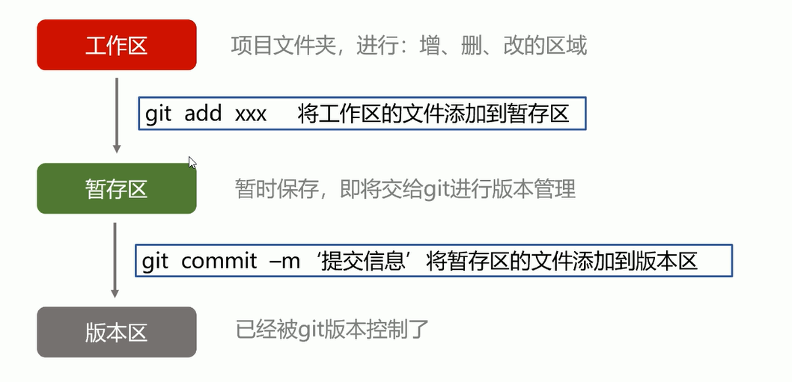
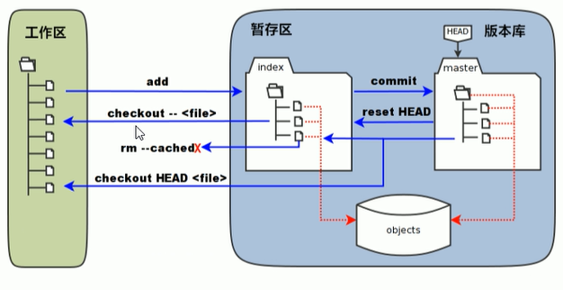

# git 安装后的配置

- `git config --global user.name 'your name'`
- `git config --global user.email 'your email'`
- `git config user.name`查看配置的姓名
- `git config user.email`查看配置的邮箱
- 因为 git 是分布式版本控制系统，所以每个机器都必须自报家门：你的名字和邮箱地址

# 常见 Linux 命令

- `mkdir xxx`新建文件夹
- `vi x.txt`新建文件
  - 输入 i 进入编辑模式
  - `ESC + : + wq`保存并退出
  - `ESC + : + q!`不保存退出
- `cd xxx`进入 xxx 目录
- `cd ..`返回上一级目录
- `ls`列出当前文件夹中所有文件，`ls -a`列出当前文件夹中所有文件（包含隐藏文件）
- `pwd`显示当前目录
- `cat x.txt`显示文件内容
- `clear`清屏
- `gg dG`文件内容将被全部清空

# 创建版本库

1. `git init`初始化版本库
2. `git add x.xxx`添加指定文件到暂存区中
3. `git status`查看文件状态
   - 红色表示在工作区
   - 绿色表示在暂存区
   - 没有任何显示代表所有文件位于版本区
4. `git commit -m xxx`提交暂存区所有文件到版本区

# 工作区、暂存区、版本区

- 工作区：简单的理解——你在电脑里能看到的目录
- 暂存区：介于工作区和版本区中间，工作区到版本区的**必经之路**
- 版本库：工作区有一个隐藏目录`.git`，准确的来说这个不算工作区，而是 Git 的版本库
  - 第一步是用`git add`把文件添加进暂存区
  - 第二步是用`git commit`把暂存区的所有内容提交到当前版本库

# 差异对比

- `git diff`比较暂存区与工作区
- `git diff--cached`比较版本区与暂存区
- `git diff master`比较版本区与工作区

# 日志、版本号

- `git log`显示从最近到最远的所有提交日志
- `git reflog`显示每次提交的 commit id

# 版本回退

- `git reset --hard HEAD^`版本回退（回退一次提交）
- `git reset --hard Obfafd`回退到指定 Obfafd 的 commit id
- `git reset HEAD`用版本库中的文件去替换暂存区的全部文件
- `git checkout --x.txt`用暂存区指定文件去替换工作区的指定文件（危险）
- `git rm--cached x.txt`从暂存区删除文件

# 删除文件

- `git rm x.txt`删除文件
- `git rm-r xxx`删除文件夹

# 分支

- `git checkout -b dev`创建分支，并切换到 dev 分支
- `git branch`查看当前分支
- `git checkout master`切换分支
- `git merge dev`合并 dev 分支到当前分支
- `git branch -d dev`删除指定分支
- `git diff branch1 branch2`显示出两个分支之间所有有差异的文件的详细差异
- `git diff branch1 branch2 --stat`显示出两个分支之间所有有差异的文件列表
- `git diff branch1 branch2 xxx`显示指定文件的详细差异

# 版本冲突

- 合并分支时，如果 在同一个文件，在同一个地方，都修改了或新增内容会引起版本冲突
- 解决版本冲突最好的办法是借助 IDE 解决，简单且高效

# 版本控制系统的区别

集中式版本控制系统有 SVN、CVS，集中式版本控制系统版本库是集中存放在中央服务器的，每个开发人员电脑只有一个版本

分布式版本控制系统有 Git、BitKeeper，每个开发人员电脑里都有一个完整的版本库。同时，它也需要一台充当**中央服务器**的电脑，来方便**交换**大家的代码修改

集中式与分布式的区别：

- 集中式版本控制系统：
  - 每个开发者只有应用代码库的一个版本
  - 在离线状态下开发者无法进行版本管理开发
- 分布式版本控制系统：
  - 每个开发者都有整个代码库的所有版本
  - 在离线状态下开发者可以进行版本管理开发，等到有网时再 push 到仓库中

# Github

Github 是一个 Git 项目托管网站，能够分享代码或者其他开发人员配合一起开发。Github 是一个基于 Git 的代码托管平台，Git 并不像 SVN 那样有一个中心服务器。目前我们作用到的 Git 命令都是在本地执行，你就需要将数据放到一台其他开发人员能够连接的服务器上。

## 本地仓库内容推送给远程仓库

1. 新建本地仓库
   - `git init`
   - `git add .`
   - `git commit -m 'xxx'`
2. 新建远程仓库
   - Github 上 new repository
3. 本地仓库和远程仓库进行关联
   - `git remote add origin address(地址)`
4. 把本地仓库内容推送到远程仓库中
   - `git push -u origin master`首次加`-u`
   - 我们第一次推送 master 分支时，加上了`-u`参数，Git 不但会把本地的 master 分支内容推送到远程新的 master 分支，不会把本地 master 分支和远程的 master 分支关联起来，在以后的推送时可以简化命令`git push origin master`

若在成功推送过一次代码后，电脑不能够自动记住 github 的账户和密码，执行以下命令解决：`git config --global credential.helper store`

## 远程仓库有内容克隆到本地进行开发

克隆远程仓库到本地`git clone https://github.com/xxx.git`

如果克隆出错，大部分是未授权导致，在终端输入以下命令并一直回车`ssh-keygen -t rsa -b 4096 -C "GitHub注册的邮箱"`

这个命令过后，将会在我们本地电脑的家目录下生成两个钥匙——私钥（id_rsa）和公钥（id_rsa.pub）

`cat ~/.ssh/id_rsa.pub`复制公钥到 Github 上的 ssh 上
