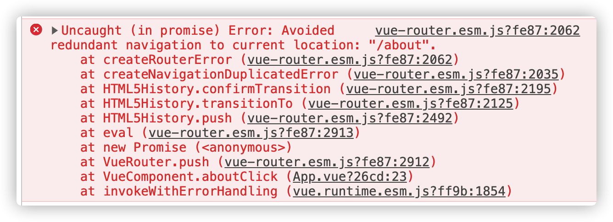

前端学习笔记总结

# 遇到的问题

## session

在学习 session 过程中，往`req.session`属性赋值时总是报错：

> TypeError: Cannot set property '\_id' of undefined
> at /Users/gin/Desktop/Node/server/router/businessRouter.js:87:28
> at processTicksAndRejections (internal/process/task_queues.js:97:5)

打印从数据库查询到的对象是存在的，检查 session 配置等检查了好多遍确认没有任何问题，突然想到打印`req.session`，发现果然是这货的问题，结果是 undefined，再次检查 session 配置没有问题，必应查找到原因以及解决方案。**报错原因**是把 session 写在路由的下面导致一直报错。**解决方案**：要把 session 配置写到路由的上方。

打印`req.session`结果

> Session {
> cookie: {
> path: '/',
> \_expires: 2020-05-03T02:42:19.984Z,
> originalMaxAge: 30000,
> httpOnly: true
> }
> }

## webpack

Webpack 使用 loader 解析 less 出现错误：

> Hash: c490b459d73661d92d2a
> Version: webpack 3.12.0
> Time: 288ms
> Asset Size Chunks Chunk Names
> index.js 13.2 kB 0 [emitted] main
> [0] ./src/js/index.js 658 bytes {0} [built][1] ./src/js/module1.js 106 bytes {0} [built][2] ./src/js/module2.js 57 bytes {0} [built][3] ./src/js/module3.js 114 bytes {0} [built][4] ./src/json/data.json 41 bytes {0} [built][5] ./src/less/demo.less 568 bytes {0} [built][7] ./node_modules/css-loader/dist/cjs.js!./node_modules/less-loader/dist/cjs.js!./src/less/demo.less 413 bytes {0} [built][failed] [1 error] + 1 hidden module
>
> ERROR in ./node_modules/css-loader/dist/cjs.js!./node_modules/less-loader/dist/cjs.js!./src/less/demo.less
> Module build failed: TypeError: loaderContext.getResolve is not a function
> at createWebpackLessPlugin (/Users/gin/Desktop/webpack-demo/node_modules/less-loader/dist/utils.js:31:33)
> at getLessOptions (/Users/gin/Desktop/webpack-demo/node_modules/less-loader/dist/utils.js:148:31)
> at Object.lessLoader (/Users/gin/Desktop/webpack-demo/node_modules/less-loader/dist/index.js:27:49)
> @ ./src/less/demo.less 2:26-135
> @ ./src/js/index.js
> ➜ webpack-demo webpack
> Hash: c490b459d73661d92d2a
> Version: webpack 3.12.0
> Time: 477ms
> Asset Size Chunks Chunk Names
> index.js 13.2 kB 0 [emitted] main
> [0] ./src/js/index.js 658 bytes {0} [built][1] ./src/js/module1.js 106 bytes {0} [built][2] ./src/js/module2.js 57 bytes {0} [built][3] ./src/js/module3.js 114 bytes {0} [built][4] ./src/json/data.json 41 bytes {0} [built][5] ./src/less/demo.less 568 bytes {0} [built][7] ./node_modules/css-loader/dist/cjs.js!./node_modules/less-loader/dist/cjs.js!./src/less/demo.less 413 bytes {0} [built][failed] [1 error]
> ➜ webpack-demo webpack
> Hash: c490b459d73661d92d2a
> Version: webpack 3.12.0
> Time: 411ms
> Asset Size Chunks Chunk Names
> index.js 13.2 kB 0 [emitted] main
> [0] ./src/js/index.js 658 bytes {0} [built][1] ./src/js/module1.js 106 bytes {0} [built][2] ./src/js/module2.js 57 bytes {0} [built][3] ./src/js/module3.js 114 bytes {0} [built][4] ./src/json/data.json 41 bytes {0} [built][5] ./src/less/demo.less 568 bytes {0} [built][7] ./node_modules/css-loader/dist/cjs.js!./node_modules/less-loader/dist/cjs.js!./src/less/demo.less 413 bytes {0} [built][failed] [1 error] + 1 hidden module
>
> ERROR in ./node_modules/css-loader/dist/cjs.js!./node_modules/less-loader/dist/cjs.js!./src/less/demo.less
> Module build failed: TypeError: loaderContext.getResolve is not a function
> at createWebpackLessPlugin (/Users/gin/Desktop/webpack-demo/node_modules/less-loader/dist/utils.js:31:33)
> at getLessOptions (/Users/gin/Desktop/webpack-demo/node_modules/less-loader/dist/utils.js:148:31)
> at Object.lessLoader (/Users/gin/Desktop/webpack-demo/node_modules/less-loader/dist/index.js:27:49)
> @ ./src/less/demo.less 2:26-135
> @ ./src/js/index.js

这是由于 less-loader 版本过高导致，卸载安装低版本`npm install less-loader@4.1.0 -D`

## Vue-router



重复点击导航路由报错解决方法：

1. 在项目目录下运行 npm i vue-router@3.0 -S 将 vue-router 改为 3.0 版本即可

2. 在 router.js 中加入以下代码就可以

   ```js
   // push方法
   const originalPush = VueRouter.prototype.push;
   VueRouter.prototype.push = function push(location) {
     return originalPush.call(this, location).catch((err) => err);
   };
   // replace方法
   const originalReplace = VueRouter.prototype.replace;
   VueRouter.prototype.replace = function replace(location) {
     return originalReplace.call(this, location).catch((err) => err);
   };
   ```
